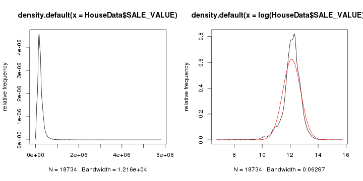

Aaron's First Cleaning of the Data
========================================================

This document describes and shows the first data cleaning done via R after the data file was uploaded to the R Server. We'll do most of the spatial display via ArcMap, but much of the data manipulation, analysis and non-spatial display via R.


```r
options(width = 140)
require(foreign)
getwd()
```

```
## [1] "/home/aswoboda/OSI Hedonic Project/OSI-Hedonic/writeup/01-DataCleaning"
```

```r
HouseData = read.dbf("../../../Data/DataFromARCMAP.dbf")
```


What's in this file? What is the underlying structure of the data? What are the variables? How many of them? What are their values?

```r
str(HouseData)
```

```
## 'data.frame':	18734 obs. of  68 variables:
##  $ COUNTY_ID : Factor w/ 5 levels "003","037","123",..: 2 2 2 2 2 2 2 2 2 2 ...
##  $ PIN       : Factor w/ 18727 levels "003-013123120005",..: 2139 2140 535 2830 2831 1238 1239 1240 1241 1242 ...
##  $ CITY      : Factor w/ 70 levels "ANDOVER","ANOKA",..: 37 37 3 45 45 6 6 6 6 7 ...
##  $ ZIP4      : Factor w/ 3338 levels "1000","1001",..: NA NA NA NA NA NA NA NA NA NA ...
##  $ LOT       : Factor w/ 372 levels "001","002","003",..: NA NA NA NA NA NA NA NA NA NA ...
##  $ ACRES_POLY: num  0.3 0.28 0.37 0.84 0.61 0.92 0.53 0.54 0.33 1.25 ...
##  $ ACRES_DEED: num  0 0 0 0 0 0 0 0 0 0 ...
##  $ USE1_DESC : Factor w/ 4 levels "100 Res 1 unit",..: 2 2 2 2 2 2 2 2 2 2 ...
##  $ HOMESTEAD : Factor w/ 3 levels "N","P","Y": 3 3 3 3 3 3 3 3 3 3 ...
##  $ EMV_LAND  : int  50600 53000 64200 118700 149400 84700 116400 101600 59300 40500 ...
##  $ EMV_BLDG  : int  135700 213100 121700 284900 599400 216600 441800 318700 178300 183300 ...
##  $ EMV_TOTAL : int  186300 266100 185900 403600 748800 301300 558200 420300 237600 223800 ...
##  $ TAX_CAPAC : int  1906 2713 1915 4277 8614 3075 5853 4283 2423 2367 ...
##  $ TOTAL_TAX : int  2088 3130 2300 4124 8211 3872 7381 5436 2921 2528 ...
##  $ XUSE1_DESC: Factor w/ 5 levels "Church-Other Res",..: NA NA NA NA NA NA NA NA NA NA ...
##  $ DWELL_TYPE: Factor w/ 12 levels "Condominium",..: 5 5 5 5 5 5 5 5 5 5 ...
##  $ HOME_STYLE: Factor w/ 52 levels "1 1/2 Story Finished",..: 45 45 45 51 51 45 51 51 51 34 ...
##  $ FIN_SQ_FT : int  1756 2806 1509 3587 6225 2944 5104 3773 2746 2960 ...
##  $ GARAGE    : Factor w/ 2 levels "N","Y": NA NA NA NA NA NA NA NA NA NA ...
##  $ GARAGESQFT: Factor w/ 1312 levels "0","10","1000",..: 674 975 548 186 45 924 1086 884 472 1027 ...
##  $ BASEMENT  : Factor w/ 2 levels "N","Y": NA NA NA NA NA NA NA NA NA NA ...
##  $ HEATING   : Factor w/ 11 levels "Electric","ELECTRIC",..: NA NA NA NA NA NA NA NA NA NA ...
##  $ COOLING   : Factor w/ 5 levels "CENTRAL","CENTRAL W/AIR COND",..: NA NA NA NA NA NA NA NA NA NA ...
##  $ YEAR_BUILT: int  1979 1991 1972 1988 1995 1979 1992 1988 1986 1966 ...
##  $ NUM_UNITS : Factor w/ 3 levels "0","1","2": 2 2 2 2 2 2 2 2 2 2 ...
##  $ SALE_DATE : Date, format: "2009-08-28" "2011-01-14" ...
##  $ SALE_VALUE: int  213400 261000 177000 465000 730000 250000 597000 369000 231000 179350 ...
##  $ SCHOOL_DST: Factor w/ 29 levels "006","11","12",..: 13 13 11 12 12 10 8 8 8 9 ...
##  $ WSHD_DIST : Factor w/ 22 levels "BLACK DOG","Capital Region W/S",..: 6 6 17 6 6 4 4 1 1 17 ...
##  $ MYPIN     : int  0 1 2 3 4 5 6 7 8 9 ...
##  $ X_COORD   : num  496830 495747 484574 491579 491388 ...
##  $ Y_COORD   : num  496830 495747 484574 491579 491388 ...
##  $ REPLACEFID: int  0 1 2 3 4 5 6 7 8 9 ...
##  $ CITY_DUMMY: int  37 37 3 45 45 6 6 6 6 7 ...
##  $ GEOID10   : Factor w/ 7434 levels "270030501101002",..: 536 573 1590 670 671 1049 1049 1028 787 1752 ...
##  $ tenthkmSUM: num  27000 108000 81000 65184 27000 ...
##  $ qtrkmSUM  : num  838847 584558 535368 747625 443717 ...
##  $ halfkmSUM : num  3569670 2687240 2190160 4111410 3692540 ...
##  $ onekmSUM  : num  17029800 18514700 13397700 29468300 26886400 ...
##  $ twokmSUM  : num  6.11e+07 8.66e+07 7.12e+07 1.13e+08 1.16e+08 ...
##  $ Census_POP: num  41 41 188 183 218 ...
##  $ WhiteDense: num  0.878 1 0.878 0.945 0.936 ...
##  $ White_POP : num  36 41 165 173 204 21 21 648 18 0 ...
##  $ Amind_POP : num  0 0 0 0 0 0 0 3 0 0 ...
##  $ Asian_POP : num  2 0 16 5 11 13 13 31 12 0 ...
##  $ Pacif_POP : num  0 0 0 0 0 0 0 0 0 0 ...
##  $ Other_POP : num  0 0 0 0 0 0 0 4 0 0 ...
##  $ Multi_POP : num  0 0 2 3 0 0 0 29 0 0 ...
##  $ Hisp_POP  : num  1 0 2 2 3 0 0 205 1 4 ...
##  $ NotHis_POP: num  40 41 186 181 215 34 34 868 35 0 ...
##  $ VACANT    : num  0 1 0 1 1 1 1 50 1 0 ...
##  $ POPUnder18: num  75 67 322 317 388 ...
##  $ POPOver65 : num  3 0 8 12 7 2 2 49 1 0 ...
##  $ SDNUM     : int  199 199 196 197 197 194 191 191 191 192 ...
##  $ SDNAME    : Factor w/ 27 levels "Anoka-Hennepin",..: 9 9 16 26 26 11 2 2 2 6 ...
##  $ ELEMENTARY: Factor w/ 165 levels "AFTON-LAKELAND",..: 115 69 56 94 94 108 154 52 159 43 ...
##  $ MIDDLE    : Factor w/ 56 levels "ANOKA MIDDLE SCHOOL FOR THE ARTS",..: 21 21 13 16 16 26 25 25 23 39 ...
##  $ HIGH      : Factor w/ 43 levels "ANDOVER","ANOKA",..: 34 34 13 19 19 35 5 5 5 15 ...
##  $ STATEFP10 : Factor w/ 1 level "27": 1 1 1 1 1 1 1 1 1 1 ...
##  $ COUNTYFP10: Factor w/ 5 levels "003","037","123",..: 2 2 2 2 2 2 2 2 2 2 ...
##  $ TRACTCE10 : Factor w/ 322 levels "030100","030201",..: 199 202 255 208 208 230 230 229 213 262 ...
##  $ NAME10    : Factor w/ 381 levels "Block 1000","Block 1001",..: 308 136 121 1 5 125 125 1 114 108 ...
##  $ Block_Area: num  40000 25000 120000 150000 260000 50000 50000 580000 56000 84000 ...
##  $ POP_Dense : num  0.001025 0.00164 0.001567 0.00122 0.000838 ...
##  $ fam_income: int  63953 99750 123628 121685 121685 76509 76509 89786 96111 78431 ...
##  $ income_err: Factor w/ 320 levels "10022","10059",..: 294 316 116 63 63 7 7 109 306 229 ...
##  $ StPaulDist: num  NA NA NA NA NA NA NA NA NA NA ...
##  $ MinneaDist: num  NA NA NA NA NA NA NA NA NA NA ...
##  - attr(*, "data_types")= chr  "C" "C" "C" "C" ...
```

```r
summary(HouseData)
```

```
##  COUNTY_ID                 PIN                           CITY     
##  003: 330   139-252310100    :    2   SAINT PAUL           :4255  
##  037:3217   163-1202721230021:    2   CITY OF WOODBURY     :2255  
##  123:7125   163-1802821340123:    2   CITY OF SHAKOPEE     :1314  
##  139:2833   163-2003021320031:    2   CITY OF COTTAGE GROVE:1001  
##  163:5229   163-2402722440001:    2   CITY OF OAKDALE      : 800  
##             163-3003021240080:    2   CITY OF SAVAGE       : 767  
##             (Other)          :18722   (Other)              :8342  
##       ZIP4            LOT         ACRES_POLY       ACRES_DEED    
##  1613   :   12   1      : 769   Min.   : 0.000   Min.   : 0.000  
##  2329   :   10   2      : 754   1st Qu.: 0.140   1st Qu.: 0.000  
##  3918   :   10   3      : 733   Median : 0.240   Median : 0.000  
##  4820   :   10   4      : 647   Mean   : 0.375   Mean   : 0.155  
##  1409   :    9   5      : 601   3rd Qu.: 0.330   3rd Qu.: 0.150  
##  (Other): 7350   (Other):9168   Max.   :29.460   Max.   :30.000  
##  NA's   :11333   NA's   :6062                                    
##                                USE1_DESC    HOMESTEAD    EMV_LAND      
##  100 Res 1 unit                     :8062   N: 3019   Min.   :   9000  
##  RESIDENTIAL                        :3217   P:   51   1st Qu.:  43000  
##  RESIDENTIAL SINGLE FAMILY          : 330   Y:15664   Median :  67000  
##  Single Family Dwelling, Platted Lot:7125             Mean   :  73619  
##                                                       3rd Qu.:  86000  
##                                                       Max.   :1750600  
##                                                                        
##     EMV_BLDG         EMV_TOTAL         TAX_CAPAC       TOTAL_TAX    
##  Min.   :      0   Min.   :      0   Min.   :    0   Min.   :    0  
##  1st Qu.: 102000   1st Qu.: 155700   1st Qu.:    0   1st Qu.:    0  
##  Median : 129600   Median : 197100   Median :    0   Median : 1722  
##  Mean   : 154234   Mean   : 227850   Mean   :  466   Mean   : 1642  
##  3rd Qu.: 182100   3rd Qu.: 265900   3rd Qu.:    0   3rd Qu.: 2618  
##  Max.   :1180100   Max.   :2600600   Max.   :17711   Max.   :35214  
##                                                                     
##                      XUSE1_DESC                             DWELL_TYPE  
##  Church-Other Res         :    1   SINGLE FAMILY DWELLING        :7125  
##  Church-Residence         :    1   Single-Family / Owner Occupied:3713  
##  Muni Srvc Other          :    4   S.FAM.RES                     :3217  
##  RESIDENTIAL SINGLE FAMILY:    2   Townhouse                     :1265  
##  Schools-Priv Res         :    1   RESIDENTIAL SINGLE FAMILY     : 330  
##  NA's                     :18725   (Other)                       : 251  
##                                    NA's                          :2833  
##          HOME_STYLE     FIN_SQ_FT      GARAGE         GARAGESQFT   
##  One Story    :2640   Min.   :  424   N   :   10   440     : 1301  
##  Bungalow     :1795   1st Qu.: 1091   Y   :12674   484     :  774  
##  2 Story Frame:1663   Median : 1425   NA's: 6050   528     :  748  
##  TWO STORY    :1499   Mean   : 1645                440.0000:  639  
##  SPLIT LEVL   :1294   3rd Qu.: 1976                576     :  564  
##  Two Story    :1117   Max.   :13426                (Other) :13980  
##  (Other)      :8726                                NA's    :  728  
##  BASEMENT          HEATING                   COOLING       YEAR_BUILT  
##  N   :   81   FA Gas   :4030   CENTRAL           :2220   Min.   :1840  
##  Y   :12603   HOT AIR  :3276   CENTRAL W/AIR COND:4834   1st Qu.:1955  
##  NA's: 6050   Yes      :1150   NON CENTRAL       :  66   Median :1981  
##               HOT WATER: 830   NONE              :   2   Mean   :1972  
##               Oil F.A. :  32   Y                 :4999   3rd Qu.:1999  
##               (Other)  :  28   NA's              :6613   Max.   :2011  
##               NA's     :9388                                           
##  NUM_UNITS      SALE_DATE            SALE_VALUE        SCHOOL_DST  
##  0   :  353   Min.   :2009-01-01   Min.   :   1000   625    :4255  
##  1   :15542   1st Qu.:2009-07-28   1st Qu.: 135502   720    :1368  
##  2   :    6   Median :2010-01-07   Median : 191900   196    :1271  
##  NA's: 2833   Mean   :2010-01-29   Mean   : 218015   719    :1139  
##               3rd Qu.:2010-07-11   3rd Qu.: 265000   ISD622 : 981  
##               Max.   :2011-12-08   Max.   :5783200   (Other):6200  
##                                                      NA's   :3520  
##                WSHD_DIST        MYPIN          X_COORD      
##  WS SOUTH WASHINGTON:3100   Min.   :    0   Min.   :453873  
##  Capital Region W/S :2931   1st Qu.: 4689   1st Qu.:484039  
##  Metro Watershed    :2266   Median : 9372   Median :492081  
##  VERMILLION RIVER   :1347   Mean   : 9371   Mean   :490259  
##  Rice Creek W/S     :1083   3rd Qu.:14056   3rd Qu.:501074  
##  (Other)            :4322   Max.   :18739   Max.   :515822  
##  NA's               :3685                                   
##     Y_COORD         REPLACEFID      CITY_DUMMY              GEOID10     
##  Min.   :453873   Min.   :    0   Min.   : 1.0   271390803011036:  125  
##  1st Qu.:484039   1st Qu.: 4686   1st Qu.:21.0   271630710181000:   86  
##  Median :492081   Median : 9370   Median :29.0   271630702031040:   59  
##  Mean   :490259   Mean   : 9368   Mean   :35.4   271390809042006:   58  
##  3rd Qu.:501074   3rd Qu.:14053   3rd Qu.:56.0   271390807001019:   55  
##  Max.   :515822   Max.   :18733   Max.   :70.0   271390807001008:   52  
##                                                  (Other)        :18299  
##    tenthkmSUM         qtrkmSUM         halfkmSUM           onekmSUM       
##  Min.   :      0   Min.   :      0   Min.   :       0   Min.   :0.00e+00  
##  1st Qu.:  38184   1st Qu.: 416184   1st Qu.: 2156065   1st Qu.:1.12e+07  
##  Median :  81000   Median : 603698   Median : 3054725   Median :1.58e+07  
##  Mean   :  95827   Mean   : 732594   Mean   : 3661434   Mean   :1.90e+07  
##  3rd Qu.: 119184   3rd Qu.: 869130   3rd Qu.: 4490825   3rd Qu.:2.41e+07  
##  Max.   :1347100   Max.   :7589400   Max.   :24899800   Max.   :1.21e+08  
##                                                                           
##     twokmSUM          Census_POP     WhiteDense      White_POP   
##  Min.   :0.00e+00   Min.   :   0   Min.   :0.000   Min.   :   0  
##  1st Qu.:5.74e+07   1st Qu.:  57   1st Qu.:0.701   1st Qu.:  39  
##  Median :8.44e+07   Median :  92   Median :0.840   Median :  70  
##  Mean   :9.83e+07   Mean   : 178   Mean   :0.779   Mean   : 138  
##  3rd Qu.:1.29e+08   3rd Qu.: 205   3rd Qu.:0.919   3rd Qu.: 165  
##  Max.   :4.81e+08   Max.   :1681   Max.   :1.000   Max.   :1394  
##                                                                  
##    Amind_POP      Asian_POP     Pacif_POP        Other_POP     
##  Min.   : 0.0   Min.   :  0   Min.   : 0.000   Min.   : 0.000  
##  1st Qu.: 0.0   1st Qu.:  1   1st Qu.: 0.000   1st Qu.: 0.000  
##  Median : 0.0   Median :  6   Median : 0.000   Median : 0.000  
##  Mean   : 0.8   Mean   : 17   Mean   : 0.057   Mean   : 0.269  
##  3rd Qu.: 1.0   3rd Qu.: 18   3rd Qu.: 0.000   3rd Qu.: 0.000  
##  Max.   :82.0   Max.   :484   Max.   :23.000   Max.   :12.000  
##                                                                
##    Multi_POP        Hisp_POP       NotHis_POP       VACANT     
##  Min.   : 0.00   Min.   :  0.0   Min.   :   0   Min.   : 0.00  
##  1st Qu.: 0.00   1st Qu.:  0.0   1st Qu.:  53   1st Qu.: 0.00  
##  Median : 2.00   Median :  4.0   Median :  87   Median : 1.00  
##  Mean   : 4.07   Mean   :  8.6   Mean   : 170   Mean   : 3.21  
##  3rd Qu.: 5.00   3rd Qu.:  9.0   3rd Qu.: 197   3rd Qu.: 3.00  
##  Max.   :71.00   Max.   :504.0   Max.   :1645   Max.   :85.00  
##                                                                
##    POPUnder18     POPOver65         SDNUM    
##  Min.   :   0   Min.   :  0.0   Min.   :  6  
##  1st Qu.:  95   1st Qu.:  3.0   1st Qu.:621  
##  Median : 154   Median :  7.0   Median :625  
##  Mean   : 297   Mean   : 15.2   Mean   :585  
##  3rd Qu.: 346   3rd Qu.: 16.0   3rd Qu.:720  
##  Max.   :2709   Max.   :438.0   Max.   :834  
##                                              
##                           SDNAME               ELEMENTARY   
##  St. Paul                    :4255   LIBERTY RIDGE  :  500  
##  South Washington County     :2969   HUGO & ONEKA   :  468  
##  North St. Paul-Maplewood    :1619   SUN PATH       :  386  
##  Shakopee                    :1367   LAKE ELMO      :  382  
##  Rosemount-Apple Valley-Eagan:1271   EAGLE CREEK    :  369  
##  Prior Lake-Savage           :1139   SHERIDAN & AMES:  341  
##  (Other)                     :6114   (Other)        :16288  
##                 MIDDLE                 HIGH       STATEFP10  COUNTYFP10
##  SHAKOPEE          : 1367   SHAKOPEE     : 1367   27:18734   003: 330  
##  BATTLE CREEK      : 1343   PRIOR LAKE   : 1139              037:3217  
##  TWIN & HIDDEN OAKS: 1139   NORTH & SOUTH: 1125              123:7125  
##  LAKE              :  927   WOODBURY     : 1033              139:2833  
##  WOODBURY          :  755   EAST RIDGE   : 1005              163:5229  
##  (Other)           :12970   NORTH        :  973                        
##  NA's              :  233   (Other)      :12092                        
##    TRACTCE10            NAME10        Block_Area        POP_Dense       
##  071018 :  724   Block 2000:  407   Min.   :   1900   Min.   :0.000000  
##  080302 :  447   Block 1000:  376   1st Qu.:  22000   1st Qu.:0.000889  
##  080301 :  377   Block 2006:  344   Median :  51000   Median :0.001678  
##  071017 :  299   Block 1008:  299   Mean   : 282176   Mean   :0.001921  
##  071206 :  299   Block 2001:  279   3rd Qu.: 200000   3rd Qu.:0.002584  
##  070203 :  277   Block 1001:  278   Max.   :6200000   Max.   :0.019298  
##  (Other):16311   (Other)   :16751                                       
##    fam_income       income_err      StPaulDist      MinneaDist   
##  Min.   : 15625   7118   :  724   Min.   : NA     Min.   : NA    
##  1st Qu.: 70288   5610   :  447   1st Qu.: NA     1st Qu.: NA    
##  Median : 87969   6132   :  377   Median : NA     Median : NA    
##  Mean   : 86765   19338  :  299   Mean   :NaN     Mean   :NaN    
##  3rd Qu.:104881   5732   :  299   3rd Qu.: NA     3rd Qu.: NA    
##  Max.   :160025   5979   :  277   Max.   : NA     Max.   : NA    
##                   (Other):16311   NA's   :18734   NA's   :18734  
```

```r
names(HouseData)
```

```
##  [1] "COUNTY_ID"  "PIN"        "CITY"       "ZIP4"       "LOT"       
##  [6] "ACRES_POLY" "ACRES_DEED" "USE1_DESC"  "HOMESTEAD"  "EMV_LAND"  
## [11] "EMV_BLDG"   "EMV_TOTAL"  "TAX_CAPAC"  "TOTAL_TAX"  "XUSE1_DESC"
## [16] "DWELL_TYPE" "HOME_STYLE" "FIN_SQ_FT"  "GARAGE"     "GARAGESQFT"
## [21] "BASEMENT"   "HEATING"    "COOLING"    "YEAR_BUILT" "NUM_UNITS" 
## [26] "SALE_DATE"  "SALE_VALUE" "SCHOOL_DST" "WSHD_DIST"  "MYPIN"     
## [31] "X_COORD"    "Y_COORD"    "REPLACEFID" "CITY_DUMMY" "GEOID10"   
## [36] "tenthkmSUM" "qtrkmSUM"   "halfkmSUM"  "onekmSUM"   "twokmSUM"  
## [41] "Census_POP" "WhiteDense" "White_POP"  "Amind_POP"  "Asian_POP" 
## [46] "Pacif_POP"  "Other_POP"  "Multi_POP"  "Hisp_POP"   "NotHis_POP"
## [51] "VACANT"     "POPUnder18" "POPOver65"  "SDNUM"      "SDNAME"    
## [56] "ELEMENTARY" "MIDDLE"     "HIGH"       "STATEFP10"  "COUNTYFP10"
## [61] "TRACTCE10"  "NAME10"     "Block_Area" "POP_Dense"  "fam_income"
## [66] "income_err" "StPaulDist" "MinneaDist"
```


Our primary interest is testing for a relationship between the house sale price and the OSI variables. 
------------
* What are the units of the OSI variable?

```r
vars = c("SALE_VALUE", "tenthkmSUM", "qtrkmSUM", "halfkmSUM", "onekmSUM", "twokmSUM")
whichVars = which(names(HouseData) %in% vars)
corMatrix = cor(HouseData[, whichVars])
round(corMatrix, 2)
```

```
##            SALE_VALUE tenthkmSUM qtrkmSUM halfkmSUM onekmSUM twokmSUM
## SALE_VALUE       1.00       0.10     0.14      0.17     0.16     0.15
## tenthkmSUM       0.10       1.00     0.79      0.59     0.40     0.31
## qtrkmSUM         0.14       0.79     1.00      0.83     0.59     0.45
## halfkmSUM        0.17       0.59     0.83      1.00     0.81     0.59
## onekmSUM         0.16       0.40     0.59      0.81     1.00     0.81
## twokmSUM         0.15       0.31     0.45      0.59     0.81     1.00
```


Our primary dependent variable has a skewed right distribution typical of house price distributions. A log-transformation results in an approximately normal-shaped distribution.

```r
par(mfrow = c(1, 2))
plot(density(HouseData$SALE_VALUE), ylab = "relative frequency")
plot(density(log(HouseData$SALE_VALUE)), ylab = "relative frequency")
curve(dnorm(x, mean = mean(log(HouseData$SALE_VALUE)), sd = sd(log(HouseData$SALE_VALUE))), 
    add = TRUE, col = "red")
```

 


The following graphs show the distributions of our five Open Space Index variables. Notice that the OSI values are less skewed for the larger OSI radii. That is, the distribution of the OSI values for the 2km radius is more symmetrical than the OSI values for the .1km radius.

```r
par(mfrow = c(2, 3))
for (myVar in whichVars[-1]) {
    plot(density(HouseData[, myVar]), ylab = "relative frequency", xlab = "", 
        main = names(HouseData)[myVar])
}
```

 


Basic Hedonic Regression
------

Let's start constructing our basic hedonic regression by formally creating the logged sale price variable and creating some time related variables (year of sale, month of sale, etc.).

```r
HouseData$logPRICE = log(HouseData$SALE_VALUE)
HouseData$SALE_YEAR = 1900 + as.POSIXlt(HouseData$SALE_DATE)$year
HouseData$SALE_MONTH = 1 + as.POSIXlt(HouseData$SALE_DATE)$mon
HouseData$YEARMON = 12 * (HouseData$SALE_YEAR - 2009) + HouseData$SALE_MONTH  # number of months since january 1, 2009
```


Now let's run an Ordinary Least Squares regression of the logged price on a few of our basic structural characteristics. The table below suggests that the two structural characteristics of finished square footage and lot size can explain over one-third of the total variation in logged sales price. 

```r
model1 = lm(logPRICE ~ FIN_SQ_FT + ACRES_POLY, data = HouseData)
summary(model1)
```

```
## 
## Call:
## lm(formula = logPRICE ~ FIN_SQ_FT + ACRES_POLY, data = HouseData)
## 
## Residuals:
##    Min     1Q Median     3Q    Max 
## -5.010 -0.183  0.072  0.292  2.898 
## 
## Coefficients:
##             Estimate Std. Error t value Pr(>|t|)    
## (Intercept) 1.13e+01   8.84e-03  1278.6   <2e-16 ***
## FIN_SQ_FT   4.79e-04   4.93e-06    97.3   <2e-16 ***
## ACRES_POLY  5.50e-02   4.61e-03    11.9   <2e-16 ***
## ---
## Signif. codes:  0 '***' 0.001 '**' 0.01 '*' 0.05 '.' 0.1 ' ' 1 
## 
## Residual standard error: 0.513 on 18731 degrees of freedom
## Multiple R-squared: 0.354,	Adjusted R-squared: 0.354 
## F-statistic: 5.13e+03 on 2 and 18731 DF,  p-value: <2e-16 
## 
```


We now add fixed effects for the home's construction style to our regression equation in order to further explain another ten percent of the variation in our logged sale price variable.

```r
model2 = lm(logPRICE ~ FIN_SQ_FT + ACRES_POLY + HOME_STYLE, data = HouseData)
summary(model2)
```

```
## 
## Call:
## lm(formula = logPRICE ~ FIN_SQ_FT + ACRES_POLY + HOME_STYLE, 
##     data = HouseData)
## 
## Residuals:
##    Min     1Q Median     3Q    Max 
## -4.995 -0.169  0.050  0.242  2.821 
## 
## Coefficients:
##                                     Estimate Std. Error t value Pr(>|t|)
## (Intercept)                         1.10e+01   1.69e-01   64.92  < 2e-16
## FIN_SQ_FT                           4.17e-04   6.02e-06   69.22  < 2e-16
## ACRES_POLY                          5.24e-02   4.54e-03   11.54  < 2e-16
## HOME_STYLE1 1/2 Story Frame         1.51e-02   1.93e-01    0.08  0.93774
## HOME_STYLE1 1/2 STRY                3.51e-01   1.91e-01    1.84  0.06604
## HOME_STYLE1-1/2 STRY                4.09e-01   1.78e-01    2.30  0.02164
## HOME_STYLE1 1/4 story finished      3.29e-01   2.14e-01    1.54  0.12437
## HOME_STYLE1 1/4 story - unfinished -7.98e-02   3.75e-01   -0.21  0.83150
## HOME_STYLE1 1/4 STRY                3.83e-01   2.31e-01    1.66  0.09722
## HOME_STYLE1-1/4 STRY                4.29e-01   1.74e-01    2.46  0.01372
## HOME_STYLE1-2 STRY                  9.59e-01   1.74e-01    5.53  3.3e-08
## HOME_STYLE1 3/4 story finished      4.59e-01   5.03e-01    0.91  0.36219
## HOME_STYLE1 3/4 STRY                7.85e-01   2.17e-01    3.62  0.00030
## HOME_STYLE1-3/4 STRY                4.19e-01   1.87e-01    2.24  0.02521
## HOME_STYLE1 Story Brick             1.36e+00   5.03e-01    2.70  0.00698
## HOME_STYLE1 Story Condo            -1.87e-01   1.79e-01   -1.04  0.29700
## HOME_STYLE1 Story Frame             5.33e-01   1.69e-01    3.15  0.00166
## HOME_STYLE1 Story Townhouse         6.08e-01   1.71e-01    3.56  0.00038
## HOME_STYLE2 1/2 Story Finished      4.38e-02   5.03e-01    0.09  0.93062
## HOME_STYLE2 Story Condo             5.18e-02   1.72e-01    0.30  0.76375
## HOME_STYLE2 Story Frame             5.80e-01   1.69e-01    3.42  0.00063
## HOME_STYLE2 Story Townhouse         1.31e-01   1.70e-01    0.77  0.44206
## HOME_STYLE3-LVL SPLT                7.58e-01   1.77e-01    4.28  1.9e-05
## HOME_STYLE4 LVL SPLT                7.79e-01   1.74e-01    4.47  7.8e-06
## HOME_STYLEBi-level                  2.45e-01   1.75e-01    1.41  0.15989
## HOME_STYLEBungalow                  2.35e-01   1.69e-01    1.39  0.16484
## HOME_STYLECONDO                    -2.94e-01   1.84e-01   -1.60  0.10967
## HOME_STYLEDUP/TRI                   4.54e-01   3.22e-01    1.41  0.15824
## HOME_STYLEEARTH SHEL                6.55e-01   5.03e-01    1.30  0.19316
## HOME_STYLELOG                      -6.06e-01   5.03e-01   -1.20  0.22897
## HOME_STYLEMfd Home (Double)        -4.17e-02   5.03e-01   -0.08  0.93397
## HOME_STYLEModified two story        3.22e-01   2.71e-01    1.19  0.23374
## HOME_STYLEN/A                       9.69e-01   3.21e-01    3.02  0.00255
## HOME_STYLEOne And 3/4 Story        -6.46e-02   1.70e-01   -0.38  0.70362
## HOME_STYLEOne Story                 3.09e-01   1.69e-01    1.83  0.06752
## HOME_STYLEONE STORY                 4.25e-01   1.70e-01    2.50  0.01233
## HOME_STYLEOther                    -1.96e+00   5.03e-01   -3.90  9.5e-05
## HOME_STYLERAMBLER                   6.78e-01   1.71e-01    3.97  7.1e-05
## HOME_STYLESalvage                   8.44e-02   3.21e-01    0.26  0.79286
## HOME_STYLESPLIT-ENT                 6.48e-01   1.71e-01    3.80  0.00015
## HOME_STYLESplit/entry               3.67e-01   1.70e-01    2.16  0.03074
## HOME_STYLESPLIT-FOY                 7.02e-01   1.77e-01    3.96  7.6e-05
## HOME_STYLESplit Foyer Frame         6.21e-01   1.70e-01    3.66  0.00026
## HOME_STYLESplit/level               4.93e-01   1.70e-01    2.89  0.00385
## HOME_STYLESplit Level               3.84e-01   1.86e-01    2.06  0.03927
## HOME_STYLESplit Level Frame         6.96e-01   1.70e-01    4.09  4.3e-05
## HOME_STYLESPLIT LEVL                4.79e-01   1.70e-01    2.83  0.00471
## HOME_STYLETOWNHOME                  4.39e-01   1.70e-01    2.59  0.00973
## HOME_STYLETWIN HOME                 5.57e-01   1.77e-01    3.14  0.00170
## HOME_STYLETwin home - one story    -3.96e-01   5.03e-01   -0.79  0.43095
## HOME_STYLETwin home - two story    -9.84e-01   5.03e-01   -1.96  0.05057
## HOME_STYLETwo Story                 4.24e-01   1.70e-01    2.50  0.01247
## HOME_STYLETWO STORY                 6.72e-01   1.69e-01    3.97  7.3e-05
## HOME_STYLETWO+ STORY               -1.48e-01   2.91e-01   -0.51  0.61194
##                                       
## (Intercept)                        ***
## FIN_SQ_FT                          ***
## ACRES_POLY                         ***
## HOME_STYLE1 1/2 Story Frame           
## HOME_STYLE1 1/2 STRY               .  
## HOME_STYLE1-1/2 STRY               *  
## HOME_STYLE1 1/4 story finished        
## HOME_STYLE1 1/4 story - unfinished    
## HOME_STYLE1 1/4 STRY               .  
## HOME_STYLE1-1/4 STRY               *  
## HOME_STYLE1-2 STRY                 ***
## HOME_STYLE1 3/4 story finished        
## HOME_STYLE1 3/4 STRY               ***
## HOME_STYLE1-3/4 STRY               *  
## HOME_STYLE1 Story Brick            ** 
## HOME_STYLE1 Story Condo               
## HOME_STYLE1 Story Frame            ** 
## HOME_STYLE1 Story Townhouse        ***
## HOME_STYLE2 1/2 Story Finished        
## HOME_STYLE2 Story Condo               
## HOME_STYLE2 Story Frame            ***
## HOME_STYLE2 Story Townhouse           
## HOME_STYLE3-LVL SPLT               ***
## HOME_STYLE4 LVL SPLT               ***
## HOME_STYLEBi-level                    
## HOME_STYLEBungalow                    
## HOME_STYLECONDO                       
## HOME_STYLEDUP/TRI                     
## HOME_STYLEEARTH SHEL                  
## HOME_STYLELOG                         
## HOME_STYLEMfd Home (Double)           
## HOME_STYLEModified two story          
## HOME_STYLEN/A                      ** 
## HOME_STYLEOne And 3/4 Story           
## HOME_STYLEOne Story                .  
## HOME_STYLEONE STORY                *  
## HOME_STYLEOther                    ***
## HOME_STYLERAMBLER                  ***
## HOME_STYLESalvage                     
## HOME_STYLESPLIT-ENT                ***
## HOME_STYLESplit/entry              *  
## HOME_STYLESPLIT-FOY                ***
## HOME_STYLESplit Foyer Frame        ***
## HOME_STYLESplit/level              ** 
## HOME_STYLESplit Level              *  
## HOME_STYLESplit Level Frame        ***
## HOME_STYLESPLIT LEVL               ** 
## HOME_STYLETOWNHOME                 ** 
## HOME_STYLETWIN HOME                ** 
## HOME_STYLETwin home - one story       
## HOME_STYLETwin home - two story    .  
## HOME_STYLETwo Story                *  
## HOME_STYLETWO STORY                ***
## HOME_STYLETWO+ STORY                  
## ---
## Signif. codes:  0 '***' 0.001 '**' 0.01 '*' 0.05 '.' 0.1 ' ' 1 
## 
## Residual standard error: 0.474 on 18680 degrees of freedom
## Multiple R-squared: 0.45,	Adjusted R-squared: 0.448 
## F-statistic:  288 on 53 and 18680 DF,  p-value: <2e-16 
## 
```


```r
model3 = lm(logPRICE ~ FIN_SQ_FT + ACRES_POLY + HOME_STYLE + GARAGESQFT, data = HouseData)
summary(model3)
```

```
## 
## Call:
## lm(formula = logPRICE ~ FIN_SQ_FT + ACRES_POLY + HOME_STYLE + 
##     GARAGESQFT, data = HouseData)
## 
## Residuals:
##    Min     1Q Median     3Q    Max 
## -4.909 -0.153  0.032  0.221  3.464 
## 
## Coefficients: (3 not defined because of singularities)
##                              Estimate Std. Error t value Pr(>|t|)    
## (Intercept)                  1.14e+01   4.68e-01   24.29  < 2e-16 ***
## FIN_SQ_FT                    3.95e-04   7.01e-06   56.27  < 2e-16 ***
## ACRES_POLY                   6.79e-02   6.38e-03   10.65  < 2e-16 ***
## HOME_STYLE1 1/2 STRY        -1.24e-01   4.77e-01   -0.26  0.79408    
## HOME_STYLE1-1/2 STRY         3.71e-02   4.71e-01    0.08  0.93720    
## HOME_STYLE1 1/4 STRY        -9.06e-02   4.93e-01   -0.18  0.85415    
## HOME_STYLE1-1/4 STRY         7.25e-02   4.70e-01    0.15  0.87739    
## HOME_STYLE1-2 STRY           4.49e-01   4.70e-01    0.96  0.33928    
## HOME_STYLE1 3/4 STRY         1.74e-01   4.89e-01    0.36  0.72237    
## HOME_STYLE1-3/4 STRY         3.74e-02   4.75e-01    0.08  0.93720    
## HOME_STYLE1 Story Brick      9.94e-01   6.53e-01    1.52  0.12798    
## HOME_STYLE1 Story Condo      1.08e-01   1.30e-01    0.83  0.40664    
## HOME_STYLE1 Story Frame      4.61e-01   1.00e-01    4.61  4.1e-06 ***
## HOME_STYLE1 Story Townhouse  5.72e-01   1.04e-01    5.50  3.8e-08 ***
## HOME_STYLE2 Story Condo      1.50e-01   1.12e-01    1.34  0.18160    
## HOME_STYLE2 Story Frame      4.39e-01   1.00e-01    4.38  1.2e-05 ***
## HOME_STYLE2 Story Townhouse  1.65e-01   1.02e-01    1.62  0.10569    
## HOME_STYLE3-LVL SPLT         3.14e-01   4.71e-01    0.67  0.50522    
## HOME_STYLE4 LVL SPLT         3.10e-01   4.70e-01    0.66  0.51038    
## HOME_STYLEBungalow          -1.35e-01   4.68e-01   -0.29  0.77252    
## HOME_STYLECONDO             -6.65e-01   4.73e-01   -1.41  0.15953    
## HOME_STYLEDUP/TRI           -1.98e-02   5.70e-01   -0.03  0.97233    
## HOME_STYLEEARTH SHEL         2.81e-01   6.53e-01    0.43  0.66723    
## HOME_STYLELOG               -1.09e+00   6.71e-01   -1.62  0.10512    
## HOME_STYLEMfd Home (Double)  1.87e-01   5.20e-01    0.36  0.71928    
## HOME_STYLEN/A                4.64e-01   5.47e-01    0.85  0.39586    
## HOME_STYLEOne And 3/4 Story -4.31e-01   4.69e-01   -0.92  0.35753    
## HOME_STYLEOne Story         -6.44e-02   4.68e-01   -0.14  0.89061    
## HOME_STYLEONE STORY          1.40e-02   4.68e-01    0.03  0.97609    
## HOME_STYLEOther             -2.39e+00   6.54e-01   -3.66  0.00025 ***
## HOME_STYLERAMBLER            2.34e-01   4.69e-01    0.50  0.61843    
## HOME_STYLESalvage            1.06e-01   3.57e-01    0.30  0.76630    
## HOME_STYLESPLIT-ENT          2.13e-01   4.69e-01    0.45  0.64947    
## HOME_STYLESplit/entry       -6.19e-02   4.69e-01   -0.13  0.89491    
## HOME_STYLESPLIT-FOY          2.38e-01   4.72e-01    0.50  0.61425    
## HOME_STYLESplit Foyer Frame  5.36e-01   1.01e-01    5.31  1.1e-07 ***
## HOME_STYLESplit/level        7.43e-02   4.69e-01    0.16  0.87405    
## HOME_STYLESplit Level Frame  5.98e-01   1.01e-01    5.90  3.7e-09 ***
## HOME_STYLESPLIT LEVL         4.91e-02   4.68e-01    0.10  0.91647    
## HOME_STYLETOWNHOME           8.58e-02   4.69e-01    0.18  0.85465    
## HOME_STYLETWIN HOME          9.36e-02   4.71e-01    0.20  0.84265    
## HOME_STYLETwo Story          2.31e-02   4.68e-01    0.05  0.96062    
## HOME_STYLETWO STORY          2.19e-01   4.68e-01    0.47  0.63994    
## HOME_STYLETWO+ STORY        -3.91e-02   5.37e-01   -0.07  0.94198    
## GARAGESQFT10                -6.75e-02   4.58e-01   -0.15  0.88271    
## GARAGESQFT1000               3.35e-01   1.89e-01    1.78  0.07538 .  
## GARAGESQFT100.0000          -5.01e-01   5.11e-01   -0.98  0.32724    
## GARAGESQFT1000.0000         -2.40e-01   5.60e-01   -0.43  0.66788    
## GARAGESQFT1002.0000         -1.57e-01   5.60e-01   -0.28  0.77911    
## GARAGESQFT1004.0000          4.45e-04   6.46e-01    0.00  0.99945    
## GARAGESQFT1005               3.40e-01   4.58e-01    0.74  0.45779    
## GARAGESQFT1006              -2.97e-01   4.58e-01   -0.65  0.51644    
## GARAGESQFT1008               1.86e-01   2.06e-01    0.90  0.36698    
## GARAGESQFT1008.0000         -4.17e-01   5.00e-01   -0.83  0.40412    
## GARAGESQFT1012               3.70e-01   2.06e-01    1.79  0.07299 .  
## GARAGESQFT1012.0000         -1.20e-01   6.46e-01   -0.19  0.85243    
## GARAGESQFT1015               2.53e-01   4.57e-01    0.55  0.58003    
## GARAGESQFT1016               2.21e-01   2.65e-01    0.83  0.40537    
## GARAGESQFT1016.0000         -7.03e-02   5.27e-01   -0.13  0.89395    
## GARAGESQFT1017.0000         -2.28e-01   6.46e-01   -0.35  0.72417    
## GARAGESQFT1020              -3.87e-01   2.30e-01   -1.68  0.09234 .  
## GARAGESQFT1021               6.72e-01   4.57e-01    1.47  0.14178    
## GARAGESQFT1022               8.77e-01   4.57e-01    1.92  0.05518 .  
## GARAGESQFT1022.0000         -1.86e+00   6.45e-01   -2.88  0.00400 ** 
## GARAGESQFT1023.0000         -9.81e-01   5.59e-01   -1.75  0.07929 .  
## GARAGESQFT1024               5.44e-01   4.57e-01    1.19  0.23468    
## GARAGESQFT1028               1.22e-01   2.65e-01    0.46  0.64474    
## GARAGESQFT1028.0000          1.84e-01   5.59e-01    0.33  0.74219    
## GARAGESQFT1030.0000         -1.60e-01   6.46e-01   -0.25  0.80409    
## GARAGESQFT1031               3.34e-01   4.58e-01    0.73  0.46589    
## GARAGESQFT1032               2.89e-01   4.58e-01    0.63  0.52731    
## GARAGESQFT1036              -1.84e+00   5.32e-01   -3.46  0.00054 ***
## GARAGESQFT1036.0000         -1.15e+00   5.59e-01   -2.06  0.03940 *  
## GARAGESQFT1038               6.45e-01   4.57e-01    1.41  0.15859    
## GARAGESQFT1039               4.95e-01   4.58e-01    1.08  0.27944    
## GARAGESQFT1040               7.19e-02   4.58e-01    0.16  0.87517    
## GARAGESQFT1040.0000         -1.73e-01   5.28e-01   -0.33  0.74261    
## GARAGESQFT1042               6.70e-01   4.58e-01    1.46  0.14321    
## GARAGESQFT1043.0000         -8.89e-01   6.46e-01   -1.38  0.16860    
## GARAGESQFT1044              -7.15e-02   4.58e-01   -0.16  0.87589    
## GARAGESQFT1045               4.72e-01   4.58e-01    1.03  0.30245    
## GARAGESQFT1045.0000          1.13e-01   6.46e-01    0.17  0.86165    
## GARAGESQFT1048               2.21e-01   3.24e-01    0.68  0.49471    
## GARAGESQFT1050               1.14e-01   4.58e-01    0.25  0.80312    
## GARAGESQFT1052               3.53e-01   2.65e-01    1.33  0.18343    
## GARAGESQFT1054              -2.37e-01   4.58e-01   -0.52  0.60475    
## GARAGESQFT1055.0000          6.69e-01   6.45e-01    1.04  0.30010    
## GARAGESQFT1056               1.56e-01   1.55e-01    1.01  0.31446    
## GARAGESQFT1056.0000         -7.29e-01   5.01e-01   -1.46  0.14541    
## GARAGESQFT106                9.04e-02   4.57e-01    0.20  0.84332    
## GARAGESQFT1060.0000          2.21e-01   5.27e-01    0.42  0.67527    
## GARAGESQFT1062               1.78e-01   4.58e-01    0.39  0.69742    
## GARAGESQFT1062.0000         -1.71e+00   6.45e-01   -2.66  0.00793 ** 
## GARAGESQFT1064               8.63e-01   4.57e-01    1.89  0.05930 .  
## GARAGESQFT1064.0000         -4.40e-01   5.27e-01   -0.83  0.40386    
## GARAGESQFT1068               2.20e-01   2.65e-01    0.83  0.40753    
## GARAGESQFT1074               2.86e-01   3.24e-01    0.88  0.37843    
## GARAGESQFT1075              -1.29e+00   4.58e-01   -2.82  0.00475 ** 
## GARAGESQFT108               -4.60e-01   4.58e-01   -1.00  0.31561    
## GARAGESQFT1080               2.70e-01   2.65e-01    1.02  0.30863    
## GARAGESQFT1080.0000         -3.17e-01   5.10e-01   -0.62  0.53390    
## GARAGESQFT1082               8.38e-01   4.57e-01    1.83  0.06701 .  
## GARAGESQFT1084               8.86e-03   4.57e-01    0.02  0.98454    
## GARAGESQFT1088               3.48e-01   2.65e-01    1.31  0.18907    
## GARAGESQFT1088.0000         -2.03e-01   6.46e-01   -0.31  0.75334    
## GARAGESQFT1090               1.74e-01   3.24e-01    0.53  0.59266    
## GARAGESQFT1090.0000         -1.96e-01   6.45e-01   -0.30  0.76189    
## GARAGESQFT1091               7.78e-01   4.57e-01    1.70  0.08888 .  
## GARAGESQFT1092               3.41e-01   3.24e-01    1.05  0.29227    
## GARAGESQFT1094.0000          2.54e-01   6.46e-01    0.39  0.69446    
## GARAGESQFT1096.0000          4.40e-01   6.46e-01    0.68  0.49606    
## GARAGESQFT1097.0000         -2.12e-01   6.45e-01   -0.33  0.74203    
## GARAGESQFT1098               5.04e-01   4.58e-01    1.10  0.27103    
## GARAGESQFT110                1.80e-01   3.25e-01    0.55  0.57933    
## GARAGESQFT1100.0000         -2.97e-01   5.59e-01   -0.53  0.59588    
## GARAGESQFT1103              -3.98e-02   4.58e-01   -0.09  0.93082    
## GARAGESQFT1104               1.33e-01   2.30e-01    0.58  0.56235    
## GARAGESQFT1107.0000         -7.71e-01   6.46e-01   -1.19  0.23219    
## GARAGESQFT1108               3.78e-01   4.57e-01    0.83  0.40829    
## GARAGESQFT1110              -2.66e+00   4.64e-01   -5.72  1.1e-08 ***
## GARAGESQFT1115.0000          5.89e-01   6.46e-01    0.91  0.36201    
## GARAGESQFT1116              -2.34e-01   4.58e-01   -0.51  0.61040    
## GARAGESQFT1116.0000          8.40e-02   6.46e-01    0.13  0.89656    
## GARAGESQFT1120              -1.28e-01   2.06e-01   -0.62  0.53520    
## GARAGESQFT1122              -4.66e-01   4.58e-01   -1.02  0.30905    
## GARAGESQFT1128               1.13e-01   3.25e-01    0.35  0.72724    
## GARAGESQFT1130              -5.22e-01   4.58e-01   -1.14  0.25399    
## GARAGESQFT1132               1.35e-01   4.58e-01    0.29  0.76880    
## GARAGESQFT1132.0000         -5.43e-01   5.27e-01   -1.03  0.30299    
## GARAGESQFT1133.0000         -1.03e+00   6.46e-01   -1.60  0.11019    
## GARAGESQFT1140               4.58e-01   4.58e-01    1.00  0.31695    
## GARAGESQFT1140.0000         -6.22e-01   6.46e-01   -0.96  0.33507    
## GARAGESQFT1144               1.12e-01   2.66e-01    0.42  0.67485    
## GARAGESQFT1148               4.72e-01   4.58e-01    1.03  0.30310    
## GARAGESQFT1148.0000          4.35e-01   5.59e-01    0.78  0.43631    
## GARAGESQFT115               -1.29e-01   4.57e-01   -0.28  0.77743    
## GARAGESQFT1150              -2.73e-01   4.59e-01   -0.59  0.55226    
## GARAGESQFT1151               1.90e-01   4.58e-01    0.42  0.67808    
## GARAGESQFT1152               6.63e-01   2.66e-01    2.50  0.01248 *  
## GARAGESQFT1155              -3.50e-01   4.59e-01   -0.76  0.44646    
## GARAGESQFT1156               1.18e-01   4.57e-01    0.26  0.79652    
## GARAGESQFT1164.0000          7.53e-02   5.59e-01    0.13  0.89284    
## GARAGESQFT1168.0000          1.61e-01   6.46e-01    0.25  0.80340    
## GARAGESQFT1172              -4.84e-01   4.58e-01   -1.06  0.29050    
## GARAGESQFT1175.0000          4.65e-01   6.46e-01    0.72  0.47162    
## GARAGESQFT1176              -8.10e-01   4.58e-01   -1.77  0.07671 .  
## GARAGESQFT1180               2.31e-01   4.59e-01    0.50  0.61384    
## GARAGESQFT1184               2.71e-01   4.57e-01    0.59  0.55365    
## GARAGESQFT1188.0000          2.41e-01   6.46e-01    0.37  0.70906    
## GARAGESQFT1190.0000         -2.54e-01   6.46e-01   -0.39  0.69419    
## GARAGESQFT1192              -4.12e-02   4.58e-01   -0.09  0.92818    
## GARAGESQFT1194               1.43e-01   4.58e-01    0.31  0.75444    
## GARAGESQFT1195              -7.08e-01   4.58e-01   -1.55  0.12195    
## GARAGESQFT1196              -4.86e-02   4.58e-01   -0.11  0.91542    
## GARAGESQFT120               -8.36e-02   2.65e-01   -0.32  0.75265    
## GARAGESQFT1200               3.77e-02   2.07e-01    0.18  0.85547    
## GARAGESQFT1200.0000         -2.15e-01   6.46e-01   -0.33  0.73893    
## GARAGESQFT1203              -4.05e-02   4.58e-01   -0.09  0.92968    
## GARAGESQFT1204               3.90e-01   4.58e-01    0.85  0.39503    
## GARAGESQFT1204.0000         -2.84e-01   6.46e-01   -0.44  0.65995    
## GARAGESQFT1206               2.35e-01   4.58e-01    0.51  0.60770    
## GARAGESQFT1208.0000         -2.10e-01   5.27e-01   -0.40  0.69104    
## GARAGESQFT1209.0000          1.74e-01   6.46e-01    0.27  0.78722    
## GARAGESQFT1216               6.63e-02   3.25e-01    0.20  0.83827    
## GARAGESQFT1218               1.00e-01   4.59e-01    0.22  0.82735    
## GARAGESQFT1220               1.14e-01   4.57e-01    0.25  0.80390    
## GARAGESQFT1222               4.12e-01   4.58e-01    0.90  0.36844    
## GARAGESQFT1224               5.53e-01   2.66e-01    2.08  0.03751 *  
## GARAGESQFT1224.0000         -3.77e-01   6.47e-01   -0.58  0.56005    
## GARAGESQFT1225               2.64e+00   4.81e-01    5.49  4.1e-08 ***
## GARAGESQFT1225.0000          3.15e-01   6.46e-01    0.49  0.62585    
## GARAGESQFT1226.0000          1.20e+00   6.46e-01    1.85  0.06379 .  
## GARAGESQFT123                1.72e-02   4.58e-01    0.04  0.97010    
## GARAGESQFT1230.0000         -6.31e-02   6.46e-01   -0.10  0.92219    
## GARAGESQFT1232               1.01e+00   4.58e-01    2.21  0.02695 *  
## GARAGESQFT1232.0000         -3.34e-01   6.46e-01   -0.52  0.60521    
## GARAGESQFT1242.0000         -1.34e-01   6.46e-01   -0.21  0.83566    
## GARAGESQFT1246.0000         -2.42e-01   6.45e-01   -0.38  0.70762    
## GARAGESQFT1248               1.78e-01   2.65e-01    0.67  0.50185    
## GARAGESQFT1248.0000          1.03e-01   6.46e-01    0.16  0.87318    
## GARAGESQFT125                7.17e-02   4.57e-01    0.16  0.87549    
## GARAGESQFT126               -3.12e-01   4.58e-01   -0.68  0.49469    
## GARAGESQFT1260.0000         -1.49e-01   6.46e-01   -0.23  0.81751    
## GARAGESQFT1265.0000         -6.33e-01   6.46e-01   -0.98  0.32709    
## GARAGESQFT1267               6.05e-02   4.58e-01    0.13  0.89496    
## GARAGESQFT127                2.55e-01   4.57e-01    0.56  0.57693    
## GARAGESQFT1270               2.72e-01   4.60e-01    0.59  0.55440    
## GARAGESQFT1276.0000         -7.58e-01   6.45e-01   -1.17  0.24026    
## GARAGESQFT1279               3.58e-01   4.58e-01    0.78  0.43464    
## GARAGESQFT1280               1.46e-01   4.58e-01    0.32  0.75004    
## GARAGESQFT1287.0000         -2.17e-01   6.49e-01   -0.33  0.73805    
## GARAGESQFT1296               3.39e-01   4.57e-01    0.74  0.45850    
## GARAGESQFT1296.0000          2.71e-02   5.27e-01    0.05  0.95903    
## GARAGESQFT1310               1.13e+00   4.58e-01    2.47  0.01356 *  
## GARAGESQFT1312              -1.14e+00   4.60e-01   -2.47  0.01347 *  
## GARAGESQFT132               -1.69e-01   4.57e-01   -0.37  0.71129    
## GARAGESQFT1320              -5.84e-01   4.59e-01   -1.27  0.20363    
## GARAGESQFT1326.0000         -6.42e-02   6.46e-01   -0.10  0.92082    
## GARAGESQFT1335.0000          4.73e-01   6.46e-01    0.73  0.46420    
## GARAGESQFT1338.0000         -4.44e-02   6.46e-01   -0.07  0.94524    
## GARAGESQFT1340.0000         -7.09e-02   6.46e-01   -0.11  0.91256    
## GARAGESQFT1346              -3.12e-01   4.59e-01   -0.68  0.49686    
## GARAGESQFT135                7.44e-02   4.59e-01    0.16  0.87128    
## GARAGESQFT1362.0000         -6.06e-01   6.46e-01   -0.94  0.34825    
## GARAGESQFT1370              -2.11e-01   4.58e-01   -0.46  0.64516    
## GARAGESQFT1370.0000          1.27e-01   6.46e-01    0.20  0.84399    
## GARAGESQFT1377               4.52e-01   4.58e-01    0.99  0.32300    
## GARAGESQFT1378               3.55e-01   4.58e-01    0.78  0.43819    
## GARAGESQFT138               -1.06e-01   4.57e-01   -0.23  0.81664    
## GARAGESQFT1380.0000         -1.44e+00   6.46e-01   -2.23  0.02569 *  
## GARAGESQFT1382.0000         -3.33e-01   6.46e-01   -0.52  0.60612    
## GARAGESQFT1392              -1.40e-01   4.59e-01   -0.31  0.75990    
## GARAGESQFT1392.0000          2.07e-02   6.46e-01    0.03  0.97449    
## GARAGESQFT1395               9.07e-02   4.57e-01    0.20  0.84289    
## GARAGESQFT1404.0000          5.72e-02   6.46e-01    0.09  0.92940    
## GARAGESQFT1408.0000         -5.23e+00   6.46e-01   -8.09  6.2e-16 ***
## GARAGESQFT1416               1.21e-01   4.57e-01    0.26  0.79144    
## GARAGESQFT1420              -6.18e-01   4.59e-01   -1.35  0.17786    
## GARAGESQFT1420.0000         -3.32e-01   6.46e-01   -0.51  0.60726    
## GARAGESQFT1424.0000          4.47e-03   6.46e-01    0.01  0.99448    
## GARAGESQFT144               -3.89e-01   2.65e-01   -1.47  0.14280    
## GARAGESQFT1440               2.10e-01   3.25e-01    0.65  0.51882    
## GARAGESQFT144.0000          -7.28e-01   5.60e-01   -1.30  0.19308    
## GARAGESQFT1444.0000         -9.96e-03   6.46e-01   -0.02  0.98770    
## GARAGESQFT1464.0000         -1.05e+00   6.49e-01   -1.62  0.10439    
## GARAGESQFT1468              -2.66e+00   4.58e-01   -5.80  6.6e-09 ***
## GARAGESQFT1476.0000         -1.17e-01   5.59e-01   -0.21  0.83381    
## GARAGESQFT1489               2.35e-01   4.59e-01    0.51  0.60874    
## GARAGESQFT150               -6.43e-02   3.24e-01   -0.20  0.84285    
## GARAGESQFT1509               1.42e-02   4.58e-01    0.03  0.97525    
## GARAGESQFT152               -1.85e+00   4.58e-01   -4.03  5.5e-05 ***
## GARAGESQFT1536               3.61e-01   4.58e-01    0.79  0.42964    
## GARAGESQFT1536.0000                NA         NA      NA       NA    
## GARAGESQFT154               -7.53e-02   3.24e-01   -0.23  0.81635    
## GARAGESQFT154.0000          -5.05e-01   6.46e-01   -0.78  0.43428    
## GARAGESQFT1540.0000          1.28e-01   6.46e-01    0.20  0.84329    
## GARAGESQFT1544               2.92e-01   4.58e-01    0.64  0.52379    
## GARAGESQFT1552               5.42e-03   4.57e-01    0.01  0.99055    
## GARAGESQFT156               -2.63e-01   4.57e-01   -0.57  0.56607    
## GARAGESQFT1564               7.20e-02   4.57e-01    0.16  0.87487    
## GARAGESQFT1584.0000         -6.23e-01   7.31e-01   -0.85  0.39376    
## GARAGESQFT1586.0000          2.15e-01   6.47e-01    0.33  0.73995    
## GARAGESQFT159               -1.37e-01   4.58e-01   -0.30  0.76427    
## GARAGESQFT160               -2.57e-02   2.06e-01   -0.12  0.90092    
## GARAGESQFT1608.0000         -1.64e-01   6.47e-01   -0.25  0.80019    
## GARAGESQFT161                3.12e-01   4.57e-01    0.68  0.49455    
## GARAGESQFT1624.0000         -2.02e-01   6.46e-01   -0.31  0.75459    
## GARAGESQFT1628               1.27e+00   4.58e-01    2.77  0.00566 ** 
## GARAGESQFT1640.0000         -6.25e-01   6.46e-01   -0.97  0.33369    
## GARAGESQFT1648               2.60e-01   4.58e-01    0.57  0.57125    
## GARAGESQFT1664               1.23e+00   4.66e-01    2.63  0.00845 ** 
## GARAGESQFT1664.0000         -1.28e-01   6.46e-01   -0.20  0.84280    
## GARAGESQFT1670.0000         -1.22e-01   6.46e-01   -0.19  0.85000    
## GARAGESQFT1671.0000         -3.29e-01   6.46e-01   -0.51  0.61109    
## GARAGESQFT1678               6.47e-02   4.58e-01    0.14  0.88782    
## GARAGESQFT168               -1.72e-01   3.24e-01   -0.53  0.59588    
## GARAGESQFT1720.0000         -4.04e-01   6.46e-01   -0.63  0.53169    
## GARAGESQFT1740.0000         -1.78e-01   6.46e-01   -0.28  0.78328    
## GARAGESQFT1745.0000         -4.92e-02   6.46e-01   -0.08  0.93924    
## GARAGESQFT176                1.20e-01   1.47e-01    0.82  0.41442    
## GARAGESQFT1770.0000         -2.77e-01   6.52e-01   -0.42  0.67095    
## GARAGESQFT180               -7.56e-02   1.30e-01   -0.58  0.56085    
## GARAGESQFT180.0000          -9.44e-01   5.11e-01   -1.85  0.06486 .  
## GARAGESQFT1816               7.84e-01   4.57e-01    1.71  0.08666 .  
## GARAGESQFT1836.0000         -1.05e-01   6.46e-01   -0.16  0.87023    
## GARAGESQFT1864              -3.19e-01   4.60e-01   -0.69  0.48744    
## GARAGESQFT187               -4.78e-02   4.58e-01   -0.10  0.91673    
## GARAGESQFT1873              -4.27e-01   4.58e-01   -0.93  0.35099    
## GARAGESQFT190               -4.40e-01   3.24e-01   -1.36  0.17465    
## GARAGESQFT190.0000          -3.08e-01   4.86e-01   -0.63  0.52579    
## GARAGESQFT1912.0000         -8.96e-02   6.46e-01   -0.14  0.88970    
## GARAGESQFT192               -3.68e-01   9.44e-02   -3.90  9.6e-05 ***
## GARAGESQFT192.0000          -2.20e-01   6.46e-01   -0.34  0.73396    
## GARAGESQFT1936.0000         -5.30e-02   6.46e-01   -0.08  0.93464    
## GARAGESQFT1938              -3.44e-02   4.58e-01   -0.08  0.94009    
## GARAGESQFT195                1.45e-01   4.57e-01    0.32  0.75056    
## GARAGESQFT1954.0000         -4.33e-01   6.55e-01   -0.66  0.50794    
## GARAGESQFT196.0000          -5.79e-01   6.46e-01   -0.90  0.37027    
## GARAGESQFT197               -3.39e-01   4.57e-01   -0.74  0.45850    
## GARAGESQFT198               -5.96e-01   2.30e-01   -2.59  0.00964 ** 
## GARAGESQFT20                -2.03e-01   4.57e-01   -0.44  0.65775    
## GARAGESQFT200               -3.39e-01   1.35e-01   -2.52  0.01184 *  
## GARAGESQFT200.0000          -6.30e-01   4.66e-01   -1.35  0.17638    
## GARAGESQFT204               -1.26e-01   2.65e-01   -0.48  0.63478    
## GARAGESQFT2043               3.59e-02   4.58e-01    0.08  0.93745    
## GARAGESQFT207                1.52e+00   4.57e-01    3.32  0.00092 ***
## GARAGESQFT209.0000          -5.41e-01   4.78e-01   -1.13  0.25804    
## GARAGESQFT2096               9.99e-02   4.58e-01    0.22  0.82725    
## GARAGESQFT210                1.12e-01   1.64e-01    0.68  0.49574    
## GARAGESQFT210.0000          -7.41e-01   4.64e-01   -1.60  0.11004    
## GARAGESQFT2126                     NA         NA      NA       NA    
## GARAGESQFT213                7.61e-01   4.58e-01    1.66  0.09624 .  
## GARAGESQFT216               -5.08e-03   4.75e-02   -0.11  0.91495    
## GARAGESQFT2175.0000          4.19e-01   5.59e-01    0.75  0.45387    
## GARAGESQFT218               -2.46e-01   4.57e-01   -0.54  0.59110    
## GARAGESQFT218.0000          -7.42e-01   5.13e-01   -1.45  0.14839    
## GARAGESQFT220               -2.98e-01   1.64e-01   -1.82  0.06878 .  
## GARAGESQFT220.0000          -5.58e-01   4.66e-01   -1.20  0.23130    
## GARAGESQFT221               -1.09e+00   4.58e-01   -2.37  0.01761 *  
## GARAGESQFT222                2.23e-01   4.57e-01    0.49  0.62544    
## GARAGESQFT224               -7.24e-01   2.06e-01   -3.51  0.00044 ***
## GARAGESQFT228               -7.98e-02   1.30e-01   -0.61  0.53889    
## GARAGESQFT228.0000          -1.02e+00   4.68e-01   -2.17  0.03005 *  
## GARAGESQFT2304.0000         -1.12e+00   6.52e-01   -1.72  0.08493 .  
## GARAGESQFT231                3.18e-01   4.57e-01    0.70  0.48651    
## GARAGESQFT232               -5.54e-01   3.24e-01   -1.71  0.08779 .  
## GARAGESQFT234               -5.96e-01   2.65e-01   -2.25  0.02472 *  
## GARAGESQFT238                9.50e-04   4.57e-01    0.00  0.99834    
## GARAGESQFT240                2.75e-02   4.09e-02    0.67  0.50094    
## GARAGESQFT240.0000          -8.08e-01   4.73e-01   -1.71  0.08793 .  
## GARAGESQFT242               -6.64e-01   7.10e-02   -9.35  < 2e-16 ***
## GARAGESQFT242.0000          -4.31e-01   4.67e-01   -0.92  0.35541    
## GARAGESQFT243               -3.84e-02   3.24e-01   -0.12  0.90578    
## GARAGESQFT244               -1.45e-01   3.24e-01   -0.45  0.65555    
## GARAGESQFT246                5.26e-01   3.24e-01    1.62  0.10470    
## GARAGESQFT247               -3.07e-01   4.57e-01   -0.67  0.50260    
## GARAGESQFT2496.0000         -1.24e-01   6.46e-01   -0.19  0.84824    
## GARAGESQFT250                1.40e-01   3.24e-01    0.43  0.66475    
## GARAGESQFT251               -1.76e-01   4.57e-01   -0.39  0.69985    
## GARAGESQFT252               -1.01e-01   6.08e-02   -1.66  0.09660 .  
## GARAGESQFT252.0000          -2.46e-01   5.11e-01   -0.48  0.63089    
## GARAGESQFT253               -2.44e-01   2.67e-01   -0.91  0.36224    
## GARAGESQFT256               -4.21e-01   2.65e-01   -1.59  0.11194    
## GARAGESQFT260                8.61e-02   1.18e-01    0.73  0.46528    
## GARAGESQFT26.0000           -4.33e-01   4.85e-01   -0.89  0.37180    
## GARAGESQFT260.0000          -4.90e-01   4.69e-01   -1.05  0.29540    
## GARAGESQFT264               -2.22e-01   5.94e-02   -3.75  0.00018 ***
## GARAGESQFT264.0000          -8.41e-01   4.79e-01   -1.75  0.07953 .  
## GARAGESQFT266               -6.67e-01   2.65e-01   -2.51  0.01192 *  
## GARAGESQFT266.0000          -9.76e-01   6.46e-01   -1.51  0.13082    
## GARAGESQFT268               -5.17e-02   3.24e-01   -0.16  0.87334    
## GARAGESQFT270               -2.96e-01   2.65e-01   -1.12  0.26400    
## GARAGESQFT273                1.43e-01   1.41e-01    1.01  0.31062    
## GARAGESQFT273.0000          -8.17e-01   5.28e-01   -1.55  0.12188    
## GARAGESQFT274                3.89e-01   4.57e-01    0.85  0.39508    
## GARAGESQFT276               -2.17e-01   1.64e-01   -1.32  0.18619    
## GARAGESQFT278                1.75e-01   3.24e-01    0.54  0.58991    
## GARAGESQFT280               -7.24e-02   4.05e-02   -1.79  0.07348 .  
## GARAGESQFT280.0000          -6.31e-01   4.79e-01   -1.32  0.18833    
## GARAGESQFT282                1.43e-01   2.65e-01    0.54  0.59093    
## GARAGESQFT284                1.82e-01   4.57e-01    0.40  0.69074    
## GARAGESQFT286                6.71e-02   9.40e-02    0.71  0.47554    
## GARAGESQFT288               -1.88e-01   7.01e-02   -2.68  0.00735 ** 
## GARAGESQFT288.0000          -6.19e-01   4.79e-01   -1.29  0.19686    
## GARAGESQFT289               -3.16e-01   3.24e-01   -0.98  0.32893    
## GARAGESQFT290               -4.25e-01   4.58e-01   -0.93  0.35310    
## GARAGESQFT292               -4.51e-02   3.24e-01   -0.14  0.88925    
## GARAGESQFT293               -6.77e-02   3.24e-01   -0.21  0.83477    
## GARAGESQFT294                9.62e-02   9.41e-02    1.02  0.30649    
## GARAGESQFT294.0000          -9.16e-01   5.11e-01   -1.79  0.07299 .  
## GARAGESQFT296.0000          -5.96e-01   6.46e-01   -0.92  0.35638    
## GARAGESQFT297.0000          -1.22e-01   6.46e-01   -0.19  0.85028    
## GARAGESQFT298                3.97e-01   4.57e-01    0.87  0.38548    
## GARAGESQFT299               -1.23e-01   4.57e-01   -0.27  0.78762    
## GARAGESQFT300               -5.55e-02   1.09e-01   -0.51  0.60997    
## GARAGESQFT302                2.91e-01   4.58e-01    0.64  0.52487    
## GARAGESQFT304               -1.14e-01   4.57e-01   -0.25  0.80377    
## GARAGESQFT306                4.76e-01   3.24e-01    1.47  0.14185    
## GARAGESQFT308               -7.97e-02   3.89e-02   -2.05  0.04035 *  
## GARAGESQFT308.0000          -6.14e-01   4.62e-01   -1.33  0.18374    
## GARAGESQFT309               -7.39e-01   4.57e-01   -1.62  0.10633    
## GARAGESQFT312               -1.48e-01   1.18e-01   -1.26  0.20750    
## GARAGESQFT312.0000          -4.46e-01   5.11e-01   -0.87  0.38300    
## GARAGESQFT314                2.97e-02   4.58e-01    0.06  0.94819    
## GARAGESQFT315               -6.21e-01   2.30e-01   -2.70  0.00693 ** 
## GARAGESQFT317               -2.15e-01   3.24e-01   -0.66  0.50657    
## GARAGESQFT318                2.77e-01   3.24e-01    0.85  0.39338    
## GARAGESQFT320               -1.00e-01   5.01e-02   -2.00  0.04565 *  
## GARAGESQFT320.0000          -5.63e-01   5.11e-01   -1.10  0.27077    
## GARAGESQFT322               -2.21e-01   1.21e-01   -1.82  0.06871 .  
## GARAGESQFT323               -3.03e-01   4.58e-01   -0.66  0.50795    
## GARAGESQFT324               -5.13e-02   6.89e-02   -0.74  0.45632    
## GARAGESQFT325               -2.20e+00   4.57e-01   -4.82  1.5e-06 ***
## GARAGESQFT327               -2.43e-01   4.58e-01   -0.53  0.59559    
## GARAGESQFT328               -3.82e-01   4.58e-01   -0.84  0.40367    
## GARAGESQFT329                7.14e-01   4.57e-01    1.56  0.11852    
## GARAGESQFT330                5.80e-02   1.15e-01    0.51  0.61260    
## GARAGESQFT330.0000          -8.12e-01   6.46e-01   -1.26  0.20894    
## GARAGESQFT332               -3.56e-01   2.65e-01   -1.34  0.17945    
## GARAGESQFT335                2.75e-01   4.58e-01    0.60  0.54745    
## GARAGESQFT336               -1.01e-01   6.23e-02   -1.62  0.10523    
## GARAGESQFT336.0000          -6.20e-01   4.73e-01   -1.31  0.19013    
## GARAGESQFT337               -6.23e-02   4.58e-01   -0.14  0.89172    
## GARAGESQFT338                8.43e-02   2.30e-01    0.37  0.71391    
## GARAGESQFT338.0000          -4.61e-01   6.46e-01   -0.71  0.47548    
## GARAGESQFT339                5.41e-01   4.57e-01    1.18  0.23727    
## GARAGESQFT340               -4.42e-03   1.35e-01   -0.03  0.97385    
## GARAGESQFT340.0000          -3.12e-01   4.70e-01   -0.66  0.50659    
## GARAGESQFT341               -4.33e-01   3.24e-01   -1.34  0.18139    
## GARAGESQFT342               -8.89e-03   1.35e-01   -0.07  0.94750    
## GARAGESQFT342.0000          -4.52e-01   4.64e-01   -0.97  0.32967    
## GARAGESQFT344               -2.23e-01   1.89e-01   -1.18  0.23878    
## GARAGESQFT344.0000          -4.17e-01   6.46e-01   -0.64  0.51909    
## GARAGESQFT345               -1.95e-01   1.89e-01   -1.03  0.30120    
## GARAGESQFT346                4.81e-02   4.57e-01    0.11  0.91633    
## GARAGESQFT348                4.64e-02   4.57e-01    0.10  0.91917    
## GARAGESQFT35                -8.33e-03   4.57e-01   -0.02  0.98547    
## GARAGESQFT350                3.07e-01   2.30e-01    1.33  0.18284    
## GARAGESQFT351                3.68e-01   4.57e-01    0.80  0.42103    
## GARAGESQFT352               -1.16e-01   3.69e-02   -3.15  0.00166 ** 
## GARAGESQFT352.0000          -5.59e-01   4.66e-01   -1.20  0.23076    
## GARAGESQFT354               -2.44e-01   2.65e-01   -0.92  0.35719    
## GARAGESQFT355                1.57e-01   4.57e-01    0.34  0.73180    
## GARAGESQFT356               -1.87e-01   2.30e-01   -0.81  0.41782    
## GARAGESQFT357               -6.41e-02   2.30e-01   -0.28  0.78059    
## GARAGESQFT357.0000          -2.40e-01   4.89e-01   -0.49  0.62337    
## GARAGESQFT360               -4.57e-02   4.08e-02   -1.12  0.26222    
## GARAGESQFT360.0000          -4.39e-01   4.59e-01   -0.96  0.33905    
## GARAGESQFT361               -3.71e-02   1.30e-01   -0.29  0.77544    
## GARAGESQFT361.0000          -4.15e-01   4.60e-01   -0.90  0.36782    
## GARAGESQFT362                4.28e-02   4.57e-01    0.09  0.92554    
## GARAGESQFT364               -1.45e-01   1.18e-01   -1.24  0.21658    
## GARAGESQFT364.0000          -2.29e-01   5.60e-01   -0.41  0.68236    
## GARAGESQFT365               -2.83e-01   4.58e-01   -0.62  0.53586    
## GARAGESQFT366               -3.45e-02   2.06e-01   -0.17  0.86705    
## GARAGESQFT367               -2.11e-01   4.58e-01   -0.46  0.64416    
## GARAGESQFT368                4.01e-02   2.65e-01    0.15  0.87968    
## GARAGESQFT368.0000          -3.05e-01   5.60e-01   -0.55  0.58528    
## GARAGESQFT369               -1.11e-02   3.24e-01   -0.03  0.97281    
## GARAGESQFT369.0000          -3.75e-01   4.84e-01   -0.77  0.43852    
## GARAGESQFT370                4.03e-01   4.57e-01    0.88  0.37843    
## GARAGESQFT371.0000          -1.00e-01   6.46e-01   -0.16  0.87639    
## GARAGESQFT372               -1.31e-02   4.57e-01   -0.03  0.97709    
## GARAGESQFT373                1.42e-01   3.25e-01    0.44  0.66243    
## GARAGESQFT374               -1.88e-01   1.55e-01   -1.21  0.22578    
## GARAGESQFT374.0000          -1.42e-01   5.62e-01   -0.25  0.80059    
## GARAGESQFT375                3.87e-01   4.58e-01    0.85  0.39743    
## GARAGESQFT376               -2.90e-01   1.89e-01   -1.54  0.12381    
## GARAGESQFT376.0000          -2.49e-01   5.03e-01   -0.49  0.62094    
## GARAGESQFT377               -8.62e-02   3.24e-01   -0.27  0.79041    
## GARAGESQFT378               -1.27e-01   1.03e-01   -1.22  0.22107    
## GARAGESQFT378.0000          -5.07e-01   4.82e-01   -1.05  0.29258    
## GARAGESQFT380               -4.54e-02   6.56e-02   -0.69  0.48948    
## GARAGESQFT380.0000          -2.64e-01   4.67e-01   -0.57  0.57196    
## GARAGESQFT381                8.97e-02   4.57e-01    0.20  0.84444    
## GARAGESQFT381.0000          -4.09e-01   4.75e-01   -0.86  0.38946    
## GARAGESQFT382.0000          -5.20e-01   5.11e-01   -1.02  0.30894    
## GARAGESQFT384               -7.57e-02   6.46e-02   -1.17  0.24118    
## GARAGESQFT384.0000          -5.62e-01   4.70e-01   -1.20  0.23140    
## GARAGESQFT385                9.75e-03   4.57e-01    0.02  0.98299    
## GARAGESQFT385.0000          -1.18e-01   6.46e-01   -0.18  0.85474    
## GARAGESQFT386                1.05e-01   2.65e-01    0.40  0.69193    
## GARAGESQFT387                1.07e-01   4.57e-01    0.23  0.81560    
## GARAGESQFT388                5.43e-02   1.75e-01    0.31  0.75644    
## GARAGESQFT388.0000          -6.66e-01   4.89e-01   -1.36  0.17305    
## GARAGESQFT389.0000          -1.83e-01   6.51e-01   -0.28  0.77811    
## GARAGESQFT390                8.89e-02   1.31e-01    0.68  0.49619    
## GARAGESQFT390.0000          -2.35e-01   6.53e-01   -0.36  0.71861    
## GARAGESQFT391               -3.14e-02   1.88e-01   -0.17  0.86751    
## GARAGESQFT392                8.98e-03   9.75e-02    0.09  0.92666    
## GARAGESQFT392.0000          -4.16e-01   5.11e-01   -0.81  0.41629    
## GARAGESQFT394               -1.20e-01   3.24e-01   -0.37  0.71167    
## GARAGESQFT396                1.00e-02   5.36e-02    0.19  0.85155    
## GARAGESQFT396.0000          -4.61e-01   4.63e-01   -1.00  0.31948    
## GARAGESQFT397               -6.86e-01   4.57e-01   -1.50  0.13353    
## GARAGESQFT398               -2.23e-01   2.66e-01   -0.84  0.40032    
## GARAGESQFT399                1.43e-01   8.44e-02    1.70  0.08992 .  
## GARAGESQFT40                -3.88e-01   3.24e-01   -1.20  0.23159    
## GARAGESQFT400                3.72e-02   3.49e-02    1.06  0.28731    
## GARAGESQFT400.0000          -3.47e-01   4.59e-01   -0.76  0.44984    
## GARAGESQFT401               -2.51e-01   4.58e-01   -0.55  0.58266    
## GARAGESQFT402                4.56e-02   1.75e-01    0.26  0.79429    
## GARAGESQFT404               -1.89e-01   2.30e-01   -0.82  0.41169    
## GARAGESQFT405               -7.76e-02   4.57e-01   -0.17  0.86521    
## GARAGESQFT407               -5.43e-03   4.57e-01   -0.01  0.99053    
## GARAGESQFT408                1.78e-02   1.64e-01    0.11  0.91356    
## GARAGESQFT408.0000          -6.68e-01   5.28e-01   -1.27  0.20567    
## GARAGESQFT4093.0000         -1.68e+00   6.48e-01   -2.59  0.00948 ** 
## GARAGESQFT410               -1.38e-01   2.30e-01   -0.60  0.54895    
## GARAGESQFT410.0000          -3.42e-01   5.11e-01   -0.67  0.50382    
## GARAGESQFT412               -5.00e-02   1.30e-01   -0.39  0.70012    
## GARAGESQFT414               -1.02e-01   7.44e-02   -1.37  0.17044    
## GARAGESQFT414.0000          -2.81e-02   4.85e-01   -0.06  0.95378    
## GARAGESQFT415                1.46e-01   4.58e-01    0.32  0.75053    
## GARAGESQFT416               -6.13e-02   8.81e-02   -0.70  0.48654    
## GARAGESQFT416.0000          -4.32e-01   4.80e-01   -0.90  0.36872    
## GARAGESQFT417               -1.56e-01   4.57e-01   -0.34  0.73391    
## GARAGESQFT417.0000          -5.62e-01   4.75e-01   -1.18  0.23671    
## GARAGESQFT418                1.89e-01   7.04e-02    2.69  0.00715 ** 
## GARAGESQFT418.0000          -6.46e-01   5.28e-01   -1.22  0.22111    
## GARAGESQFT419                2.81e-01   4.57e-01    0.61  0.53912    
## GARAGESQFT420                3.78e-02   4.82e-02    0.78  0.43323    
## GARAGESQFT420.0000          -4.53e-01   4.64e-01   -0.98  0.32879    
## GARAGESQFT422                1.18e-01   1.26e-01    0.94  0.34722    
## GARAGESQFT422.0000           2.77e-02   6.47e-01    0.04  0.96579    
## GARAGESQFT423.0000          -4.43e-01   5.60e-01   -0.79  0.42890    
## GARAGESQFT424                8.14e-02   1.21e-01    0.67  0.50183    
## GARAGESQFT424.0000          -1.08e-01   4.85e-01   -0.22  0.82320    
## GARAGESQFT425                3.64e-02   4.58e-01    0.08  0.93658    
## GARAGESQFT425.0000          -3.57e-01   5.01e-01   -0.71  0.47682    
## GARAGESQFT426               -2.05e-01   2.65e-01   -0.77  0.43879    
## GARAGESQFT426.0000          -2.85e-01   5.28e-01   -0.54  0.58872    
## GARAGESQFT427                1.31e-01   4.57e-01    0.29  0.77401    
## GARAGESQFT427.0000          -1.55e-01   6.48e-01   -0.24  0.81129    
## GARAGESQFT428                6.15e-02   1.41e-01    0.44  0.66242    
## GARAGESQFT428.0000          -5.56e-01   4.89e-01   -1.14  0.25573    
## GARAGESQFT429                8.21e-02   4.58e-01    0.18  0.85763    
## GARAGESQFT430               -7.20e-02   2.30e-01   -0.31  0.75439    
## GARAGESQFT430.0000          -3.65e-01   4.69e-01   -0.78  0.43623    
## GARAGESQFT431                3.83e-01   4.57e-01    0.84  0.40279    
## GARAGESQFT432               -3.25e-02   5.61e-02   -0.58  0.56236    
## GARAGESQFT432.0000          -3.25e-01   4.67e-01   -0.70  0.48584    
## GARAGESQFT433                6.32e-02   4.57e-01    0.14  0.89002    
## GARAGESQFT433.0000          -4.12e-01   4.63e-01   -0.89  0.37323    
## GARAGESQFT434               -1.11e-01   1.89e-01   -0.59  0.55779    
## GARAGESQFT434.0000          -1.25e-01   6.46e-01   -0.19  0.84608    
## GARAGESQFT435                2.68e-01   2.06e-01    1.30  0.19358    
## GARAGESQFT436                1.55e-01   1.64e-01    0.95  0.34304    
## GARAGESQFT436.0000           3.14e-02   5.11e-01    0.06  0.95091    
## GARAGESQFT437                2.56e-01   1.21e-01    2.11  0.03454 *  
## GARAGESQFT437.0000          -1.35e-01   6.46e-01   -0.21  0.83443    
## GARAGESQFT438.0000          -2.67e-01   4.94e-01   -0.54  0.58902    
## GARAGESQFT439                5.40e-02   4.58e-01    0.12  0.90604    
## GARAGESQFT44                -5.23e-02   4.57e-01   -0.11  0.90900    
## GARAGESQFT440                6.11e-02   3.07e-02    1.99  0.04643 *  
## GARAGESQFT44.0000           -6.92e-01   5.28e-01   -1.31  0.18970    
## GARAGESQFT440.0000          -2.86e-01   4.57e-01   -0.62  0.53229    
## GARAGESQFT441                3.04e-01   1.14e-01    2.65  0.00796 ** 
## GARAGESQFT441.0000          -3.04e-01   4.74e-01   -0.64  0.52084    
## GARAGESQFT442               -6.87e-02   2.30e-01   -0.30  0.76512    
## GARAGESQFT444               -7.91e-02   1.89e-01   -0.42  0.67517    
## GARAGESQFT444.0000          -2.45e-01   6.46e-01   -0.38  0.70453    
## GARAGESQFT445               -2.94e-01   4.58e-01   -0.64  0.52081    
## GARAGESQFT446                6.93e-02   2.30e-01    0.30  0.76356    
## GARAGESQFT446.0000           9.66e-02   5.60e-01    0.17  0.86309    
## GARAGESQFT447                2.09e-01   2.65e-01    0.79  0.43068    
## GARAGESQFT448               -1.32e-01   1.35e-01   -0.98  0.32674    
## GARAGESQFT448.0000          -1.81e-01   4.89e-01   -0.37  0.71152    
## GARAGESQFT450               -5.09e-01   1.89e-01   -2.70  0.00697 ** 
## GARAGESQFT450.0000          -3.35e-01   4.71e-01   -0.71  0.47692    
## GARAGESQFT451                3.62e-01   4.58e-01    0.79  0.42870    
## GARAGESQFT451.0000           1.34e-01   6.46e-01    0.21  0.83576    
## GARAGESQFT452                2.36e-01   1.75e-01    1.35  0.17659    
## GARAGESQFT452.0000          -3.05e-01   4.76e-01   -0.64  0.52162    
## GARAGESQFT453                2.23e-01   2.66e-01    0.84  0.40268    
## GARAGESQFT454               -1.63e-01   4.57e-01   -0.36  0.72138    
## GARAGESQFT454.0000          -4.29e-01   5.27e-01   -0.81  0.41599    
## GARAGESQFT456                1.45e-01   9.56e-02    1.51  0.13028    
## GARAGESQFT456.0000           5.01e-02   5.28e-01    0.10  0.92431    
## GARAGESQFT457.0000          -5.75e-01   6.46e-01   -0.89  0.37379    
## GARAGESQFT458                1.02e-01   2.30e-01    0.44  0.65702    
## GARAGESQFT458.0000           1.44e-01   5.01e-01    0.29  0.77355    
## GARAGESQFT459                3.89e-01   4.57e-01    0.85  0.39564    
## GARAGESQFT460                1.03e-01   6.02e-02    1.72  0.08580 .  
## GARAGESQFT460.0000          -2.18e-01   4.63e-01   -0.47  0.63716    
## GARAGESQFT461                1.20e+00   4.58e-01    2.61  0.00902 ** 
## GARAGESQFT462                1.55e-01   5.45e-02    2.85  0.00441 ** 
## GARAGESQFT462.0000          -2.20e-01   4.70e-01   -0.47  0.63913    
## GARAGESQFT464                9.44e-02   1.18e-01    0.80  0.42241    
## GARAGESQFT464.0000          -6.06e-01   5.60e-01   -1.08  0.27866    
## GARAGESQFT465                1.34e-01   1.89e-01    0.71  0.47604    
## GARAGESQFT465.0000          -3.16e-01   4.73e-01   -0.67  0.50441    
## GARAGESQFT466                2.60e-01   2.65e-01    0.98  0.32661    
## GARAGESQFT466.0000          -3.55e-02   6.46e-01   -0.05  0.95621    
## GARAGESQFT467                2.67e-01   3.25e-01    0.82  0.41190    
## GARAGESQFT467.0000          -1.08e-01   6.47e-01   -0.17  0.86749    
## GARAGESQFT468                9.84e-02   1.02e-01    0.96  0.33616    
## GARAGESQFT468.0000           2.37e-02   5.60e-01    0.04  0.96628    
## GARAGESQFT469.0000          -8.59e-03   6.46e-01   -0.01  0.98939    
## GARAGESQFT470                1.35e-01   1.03e-01    1.30  0.19337    
## GARAGESQFT470.0000          -2.80e-01   4.64e-01   -0.60  0.54584    
## GARAGESQFT471               -1.98e-01   4.58e-01   -0.43  0.66483    
## GARAGESQFT472               -6.19e-04   8.82e-02   -0.01  0.99440    
## GARAGESQFT472.0000          -1.91e-01   4.85e-01   -0.39  0.69314    
## GARAGESQFT473               -1.32e-02   2.65e-01   -0.05  0.96033    
## GARAGESQFT473.0000          -2.89e-01   6.46e-01   -0.45  0.65474    
## GARAGESQFT474                1.57e-01   3.24e-01    0.48  0.62806    
## GARAGESQFT474.0000          -1.38e-01   5.60e-01   -0.25  0.80593    
## GARAGESQFT475                8.33e-02   1.47e-01    0.57  0.57138    
## GARAGESQFT475.0000          -2.78e-01   5.28e-01   -0.53  0.59778    
## GARAGESQFT476                1.72e-01   9.93e-02    1.73  0.08375 .  
## GARAGESQFT476.0000          -2.54e-01   4.79e-01   -0.53  0.59548    
## GARAGESQFT477               -6.66e-02   2.32e-01   -0.29  0.77394    
## GARAGESQFT477.0000          -3.44e-01   5.27e-01   -0.65  0.51419    
## GARAGESQFT478                2.11e-01   2.06e-01    1.02  0.30611    
## GARAGESQFT478.0000          -3.16e-01   5.01e-01   -0.63  0.52811    
## GARAGESQFT479               -4.27e-01   4.58e-01   -0.93  0.35120    
## GARAGESQFT48                 4.25e-02   2.65e-01    0.16  0.87259    
## GARAGESQFT480                4.99e-02   3.59e-02    1.39  0.16532    
## GARAGESQFT480.0000          -3.28e-01   4.58e-01   -0.72  0.47337    
## GARAGESQFT481               -2.28e-01   4.57e-01   -0.50  0.61871    
## GARAGESQFT482                1.91e-01   2.06e-01    0.92  0.35504    
## GARAGESQFT482.0000          -4.30e-01   6.46e-01   -0.67  0.50538    
## GARAGESQFT483                1.48e-01   1.18e-01    1.26  0.20883    
## GARAGESQFT483.0000          -8.86e-02   4.85e-01   -0.18  0.85506    
## GARAGESQFT484                6.37e-02   3.27e-02    1.95  0.05177 .  
## GARAGESQFT484.0000          -2.52e-01   4.58e-01   -0.55  0.58270    
## GARAGESQFT485               -1.89e-01   3.26e-01   -0.58  0.56240    
## GARAGESQFT485.0000          -3.12e-01   6.47e-01   -0.48  0.62923    
## GARAGESQFT486               -1.72e-02   2.65e-01   -0.07  0.94817    
## GARAGESQFT487                9.56e-02   1.30e-01    0.74  0.46230    
## GARAGESQFT487.0000          -1.71e-01   6.46e-01   -0.26  0.79138    
## GARAGESQFT488               -3.15e-03   1.06e-01   -0.03  0.97626    
## GARAGESQFT488.0000          -1.73e-01   4.84e-01   -0.36  0.72039    
## GARAGESQFT489               -1.23e-01   4.58e-01   -0.27  0.78856    
## GARAGESQFT489.0000          -2.15e-01   5.60e-01   -0.38  0.70100    
## GARAGESQFT490                2.16e-01   1.89e-01    1.14  0.25311    
## GARAGESQFT490.0000          -1.29e-01   5.59e-01   -0.23  0.81763    
## GARAGESQFT492               -2.12e-01   2.65e-01   -0.80  0.42443    
## GARAGESQFT492.0000          -3.67e-01   5.27e-01   -0.70  0.48617    
## GARAGESQFT493                2.39e-01   4.57e-01    0.52  0.60201    
## GARAGESQFT493.0000          -2.51e-01   6.46e-01   -0.39  0.69757    
## GARAGESQFT494                8.15e-02   1.47e-01    0.55  0.57939    
## GARAGESQFT494.0000          -2.00e-01   6.46e-01   -0.31  0.75635    
## GARAGESQFT495                1.28e-02   3.24e-01    0.04  0.96843    
## GARAGESQFT496                1.41e-01   1.88e-01    0.75  0.45495    
## GARAGESQFT496.0000          -4.32e-01   4.82e-01   -0.90  0.36991    
## GARAGESQFT497                5.73e-02   2.65e-01    0.22  0.82904    
## GARAGESQFT498                1.45e-01   2.66e-01    0.55  0.58544    
## GARAGESQFT498.0000          -2.99e-01   4.94e-01   -0.61  0.54415    
## GARAGESQFT499               -1.88e-02   4.57e-01   -0.04  0.96717    
## GARAGESQFT499.0000          -1.07e-01   5.28e-01   -0.20  0.83886    
## GARAGESQFT500                3.38e-02   6.93e-02    0.49  0.62541    
## GARAGESQFT500.0000          -1.07e-01   4.66e-01   -0.23  0.81879    
## GARAGESQFT502               -9.76e-02   2.06e-01   -0.47  0.63613    
## GARAGESQFT504                1.45e-01   6.88e-02    2.12  0.03437 *  
## GARAGESQFT504.0000          -3.69e-01   4.70e-01   -0.78  0.43272    
## GARAGESQFT505                2.33e-01   3.24e-01    0.72  0.47285    
## GARAGESQFT506                3.87e-02   5.71e-02    0.68  0.49787    
## GARAGESQFT506.0000          -3.04e-01   4.73e-01   -0.64  0.52057    
## GARAGESQFT507                2.59e-01   2.65e-01    0.98  0.32864    
## GARAGESQFT507.0000          -5.07e-01   6.46e-01   -0.78  0.43282    
## GARAGESQFT508                1.03e-01   1.64e-01    0.63  0.53078    
## GARAGESQFT508.0000          -3.09e-02   6.46e-01   -0.05  0.96176    
## GARAGESQFT510               -1.04e-01   2.65e-01   -0.39  0.69444    
## GARAGESQFT512                1.56e-01   1.18e-01    1.32  0.18579    
## GARAGESQFT512.0000          -2.54e-01   4.77e-01   -0.53  0.59422    
## GARAGESQFT513                2.82e-01   4.58e-01    0.62  0.53768    
## GARAGESQFT513.0000          -1.18e-01   6.46e-01   -0.18  0.85481    
## GARAGESQFT514                1.44e-01   1.55e-01    0.93  0.35178    
## GARAGESQFT514.0000          -1.15e-02   4.94e-01   -0.02  0.98136    
## GARAGESQFT515                1.87e-01   4.57e-01    0.41  0.68337    
## GARAGESQFT515.0000           5.20e-01   6.47e-01    0.80  0.42168    
## GARAGESQFT516                2.41e-01   1.35e-01    1.79  0.07419 .  
## GARAGESQFT516.0000          -3.70e-01   5.05e-01   -0.73  0.46380    
## GARAGESQFT517                7.03e-01   4.58e-01    1.54  0.12450    
## GARAGESQFT518                1.23e-01   2.65e-01    0.46  0.64311    
## GARAGESQFT518.0000          -3.01e-01   5.01e-01   -0.60  0.54709    
## GARAGESQFT520                6.53e-02   5.84e-02    1.12  0.26323    
## GARAGESQFT52.0000           -1.07e+00   6.46e-01   -1.66  0.09676 .  
## GARAGESQFT520.0000          -2.26e-01   4.64e-01   -0.49  0.62653    
## GARAGESQFT521               -1.70e-02   2.30e-01   -0.07  0.94121    
## GARAGESQFT522                8.06e-02   1.65e-01    0.49  0.62453    
## GARAGESQFT524               -4.62e-02   1.35e-01   -0.34  0.73253    
## GARAGESQFT524.0000          -1.79e-01   5.59e-01   -0.32  0.74904    
## GARAGESQFT525               -1.35e-04   1.64e-01    0.00  0.99934    
## GARAGESQFT525.0000          -5.58e-01   5.60e-01   -1.00  0.31904    
## GARAGESQFT526                3.85e-02   1.89e-01    0.20  0.83806    
## GARAGESQFT526.0000           5.97e-03   6.46e-01    0.01  0.99262    
## GARAGESQFT527                2.65e-01   4.57e-01    0.58  0.56294    
## GARAGESQFT528                6.08e-02   3.29e-02    1.85  0.06433 .  
## GARAGESQFT528.0000          -2.99e-01   4.58e-01   -0.65  0.51367    
## GARAGESQFT529                8.20e-02   1.21e-01    0.68  0.49952    
## GARAGESQFT529.0000           5.39e-02   6.46e-01    0.08  0.93348    
## GARAGESQFT530                7.32e-02   1.64e-01    0.45  0.65526    
## GARAGESQFT530.0000          -2.46e-01   6.46e-01   -0.38  0.70296    
## GARAGESQFT532                2.62e-01   1.30e-01    2.01  0.04440 *  
## GARAGESQFT532.0000          -2.02e-01   6.46e-01   -0.31  0.75398    
## GARAGESQFT534                1.86e-01   1.55e-01    1.20  0.22939    
## GARAGESQFT535                7.49e-01   4.58e-01    1.64  0.10179    
## GARAGESQFT536                3.92e-02   1.35e-01    0.29  0.77167    
## GARAGESQFT536.0000          -2.69e-01   6.46e-01   -0.42  0.67680    
## GARAGESQFT537                1.81e-01   4.57e-01    0.40  0.69250    
## GARAGESQFT538                1.47e-01   1.64e-01    0.90  0.36951    
## GARAGESQFT538.0000          -2.06e-01   5.28e-01   -0.39  0.69663    
## GARAGESQFT539                2.85e-01   4.58e-01    0.62  0.53334    
## GARAGESQFT540                9.57e-03   9.74e-02    0.10  0.92173    
## GARAGESQFT540.0000          -2.06e-02   5.00e-01   -0.04  0.96721    
## GARAGESQFT542                1.60e-01   1.89e-01    0.85  0.39558    
## GARAGESQFT542.0000          -2.40e-01   6.46e-01   -0.37  0.71047    
## GARAGESQFT543                1.50e-01   3.24e-01    0.46  0.64461    
## GARAGESQFT543.0000          -2.30e-01   6.46e-01   -0.36  0.72241    
## GARAGESQFT544                2.60e-02   1.26e-01    0.21  0.83627    
## GARAGESQFT544.0000           2.53e-03   5.59e-01    0.00  0.99639    
## GARAGESQFT545                4.98e-01   3.25e-01    1.53  0.12518    
## GARAGESQFT545.0000          -1.19e-02   6.46e-01   -0.02  0.98534    
## GARAGESQFT546                8.77e-02   1.18e-01    0.75  0.45594    
## GARAGESQFT546.0000           8.45e-02   6.46e-01    0.13  0.89593    
## GARAGESQFT547                6.57e-01   4.58e-01    1.44  0.15117    
## GARAGESQFT547.0000          -2.76e-01   6.46e-01   -0.43  0.66892    
## GARAGESQFT548                1.39e-01   2.06e-01    0.67  0.50157    
## GARAGESQFT548.0000           1.78e-01   5.59e-01    0.32  0.75091    
## GARAGESQFT550                3.17e-02   6.70e-02    0.47  0.63635    
## GARAGESQFT550.0000          -2.84e-01   4.66e-01   -0.61  0.54156    
## GARAGESQFT551                2.54e-01   3.24e-01    0.78  0.43304    
## GARAGESQFT551.0000          -6.50e-02   5.59e-01   -0.12  0.90755    
## GARAGESQFT552                1.14e-01   7.31e-02    1.56  0.11918    
## GARAGESQFT552.0000          -3.32e-01   4.77e-01   -0.70  0.48594    
## GARAGESQFT553                2.40e-01   4.59e-01    0.52  0.60063    
## GARAGESQFT554               -6.55e-02   2.07e-01   -0.32  0.75132    
## GARAGESQFT555               -5.32e-01   4.58e-01   -1.16  0.24533    
## GARAGESQFT555.0000          -1.16e-01   6.46e-01   -0.18  0.85694    
## GARAGESQFT556                2.36e-01   1.64e-01    1.44  0.14996    
## GARAGESQFT556.0000          -3.14e-01   5.59e-01   -0.56  0.57399    
## GARAGESQFT557               -1.01e-01   4.57e-01   -0.22  0.82491    
## GARAGESQFT558                2.28e-01   1.89e-01    1.21  0.22700    
## GARAGESQFT559                2.12e-03   4.57e-01    0.00  0.99630    
## GARAGESQFT56                -1.84e-01   4.58e-01   -0.40  0.68799    
## GARAGESQFT560                1.13e-01   7.10e-02    1.59  0.11155    
## GARAGESQFT560.0000          -6.23e-01   4.88e-01   -1.28  0.20195    
## GARAGESQFT561                1.07e-01   1.75e-01    0.61  0.54102    
## GARAGESQFT561.0000          -3.89e-02   5.28e-01   -0.07  0.94119    
## GARAGESQFT562                2.19e-01   1.89e-01    1.16  0.24564    
## GARAGESQFT562.0000          -1.38e-01   6.46e-01   -0.21  0.83060    
## GARAGESQFT563                7.89e-01   2.65e-01    2.97  0.00294 ** 
## GARAGESQFT564                1.22e-01   1.11e-01    1.10  0.27250    
## GARAGESQFT564.0000          -2.00e-01   5.59e-01   -0.36  0.72080    
## GARAGESQFT565                3.17e-01   4.58e-01    0.69  0.48873    
## GARAGESQFT565.0000           1.40e-01   5.59e-01    0.25  0.80215    
## GARAGESQFT566                2.60e-01   2.66e-01    0.98  0.32746    
## GARAGESQFT567                2.54e-01   1.75e-01    1.45  0.14647    
## GARAGESQFT567.0000          -2.56e-01   6.46e-01   -0.40  0.69187    
## GARAGESQFT568                1.19e-02   1.35e-01    0.09  0.92999    
## GARAGESQFT568.0000          -2.03e-01   6.46e-01   -0.31  0.75312    
## GARAGESQFT569               -1.39e-02   4.61e-01   -0.03  0.97584    
## GARAGESQFT569.0000          -5.26e-02   6.46e-01   -0.08  0.93505    
## GARAGESQFT570                1.20e-01   2.06e-01    0.58  0.56118    
## GARAGESQFT570.0000          -2.05e-01   5.60e-01   -0.37  0.71427    
## GARAGESQFT572                9.51e-02   4.77e-02    2.00  0.04589 *  
## GARAGESQFT572.0000          -3.21e-01   4.64e-01   -0.69  0.48940    
## GARAGESQFT573               -2.50e-01   2.65e-01   -0.94  0.34583    
## GARAGESQFT574                3.50e-01   2.06e-01    1.69  0.09023 .  
## GARAGESQFT574.0000          -1.62e-01   4.75e-01   -0.34  0.73338    
## GARAGESQFT575                2.39e-01   2.06e-01    1.16  0.24717    
## GARAGESQFT575.0000          -1.40e-01   6.46e-01   -0.22  0.82871    
## GARAGESQFT576                1.11e-02   3.44e-02    0.32  0.74645    
## GARAGESQFT576.0000          -3.82e-01   4.59e-01   -0.83  0.40456    
## GARAGESQFT577               -2.77e-01   3.24e-01   -0.85  0.39307    
## GARAGESQFT578                2.17e-01   1.25e-01    1.73  0.08434 .  
## GARAGESQFT578.0000          -2.08e-01   5.01e-01   -0.41  0.67816    
## GARAGESQFT579                1.81e-01   3.24e-01    0.56  0.57591    
## GARAGESQFT579.0000           2.03e-01   6.46e-01    0.31  0.75314    
## GARAGESQFT580                1.59e-01   1.18e-01    1.35  0.17718    
## GARAGESQFT580.0000          -1.62e-01   4.93e-01   -0.33  0.74270    
## GARAGESQFT582                6.43e-02   1.89e-01    0.34  0.73332    
## GARAGESQFT582.0000          -4.77e-01   6.45e-01   -0.74  0.45990    
## GARAGESQFT583               -9.89e-02   4.58e-01   -0.22  0.82899    
## GARAGESQFT584               -7.11e-02   1.89e-01   -0.38  0.70673    
## GARAGESQFT584.0000          -3.66e-01   5.27e-01   -0.69  0.48791    
## GARAGESQFT585                1.31e-01   4.57e-01    0.29  0.77415    
## GARAGESQFT585.0000          -1.74e-01   6.47e-01   -0.27  0.78730    
## GARAGESQFT586                3.11e-01   1.75e-01    1.78  0.07546 .  
## GARAGESQFT587                3.65e-01   3.26e-01    1.12  0.26296    
## GARAGESQFT587.0000          -2.19e-01   6.46e-01   -0.34  0.73429    
## GARAGESQFT588                1.13e-01   1.11e-01    1.01  0.31178    
## GARAGESQFT588.0000          -3.26e-01   5.11e-01   -0.64  0.52295    
## GARAGESQFT589                3.10e-01   3.24e-01    0.96  0.33813    
## GARAGESQFT590                2.52e-01   2.30e-01    1.09  0.27364    
## GARAGESQFT590.0000          -1.57e-01   6.46e-01   -0.24  0.80758    
## GARAGESQFT591                8.45e-02   3.24e-01    0.26  0.79430    
## GARAGESQFT591.0000          -1.09e-01   6.46e-01   -0.17  0.86597    
## GARAGESQFT592                5.96e-02   2.30e-01    0.26  0.79571    
## GARAGESQFT592.0000          -1.74e-01   5.11e-01   -0.34  0.73351    
## GARAGESQFT593               -4.20e-02   3.24e-01   -0.13  0.89689    
## GARAGESQFT594                9.55e-02   1.18e-01    0.81  0.41680    
## GARAGESQFT595                1.27e-01   3.24e-01    0.39  0.69449    
## GARAGESQFT595.0000          -1.57e-01   6.46e-01   -0.24  0.80856    
## GARAGESQFT596               -1.48e-01   7.98e-02   -1.86  0.06317 .  
## GARAGESQFT596.0000          -1.50e-01   4.63e-01   -0.32  0.74584    
## GARAGESQFT597                1.56e-01   4.58e-01    0.34  0.73395    
## GARAGESQFT598                1.61e-01   1.18e-01    1.37  0.17174    
## GARAGESQFT598.0000          -5.51e-01   4.85e-01   -1.14  0.25576    
## GARAGESQFT599               -1.74e-01   2.06e-01   -0.84  0.39914    
## GARAGESQFT599.0000          -2.44e+00   5.59e-01   -4.36  1.3e-05 ***
## GARAGESQFT60                -1.45e-01   3.24e-01   -0.45  0.65519    
## GARAGESQFT600                1.13e-01   5.92e-02    1.90  0.05696 .  
## GARAGESQFT600.0000          -2.79e-01   4.71e-01   -0.59  0.55363    
## GARAGESQFT601               -1.17e+00   4.58e-01   -2.56  0.01046 *  
## GARAGESQFT602               -2.13e-01   1.89e-01   -1.13  0.25817    
## GARAGESQFT602.0000          -1.80e-01   5.27e-01   -0.34  0.73310    
## GARAGESQFT604               -6.84e-01   2.06e-01   -3.32  0.00091 ***
## GARAGESQFT604.0000           2.03e-01   5.00e-01    0.41  0.68506    
## GARAGESQFT606               -1.32e-01   1.41e-01   -0.94  0.34803    
## GARAGESQFT606.0000          -2.78e-01   6.46e-01   -0.43  0.66639    
## GARAGESQFT607.0000           3.62e-01   6.46e-01    0.56  0.57560    
## GARAGESQFT608               -5.03e-02   1.47e-01   -0.34  0.73275    
## GARAGESQFT608.0000          -1.14e-01   4.77e-01   -0.24  0.81027    
## GARAGESQFT609                2.03e-01   2.65e-01    0.76  0.44497    
## GARAGESQFT610                3.08e-01   2.65e-01    1.16  0.24574    
## GARAGESQFT610.0000          -1.66e-01   5.59e-01   -0.30  0.76715    
## GARAGESQFT611               -4.64e-01   3.24e-01   -1.43  0.15221    
## GARAGESQFT612                9.67e-02   1.35e-01    0.72  0.47427    
## GARAGESQFT612.0000           1.06e-02   4.81e-01    0.02  0.98246    
## GARAGESQFT614               -1.08e-02   2.65e-01   -0.04  0.96766    
## GARAGESQFT614.0000          -1.03e-02   5.00e-01   -0.02  0.98354    
## GARAGESQFT615                4.15e-02   4.59e-01    0.09  0.92803    
## GARAGESQFT615.0000          -8.82e-03   6.46e-01   -0.01  0.98910    
## GARAGESQFT616                2.19e-01   5.43e-02    4.03  5.7e-05 ***
## GARAGESQFT616.0000          -2.26e-01   4.63e-01   -0.49  0.62469    
## GARAGESQFT617                3.91e-01   4.58e-01    0.85  0.39313    
## GARAGESQFT618                2.30e-01   1.75e-01    1.31  0.18955    
## GARAGESQFT618.0000          -1.93e-01   5.59e-01   -0.34  0.73022    
## GARAGESQFT619                4.33e-01   4.58e-01    0.95  0.34427    
## GARAGESQFT619.0000          -9.95e-03   5.59e-01   -0.02  0.98580    
## GARAGESQFT620                4.23e-02   1.47e-01    0.29  0.77378    
## GARAGESQFT620.0000          -1.39e-01   4.70e-01   -0.30  0.76762    
## GARAGESQFT621                5.97e-02   2.30e-01    0.26  0.79550    
## GARAGESQFT621.0000          -1.96e-01   6.46e-01   -0.30  0.76151    
## GARAGESQFT622                4.95e-01   2.65e-01    1.87  0.06175 .  
## GARAGESQFT623               -4.30e-01   2.65e-01   -1.62  0.10465    
## GARAGESQFT624                7.98e-02   4.15e-02    1.92  0.05453 .  
## GARAGESQFT624.0000          -3.32e-01   4.62e-01   -0.72  0.47270    
## GARAGESQFT625               -3.64e-02   2.06e-01   -0.18  0.85989    
## GARAGESQFT625.0000          -6.49e-02   6.46e-01   -0.10  0.91997    
## GARAGESQFT626                1.22e-01   2.31e-01    0.53  0.59781    
## GARAGESQFT626.0000          -9.02e-02   5.59e-01   -0.16  0.87183    
## GARAGESQFT627                3.93e-01   4.58e-01    0.86  0.39046    
## GARAGESQFT627.0000          -3.09e-01   6.46e-01   -0.48  0.63221    
## GARAGESQFT628                2.95e-03   2.30e-01    0.01  0.98977    
## GARAGESQFT628.0000          -3.77e-01   4.93e-01   -0.77  0.44396    
## GARAGESQFT629                3.11e-01   4.57e-01    0.68  0.49644    
## GARAGESQFT629.0000          -2.39e-01   4.93e-01   -0.49  0.62731    
## GARAGESQFT630                7.40e-02   1.26e-01    0.59  0.55565    
## GARAGESQFT630.0000          -1.49e-01   4.81e-01   -0.31  0.75614    
## GARAGESQFT631               -1.34e-01   4.58e-01   -0.29  0.76879    
## GARAGESQFT631.0000           2.55e-01   6.46e-01    0.40  0.69238    
## GARAGESQFT632                5.09e-02   1.26e-01    0.41  0.68517    
## GARAGESQFT632.0000          -1.47e-01   4.75e-01   -0.31  0.75742    
## GARAGESQFT633                1.12e-01   2.65e-01    0.42  0.67195    
## GARAGESQFT633.0000           4.89e-02   6.46e-01    0.08  0.93962    
## GARAGESQFT634                3.46e-01   1.89e-01    1.83  0.06676 .  
## GARAGESQFT634.0000          -2.36e-02   4.93e-01   -0.05  0.96176    
## GARAGESQFT635                5.66e-01   4.58e-01    1.24  0.21595    
## GARAGESQFT635.0000          -4.68e-02   4.88e-01   -0.10  0.92353    
## GARAGESQFT636                2.68e-01   1.75e-01    1.53  0.12636    
## GARAGESQFT636.0000          -1.14e-01   5.00e-01   -0.23  0.82034    
## GARAGESQFT637                3.56e-01   2.06e-01    1.73  0.08450 .  
## GARAGESQFT637.0000           5.75e-02   5.59e-01    0.10  0.91815    
## GARAGESQFT638                2.68e-01   5.96e-02    4.49  7.0e-06 ***
## GARAGESQFT638.0000          -3.02e-01   4.61e-01   -0.65  0.51320    
## GARAGESQFT640                1.92e-01   4.77e-02    4.03  5.6e-05 ***
## GARAGESQFT640.0000          -1.34e-01   4.59e-01   -0.29  0.77088    
## GARAGESQFT641                1.15e-01   3.25e-01    0.35  0.72347    
## GARAGESQFT641.0000          -2.05e-01   5.59e-01   -0.37  0.71376    
## GARAGESQFT642                3.95e-01   2.30e-01    1.72  0.08627 .  
## GARAGESQFT642.0000          -2.25e-01   5.59e-01   -0.40  0.68723    
## GARAGESQFT643                6.05e-02   3.25e-01    0.19  0.85239    
## GARAGESQFT643.0000          -2.50e-01   6.45e-01   -0.39  0.69848    
## GARAGESQFT644               -6.11e-02   1.11e-01   -0.55  0.58352    
## GARAGESQFT644.0000          -2.92e-01   4.81e-01   -0.61  0.54365    
## GARAGESQFT645                1.83e-01   2.66e-01    0.69  0.49013    
## GARAGESQFT646                8.33e-02   1.89e-01    0.44  0.65932    
## GARAGESQFT646.0000          -2.81e-01   5.27e-01   -0.53  0.59370    
## GARAGESQFT647.0000          -3.84e-01   6.45e-01   -0.60  0.55152    
## GARAGESQFT648                1.02e-01   8.54e-02    1.19  0.23429    
## GARAGESQFT648.0000          -1.06e-01   5.00e-01   -0.21  0.83186    
## GARAGESQFT649                1.84e-01   1.89e-01    0.98  0.32882    
## GARAGESQFT649.0000          -4.77e-01   4.77e-01   -1.00  0.31725    
## GARAGESQFT650                1.13e-01   9.75e-02    1.16  0.24699    
## GARAGESQFT650.0000          -4.34e-01   4.81e-01   -0.90  0.36715    
## GARAGESQFT651                5.80e-01   3.24e-01    1.79  0.07351 .  
## GARAGESQFT652               -2.64e-02   1.22e-01   -0.22  0.82791    
## GARAGESQFT652.0000          -1.29e-01   4.72e-01   -0.27  0.78518    
## GARAGESQFT653.0000          -1.59e-01   5.59e-01   -0.28  0.77574    
## GARAGESQFT654                5.26e-01   2.06e-01    2.55  0.01084 *  
## GARAGESQFT654.0000           6.51e-04   6.46e-01    0.00  0.99920    
## GARAGESQFT655.0000          -4.71e-01   5.60e-01   -0.84  0.39980    
## GARAGESQFT656                4.15e-01   1.30e-01    3.19  0.00142 ** 
## GARAGESQFT656.0000          -5.22e-01   4.81e-01   -1.08  0.27840    
## GARAGESQFT657                4.38e-01   2.66e-01    1.65  0.09926 .  
## GARAGESQFT657.0000          -1.17e-01   4.63e-01   -0.25  0.80064    
## GARAGESQFT658                3.05e-01   1.41e-01    2.17  0.03031 *  
## GARAGESQFT658.0000          -1.94e-02   4.75e-01   -0.04  0.96737    
## GARAGESQFT659.0000          -2.65e-01   6.46e-01   -0.41  0.68097    
## GARAGESQFT660                2.08e-01   4.73e-02    4.39  1.1e-05 ***
## GARAGESQFT660.0000          -1.81e-01   4.59e-01   -0.40  0.69226    
## GARAGESQFT661               -4.98e-01   4.58e-01   -1.09  0.27609    
## GARAGESQFT662                1.74e-01   1.55e-01    1.12  0.26286    
## GARAGESQFT662.0000          -6.25e-02   4.79e-01   -0.13  0.89618    
## GARAGESQFT664                2.88e-02   2.30e-01    0.13  0.90049    
## GARAGESQFT664.0000           1.20e-01   5.27e-01    0.23  0.82054    
## GARAGESQFT665               -6.86e-02   3.24e-01   -0.21  0.83260    
## GARAGESQFT666                4.17e-01   2.65e-01    1.57  0.11634    
## GARAGESQFT666.0000          -1.56e-01   6.46e-01   -0.24  0.80915    
## GARAGESQFT667                5.39e-01   3.24e-01    1.66  0.09639 .  
## GARAGESQFT667.0000           2.42e-01   6.46e-01    0.37  0.70786    
## GARAGESQFT668                8.27e-02   1.48e-01    0.56  0.57519    
## GARAGESQFT668.0000          -2.09e-02   4.77e-01   -0.04  0.96504    
## GARAGESQFT669                2.07e-01   4.58e-01    0.45  0.65144    
## GARAGESQFT669.0000           3.60e-02   6.46e-01    0.06  0.95550    
## GARAGESQFT670                2.35e-01   1.47e-01    1.60  0.11048    
## GARAGESQFT670.0000          -1.43e-01   4.93e-01   -0.29  0.77118    
## GARAGESQFT671               -4.49e-01   3.24e-01   -1.38  0.16630    
## GARAGESQFT671.0000          -3.89e-01   4.93e-01   -0.79  0.42983    
## GARAGESQFT672                6.85e-02   5.16e-02    1.33  0.18368    
## GARAGESQFT672.0000          -2.13e-01   4.65e-01   -0.46  0.64745    
## GARAGESQFT673                1.90e-01   4.57e-01    0.42  0.67797    
## GARAGESQFT673.0000           2.46e-01   6.46e-01    0.38  0.70356    
## GARAGESQFT674                1.70e-01   1.41e-01    1.20  0.22954    
## GARAGESQFT674.0000           2.68e-01   5.10e-01    0.53  0.59927    
## GARAGESQFT675                4.71e-02   2.66e-01    0.18  0.85909    
## GARAGESQFT675.0000           1.32e-01   5.59e-01    0.24  0.81284    
## GARAGESQFT676                2.75e-02   7.84e-02    0.35  0.72558    
## GARAGESQFT676.0000          -2.31e-01   4.66e-01   -0.50  0.61978    
## GARAGESQFT678                1.73e-01   2.65e-01    0.65  0.51401    
## GARAGESQFT678.0000          -2.07e-01   5.00e-01   -0.41  0.67868    
## GARAGESQFT679                2.68e-01   3.24e-01    0.83  0.40837    
## GARAGESQFT679.0000           4.91e-02   6.45e-01    0.08  0.93939    
## GARAGESQFT680                2.41e-01   5.51e-02    4.38  1.2e-05 ***
## GARAGESQFT680.0000          -9.57e-02   4.59e-01   -0.21  0.83488    
## GARAGESQFT681.0000           2.46e-02   6.45e-01    0.04  0.96956    
## GARAGESQFT682                1.12e-01   8.97e-02    1.24  0.21377    
## GARAGESQFT682.0000          -9.50e-02   4.71e-01   -0.20  0.84005    
## GARAGESQFT684                1.43e-01   9.10e-02    1.58  0.11501    
## GARAGESQFT684.0000          -1.39e-01   4.63e-01   -0.30  0.76382    
## GARAGESQFT685                1.91e-01   3.24e-01    0.59  0.55517    
## GARAGESQFT685.0000          -3.11e-01   6.46e-01   -0.48  0.63002    
## GARAGESQFT686                1.29e-01   2.06e-01    0.62  0.53302    
## GARAGESQFT686.0000          -7.86e-02   5.59e-01   -0.14  0.88824    
## GARAGESQFT687               -1.48e-01   4.58e-01   -0.32  0.74657    
## GARAGESQFT687.0000           1.66e-01   5.27e-01    0.32  0.75241    
## GARAGESQFT688                3.55e-01   1.89e-01    1.88  0.05958 .  
## GARAGESQFT688.0000          -1.09e-01   4.93e-01   -0.22  0.82458    
## GARAGESQFT689.0000          -5.10e-01   5.27e-01   -0.97  0.33304    
## GARAGESQFT690                1.55e-01   1.47e-01    1.05  0.29158    
## GARAGESQFT690.0000          -3.61e-01   4.84e-01   -0.75  0.45625    
## GARAGESQFT691                1.51e-01   2.06e-01    0.73  0.46429    
## GARAGESQFT691.0000          -6.35e-02   5.10e-01   -0.12  0.90097    
## GARAGESQFT692                1.17e-01   9.57e-02    1.23  0.22043    
## GARAGESQFT692.0000          -1.13e-01   4.88e-01   -0.23  0.81621    
## GARAGESQFT693                6.20e-01   3.24e-01    1.91  0.05610 .  
## GARAGESQFT693.0000           8.69e-02   5.27e-01    0.16  0.86909    
## GARAGESQFT694                2.89e-01   1.68e-01    1.72  0.08559 .  
## GARAGESQFT694.0000          -5.17e-02   4.88e-01   -0.11  0.91563    
## GARAGESQFT695                5.19e-01   3.24e-01    1.60  0.10970    
## GARAGESQFT695.0000           6.01e-03   5.59e-01    0.01  0.99143    
## GARAGESQFT696               -1.57e-02   1.25e-01   -0.13  0.90034    
## GARAGESQFT696.0000          -1.50e-01   4.74e-01   -0.32  0.75079    
## GARAGESQFT697               -2.20e-01   4.57e-01   -0.48  0.63030    
## GARAGESQFT698                3.35e-01   1.04e-01    3.22  0.00127 ** 
## GARAGESQFT698.0000          -1.53e-01   4.66e-01   -0.33  0.74223    
## GARAGESQFT700                1.86e-01   7.69e-02    2.43  0.01527 *  
## GARAGESQFT700.0000          -1.74e-01   4.63e-01   -0.37  0.70773    
## GARAGESQFT701                9.36e-02   4.58e-01    0.20  0.83787    
## GARAGESQFT701.0000          -1.14e-01   6.46e-01   -0.18  0.85955    
## GARAGESQFT702                2.16e-01   1.22e-01    1.78  0.07564 .  
## GARAGESQFT702.0000          -3.73e-01   4.79e-01   -0.78  0.43616    
## GARAGESQFT703               -7.37e-01   4.57e-01   -1.61  0.10712    
## GARAGESQFT704                1.27e-01   6.24e-02    2.03  0.04217 *  
## GARAGESQFT704.0000          -1.59e-01   4.62e-01   -0.34  0.73013    
## GARAGESQFT705                1.94e-01   4.57e-01    0.42  0.67098    
## GARAGESQFT705.0000           1.02e-01   5.59e-01    0.18  0.85553    
## GARAGESQFT706                3.59e-01   4.58e-01    0.79  0.43207    
## GARAGESQFT706.0000           1.98e-01   5.10e-01    0.39  0.69797    
## GARAGESQFT707                3.72e-01   4.57e-01    0.81  0.41658    
## GARAGESQFT707.0000          -3.47e-02   5.10e-01   -0.07  0.94574    
## GARAGESQFT708                1.40e-01   1.75e-01    0.80  0.42575    
## GARAGESQFT708.0000           6.80e-02   4.81e-01    0.14  0.88769    
## GARAGESQFT709               -1.33e-02   3.24e-01   -0.04  0.96725    
## GARAGESQFT709.0000           2.40e-01   4.79e-01    0.50  0.61579    
## GARAGESQFT710                4.79e-01   2.06e-01    2.32  0.02018 *  
## GARAGESQFT710.0000           7.24e-02   5.00e-01    0.14  0.88495    
## GARAGESQFT711                5.02e-01   2.32e-01    2.17  0.03038 *  
## GARAGESQFT712                1.62e-01   1.18e-01    1.38  0.16893    
## GARAGESQFT712.0000           3.68e-02   5.00e-01    0.07  0.94137    
## GARAGESQFT713                1.27e-01   3.25e-01    0.39  0.69635    
## GARAGESQFT713.0000          -5.26e-02   5.10e-01   -0.10  0.91797    
## GARAGESQFT714               -1.62e-01   2.65e-01   -0.61  0.54112    
## GARAGESQFT714.0000          -2.62e-01   4.93e-01   -0.53  0.59540    
## GARAGESQFT715                6.21e-02   3.24e-01    0.19  0.84808    
## GARAGESQFT715.0000          -4.67e-02   6.46e-01   -0.07  0.94231    
## GARAGESQFT716                9.26e-02   1.89e-01    0.49  0.62358    
## GARAGESQFT716.0000           5.47e-02   4.77e-01    0.11  0.90870    
## GARAGESQFT717               -1.45e-01   2.30e-01   -0.63  0.52927    
## GARAGESQFT718                2.12e-01   2.65e-01    0.80  0.42550    
## GARAGESQFT718.0000          -2.27e-01   4.93e-01   -0.46  0.64496    
## GARAGESQFT720                1.40e-01   5.40e-02    2.59  0.00949 ** 
## GARAGESQFT72.0000           -4.84e-01   4.69e-01   -1.03  0.30267    
## GARAGESQFT720.0000          -1.69e-01   4.61e-01   -0.37  0.71367    
## GARAGESQFT721                1.54e-01   2.65e-01    0.58  0.56078    
## GARAGESQFT721.0000           1.94e-01   6.45e-01    0.30  0.76391    
## GARAGESQFT722                1.30e-01   1.41e-01    0.93  0.35471    
## GARAGESQFT722.0000          -8.71e-02   4.79e-01   -0.18  0.85566    
## GARAGESQFT723.0000           1.53e-01   6.46e-01    0.24  0.81213    
## GARAGESQFT724                2.10e-01   9.77e-02    2.15  0.03140 *  
## GARAGESQFT724.0000          -5.48e-02   4.65e-01   -0.12  0.90604    
## GARAGESQFT725                8.55e-01   3.24e-01    2.64  0.00836 ** 
## GARAGESQFT725.0000          -1.90e-01   6.46e-01   -0.29  0.76893    
## GARAGESQFT726               -3.02e-02   1.89e-01   -0.16  0.87315    
## GARAGESQFT726.0000           1.53e-01   4.88e-01    0.31  0.75369    
## GARAGESQFT727.0000           7.42e-02   5.59e-01    0.13  0.89444    
## GARAGESQFT728               -8.68e-02   7.68e-02   -1.13  0.25868    
## GARAGESQFT728.0000          -3.32e-01   4.69e-01   -0.71  0.47926    
## GARAGESQFT729               -1.33e-03   2.65e-01   -0.01  0.99598    
## GARAGESQFT729.0000           1.19e-01   5.59e-01    0.21  0.83152    
## GARAGESQFT730                2.94e-01   1.55e-01    1.90  0.05754 .  
## GARAGESQFT730.0000          -7.24e-02   4.88e-01   -0.15  0.88210    
## GARAGESQFT731.0000          -2.95e-01   6.46e-01   -0.46  0.64727    
## GARAGESQFT732                1.68e-01   1.41e-01    1.19  0.23257    
## GARAGESQFT732.0000          -6.36e-02   4.93e-01   -0.13  0.89742    
## GARAGESQFT733                2.50e-01   4.57e-01    0.55  0.58538    
## GARAGESQFT733.0000          -1.17e+00   6.46e-01   -1.81  0.07002 .  
## GARAGESQFT734                2.96e-01   2.65e-01    1.12  0.26362    
## GARAGESQFT734.0000          -1.88e-01   5.27e-01   -0.36  0.72124    
## GARAGESQFT735                5.14e-01   2.30e-01    2.23  0.02543 *  
## GARAGESQFT735.0000          -1.50e-01   6.46e-01   -0.23  0.81566    
## GARAGESQFT736                8.06e-02   1.55e-01    0.52  0.60322    
## GARAGESQFT736.0000          -2.57e-01   4.69e-01   -0.55  0.58299    
## GARAGESQFT737               -1.12e-01   2.30e-01   -0.49  0.62707    
## GARAGESQFT738                3.92e-01   2.30e-01    1.70  0.08873 .  
## GARAGESQFT738.0000          -1.21e+00   5.60e-01   -2.16  0.03073 *  
## GARAGESQFT739                2.49e-01   4.57e-01    0.55  0.58558    
## GARAGESQFT739.0000           6.28e-03   5.59e-01    0.01  0.99103    
## GARAGESQFT740                4.64e-01   1.76e-01    2.64  0.00819 ** 
## GARAGESQFT740.0000          -3.28e-01   4.84e-01   -0.68  0.49775    
## GARAGESQFT741.0000           2.10e-01   5.59e-01    0.38  0.70750    
## GARAGESQFT742                1.39e-01   2.65e-01    0.52  0.60110    
## GARAGESQFT742.0000          -2.79e-01   5.10e-01   -0.55  0.58486    
## GARAGESQFT743                3.49e-01   3.25e-01    1.07  0.28244    
## GARAGESQFT743.0000          -3.28e-01   6.46e-01   -0.51  0.61162    
## GARAGESQFT744                2.98e-01   6.71e-02    4.44  9.1e-06 ***
## GARAGESQFT744.0000          -2.49e-01   4.59e-01   -0.54  0.58707    
## GARAGESQFT745                1.81e-01   4.59e-01    0.39  0.69431    
## GARAGESQFT745.0000          -2.97e-01   5.59e-01   -0.53  0.59532    
## GARAGESQFT746                3.57e-02   1.64e-01    0.22  0.82772    
## GARAGESQFT746.0000          -2.19e-01   4.71e-01   -0.47  0.64166    
## GARAGESQFT747.0000          -9.12e-01   5.59e-01   -1.63  0.10271    
## GARAGESQFT748                1.48e-01   8.69e-02    1.71  0.08816 .  
## GARAGESQFT748.0000          -5.49e-02   4.67e-01   -0.12  0.90657    
## GARAGESQFT749                2.66e-01   2.65e-01    1.00  0.31675    
## GARAGESQFT750               -3.50e-02   1.64e-01   -0.21  0.83116    
## GARAGESQFT750.0000          -4.62e-01   5.27e-01   -0.88  0.38085    
## GARAGESQFT751               -3.44e-01   3.24e-01   -1.06  0.28798    
## GARAGESQFT751.0000           2.22e-01   6.46e-01    0.34  0.73131    
## GARAGESQFT752                1.33e-01   1.41e-01    0.94  0.34516    
## GARAGESQFT752.0000          -5.09e-02   5.10e-01   -0.10  0.92050    
## GARAGESQFT753.0000          -6.51e-01   5.59e-01   -1.16  0.24417    
## GARAGESQFT754                8.22e-02   1.64e-01    0.50  0.61637    
## GARAGESQFT754.0000          -9.34e-02   4.81e-01   -0.19  0.84608    
## GARAGESQFT755.0000           1.63e-01   5.59e-01    0.29  0.77059    
## GARAGESQFT756                3.39e-01   1.18e-01    2.88  0.00398 ** 
## GARAGESQFT756.0000          -3.44e-01   4.88e-01   -0.71  0.48036    
## GARAGESQFT757                8.39e-01   4.58e-01    1.83  0.06669 .  
## GARAGESQFT758                2.49e-01   1.55e-01    1.61  0.10735    
## GARAGESQFT758.0000           1.21e-01   4.93e-01    0.25  0.80578    
## GARAGESQFT759                2.02e-01   3.24e-01    0.62  0.53308    
## GARAGESQFT759.0000           1.35e-01   6.46e-01    0.21  0.83445    
## GARAGESQFT760                2.23e-01   1.25e-01    1.78  0.07558 .  
## GARAGESQFT760.0000          -2.31e-01   4.73e-01   -0.49  0.62431    
## GARAGESQFT761                4.08e-01   4.57e-01    0.89  0.37213    
## GARAGESQFT762                4.64e-01   3.24e-01    1.43  0.15260    
## GARAGESQFT762.0000           6.13e-02   5.59e-01    0.11  0.91262    
## GARAGESQFT764                1.85e-01   2.06e-01    0.90  0.36991    
## GARAGESQFT764.0000           2.35e-02   5.00e-01    0.05  0.96248    
## GARAGESQFT765                3.45e-01   4.57e-01    0.75  0.45050    
## GARAGESQFT765.0000          -9.01e-02   5.27e-01   -0.17  0.86427    
## GARAGESQFT766                4.81e-01   1.89e-01    2.55  0.01080 *  
## GARAGESQFT766.0000           3.06e-02   4.84e-01    0.06  0.94960    
## GARAGESQFT767                2.69e-01   3.24e-01    0.83  0.40571    
## GARAGESQFT767.0000           5.46e-01   6.46e-01    0.84  0.39825    
## GARAGESQFT768                1.28e-01   6.16e-02    2.07  0.03838 *  
## GARAGESQFT768.0000          -2.43e-01   4.60e-01   -0.53  0.59815    
## GARAGESQFT769                2.52e-01   3.24e-01    0.78  0.43812    
## GARAGESQFT770               -8.26e-02   2.06e-01   -0.40  0.68902    
## GARAGESQFT770.0000          -4.19e-02   5.00e-01   -0.08  0.93319    
## GARAGESQFT772                1.61e-01   2.30e-01    0.70  0.48398    
## GARAGESQFT772.0000          -2.50e-01   5.00e-01   -0.50  0.61683    
## GARAGESQFT773               -3.09e-01   3.25e-01   -0.95  0.34115    
## GARAGESQFT773.0000          -2.81e-01   6.46e-01   -0.44  0.66297    
## GARAGESQFT774               -7.25e-02   2.65e-01   -0.27  0.78478    
## GARAGESQFT774.0000           2.18e-02   5.59e-01    0.04  0.96883    
## GARAGESQFT775                2.20e-01   2.30e-01    0.96  0.33922    
## GARAGESQFT776                2.38e-01   1.75e-01    1.36  0.17450    
## GARAGESQFT776.0000          -3.56e-01   4.93e-01   -0.72  0.47027    
## GARAGESQFT777               -3.62e-01   4.57e-01   -0.79  0.42822    
## GARAGESQFT778                4.02e-01   2.06e-01    1.95  0.05154 .  
## GARAGESQFT778.0000          -1.57e-01   4.75e-01   -0.33  0.74051    
## GARAGESQFT779                2.10e-01   4.57e-01    0.46  0.64596    
## GARAGESQFT779.0000          -2.46e-01   5.59e-01   -0.44  0.65962    
## GARAGESQFT780               -7.60e-02   7.93e-02   -0.96  0.33786    
## GARAGESQFT780.0000          -1.07e-01   4.75e-01   -0.22  0.82211    
## GARAGESQFT781                3.60e-01   3.24e-01    1.11  0.26724    
## GARAGESQFT782                1.98e-01   2.30e-01    0.86  0.39111    
## GARAGESQFT782.0000          -3.89e-01   5.27e-01   -0.74  0.46043    
## GARAGESQFT784                1.94e-01   1.18e-01    1.65  0.09995 .  
## GARAGESQFT784.0000          -4.42e-01   4.81e-01   -0.92  0.35858    
## GARAGESQFT786                4.45e-01   4.57e-01    0.97  0.33122    
## GARAGESQFT786.0000          -3.07e-02   5.27e-01   -0.06  0.95353    
## GARAGESQFT787                3.19e-01   3.24e-01    0.98  0.32472    
## GARAGESQFT787.0000           9.18e-02   6.46e-01    0.14  0.88696    
## GARAGESQFT788                7.63e-02   1.75e-01    0.44  0.66309    
## GARAGESQFT788.0000          -6.87e-02   5.00e-01   -0.14  0.89074    
## GARAGESQFT790                2.90e-01   4.58e-01    0.63  0.52659    
## GARAGESQFT790.0000          -6.79e-02   6.45e-01   -0.11  0.91626    
## GARAGESQFT791               -3.12e-01   4.58e-01   -0.68  0.49593    
## GARAGESQFT792                2.38e-01   7.85e-02    3.03  0.00245 ** 
## GARAGESQFT792.0000          -2.63e-01   4.69e-01   -0.56  0.57499    
## GARAGESQFT793.0000           2.11e-01   6.45e-01    0.33  0.74403    
## GARAGESQFT794                3.71e-01   2.65e-01    1.40  0.16125    
## GARAGESQFT794.0000          -7.20e-01   5.59e-01   -1.29  0.19763    
## GARAGESQFT795                3.79e-01   3.24e-01    1.17  0.24180    
## GARAGESQFT796                4.25e-01   1.55e-01    2.74  0.00612 ** 
## GARAGESQFT796.0000           4.73e-03   5.10e-01    0.01  0.99261    
## GARAGESQFT797.0000          -1.07e-01   6.45e-01   -0.17  0.86850    
## GARAGESQFT798               -5.02e-01   4.58e-01   -1.10  0.27239    
## GARAGESQFT798.0000           1.01e-01   5.59e-01    0.18  0.85690    
## GARAGESQFT799                3.74e-01   4.57e-01    0.82  0.41352    
## GARAGESQFT799.0000          -9.26e-02   5.59e-01   -0.17  0.86852    
## GARAGESQFT80                 2.46e-01   2.65e-01    0.93  0.35398    
## GARAGESQFT800                2.91e-01   1.47e-01    1.97  0.04858 *  
## GARAGESQFT800.0000          -4.87e-01   5.11e-01   -0.95  0.34007    
## GARAGESQFT801                4.39e-01   4.58e-01    0.96  0.33802    
## GARAGESQFT801.0000           1.32e-01   5.00e-01    0.26  0.79235    
## GARAGESQFT802                5.40e-01   2.07e-01    2.61  0.00903 ** 
## GARAGESQFT802.0000          -1.61e-01   5.27e-01   -0.31  0.75955    
## GARAGESQFT803.0000           1.02e-01   6.46e-01    0.16  0.87452    
## GARAGESQFT804                1.93e-01   1.76e-01    1.10  0.27245    
## GARAGESQFT804.0000          -3.78e-01   5.10e-01   -0.74  0.45876    
## GARAGESQFT805                6.03e-01   3.24e-01    1.86  0.06287 .  
## GARAGESQFT805.0000          -1.55e-01   5.27e-01   -0.29  0.76890    
## GARAGESQFT806                7.21e-02   2.30e-01    0.31  0.75428    
## GARAGESQFT806.0000          -5.79e-01   5.11e-01   -1.13  0.25673    
## GARAGESQFT808                6.00e-02   1.55e-01    0.39  0.69830    
## GARAGESQFT808.0000          -2.41e-01   4.79e-01   -0.50  0.61499    
## GARAGESQFT809                2.70e-01   4.58e-01    0.59  0.55456    
## GARAGESQFT810                2.81e-01   1.75e-01    1.60  0.10910    
## GARAGESQFT810.0000          -4.79e-02   5.27e-01   -0.09  0.92765    
## GARAGESQFT811                2.27e-01   5.61e-01    0.40  0.68567    
## GARAGESQFT812                1.92e-01   1.75e-01    1.10  0.27257    
## GARAGESQFT812.0000          -1.99e-01   5.10e-01   -0.39  0.69675    
## GARAGESQFT813.0000           2.68e-01   5.59e-01    0.48  0.63133    
## GARAGESQFT814                6.15e-01   3.24e-01    1.90  0.05766 .  
## GARAGESQFT814.0000           7.94e-02   5.10e-01    0.16  0.87637    
## GARAGESQFT815               -8.73e-01   3.24e-01   -2.69  0.00711 ** 
## GARAGESQFT816                1.81e-01   9.10e-02    1.98  0.04718 *  
## GARAGESQFT816.0000           1.62e-02   4.74e-01    0.03  0.97275    
## GARAGESQFT817                6.65e-01   4.57e-01    1.45  0.14625    
## GARAGESQFT817.0000           1.23e-01   6.45e-01    0.19  0.84862    
## GARAGESQFT818                7.09e-02   2.65e-01    0.27  0.78925    
## GARAGESQFT818.0000          -2.72e-02   5.59e-01   -0.05  0.96115    
## GARAGESQFT819                9.76e-01   4.57e-01    2.13  0.03293 *  
## GARAGESQFT819.0000          -7.99e-02   6.46e-01   -0.12  0.90152    
## GARAGESQFT820                2.43e-01   1.41e-01    1.73  0.08423 .  
## GARAGESQFT820.0000          -1.93e-01   4.73e-01   -0.41  0.68230    
## GARAGESQFT821                5.57e-01   3.24e-01    1.72  0.08543 .  
## GARAGESQFT822                1.14e-01   3.24e-01    0.35  0.72431    
## GARAGESQFT823                8.40e-01   4.57e-01    1.84  0.06632 .  
## GARAGESQFT823.0000          -7.23e-02   6.46e-01   -0.11  0.91084    
## GARAGESQFT824                2.51e-01   1.90e-01    1.32  0.18699    
## GARAGESQFT824.0000          -1.42e-01   5.27e-01   -0.27  0.78815    
## GARAGESQFT825                1.97e-01   2.65e-01    0.74  0.45873    
## GARAGESQFT826                9.37e-02   2.31e-01    0.41  0.68493    
## GARAGESQFT826.0000          -1.30e-01   5.27e-01   -0.25  0.80453    
## GARAGESQFT827                3.22e-02   2.41e-01    0.13  0.89356    
## GARAGESQFT827.0000           1.58e-01   6.45e-01    0.25  0.80632    
## GARAGESQFT828                2.94e-01   3.24e-01    0.91  0.36467    
## GARAGESQFT828.0000          -1.01e-01   5.00e-01   -0.20  0.83948    
## GARAGESQFT829                1.94e-01   3.24e-01    0.60  0.55050    
## GARAGESQFT830               -3.04e-02   2.65e-01   -0.11  0.90884    
## GARAGESQFT830.0000          -1.21e-01   5.59e-01   -0.22  0.82927    
## GARAGESQFT831                4.07e-01   4.57e-01    0.89  0.37331    
## GARAGESQFT832                9.22e-02   1.06e-01    0.87  0.38481    
## GARAGESQFT832.0000          -1.95e-02   4.84e-01   -0.04  0.96794    
## GARAGESQFT833                1.45e-02   3.24e-01    0.04  0.96438    
## GARAGESQFT833.0000           2.17e-01   5.59e-01    0.39  0.69845    
## GARAGESQFT834                5.59e-02   1.64e-01    0.34  0.73336    
## GARAGESQFT834.0000          -2.37e-01   5.59e-01   -0.42  0.67218    
## GARAGESQFT835                4.27e-02   3.24e-01    0.13  0.89533    
## GARAGESQFT835.0000          -9.84e-02   6.45e-01   -0.15  0.87882    
## GARAGESQFT836                3.63e-02   1.30e-01    0.28  0.78044    
## GARAGESQFT836.0000          -5.70e-02   4.88e-01   -0.12  0.90696    
## GARAGESQFT838                5.46e-01   2.06e-01    2.64  0.00819 ** 
## GARAGESQFT839                2.81e-01   4.57e-01    0.61  0.53910    
## GARAGESQFT84                 1.66e-02   4.57e-01    0.04  0.97104    
## GARAGESQFT840                2.47e-01   8.25e-02    3.00  0.00273 ** 
## GARAGESQFT840.0000          -2.39e-01   4.69e-01   -0.51  0.60989    
## GARAGESQFT841                2.00e-01   4.58e-01    0.44  0.66292    
## GARAGESQFT842                5.37e-01   3.24e-01    1.65  0.09797 .  
## GARAGESQFT842.0000          -6.55e-02   6.46e-01   -0.10  0.91928    
## GARAGESQFT843                7.71e-02   4.58e-01    0.17  0.86620    
## GARAGESQFT844                1.74e-02   2.06e-01    0.08  0.93270    
## GARAGESQFT844.0000          -2.48e-01   5.10e-01   -0.49  0.62736    
## GARAGESQFT845                1.72e-01   4.58e-01    0.38  0.70634    
## GARAGESQFT845.0000          -2.00e-01   6.46e-01   -0.31  0.75643    
## GARAGESQFT846.0000          -1.14e-01   5.59e-01   -0.20  0.83819    
## GARAGESQFT848                1.76e-01   2.07e-01    0.85  0.39544    
## GARAGESQFT848.0000          -1.31e+00   6.45e-01   -2.02  0.04318 *  
## GARAGESQFT849                2.62e-01   4.59e-01    0.57  0.56794    
## GARAGESQFT849.0000           3.63e-01   6.45e-01    0.56  0.57352    
## GARAGESQFT850                7.10e-02   2.65e-01    0.27  0.78896    
## GARAGESQFT850.0000           2.46e-02   6.45e-01    0.04  0.96958    
## GARAGESQFT851               -2.59e-01   4.58e-01   -0.57  0.57183    
## GARAGESQFT851.0000          -1.30e+00   6.45e-01   -2.01  0.04407 *  
## GARAGESQFT852                1.88e-01   2.31e-01    0.81  0.41534    
## GARAGESQFT852.0000          -6.76e-01   5.60e-01   -1.21  0.22737    
## GARAGESQFT853.0000           3.06e-01   5.59e-01    0.55  0.58419    
## GARAGESQFT854               -6.57e-01   4.58e-01   -1.43  0.15147    
## GARAGESQFT855.0000          -1.83e-01   6.46e-01   -0.28  0.77648    
## GARAGESQFT856                1.45e-01   2.06e-01    0.70  0.48137    
## GARAGESQFT856.0000           2.49e-01   6.45e-01    0.39  0.69933    
## GARAGESQFT858                1.65e-02   2.06e-01    0.08  0.93633    
## GARAGESQFT858.0000          -2.77e-01   4.84e-01   -0.57  0.56736    
## GARAGESQFT860                9.76e-03   1.55e-01    0.06  0.94979    
## GARAGESQFT860.0000          -5.07e-03   5.00e-01   -0.01  0.99191    
## GARAGESQFT861                2.86e-01   4.58e-01    0.62  0.53223    
## GARAGESQFT861.0000           2.27e-01   5.60e-01    0.41  0.68539    
## GARAGESQFT862                2.57e-01   1.75e-01    1.47  0.14195    
## GARAGESQFT862.0000          -1.13e-01   6.46e-01   -0.18  0.86097    
## GARAGESQFT863                5.06e-01   4.57e-01    1.11  0.26849    
## GARAGESQFT863.0000           9.76e-02   6.46e-01    0.15  0.87979    
## GARAGESQFT864                1.30e-01   8.69e-02    1.49  0.13518    
## GARAGESQFT864.0000          -4.66e-01   4.81e-01   -0.97  0.33295    
## GARAGESQFT866                1.75e-01   2.65e-01    0.66  0.50895    
## GARAGESQFT867                4.21e-01   3.24e-01    1.30  0.19397    
## GARAGESQFT867.0000          -9.57e-03   5.28e-01   -0.02  0.98553    
## GARAGESQFT868                1.48e-01   2.06e-01    0.72  0.47354    
## GARAGESQFT868.0000          -3.49e-01   6.46e-01   -0.54  0.58890    
## GARAGESQFT870                2.14e-01   3.24e-01    0.66  0.50978    
## GARAGESQFT870.0000          -2.02e-02   5.59e-01   -0.04  0.97115    
## GARAGESQFT871                9.20e-03   3.24e-01    0.03  0.97735    
## GARAGESQFT872                3.58e-02   1.47e-01    0.24  0.80805    
## GARAGESQFT872.0000          -4.10e-01   5.10e-01   -0.80  0.42223    
## GARAGESQFT873                4.16e-01   3.24e-01    1.28  0.19964    
## GARAGESQFT874                8.71e-01   2.67e-01    3.26  0.00110 ** 
## GARAGESQFT874.0000           3.52e-01   5.59e-01    0.63  0.52936    
## GARAGESQFT875               -3.51e-01   4.58e-01   -0.77  0.44371    
## GARAGESQFT876.0000           4.35e-02   5.59e-01    0.08  0.93804    
## GARAGESQFT878                3.16e-01   2.30e-01    1.37  0.16954    
## GARAGESQFT879               -2.05e-01   4.58e-01   -0.45  0.65442    
## GARAGESQFT88                -1.03e-01   2.65e-01   -0.39  0.69890    
## GARAGESQFT880                1.72e-01   1.55e-01    1.11  0.26535    
## GARAGESQFT88.0000           -6.47e-01   5.11e-01   -1.27  0.20575    
## GARAGESQFT880.0000          -2.09e-01   4.88e-01   -0.43  0.66845    
## GARAGESQFT881                2.43e-01   4.58e-01    0.53  0.59601    
## GARAGESQFT882                8.10e-02   3.25e-01    0.25  0.80288    
## GARAGESQFT882.0000           2.11e-01   6.46e-01    0.33  0.74349    
## GARAGESQFT884                1.96e-01   1.18e-01    1.67  0.09540 .  
## GARAGESQFT884.0000          -1.14e-01   4.84e-01   -0.24  0.81329    
## GARAGESQFT885.0000           3.97e-01   6.46e-01    0.62  0.53827    
## GARAGESQFT886                2.26e-02   3.24e-01    0.07  0.94450    
## GARAGESQFT887.0000           1.40e-01   5.27e-01    0.27  0.79029    
## GARAGESQFT888                1.46e-02   1.64e-01    0.09  0.92922    
## GARAGESQFT888.0000          -4.55e-01   4.93e-01   -0.92  0.35568    
## GARAGESQFT890                2.12e-01   2.65e-01    0.80  0.42340    
## GARAGESQFT890.0000          -2.23e-01   6.46e-01   -0.35  0.72944    
## GARAGESQFT891                5.91e-01   4.58e-01    1.29  0.19654    
## GARAGESQFT892                5.21e-01   4.58e-01    1.14  0.25440    
## GARAGESQFT892.0000          -3.58e-01   5.59e-01   -0.64  0.52198    
## GARAGESQFT894                4.82e-01   4.58e-01    1.05  0.29195    
## GARAGESQFT896                6.58e-02   1.30e-01    0.51  0.61285    
## GARAGESQFT896.0000          -5.71e-01   5.11e-01   -1.12  0.26339    
## GARAGESQFT897.0000           6.64e-01   6.46e-01    1.03  0.30426    
## GARAGESQFT898                1.63e-02   4.58e-01    0.04  0.97163    
## GARAGESQFT898.0000          -1.39e+00   5.59e-01   -2.49  0.01270 *  
## GARAGESQFT899                9.73e-01   4.57e-01    2.13  0.03340 *  
## GARAGESQFT899.0000           2.93e-01   6.45e-01    0.45  0.65014    
## GARAGESQFT900                7.96e-02   1.64e-01    0.49  0.62748    
## GARAGESQFT900.0000          -4.64e-01   5.27e-01   -0.88  0.37858    
## GARAGESQFT901                1.30e-01   3.24e-01    0.40  0.68852    
## GARAGESQFT901.0000          -5.29e-01   6.46e-01   -0.82  0.41298    
## GARAGESQFT902                3.43e-01   2.30e-01    1.49  0.13629    
## GARAGESQFT902.0000          -1.47e-01   6.46e-01   -0.23  0.82047    
## GARAGESQFT903.0000           7.61e-02   5.59e-01    0.14  0.89172    
## GARAGESQFT904                2.71e-01   3.24e-01    0.84  0.40290    
## GARAGESQFT905                3.38e-01   3.24e-01    1.04  0.29753    
## GARAGESQFT905.0000          -9.65e-01   6.45e-01   -1.50  0.13485    
## GARAGESQFT906               -1.19e-01   4.57e-01   -0.26  0.79455    
## GARAGESQFT906.0000          -1.05e-01   6.46e-01   -0.16  0.87129    
## GARAGESQFT908                2.32e-01   1.89e-01    1.23  0.21977    
## GARAGESQFT910                2.07e-01   3.24e-01    0.64  0.52280    
## GARAGESQFT911.0000          -9.73e-01   5.59e-01   -1.74  0.08173 .  
## GARAGESQFT912                3.56e-01   1.30e-01    2.74  0.00619 ** 
## GARAGESQFT912.0000          -3.91e-01   4.84e-01   -0.81  0.42010    
## GARAGESQFT914                3.13e-01   2.65e-01    1.18  0.23843    
## GARAGESQFT915               -1.22e-01   4.58e-01   -0.27  0.78974    
## GARAGESQFT916                1.90e-01   2.06e-01    0.92  0.35735    
## GARAGESQFT916.0000          -1.38e-01   6.46e-01   -0.21  0.83115    
## GARAGESQFT917               -4.73e-01   4.58e-01   -1.03  0.30076    
## GARAGESQFT918                3.15e-01   3.24e-01    0.97  0.33047    
## GARAGESQFT919                2.24e-01   4.58e-01    0.49  0.62543    
## GARAGESQFT919.0000          -1.12e-01   6.46e-01   -0.17  0.86188    
## GARAGESQFT92                -1.48e+00   4.57e-01   -3.24  0.00121 ** 
## GARAGESQFT920.0000           9.28e-02   5.60e-01    0.17  0.86823    
## GARAGESQFT921                9.08e-03   4.58e-01    0.02  0.98416    
## GARAGESQFT922                3.14e-01   4.58e-01    0.69  0.49240    
## GARAGESQFT922.0000          -2.59e-01   6.45e-01   -0.40  0.68812    
## GARAGESQFT923               -1.39e+00   4.57e-01   -3.04  0.00237 ** 
## GARAGESQFT924                1.07e-02   2.66e-01    0.04  0.96804    
## GARAGESQFT924.0000          -4.78e-01   5.59e-01   -0.86  0.39245    
## GARAGESQFT925               -6.04e-01   4.57e-01   -1.32  0.18671    
## GARAGESQFT925.0000           2.79e-01   5.59e-01    0.50  0.61782    
## GARAGESQFT926                4.58e-02   4.57e-01    0.10  0.92018    
## GARAGESQFT926.0000           6.57e-01   6.46e-01    1.02  0.30886    
## GARAGESQFT928                1.90e-01   2.30e-01    0.83  0.40925    
## GARAGESQFT928.0000          -5.84e-02   5.28e-01   -0.11  0.91185    
## GARAGESQFT929.0000           4.45e-01   6.45e-01    0.69  0.49021    
## GARAGESQFT930.0000          -2.31e-01   6.46e-01   -0.36  0.72030    
## GARAGESQFT932               -4.87e-02   2.66e-01   -0.18  0.85436    
## GARAGESQFT934                3.39e-01   4.58e-01    0.74  0.45966    
## GARAGESQFT934.0000           7.51e-02   5.59e-01    0.13  0.89314    
## GARAGESQFT936                9.32e-02   1.35e-01    0.69  0.49008    
## GARAGESQFT936.0000           3.94e-01   5.27e-01    0.75  0.45483    
## GARAGESQFT938                1.85e-01   4.58e-01    0.40  0.68655    
## GARAGESQFT939.0000           3.69e-01   6.45e-01    0.57  0.56794    
## GARAGESQFT940               -2.37e-01   2.30e-01   -1.03  0.30308    
## GARAGESQFT940.0000           3.51e-01   6.46e-01    0.54  0.58689    
## GARAGESQFT944               -3.09e-02   1.75e-01   -0.18  0.86003    
## GARAGESQFT944.0000           1.99e-01   6.46e-01    0.31  0.75752    
## GARAGESQFT946                7.81e-01   4.58e-01    1.71  0.08806 .  
## GARAGESQFT946.0000          -2.90e-01   5.59e-01   -0.52  0.60465    
## GARAGESQFT947                2.40e-01   4.57e-01    0.53  0.59932    
## GARAGESQFT948                8.07e-01   3.24e-01    2.49  0.01279 *  
## GARAGESQFT949.0000          -3.07e-01   6.46e-01   -0.47  0.63490    
## GARAGESQFT950                3.14e-01   3.24e-01    0.97  0.33228    
## GARAGESQFT950.0000           1.06e-01   5.10e-01    0.21  0.83587    
## GARAGESQFT952                1.72e-01   3.24e-01    0.53  0.59620    
## GARAGESQFT952.0000          -1.81e-01   5.00e-01   -0.36  0.71720    
## GARAGESQFT953               -4.31e-01   4.58e-01   -0.94  0.34648    
## GARAGESQFT954                2.39e-01   4.58e-01    0.52  0.60104    
## GARAGESQFT954.0000          -3.79e-01   5.59e-01   -0.68  0.49792    
## GARAGESQFT956                4.36e-01   3.24e-01    1.34  0.17901    
## GARAGESQFT956.0000           8.62e-03   5.27e-01    0.02  0.98696    
## GARAGESQFT96                 2.41e-01   4.57e-01    0.53  0.59771    
## GARAGESQFT960                1.65e-01   1.18e-01    1.40  0.16064    
## GARAGESQFT96.0000           -2.85e-01   5.28e-01   -0.54  0.58865    
## GARAGESQFT960.0000          -6.34e-01   4.82e-01   -1.32  0.18812    
## GARAGESQFT962                2.42e-01   2.65e-01    0.91  0.36242    
## GARAGESQFT962.0000           5.11e-01   6.46e-01    0.79  0.42875    
## GARAGESQFT964                1.74e-01   2.30e-01    0.76  0.44936    
## GARAGESQFT964.0000          -1.95e-01   5.59e-01   -0.35  0.72694    
## GARAGESQFT965                3.33e-01   4.58e-01    0.73  0.46648    
## GARAGESQFT966                4.38e-02   4.58e-01    0.10  0.92371    
## GARAGESQFT967                9.05e-02   4.58e-01    0.20  0.84332    
## GARAGESQFT968                4.15e-01   1.75e-01    2.37  0.01774 *  
## GARAGESQFT968.0000          -7.71e-02   5.27e-01   -0.15  0.88377    
## GARAGESQFT970.0000          -5.10e-01   5.59e-01   -0.91  0.36156    
## GARAGESQFT972               -2.16e-01   4.58e-01   -0.47  0.63764    
## GARAGESQFT972.0000          -8.15e-02   5.10e-01   -0.16  0.87305    
## GARAGESQFT973               -5.70e-01   4.58e-01   -1.24  0.21334    
## GARAGESQFT974               -6.94e-03   4.58e-01   -0.02  0.98790    
## GARAGESQFT974.0000          -1.73e-01   6.45e-01   -0.27  0.78910    
## GARAGESQFT975                8.91e-01   3.24e-01    2.75  0.00602 ** 
## GARAGESQFT976               -1.61e-01   2.65e-01   -0.61  0.54260    
## GARAGESQFT976.0000          -2.00e-01   5.59e-01   -0.36  0.72035    
## GARAGESQFT978                3.07e-01   4.58e-01    0.67  0.50290    
## GARAGESQFT980               -2.58e-02   3.24e-01   -0.08  0.93659    
## GARAGESQFT980.0000          -8.86e-01   5.00e-01   -1.77  0.07648 .  
## GARAGESQFT982               -7.85e-03   4.57e-01   -0.02  0.98631    
## GARAGESQFT982.0000          -1.18e+00   6.46e-01   -1.83  0.06794 .  
## GARAGESQFT984               -2.49e-01   1.64e-01   -1.52  0.12930    
## GARAGESQFT985.0000           1.42e-01   6.46e-01    0.22  0.82614    
## GARAGESQFT986                1.07e-01   3.24e-01    0.33  0.74210    
## GARAGESQFT986.0000          -4.45e-01   6.46e-01   -0.69  0.49065    
## GARAGESQFT987                4.93e-01   3.24e-01    1.52  0.12870    
## GARAGESQFT988               -2.20e-02   1.89e-01   -0.12  0.90731    
## GARAGESQFT988.0000          -9.04e-01   5.11e-01   -1.77  0.07706 .  
## GARAGESQFT990                8.80e-02   2.06e-01    0.43  0.66956    
## GARAGESQFT990.0000           1.30e-03   5.60e-01    0.00  0.99815    
## GARAGESQFT992                5.94e-01   3.24e-01    1.83  0.06670 .  
## GARAGESQFT992.0000          -1.49e+00   5.59e-01   -2.66  0.00777 ** 
## GARAGESQFT994.0000           9.43e-02   5.59e-01    0.17  0.86609    
## GARAGESQFT996               -1.91e-01   2.65e-01   -0.72  0.47097    
## GARAGESQFT996.0000                 NA         NA      NA       NA    
## GARAGESQFT998               -2.68e-01   3.25e-01   -0.82  0.40998    
## GARAGESQFT999               -2.55e-01   4.58e-01   -0.56  0.57786    
## ---
## Signif. codes:  0 '***' 0.001 '**' 0.01 '*' 0.05 '.' 0.1 ' ' 1 
## 
## Residual standard error: 0.456 on 16654 degrees of freedom
##   (728 observations deleted due to missingness)
## Multiple R-squared: 0.525,	Adjusted R-squared: 0.486 
## F-statistic: 13.6 on 1351 and 16654 DF,  p-value: <2e-16 
## 
```

```r
model4 = lm(logPRICE ~ FIN_SQ_FT + ACRES_POLY + HOME_STYLE + COOLING, data = HouseData)
summary(model4)
```

```
## 
## Call:
## lm(formula = logPRICE ~ FIN_SQ_FT + ACRES_POLY + HOME_STYLE + 
##     COOLING, data = HouseData)
## 
## Residuals:
##    Min     1Q Median     3Q    Max 
## -5.157 -0.188  0.071  0.269  2.596 
## 
## Coefficients: (1 not defined because of singularities)
##                              Estimate Std. Error t value Pr(>|t|)    
## (Intercept)                  1.11e+01   1.29e-01   85.66  < 2e-16 ***
## FIN_SQ_FT                    5.30e-04   9.26e-06   57.19  < 2e-16 ***
## ACRES_POLY                   4.87e-02   7.91e-03    6.16  7.5e-10 ***
## HOME_STYLE1 Story Brick      1.01e+00   5.27e-01    1.92  0.05546 .  
## HOME_STYLE1 Story Condo     -3.85e-01   1.45e-01   -2.66  0.00793 ** 
## HOME_STYLE1 Story Frame      3.31e-01   1.29e-01    2.56  0.01034 *  
## HOME_STYLE1 Story Townhouse  3.59e-01   1.31e-01    2.74  0.00619 ** 
## HOME_STYLE2 Story Condo     -1.71e-01   1.34e-01   -1.28  0.20178    
## HOME_STYLE2 Story Frame      2.14e-01   1.29e-01    1.66  0.09625 .  
## HOME_STYLE2 Story Townhouse -1.32e-01   1.29e-01   -1.02  0.30820    
## HOME_STYLEBungalow          -1.19e-01   1.29e-01   -0.92  0.35613    
## HOME_STYLEMfd Home (Double) -3.87e-01   5.27e-01   -0.73  0.46248    
## HOME_STYLEOne And 3/4 Story -3.72e-01   1.30e-01   -2.87  0.00412 ** 
## HOME_STYLEOne Story         -8.72e-02   1.29e-01   -0.68  0.49900    
## HOME_STYLEOther             -2.42e+00   5.27e-01   -4.60  4.3e-06 ***
## HOME_STYLESplit/entry       -1.11e-01   1.30e-01   -0.85  0.39302    
## HOME_STYLESplit Foyer Frame  4.15e-01   1.29e-01    3.21  0.00135 ** 
## HOME_STYLESplit/level        9.33e-03   1.31e-01    0.07  0.94321    
## HOME_STYLESplit Level Frame  4.72e-01   1.30e-01    3.63  0.00029 ***
## HOME_STYLETwo Story         -3.68e-02   1.29e-01   -0.28  0.77570    
## COOLINGCENTRAL W/AIR COND    2.22e-01   1.42e-02   15.62  < 2e-16 ***
## COOLINGNON CENTRAL          -3.86e-02   6.39e-02   -0.60  0.54554    
## COOLINGNONE                 -3.63e-01   3.62e-01   -1.00  0.31511    
## COOLINGY                           NA         NA      NA       NA    
## ---
## Signif. codes:  0 '***' 0.001 '**' 0.01 '*' 0.05 '.' 0.1 ' ' 1 
## 
## Residual standard error: 0.511 on 12098 degrees of freedom
##   (6613 observations deleted due to missingness)
## Multiple R-squared: 0.444,	Adjusted R-squared: 0.443 
## F-statistic:  439 on 22 and 12098 DF,  p-value: <2e-16 
## 
```

```r
model5 = lm(logPRICE ~ FIN_SQ_FT + ACRES_POLY + HOME_STYLE + GARAGESQFT + COOLING, 
    data = HouseData)
summary(model5)
```

```
## 
## Call:
## lm(formula = logPRICE ~ FIN_SQ_FT + ACRES_POLY + HOME_STYLE + 
##     GARAGESQFT + COOLING, data = HouseData)
## 
## Residuals:
##    Min     1Q Median     3Q    Max 
## -4.940 -0.170  0.040  0.251  2.621 
## 
## Coefficients: (3 not defined because of singularities)
##                              Estimate Std. Error t value Pr(>|t|)    
## (Intercept)                  1.12e+01   5.25e-01   21.36  < 2e-16 ***
## FIN_SQ_FT                    5.39e-04   1.17e-05   45.88  < 2e-16 ***
## ACRES_POLY                   6.44e-02   9.83e-03    6.55  6.1e-11 ***
## HOME_STYLE1 Story Brick      8.16e-01   7.27e-01    1.12  0.26190    
## HOME_STYLE1 Story Condo     -2.64e-01   1.69e-01   -1.56  0.11801    
## HOME_STYLE1 Story Frame      2.12e-01   1.38e-01    1.54  0.12379    
## HOME_STYLE1 Story Townhouse  2.70e-01   1.41e-01    1.91  0.05644 .  
## HOME_STYLE2 Story Condo     -1.91e-01   1.49e-01   -1.28  0.20081    
## HOME_STYLE2 Story Frame      3.87e-02   1.38e-01    0.28  0.77901    
## HOME_STYLE2 Story Townhouse -1.90e-01   1.40e-01   -1.36  0.17312    
## HOME_STYLEBungalow          -1.68e-01   5.99e-01   -0.28  0.77903    
## HOME_STYLEMfd Home (Double) -2.29e-01   5.81e-01   -0.39  0.69383    
## HOME_STYLEOne And 3/4 Story -4.24e-01   5.99e-01   -0.71  0.47938    
## HOME_STYLEOne Story         -1.34e-01   5.99e-01   -0.22  0.82336    
## HOME_STYLEOther             -2.50e+00   7.84e-01   -3.19  0.00141 ** 
## HOME_STYLESplit/entry       -2.12e-01   6.00e-01   -0.35  0.72353    
## HOME_STYLESplit Foyer Frame  2.89e-01   1.39e-01    2.08  0.03720 *  
## HOME_STYLESplit/level       -6.76e-02   6.00e-01   -0.11  0.91023    
## HOME_STYLESplit Level Frame  3.40e-01   1.39e-01    2.45  0.01439 *  
## HOME_STYLETwo Story         -9.98e-02   5.99e-01   -0.17  0.86772    
## GARAGESQFT100.0000          -2.46e-01   5.66e-01   -0.44  0.66346    
## GARAGESQFT1000.0000          1.22e-01   7.15e-01    0.17  0.86451    
## GARAGESQFT1002.0000          1.38e-02   6.19e-01    0.02  0.98215    
## GARAGESQFT1004.0000          3.37e-01   7.14e-01    0.47  0.63683    
## GARAGESQFT1008               1.42e-01   4.12e-01    0.34  0.73140    
## GARAGESQFT1008.0000         -2.82e-01   5.53e-01   -0.51  0.60974    
## GARAGESQFT1012               4.81e-01   4.61e-01    1.04  0.29648    
## GARAGESQFT1012.0000          1.10e-01   7.14e-01    0.15  0.87753    
## GARAGESQFT1016.0000         -2.40e-02   5.83e-01   -0.04  0.96721    
## GARAGESQFT1017.0000         -4.50e-02   7.14e-01   -0.06  0.94978    
## GARAGESQFT1020              -5.48e-01   4.61e-01   -1.19  0.23491    
## GARAGESQFT1022.0000         -1.94e+00   7.14e-01   -2.72  0.00651 ** 
## GARAGESQFT1023.0000         -9.47e-01   6.18e-01   -1.53  0.12542    
## GARAGESQFT1024               2.83e-01   5.83e-01    0.49  0.62754    
## GARAGESQFT1028.0000          3.53e-01   6.18e-01    0.57  0.56755    
## GARAGESQFT1030.0000          3.54e-02   7.14e-01    0.05  0.96046    
## GARAGESQFT1031              -4.34e-01   5.84e-01   -0.74  0.45681    
## GARAGESQFT1036.0000         -1.19e+00   6.18e-01   -1.93  0.05407 .  
## GARAGESQFT1039               2.33e-01   5.83e-01    0.40  0.69003    
## GARAGESQFT1040.0000          8.63e-03   5.84e-01    0.01  0.98819    
## GARAGESQFT1045               1.49e-01   5.83e-01    0.26  0.79785    
## GARAGESQFT1045.0000          1.48e-01   7.14e-01    0.21  0.83556    
## GARAGESQFT1048              -4.13e-01   5.83e-01   -0.71  0.47899    
## GARAGESQFT1050              -2.87e-01   5.83e-01   -0.49  0.62258    
## GARAGESQFT1052               6.76e-01   5.83e-01    1.16  0.24609    
## GARAGESQFT1055.0000          6.03e-01   7.14e-01    0.85  0.39791    
## GARAGESQFT1056              -5.26e-01   4.12e-01   -1.28  0.20227    
## GARAGESQFT1056.0000         -7.66e-01   5.83e-01   -1.31  0.18873    
## GARAGESQFT1060.0000          3.21e-01   5.83e-01    0.55  0.58221    
## GARAGESQFT1062              -3.52e-01   5.83e-01   -0.60  0.54650    
## GARAGESQFT1062.0000         -1.76e+00   7.14e-01   -2.47  0.01364 *  
## GARAGESQFT1064.0000         -2.54e-01   5.83e-01   -0.44  0.66288    
## GARAGESQFT1074              -3.94e-01   5.84e-01   -0.68  0.49932    
## GARAGESQFT1080               9.16e-02   4.61e-01    0.20  0.84254    
## GARAGESQFT1080.0000         -5.73e-02   5.83e-01   -0.10  0.92165    
## GARAGESQFT1088               1.75e-01   4.61e-01    0.38  0.70424    
## GARAGESQFT1088.0000         -1.29e-01   7.14e-01   -0.18  0.85610    
## GARAGESQFT1090.0000         -3.11e-02   7.14e-01   -0.04  0.96529    
## GARAGESQFT1092               1.86e-01   4.61e-01    0.40  0.68715    
## GARAGESQFT1094.0000          2.82e-01   7.14e-01    0.39  0.69298    
## GARAGESQFT1096.0000          4.65e-01   7.14e-01    0.65  0.51544    
## GARAGESQFT1097.0000         -5.19e-02   7.14e-01   -0.07  0.94200    
## GARAGESQFT1100.0000         -3.70e-02   7.14e-01   -0.05  0.95865    
## GARAGESQFT1104              -6.81e-01   5.84e-01   -1.17  0.24387    
## GARAGESQFT1107.0000         -9.36e-01   7.14e-01   -1.31  0.18981    
## GARAGESQFT1108               1.85e-01   5.83e-01    0.32  0.75123    
## GARAGESQFT1115.0000          5.31e-01   7.14e-01    0.74  0.45739    
## GARAGESQFT1116.0000          3.14e-01   7.14e-01    0.44  0.66015    
## GARAGESQFT1120              -3.19e-01   3.69e-01   -0.87  0.38694    
## GARAGESQFT1122              -1.04e+00   5.83e-01   -1.79  0.07361 .  
## GARAGESQFT1128              -2.13e-01   5.83e-01   -0.37  0.71490    
## GARAGESQFT1132              -4.93e-01   5.83e-01   -0.85  0.39783    
## GARAGESQFT1132.0000         -4.41e-01   5.83e-01   -0.76  0.44989    
## GARAGESQFT1133.0000         -1.13e+00   7.14e-01   -1.58  0.11406    
## GARAGESQFT1140               3.10e-02   5.83e-01    0.05  0.95760    
## GARAGESQFT1140.0000         -3.06e-01   7.14e-01   -0.43  0.66838    
## GARAGESQFT1144               2.55e-01   5.83e-01    0.44  0.66190    
## GARAGESQFT1148.0000          5.56e-01   6.19e-01    0.90  0.36841    
## GARAGESQFT1156              -1.04e-01   5.83e-01   -0.18  0.85822    
## GARAGESQFT1164.0000          1.80e-01   6.18e-01    0.29  0.77158    
## GARAGESQFT1168.0000          2.63e-01   7.14e-01    0.37  0.71305    
## GARAGESQFT1175.0000          5.68e-01   7.14e-01    0.79  0.42678    
## GARAGESQFT1176              -8.91e-01   5.84e-01   -1.53  0.12687    
## GARAGESQFT1180              -6.66e-01   5.84e-01   -1.14  0.25439    
## GARAGESQFT1188.0000          4.64e-01   7.15e-01    0.65  0.51625    
## GARAGESQFT1190.0000          1.52e-02   7.15e-01    0.02  0.98300    
## GARAGESQFT1195              -1.33e+00   5.83e-01   -2.28  0.02260 *  
## GARAGESQFT1200              -1.01e-01   4.13e-01   -0.24  0.80683    
## GARAGESQFT1200.0000          4.02e-02   7.14e-01    0.06  0.95519    
## GARAGESQFT1204.0000         -1.49e-01   7.14e-01   -0.21  0.83525    
## GARAGESQFT1206              -4.56e-01   5.83e-01   -0.78  0.43490    
## GARAGESQFT1208.0000         -5.69e-02   6.18e-01   -0.09  0.92673    
## GARAGESQFT1209.0000          3.65e-01   7.14e-01    0.51  0.60960    
## GARAGESQFT1224.0000         -2.01e-01   7.16e-01   -0.28  0.77886    
## GARAGESQFT1225.0000          3.38e-01   7.14e-01    0.47  0.63583    
## GARAGESQFT1226.0000          1.05e+00   7.14e-01    1.47  0.14268    
## GARAGESQFT1230.0000          1.98e-01   7.14e-01    0.28  0.78168    
## GARAGESQFT1232               3.95e-01   5.83e-01    0.68  0.49861    
## GARAGESQFT1232.0000         -6.71e-02   7.15e-01   -0.09  0.92514    
## GARAGESQFT1242.0000          7.89e-02   7.14e-01    0.11  0.91203    
## GARAGESQFT1246.0000         -1.27e-01   7.14e-01   -0.18  0.85920    
## GARAGESQFT1248              -1.59e-01   4.61e-01   -0.34  0.73077    
## GARAGESQFT1248.0000          3.02e-01   7.15e-01    0.42  0.67273    
## GARAGESQFT1260.0000          8.55e-02   7.14e-01    0.12  0.90473    
## GARAGESQFT1265.0000         -4.03e-01   7.14e-01   -0.56  0.57267    
## GARAGESQFT1276.0000         -8.69e-01   7.14e-01   -1.22  0.22347    
## GARAGESQFT1279              -9.57e-02   5.83e-01   -0.16  0.86960    
## GARAGESQFT1287.0000         -3.03e-02   7.20e-01   -0.04  0.96647    
## GARAGESQFT1296               1.69e-01   5.83e-01    0.29  0.77206    
## GARAGESQFT1296.0000          2.08e-01   5.83e-01    0.36  0.72152    
## GARAGESQFT1310               3.03e-01   5.84e-01    0.52  0.60422    
## GARAGESQFT132               -3.77e-01   5.83e-01   -0.65  0.51846    
## GARAGESQFT1326.0000          1.79e-01   7.14e-01    0.25  0.80169    
## GARAGESQFT1335.0000          5.08e-01   7.14e-01    0.71  0.47700    
## GARAGESQFT1338.0000         -4.83e-02   7.15e-01   -0.07  0.94606    
## GARAGESQFT1340.0000          1.99e-01   7.15e-01    0.28  0.78103    
## GARAGESQFT1346              -1.18e+00   5.84e-01   -2.02  0.04317 *  
## GARAGESQFT1362.0000         -4.00e-01   7.14e-01   -0.56  0.57539    
## GARAGESQFT1370.0000          1.40e-01   7.14e-01    0.20  0.84458    
## GARAGESQFT1377              -3.12e-02   5.83e-01   -0.05  0.95731    
## GARAGESQFT1382.0000         -6.09e-01   7.14e-01   -0.85  0.39382    
## GARAGESQFT1392.0000          2.56e-01   7.15e-01    0.36  0.72066    
## GARAGESQFT1404.0000          2.70e-01   7.14e-01    0.38  0.70545    
## GARAGESQFT1408.0000         -5.24e+00   7.15e-01   -7.33  2.5e-13 ***
## GARAGESQFT1420              -1.50e+00   5.85e-01   -2.56  0.01044 *  
## GARAGESQFT1420.0000         -6.27e-02   7.14e-01   -0.09  0.93001    
## GARAGESQFT1424.0000          1.51e-01   7.14e-01    0.21  0.83284    
## GARAGESQFT144               -4.32e-01   4.12e-01   -1.05  0.29467    
## GARAGESQFT1440              -4.22e-01   5.85e-01   -0.72  0.47059    
## GARAGESQFT144.0000          -4.48e-01   6.19e-01   -0.72  0.46965    
## GARAGESQFT1444.0000          2.48e-01   7.14e-01    0.35  0.72858    
## GARAGESQFT1464.0000         -7.48e-01   7.21e-01   -1.04  0.29977    
## GARAGESQFT1476.0000          9.04e-02   6.19e-01    0.15  0.88385    
## GARAGESQFT152               -1.89e+00   5.83e-01   -3.23  0.00122 ** 
## GARAGESQFT1536.0000                NA         NA      NA       NA    
## GARAGESQFT154.0000          -2.67e-01   7.14e-01   -0.37  0.70866    
## GARAGESQFT1540.0000          2.94e-01   7.14e-01    0.41  0.68046    
## GARAGESQFT1586.0000          3.59e-01   7.16e-01    0.50  0.61595    
## GARAGESQFT160               -1.45e-01   3.86e-01   -0.38  0.70748    
## GARAGESQFT1608.0000         -1.60e-02   7.16e-01   -0.02  0.98222    
## GARAGESQFT1624.0000          2.03e-02   7.15e-01    0.03  0.97735    
## GARAGESQFT1640.0000         -6.40e-01   7.16e-01   -0.89  0.37103    
## GARAGESQFT1664.0000          9.00e-02   7.15e-01    0.13  0.89980    
## GARAGESQFT1671.0000         -2.05e-01   7.15e-01   -0.29  0.77385    
## GARAGESQFT1740.0000          7.65e-02   7.15e-01    0.11  0.91481    
## GARAGESQFT1745.0000          3.67e-02   7.14e-01    0.05  0.95904    
## GARAGESQFT176                7.44e-02   4.61e-01    0.16  0.87188    
## GARAGESQFT1770.0000         -1.28e-01   7.28e-01   -0.18  0.86077    
## GARAGESQFT180               -9.94e-02   3.24e-01   -0.31  0.75887    
## GARAGESQFT180.0000          -5.74e-01   5.66e-01   -1.01  0.31074    
## GARAGESQFT1836.0000         -3.66e-02   7.14e-01   -0.05  0.95913    
## GARAGESQFT187               -6.12e-02   5.83e-01   -0.10  0.91647    
## GARAGESQFT190               -4.67e-01   4.61e-01   -1.01  0.31158    
## GARAGESQFT190.0000           2.96e-02   5.37e-01    0.06  0.95613    
## GARAGESQFT1912.0000         -1.38e-02   7.15e-01   -0.02  0.98460    
## GARAGESQFT192               -4.09e-01   3.10e-01   -1.32  0.18671    
## GARAGESQFT192.0000          -1.48e-02   7.14e-01   -0.02  0.98346    
## GARAGESQFT1936.0000         -1.34e-02   7.14e-01   -0.02  0.98507    
## GARAGESQFT1954.0000         -8.24e-01   7.30e-01   -1.13  0.25877    
## GARAGESQFT197               -3.09e-01   5.83e-01   -0.53  0.59573    
## GARAGESQFT198               -1.12e+00   4.61e-01   -2.42  0.01539 *  
## GARAGESQFT200               -6.58e-01   3.69e-01   -1.78  0.07450 .  
## GARAGESQFT200.0000          -2.58e-01   5.16e-01   -0.50  0.61685    
## GARAGESQFT204               -7.35e-02   4.13e-01   -0.18  0.85863    
## GARAGESQFT2043              -6.15e-01   5.83e-01   -1.05  0.29197    
## GARAGESQFT209.0000          -1.96e-01   5.29e-01   -0.37  0.71124    
## GARAGESQFT210                1.19e-01   4.12e-01    0.29  0.77222    
## GARAGESQFT210.0000          -3.66e-01   5.14e-01   -0.71  0.47642    
## GARAGESQFT213                3.28e-01   5.83e-01    0.56  0.57403    
## GARAGESQFT216               -3.55e-02   2.95e-01   -0.12  0.90405    
## GARAGESQFT2175.0000         -3.75e-03   6.19e-01   -0.01  0.99517    
## GARAGESQFT218               -4.45e-01   5.83e-01   -0.76  0.44491    
## GARAGESQFT218.0000          -4.24e-01   5.68e-01   -0.75  0.45574    
## GARAGESQFT220               -4.56e-01   3.69e-01   -1.24  0.21613    
## GARAGESQFT220.0000          -2.06e-01   5.16e-01   -0.40  0.68920    
## GARAGESQFT221               -1.10e+00   5.83e-01   -1.89  0.05898 .  
## GARAGESQFT224               -8.29e-01   3.86e-01   -2.15  0.03179 *  
## GARAGESQFT228               -1.46e-01   3.29e-01   -0.44  0.65653    
## GARAGESQFT228.0000          -6.90e-01   5.18e-01   -1.33  0.18290    
## GARAGESQFT2304.0000         -8.65e-01   7.28e-01   -1.19  0.23509    
## GARAGESQFT231                3.71e-01   5.83e-01    0.64  0.52490    
## GARAGESQFT232               -8.60e-01   5.83e-01   -1.47  0.14025    
## GARAGESQFT234               -6.68e-01   4.13e-01   -1.62  0.10531    
## GARAGESQFT238                1.15e-01   5.83e-01    0.20  0.84339    
## GARAGESQFT240               -3.23e-02   2.94e-01   -0.11  0.91256    
## GARAGESQFT240.0000          -3.94e-01   5.29e-01   -0.74  0.45694    
## GARAGESQFT242               -6.72e-01   3.57e-01   -1.88  0.06011 .  
## GARAGESQFT242.0000          -9.51e-02   5.17e-01   -0.18  0.85387    
## GARAGESQFT243               -1.31e-01   4.61e-01   -0.28  0.77669    
## GARAGESQFT246                1.23e+00   5.83e-01    2.11  0.03510 *  
## GARAGESQFT247               -4.96e-01   5.83e-01   -0.85  0.39510    
## GARAGESQFT2496.0000          1.60e-01   7.15e-01    0.22  0.82253    
## GARAGESQFT250               -5.96e-02   4.61e-01   -0.13  0.89723    
## GARAGESQFT251               -3.87e-01   5.83e-01   -0.66  0.50663    
## GARAGESQFT252               -1.58e-01   2.98e-01   -0.53  0.59738    
## GARAGESQFT252.0000           1.73e-01   5.84e-01    0.30  0.76669    
## GARAGESQFT253               -2.82e-01   5.83e-01   -0.48  0.62886    
## GARAGESQFT256               -7.84e-01   4.61e-01   -1.70  0.08926 .  
## GARAGESQFT260                5.82e-02   3.24e-01    0.18  0.85724    
## GARAGESQFT26.0000           -1.71e-01   5.37e-01   -0.32  0.74934    
## GARAGESQFT260.0000          -1.93e-01   5.19e-01   -0.37  0.70986    
## GARAGESQFT264               -3.39e-01   2.99e-01   -1.13  0.25782    
## GARAGESQFT264.0000          -3.41e-01   5.37e-01   -0.64  0.52521    
## GARAGESQFT266               -7.43e-01   4.12e-01   -1.80  0.07171 .  
## GARAGESQFT266.0000          -7.02e-01   7.15e-01   -0.98  0.32600    
## GARAGESQFT270               -1.53e+00   5.83e-01   -2.62  0.00883 ** 
## GARAGESQFT273               -3.17e-02   3.29e-01   -0.10  0.92333    
## GARAGESQFT273.0000          -4.84e-01   5.84e-01   -0.83  0.40720    
## GARAGESQFT274                1.53e-01   5.83e-01    0.26  0.79334    
## GARAGESQFT276               -3.31e-01   3.69e-01   -0.90  0.36918    
## GARAGESQFT278                3.35e-01   5.83e-01    0.58  0.56520    
## GARAGESQFT280               -1.60e-01   2.94e-01   -0.54  0.58608    
## GARAGESQFT280.0000          -3.59e-01   5.41e-01   -0.66  0.50663    
## GARAGESQFT282                2.16e-01   5.83e-01    0.37  0.71163    
## GARAGESQFT286               -4.08e-02   3.13e-01   -0.13  0.89624    
## GARAGESQFT288               -2.46e-01   3.02e-01   -0.81  0.41663    
## GARAGESQFT288.0000          -4.39e-01   5.41e-01   -0.81  0.41692    
## GARAGESQFT289               -9.02e-01   5.83e-01   -1.55  0.12212    
## GARAGESQFT294                5.32e-03   3.11e-01    0.02  0.98634    
## GARAGESQFT294.0000          -6.23e-01   5.65e-01   -1.10  0.27040    
## GARAGESQFT296.0000          -3.86e-01   7.14e-01   -0.54  0.58859    
## GARAGESQFT297.0000           1.38e-01   7.14e-01    0.19  0.84667    
## GARAGESQFT298                1.49e-01   5.83e-01    0.26  0.79822    
## GARAGESQFT299               -3.64e-01   5.83e-01   -0.63  0.53191    
## GARAGESQFT300               -1.65e-01   3.16e-01   -0.52  0.60158    
## GARAGESQFT306                3.12e-01   4.61e-01    0.68  0.49893    
## GARAGESQFT308               -1.72e-01   2.93e-01   -0.58  0.55862    
## GARAGESQFT308.0000          -3.23e-01   5.14e-01   -0.63  0.52927    
## GARAGESQFT309               -8.99e-01   5.83e-01   -1.54  0.12321    
## GARAGESQFT312               -2.97e-01   3.29e-01   -0.90  0.36723    
## GARAGESQFT312.0000          -1.89e-01   5.65e-01   -0.33  0.73769    
## GARAGESQFT315               -1.20e+00   4.61e-01   -2.61  0.00910 ** 
## GARAGESQFT317               -3.13e-01   4.61e-01   -0.68  0.49721    
## GARAGESQFT318                3.37e-01   4.61e-01    0.73  0.46509    
## GARAGESQFT320               -1.81e-01   2.95e-01   -0.61  0.54034    
## GARAGESQFT320.0000          -3.44e-01   5.84e-01   -0.59  0.55521    
## GARAGESQFT322               -3.72e-01   3.42e-01   -1.09  0.27622    
## GARAGESQFT324               -6.85e-02   3.03e-01   -0.23  0.82101    
## GARAGESQFT325               -2.14e+00   5.83e-01   -3.67  0.00024 ***
## GARAGESQFT328               -2.91e-01   5.83e-01   -0.50  0.61731    
## GARAGESQFT329                7.53e-01   5.83e-01    1.29  0.19673    
## GARAGESQFT330               -2.00e-01   3.37e-01   -0.59  0.55315    
## GARAGESQFT330.0000          -5.72e-01   7.14e-01   -0.80  0.42309    
## GARAGESQFT332               -6.12e-01   4.61e-01   -1.33  0.18410    
## GARAGESQFT335                1.47e-01   5.83e-01    0.25  0.80067    
## GARAGESQFT336               -2.22e-01   3.00e-01   -0.74  0.45965    
## GARAGESQFT336.0000          -3.30e-01   5.33e-01   -0.62  0.53635    
## GARAGESQFT338               -1.55e-01   4.12e-01   -0.38  0.70683    
## GARAGESQFT338.0000          -1.98e-01   7.15e-01   -0.28  0.78187    
## GARAGESQFT339                4.12e-01   5.83e-01    0.71  0.47924    
## GARAGESQFT340               -2.74e-02   3.33e-01   -0.08  0.93439    
## GARAGESQFT340.0000          -1.68e-02   5.20e-01   -0.03  0.97430    
## GARAGESQFT341               -8.66e-01   5.83e-01   -1.49  0.13733    
## GARAGESQFT342                3.11e-01   4.61e-01    0.67  0.50029    
## GARAGESQFT342.0000          -1.27e-01   5.13e-01   -0.25  0.80419    
## GARAGESQFT344               -5.14e-01   4.61e-01   -1.11  0.26507    
## GARAGESQFT344.0000          -1.50e-01   7.15e-01   -0.21  0.83367    
## GARAGESQFT345               -4.05e-01   3.86e-01   -1.05  0.29471    
## GARAGESQFT350                2.17e-01   3.86e-01    0.56  0.57449    
## GARAGESQFT352               -2.27e-01   2.93e-01   -0.77  0.43838    
## GARAGESQFT352.0000          -3.31e-01   5.19e-01   -0.64  0.52299    
## GARAGESQFT354               -3.69e-01   4.61e-01   -0.80  0.42327    
## GARAGESQFT355               -8.40e-02   5.83e-01   -0.14  0.88545    
## GARAGESQFT356               -4.19e-01   5.83e-01   -0.72  0.47271    
## GARAGESQFT357               -1.36e-01   3.86e-01   -0.35  0.72521    
## GARAGESQFT357.0000           8.61e-02   5.41e-01    0.16  0.87365    
## GARAGESQFT360               -9.38e-02   2.95e-01   -0.32  0.75015    
## GARAGESQFT360.0000          -1.57e-01   5.08e-01   -0.31  0.75635    
## GARAGESQFT361               -3.82e-01   4.12e-01   -0.93  0.35397    
## GARAGESQFT361.0000          -1.11e-01   5.09e-01   -0.22  0.82726    
## GARAGESQFT364               -2.04e-01   3.49e-01   -0.59  0.55826    
## GARAGESQFT366               -1.63e-01   4.12e-01   -0.40  0.69206    
## GARAGESQFT368               -1.22e-01   4.12e-01   -0.30  0.76713    
## GARAGESQFT368.0000          -2.68e-01   7.14e-01   -0.38  0.70717    
## GARAGESQFT369.0000          -1.19e-01   5.36e-01   -0.22  0.82381    
## GARAGESQFT371.0000           7.28e-02   7.14e-01    0.10  0.91885    
## GARAGESQFT374               -4.77e-01   3.57e-01   -1.34  0.18154    
## GARAGESQFT374.0000          -4.58e-02   6.23e-01   -0.07  0.94136    
## GARAGESQFT375                1.48e-01   5.83e-01    0.25  0.79992    
## GARAGESQFT376               -8.04e-01   4.61e-01   -1.74  0.08145 .  
## GARAGESQFT376.0000           8.77e-02   5.57e-01    0.16  0.87498    
## GARAGESQFT378               -1.66e-01   3.32e-01   -0.50  0.61715    
## GARAGESQFT378.0000          -2.10e-01   5.33e-01   -0.39  0.69309    
## GARAGESQFT380               -3.81e-03   3.24e-01   -0.01  0.99062    
## GARAGESQFT380.0000           4.29e-02   5.17e-01    0.08  0.93391    
## GARAGESQFT381.0000          -1.12e-01   5.25e-01   -0.21  0.83085    
## GARAGESQFT382.0000          -1.96e-01   5.66e-01   -0.35  0.72848    
## GARAGESQFT384               -1.76e-01   3.02e-01   -0.58  0.55970    
## GARAGESQFT384.0000          -2.00e-01   5.24e-01   -0.38  0.70244    
## GARAGESQFT385.0000           1.58e-01   7.15e-01    0.22  0.82503    
## GARAGESQFT388                6.09e-02   5.83e-01    0.10  0.91682    
## GARAGESQFT388.0000          -3.82e-01   5.41e-01   -0.71  0.48014    
## GARAGESQFT389.0000           1.69e-01   7.21e-01    0.23  0.81485    
## GARAGESQFT390               -4.17e-02   3.38e-01   -0.12  0.90174    
## GARAGESQFT391               -2.03e-01   4.12e-01   -0.49  0.62240    
## GARAGESQFT392                2.88e-01   3.69e-01    0.78  0.43596    
## GARAGESQFT392.0000          -1.45e-01   5.65e-01   -0.26  0.79743    
## GARAGESQFT394               -3.96e-02   5.84e-01   -0.07  0.94586    
## GARAGESQFT396               -7.18e-02   2.97e-01   -0.24  0.80917    
## GARAGESQFT396.0000          -1.37e-01   5.12e-01   -0.27  0.78854    
## GARAGESQFT397               -6.02e-01   5.83e-01   -1.03  0.30188    
## GARAGESQFT399                1.31e-01   3.21e-01    0.41  0.68293    
## GARAGESQFT400               -3.14e-02   2.93e-01   -0.11  0.91474    
## GARAGESQFT400.0000          -5.89e-02   5.07e-01   -0.12  0.90756    
## GARAGESQFT402               -5.63e-01   4.61e-01   -1.22  0.22184    
## GARAGESQFT404               -1.62e-01   4.61e-01   -0.35  0.72573    
## GARAGESQFT405               -2.58e-01   5.83e-01   -0.44  0.65864    
## GARAGESQFT407               -2.62e-01   5.83e-01   -0.45  0.65282    
## GARAGESQFT408               -8.24e-02   3.57e-01   -0.23  0.81759    
## GARAGESQFT408.0000          -4.26e-01   5.84e-01   -0.73  0.46570    
## GARAGESQFT4093.0000         -2.07e+00   7.18e-01   -2.88  0.00396 ** 
## GARAGESQFT410.0000          -9.69e-02   5.65e-01   -0.17  0.86395    
## GARAGESQFT412               -8.26e-01   4.61e-01   -1.79  0.07297 .  
## GARAGESQFT414               -1.59e+00   3.86e-01   -4.12  3.8e-05 ***
## GARAGESQFT414.0000           2.71e-01   5.37e-01    0.50  0.61396    
## GARAGESQFT415               -3.84e-02   5.83e-01   -0.07  0.94752    
## GARAGESQFT416               -2.18e-01   3.33e-01   -0.66  0.51231    
## GARAGESQFT416.0000          -1.82e-01   5.31e-01   -0.34  0.73245    
## GARAGESQFT417.0000          -3.28e-01   5.25e-01   -0.62  0.53219    
## GARAGESQFT418                1.03e-01   3.05e-01    0.34  0.73624    
## GARAGESQFT418.0000          -3.46e-01   5.84e-01   -0.59  0.55286    
## GARAGESQFT420               -9.67e-02   3.00e-01   -0.32  0.74726    
## GARAGESQFT420.0000          -1.79e-01   5.13e-01   -0.35  0.72699    
## GARAGESQFT422.0000           2.89e-01   7.15e-01    0.40  0.68609    
## GARAGESQFT423.0000          -1.80e-01   6.19e-01   -0.29  0.77160    
## GARAGESQFT424               -8.02e-02   4.61e-01   -0.17  0.86183    
## GARAGESQFT424.0000           1.54e-01   5.36e-01    0.29  0.77348    
## GARAGESQFT425.0000          -1.34e-01   5.54e-01   -0.24  0.80921    
## GARAGESQFT426               -5.96e-02   5.84e-01   -0.10  0.91866    
## GARAGESQFT426.0000          -3.59e-02   5.84e-01   -0.06  0.95099    
## GARAGESQFT427.0000           1.57e-01   7.17e-01    0.22  0.82711    
## GARAGESQFT428               -5.73e-02   4.62e-01   -0.12  0.90131    
## GARAGESQFT428.0000          -2.67e-01   5.41e-01   -0.49  0.62158    
## GARAGESQFT430.0000          -1.00e-01   5.18e-01   -0.19  0.84661    
## GARAGESQFT432               -1.62e-01   3.02e-01   -0.54  0.59233    
## GARAGESQFT432.0000          -1.89e-02   5.17e-01   -0.04  0.97092    
## GARAGESQFT433.0000          -1.52e-01   5.12e-01   -0.30  0.76704    
## GARAGESQFT434               -6.05e-01   4.61e-01   -1.31  0.18956    
## GARAGESQFT434.0000           1.38e-01   7.15e-01    0.19  0.84703    
## GARAGESQFT436               -2.65e-02   4.61e-01   -0.06  0.95425    
## GARAGESQFT436.0000           2.79e-01   5.65e-01    0.49  0.62110    
## GARAGESQFT437                2.03e-01   3.57e-01    0.57  0.56894    
## GARAGESQFT437.0000           1.24e-01   7.14e-01    0.17  0.86248    
## GARAGESQFT438.0000           2.45e-02   5.46e-01    0.04  0.96419    
## GARAGESQFT439               -3.17e-01   5.83e-01   -0.54  0.58704    
## GARAGESQFT440               -5.95e-02   2.92e-01   -0.20  0.83875    
## GARAGESQFT44.0000           -4.43e-01   5.84e-01   -0.76  0.44821    
## GARAGESQFT440.0000          -2.56e-02   5.06e-01   -0.05  0.95971    
## GARAGESQFT441                1.40e-01   3.23e-01    0.43  0.66531    
## GARAGESQFT441.0000          -5.79e-02   5.24e-01   -0.11  0.91204    
## GARAGESQFT444               -1.78e-01   4.61e-01   -0.39  0.69890    
## GARAGESQFT444.0000           2.06e-02   7.15e-01    0.03  0.97704    
## GARAGESQFT446.0000           2.98e-01   6.19e-01    0.48  0.63031    
## GARAGESQFT447                8.39e-02   4.12e-01    0.20  0.83873    
## GARAGESQFT448               -2.25e-01   3.42e-01   -0.66  0.51009    
## GARAGESQFT448.0000           3.26e-02   5.40e-01    0.06  0.95184    
## GARAGESQFT450               -5.53e-01   3.86e-01   -1.43  0.15145    
## GARAGESQFT450.0000          -1.10e-01   5.21e-01   -0.21  0.83304    
## GARAGESQFT451                9.42e-02   5.83e-01    0.16  0.87165    
## GARAGESQFT451.0000           2.98e-01   7.14e-01    0.42  0.67690    
## GARAGESQFT452                8.53e-01   4.61e-01    1.85  0.06430 .  
## GARAGESQFT452.0000          -6.21e-02   5.26e-01   -0.12  0.90614    
## GARAGESQFT454.0000          -1.63e-01   5.83e-01   -0.28  0.77986    
## GARAGESQFT456                1.05e-01   3.26e-01    0.32  0.74744    
## GARAGESQFT456.0000           2.77e-01   5.84e-01    0.47  0.63519    
## GARAGESQFT457.0000          -3.45e-01   7.14e-01   -0.48  0.62918    
## GARAGESQFT458               -2.45e-01   4.61e-01   -0.53  0.59463    
## GARAGESQFT458.0000           3.78e-01   5.54e-01    0.68  0.49456    
## GARAGESQFT460               -1.18e-01   3.06e-01   -0.39  0.69993    
## GARAGESQFT460.0000           3.22e-02   5.12e-01    0.06  0.94992    
## GARAGESQFT461                6.79e-01   5.83e-01    1.16  0.24452    
## GARAGESQFT462                2.70e-02   3.00e-01    0.09  0.92836    
## GARAGESQFT462.0000           5.30e-03   5.21e-01    0.01  0.99188    
## GARAGESQFT464               -3.18e-02   4.12e-01   -0.08  0.93849    
## GARAGESQFT464.0000          -2.83e-01   7.14e-01   -0.40  0.69160    
## GARAGESQFT465.0000          -6.43e-02   5.26e-01   -0.12  0.90280    
## GARAGESQFT466                3.47e-01   4.62e-01    0.75  0.45181    
## GARAGESQFT466.0000           2.09e-01   7.14e-01    0.29  0.77031    
## GARAGESQFT467.0000           1.38e-01   7.15e-01    0.19  0.84681    
## GARAGESQFT468                6.68e-02   3.29e-01    0.20  0.83915    
## GARAGESQFT468.0000           2.78e-01   6.19e-01    0.45  0.65374    
## GARAGESQFT469.0000           2.48e-01   7.14e-01    0.35  0.72884    
## GARAGESQFT470               -2.75e-02   3.69e-01   -0.07  0.94059    
## GARAGESQFT470.0000           2.56e-03   5.14e-01    0.00  0.99602    
## GARAGESQFT472               -2.62e-01   3.86e-01   -0.68  0.49655    
## GARAGESQFT472.0000           7.28e-02   5.36e-01    0.14  0.89198    
## GARAGESQFT473.0000          -6.88e-02   7.15e-01   -0.10  0.92329    
## GARAGESQFT474               -4.27e-03   5.84e-01   -0.01  0.99417    
## GARAGESQFT474.0000           1.44e-01   6.19e-01    0.23  0.81673    
## GARAGESQFT475               -1.83e-01   3.48e-01   -0.53  0.59924    
## GARAGESQFT475.0000          -1.95e-02   5.84e-01   -0.03  0.97333    
## GARAGESQFT476                1.91e-01   3.33e-01    0.57  0.56605    
## GARAGESQFT476.0000          -2.71e-02   5.30e-01   -0.05  0.95915    
## GARAGESQFT477.0000          -1.42e-01   5.83e-01   -0.24  0.80802    
## GARAGESQFT478                5.96e-03   5.83e-01    0.01  0.99184    
## GARAGESQFT478.0000          -6.80e-02   5.54e-01   -0.12  0.90224    
## GARAGESQFT480               -7.44e-02   2.93e-01   -0.25  0.79980    
## GARAGESQFT480.0000          -8.10e-02   5.07e-01   -0.16  0.87302    
## GARAGESQFT482               -6.33e-02   4.62e-01   -0.14  0.89098    
## GARAGESQFT482.0000          -1.98e-01   7.14e-01   -0.28  0.78127    
## GARAGESQFT483               -6.50e-02   3.37e-01   -0.19  0.84695    
## GARAGESQFT483.0000           1.41e-01   5.36e-01    0.26  0.79274    
## GARAGESQFT484               -6.35e-02   2.93e-01   -0.22  0.82814    
## GARAGESQFT484.0000           5.28e-03   5.07e-01    0.01  0.99168    
## GARAGESQFT485.0000          -4.86e-02   7.15e-01   -0.07  0.94581    
## GARAGESQFT486               -1.90e-01   5.83e-01   -0.33  0.74409    
## GARAGESQFT487.0000           9.50e-02   7.15e-01    0.13  0.89420    
## GARAGESQFT488               -2.91e-01   3.49e-01   -0.83  0.40391    
## GARAGESQFT488.0000           4.30e-02   5.36e-01    0.08  0.93596    
## GARAGESQFT489.0000           1.81e-02   6.20e-01    0.03  0.97664    
## GARAGESQFT490                6.23e-01   4.61e-01    1.35  0.17655    
## GARAGESQFT490.0000           1.21e-01   6.19e-01    0.20  0.84434    
## GARAGESQFT492               -5.68e-01   5.83e-01   -0.97  0.33043    
## GARAGESQFT492.0000          -1.22e-01   5.83e-01   -0.21  0.83473    
## GARAGESQFT493.0000          -5.07e-02   7.14e-01   -0.07  0.94341    
## GARAGESQFT494               -1.73e-01   4.61e-01   -0.37  0.70774    
## GARAGESQFT494.0000           8.96e-02   7.14e-01    0.13  0.90013    
## GARAGESQFT495               -8.57e-02   5.83e-01   -0.15  0.88326    
## GARAGESQFT496               -1.06e-01   4.12e-01   -0.26  0.79622    
## GARAGESQFT496.0000          -1.85e-01   5.33e-01   -0.35  0.72884    
## GARAGESQFT498               -4.93e-01   5.84e-01   -0.85  0.39812    
## GARAGESQFT498.0000          -1.07e-01   5.46e-01   -0.20  0.84449    
## GARAGESQFT499.0000           6.57e-02   5.84e-01    0.11  0.91039    
## GARAGESQFT500               -1.68e-01   3.16e-01   -0.53  0.59447    
## GARAGESQFT500.0000           1.27e-01   5.15e-01    0.25  0.80559    
## GARAGESQFT504                1.01e-01   3.07e-01    0.33  0.74142    
## GARAGESQFT504.0000          -1.27e-01   5.22e-01   -0.24  0.80821    
## GARAGESQFT506               -1.33e-01   3.05e-01   -0.44  0.66259    
## GARAGESQFT506.0000          -8.18e-02   5.23e-01   -0.16  0.87571    
## GARAGESQFT507                1.30e-01   4.61e-01    0.28  0.77815    
## GARAGESQFT507.0000          -2.66e-01   7.14e-01   -0.37  0.70957    
## GARAGESQFT508                2.38e-01   3.86e-01    0.62  0.53738    
## GARAGESQFT508.0000           2.31e-01   7.14e-01    0.32  0.74645    
## GARAGESQFT510                2.44e-01   5.83e-01    0.42  0.67614    
## GARAGESQFT512                6.08e-02   3.37e-01    0.18  0.85669    
## GARAGESQFT512.0000          -7.10e-03   5.28e-01   -0.01  0.98927    
## GARAGESQFT513.0000           1.39e-01   7.14e-01    0.19  0.84559    
## GARAGESQFT514                8.74e-02   5.83e-01    0.15  0.88088    
## GARAGESQFT514.0000           2.06e-01   5.46e-01    0.38  0.70597    
## GARAGESQFT515.0000           7.79e-01   7.15e-01    1.09  0.27602    
## GARAGESQFT516                2.03e-01   3.69e-01    0.55  0.58271    
## GARAGESQFT516.0000           4.95e-02   5.65e-01    0.09  0.93025    
## GARAGESQFT517                4.18e-01   5.83e-01    0.72  0.47285    
## GARAGESQFT518                4.49e-02   4.61e-01    0.10  0.92234    
## GARAGESQFT518.0000          -9.84e-02   5.54e-01   -0.18  0.85893    
## GARAGESQFT520               -9.17e-02   3.00e-01   -0.31  0.76023    
## GARAGESQFT52.0000           -8.53e-01   7.14e-01   -1.19  0.23272    
## GARAGESQFT520.0000           4.52e-02   5.14e-01    0.09  0.92995    
## GARAGESQFT521               -6.17e-02   4.61e-01   -0.13  0.89356    
## GARAGESQFT522                9.55e-02   4.13e-01    0.23  0.81691    
## GARAGESQFT524                1.20e-01   5.83e-01    0.21  0.83681    
## GARAGESQFT524.0000           1.68e-02   6.19e-01    0.03  0.97832    
## GARAGESQFT525               -1.59e-01   3.86e-01   -0.41  0.68054    
## GARAGESQFT525.0000          -3.21e-01   6.19e-01   -0.52  0.60370    
## GARAGESQFT526                1.25e-01   5.83e-01    0.21  0.83005    
## GARAGESQFT526.0000           1.52e-01   7.14e-01    0.21  0.83165    
## GARAGESQFT528               -8.43e-02   2.93e-01   -0.29  0.77327    
## GARAGESQFT528.0000          -5.25e-02   5.07e-01   -0.10  0.91757    
## GARAGESQFT529               -1.78e-01   3.29e-01   -0.54  0.58856    
## GARAGESQFT529.0000           2.57e-01   7.14e-01    0.36  0.71877    
## GARAGESQFT530                2.15e-01   4.61e-01    0.47  0.64090    
## GARAGESQFT530.0000          -4.62e-03   7.15e-01   -0.01  0.99484    
## GARAGESQFT532                2.39e-01   3.49e-01    0.69  0.49298    
## GARAGESQFT532.0000           5.94e-02   7.14e-01    0.08  0.93366    
## GARAGESQFT534               -6.74e-02   3.86e-01   -0.17  0.86135    
## GARAGESQFT535                3.94e-01   5.83e-01    0.68  0.49945    
## GARAGESQFT536                1.55e-01   4.61e-01    0.34  0.73727    
## GARAGESQFT536.0000          -6.57e-02   7.14e-01   -0.09  0.92664    
## GARAGESQFT538.0000           3.51e-02   5.84e-01    0.06  0.95207    
## GARAGESQFT540               -2.14e-01   3.42e-01   -0.63  0.53187    
## GARAGESQFT540.0000           2.36e-01   5.53e-01    0.43  0.66928    
## GARAGESQFT542                2.69e-01   4.12e-01    0.65  0.51501    
## GARAGESQFT542.0000          -2.68e-02   7.14e-01   -0.04  0.97003    
## GARAGESQFT543                4.06e-01   5.84e-01    0.70  0.48641    
## GARAGESQFT543.0000          -8.49e-03   7.15e-01   -0.01  0.99052    
## GARAGESQFT544                1.49e-01   3.69e-01    0.40  0.68755    
## GARAGESQFT544.0000           2.22e-01   6.19e-01    0.36  0.71988    
## GARAGESQFT545.0000           2.34e-01   7.14e-01    0.33  0.74290    
## GARAGESQFT546               -1.35e-01   3.42e-01   -0.39  0.69312    
## GARAGESQFT546.0000           3.28e-01   7.14e-01    0.46  0.64640    
## GARAGESQFT547                3.89e-01   5.83e-01    0.67  0.50522    
## GARAGESQFT547.0000          -8.65e-02   7.14e-01   -0.12  0.90359    
## GARAGESQFT548               -1.32e-02   4.12e-01   -0.03  0.97442    
## GARAGESQFT548.0000           3.78e-01   6.19e-01    0.61  0.54153    
## GARAGESQFT550                9.30e-02   3.13e-01    0.30  0.76627    
## GARAGESQFT550.0000          -3.97e-02   5.15e-01   -0.08  0.93868    
## GARAGESQFT551                4.22e-01   5.84e-01    0.72  0.47004    
## GARAGESQFT551.0000           2.02e-01   6.19e-01    0.33  0.74371    
## GARAGESQFT552                3.43e-03   3.10e-01    0.01  0.99118    
## GARAGESQFT552.0000          -1.37e-01   5.30e-01   -0.26  0.79556    
## GARAGESQFT555               -7.72e-01   5.83e-01   -1.32  0.18587    
## GARAGESQFT555.0000           8.95e-02   7.14e-01    0.13  0.90025    
## GARAGESQFT556               -2.04e-01   5.83e-01   -0.35  0.72596    
## GARAGESQFT556.0000          -1.05e-01   6.18e-01   -0.17  0.86575    
## GARAGESQFT558                3.45e-01   4.12e-01    0.84  0.40292    
## GARAGESQFT560               -6.01e-02   3.21e-01   -0.19  0.85172    
## GARAGESQFT560.0000          -1.01e-01   5.65e-01   -0.18  0.85767    
## GARAGESQFT561                2.93e-01   5.83e-01    0.50  0.61556    
## GARAGESQFT561.0000           1.52e-01   5.84e-01    0.26  0.79425    
## GARAGESQFT562                7.22e-02   4.12e-01    0.17  0.86111    
## GARAGESQFT562.0000           1.15e-01   7.14e-01    0.16  0.87209    
## GARAGESQFT563                5.81e-01   4.61e-01    1.26  0.20791    
## GARAGESQFT564                1.13e-01   3.49e-01    0.33  0.74504    
## GARAGESQFT564.0000           5.58e-03   6.19e-01    0.01  0.99281    
## GARAGESQFT565                1.59e-01   5.83e-01    0.27  0.78511    
## GARAGESQFT565.0000           3.78e-01   6.19e-01    0.61  0.54132    
## GARAGESQFT566                1.26e-03   5.83e-01    0.00  0.99827    
## GARAGESQFT567                1.71e-01   4.61e-01    0.37  0.71092    
## GARAGESQFT567.0000          -6.71e-02   7.15e-01   -0.09  0.92518    
## GARAGESQFT568               -3.10e-02   3.69e-01   -0.08  0.93311    
## GARAGESQFT568.0000           3.23e-02   7.14e-01    0.05  0.96396    
## GARAGESQFT569.0000           1.20e-01   7.14e-01    0.17  0.86656    
## GARAGESQFT570                1.71e-02   4.61e-01    0.04  0.97032    
## GARAGESQFT570.0000           3.27e-02   6.19e-01    0.05  0.95793    
## GARAGESQFT572               -4.22e-02   2.97e-01   -0.14  0.88702    
## GARAGESQFT572.0000           1.12e-03   5.15e-01    0.00  0.99826    
## GARAGESQFT574                1.25e-01   4.61e-01    0.27  0.78715    
## GARAGESQFT574.0000           1.69e-02   5.26e-01    0.03  0.97434    
## GARAGESQFT575               -4.77e-02   4.12e-01   -0.12  0.90798    
## GARAGESQFT575.0000           1.23e-01   7.14e-01    0.17  0.86340    
## GARAGESQFT576               -1.34e-01   2.93e-01   -0.46  0.64780    
## GARAGESQFT576.0000          -1.11e-01   5.08e-01   -0.22  0.82751    
## GARAGESQFT577               -5.12e-01   5.83e-01   -0.88  0.38009    
## GARAGESQFT578               -1.13e-01   4.12e-01   -0.28  0.78320    
## GARAGESQFT578.0000           4.89e-02   5.54e-01    0.09  0.92957    
## GARAGESQFT579.0000           5.05e-01   7.14e-01    0.71  0.47919    
## GARAGESQFT580.0000           6.97e-02   5.45e-01    0.13  0.89826    
## GARAGESQFT582               -5.11e-01   5.83e-01   -0.88  0.38053    
## GARAGESQFT582.0000          -3.12e-01   7.14e-01   -0.44  0.66229    
## GARAGESQFT583               -3.11e-01   5.83e-01   -0.53  0.59442    
## GARAGESQFT584               -4.50e-01   4.12e-01   -1.09  0.27519    
## GARAGESQFT584.0000          -1.00e-01   5.83e-01   -0.17  0.86355    
## GARAGESQFT585.0000           6.56e-02   7.15e-01    0.09  0.92686    
## GARAGESQFT587.0000           2.11e-02   7.14e-01    0.03  0.97643    
## GARAGESQFT588               -9.52e-02   3.32e-01   -0.29  0.77466    
## GARAGESQFT588.0000          -1.05e-01   5.65e-01   -0.19  0.85215    
## GARAGESQFT589                3.84e-01   5.83e-01    0.66  0.51014    
## GARAGESQFT590.0000           5.95e-02   7.15e-01    0.08  0.93365    
## GARAGESQFT591.0000           1.40e-01   7.14e-01    0.20  0.84519    
## GARAGESQFT592.0000           1.20e-01   5.83e-01    0.21  0.83646    
## GARAGESQFT594               -1.21e-02   3.32e-01   -0.04  0.97086    
## GARAGESQFT595               -2.19e-01   4.61e-01   -0.48  0.63467    
## GARAGESQFT595.0000           9.94e-02   7.14e-01    0.14  0.88936    
## GARAGESQFT596                1.24e-02   3.69e-01    0.03  0.97319    
## GARAGESQFT596.0000           9.20e-02   5.12e-01    0.18  0.85740    
## GARAGESQFT597               -2.18e-02   5.83e-01   -0.04  0.97015    
## GARAGESQFT598               -3.93e-02   3.29e-01   -0.12  0.90477    
## GARAGESQFT598.0000          -3.57e-01   5.40e-01   -0.66  0.50920    
## GARAGESQFT599.0000          -2.23e+00   6.19e-01   -3.60  0.00032 ***
## GARAGESQFT600               -6.62e-02   3.02e-01   -0.22  0.82677    
## GARAGESQFT600.0000          -8.54e-02   5.22e-01   -0.16  0.86997    
## GARAGESQFT601               -1.40e+00   5.83e-01   -2.40  0.01622 *  
## GARAGESQFT602               -1.37e+00   5.83e-01   -2.35  0.01890 *  
## GARAGESQFT602.0000           4.69e-02   5.83e-01    0.08  0.93589    
## GARAGESQFT604.0000           3.66e-01   5.53e-01    0.66  0.50806    
## GARAGESQFT606                5.61e-02   4.12e-01    0.14  0.89173    
## GARAGESQFT606.0000          -1.46e-01   7.14e-01   -0.20  0.83811    
## GARAGESQFT607.0000           5.60e-01   7.15e-01    0.78  0.43340    
## GARAGESQFT608               -2.94e-01   4.61e-01   -0.64  0.52440    
## GARAGESQFT608.0000           1.06e-01   5.27e-01    0.20  0.84076    
## GARAGESQFT609                1.44e-01   4.61e-01    0.31  0.75520    
## GARAGESQFT610               -5.20e-02   5.83e-01   -0.09  0.92892    
## GARAGESQFT610.0000           1.10e-01   6.18e-01    0.18  0.85941    
## GARAGESQFT611                1.77e-01   5.83e-01    0.30  0.76148    
## GARAGESQFT612               -1.36e-01   3.86e-01   -0.35  0.72491    
## GARAGESQFT612.0000           2.28e-01   5.32e-01    0.43  0.66832    
## GARAGESQFT614               -1.46e-02   5.83e-01   -0.02  0.98007    
## GARAGESQFT614.0000           2.05e-01   5.54e-01    0.37  0.71143    
## GARAGESQFT615.0000           2.20e-01   7.15e-01    0.31  0.75774    
## GARAGESQFT616                1.89e-01   3.04e-01    0.62  0.53332    
## GARAGESQFT616.0000          -2.24e-02   5.12e-01   -0.04  0.96516    
## GARAGESQFT617                2.36e-01   5.83e-01    0.40  0.68609    
## GARAGESQFT618.0000          -4.52e-02   6.18e-01   -0.07  0.94175    
## GARAGESQFT619.0000           2.41e-01   6.18e-01    0.39  0.69645    
## GARAGESQFT620                2.17e-02   5.83e-01    0.04  0.97026    
## GARAGESQFT620.0000           7.18e-02   5.20e-01    0.14  0.89021    
## GARAGESQFT621               -7.64e-02   4.12e-01   -0.19  0.85297    
## GARAGESQFT621.0000           3.60e-02   7.14e-01    0.05  0.95978    
## GARAGESQFT623               -1.72e+00   5.83e-01   -2.96  0.00313 ** 
## GARAGESQFT624               -5.94e-02   2.95e-01   -0.20  0.84033    
## GARAGESQFT624.0000          -7.67e-02   5.12e-01   -0.15  0.88100    
## GARAGESQFT625               -1.85e-01   4.12e-01   -0.45  0.65438    
## GARAGESQFT625.0000           1.95e-01   7.14e-01    0.27  0.78486    
## GARAGESQFT626.0000           1.70e-01   6.18e-01    0.27  0.78333    
## GARAGESQFT627.0000          -9.59e-02   7.14e-01   -0.13  0.89318    
## GARAGESQFT628.0000          -2.03e-01   5.45e-01   -0.37  0.71013    
## GARAGESQFT629.0000          -5.67e-02   5.45e-01   -0.10  0.91723    
## GARAGESQFT630               -2.75e-01   3.86e-01   -0.71  0.47574    
## GARAGESQFT630.0000           3.39e-02   5.32e-01    0.06  0.94920    
## GARAGESQFT631.0000           4.49e-01   7.14e-01    0.63  0.52966    
## GARAGESQFT632                1.55e-01   5.83e-01    0.27  0.79069    
## GARAGESQFT632.0000           8.57e-02   5.26e-01    0.16  0.87055    
## GARAGESQFT633                1.98e-01   5.83e-01    0.34  0.73446    
## GARAGESQFT633.0000           3.54e-01   7.14e-01    0.50  0.62018    
## GARAGESQFT634.0000           2.49e-01   5.46e-01    0.46  0.64776    
## GARAGESQFT635.0000           1.60e-01   5.40e-01    0.30  0.76725    
## GARAGESQFT636.0000           9.41e-02   5.53e-01    0.17  0.86493    
## GARAGESQFT637                3.59e-02   4.61e-01    0.08  0.93797    
## GARAGESQFT637.0000           2.44e-01   6.18e-01    0.40  0.69251    
## GARAGESQFT638               -2.65e-01   4.12e-01   -0.64  0.52027    
## GARAGESQFT638.0000          -1.06e-01   5.10e-01   -0.21  0.83603    
## GARAGESQFT640               -7.54e-02   3.13e-01   -0.24  0.80959    
## GARAGESQFT640.0000           9.51e-02   5.07e-01    0.19  0.85135    
## GARAGESQFT641.0000           3.71e-02   6.19e-01    0.06  0.95220    
## GARAGESQFT642.0000           1.89e-02   6.19e-01    0.03  0.97559    
## GARAGESQFT643.0000          -9.49e-02   7.14e-01   -0.13  0.89422    
## GARAGESQFT644                1.43e-01   3.48e-01    0.41  0.68124    
## GARAGESQFT644.0000           8.76e-02   5.40e-01    0.16  0.87112    
## GARAGESQFT645                2.70e-01   5.83e-01    0.46  0.64393    
## GARAGESQFT646                1.11e-01   5.84e-01    0.19  0.84873    
## GARAGESQFT646.0000          -1.33e-01   5.83e-01   -0.23  0.81935    
## GARAGESQFT647.0000          -2.26e-01   7.14e-01   -0.32  0.75203    
## GARAGESQFT648               -9.84e-02   3.42e-01   -0.29  0.77339    
## GARAGESQFT648.0000           1.94e-01   5.65e-01    0.34  0.73114    
## GARAGESQFT649.0000          -2.61e-01   5.27e-01   -0.49  0.62066    
## GARAGESQFT650               -1.06e-01   3.69e-01   -0.29  0.77419    
## GARAGESQFT650.0000          -2.07e-01   5.32e-01   -0.39  0.69767    
## GARAGESQFT652                4.61e-01   5.84e-01    0.79  0.42918    
## GARAGESQFT652.0000           1.01e-01   5.22e-01    0.19  0.84713    
## GARAGESQFT653.0000           4.78e-02   6.18e-01    0.08  0.93833    
## GARAGESQFT654                1.27e-01   5.83e-01    0.22  0.82819    
## GARAGESQFT654.0000           2.64e-01   7.14e-01    0.37  0.71156    
## GARAGESQFT655.0000          -2.66e-01   6.19e-01   -0.43  0.66762    
## GARAGESQFT656                1.19e-01   4.61e-01    0.26  0.79702    
## GARAGESQFT656.0000          -3.72e-01   5.32e-01   -0.70  0.48466    
## GARAGESQFT657               -1.19e-01   5.84e-01   -0.20  0.83916    
## GARAGESQFT657.0000           9.37e-02   5.12e-01    0.18  0.85480    
## GARAGESQFT658               -3.92e-01   5.83e-01   -0.67  0.50194    
## GARAGESQFT658.0000           1.86e-01   5.26e-01    0.35  0.72400    
## GARAGESQFT659.0000           2.94e-02   7.14e-01    0.04  0.96719    
## GARAGESQFT660               -6.14e-02   3.02e-01   -0.20  0.83860    
## GARAGESQFT660.0000           3.83e-02   5.07e-01    0.08  0.93981    
## GARAGESQFT662.0000           1.09e-01   5.29e-01    0.21  0.83621    
## GARAGESQFT664.0000           3.07e-01   5.83e-01    0.53  0.59812    
## GARAGESQFT665               -3.64e-01   4.61e-01   -0.79  0.43023    
## GARAGESQFT666.0000           3.54e-02   7.14e-01    0.05  0.96042    
## GARAGESQFT667                7.59e-01   5.83e-01    1.30  0.19323    
## GARAGESQFT667.0000           4.71e-01   7.14e-01    0.66  0.50969    
## GARAGESQFT668.0000           2.14e-01   5.27e-01    0.40  0.68555    
## GARAGESQFT669.0000           2.78e-01   7.14e-01    0.39  0.69687    
## GARAGESQFT670                2.79e-01   5.83e-01    0.48  0.63163    
## GARAGESQFT670.0000           5.64e-02   5.45e-01    0.10  0.91769    
## GARAGESQFT671.0000          -2.11e-01   5.45e-01   -0.39  0.69829    
## GARAGESQFT672               -8.16e-02   2.97e-01   -0.27  0.78382    
## GARAGESQFT672.0000           1.35e-02   5.15e-01    0.03  0.97905    
## GARAGESQFT673.0000           4.35e-01   7.14e-01    0.61  0.54200    
## GARAGESQFT674               -4.19e-01   4.12e-01   -1.02  0.30961    
## GARAGESQFT674.0000           4.68e-01   5.65e-01    0.83  0.40741    
## GARAGESQFT675.0000           2.76e-01   6.19e-01    0.45  0.65491    
## GARAGESQFT676               -8.74e-02   3.09e-01   -0.28  0.77705    
## GARAGESQFT676.0000          -1.26e-02   5.17e-01   -0.02  0.98050    
## GARAGESQFT678.0000          -5.51e-03   5.53e-01   -0.01  0.99206    
## GARAGESQFT679               -1.23e-01   5.83e-01   -0.21  0.83244    
## GARAGESQFT679.0000           2.20e-01   7.14e-01    0.31  0.75823    
## GARAGESQFT680                1.24e-01   3.13e-01    0.40  0.69058    
## GARAGESQFT680.0000           1.05e-01   5.08e-01    0.21  0.83661    
## GARAGESQFT681.0000           8.66e-02   7.14e-01    0.12  0.90344    
## GARAGESQFT682                2.23e-01   4.12e-01    0.54  0.58923    
## GARAGESQFT682.0000           1.28e-01   5.20e-01    0.25  0.80536    
## GARAGESQFT684                7.53e-02   3.69e-01    0.20  0.83831    
## GARAGESQFT684.0000           8.36e-02   5.12e-01    0.16  0.87037    
## GARAGESQFT685                1.27e-01   4.61e-01    0.28  0.78260    
## GARAGESQFT685.0000          -1.15e-01   7.14e-01   -0.16  0.87225    
## GARAGESQFT686               -3.05e-01   5.83e-01   -0.52  0.60086    
## GARAGESQFT686.0000           1.87e-01   6.19e-01    0.30  0.76235    
## GARAGESQFT687.0000           3.88e-01   5.83e-01    0.66  0.50628    
## GARAGESQFT688                1.37e-01   5.83e-01    0.23  0.81480    
## GARAGESQFT688.0000           1.40e-01   5.45e-01    0.26  0.79806    
## GARAGESQFT689.0000          -3.07e-01   5.83e-01   -0.53  0.59852    
## GARAGESQFT690                8.16e-02   3.86e-01    0.21  0.83247    
## GARAGESQFT690.0000          -2.33e-01   5.35e-01   -0.43  0.66375    
## GARAGESQFT691               -5.92e-01   5.83e-01   -1.02  0.30957    
## GARAGESQFT691.0000           1.29e-01   5.64e-01    0.23  0.81966    
## GARAGESQFT692                5.28e-01   4.61e-01    1.14  0.25239    
## GARAGESQFT692.0000           6.76e-02   5.40e-01    0.13  0.90030    
## GARAGESQFT693.0000           2.29e-01   5.83e-01    0.39  0.69423    
## GARAGESQFT694               -5.17e-02   4.61e-01   -0.11  0.91064    
## GARAGESQFT694.0000           1.15e-01   5.40e-01    0.21  0.83091    
## GARAGESQFT695                6.79e-01   5.84e-01    1.16  0.24456    
## GARAGESQFT695.0000           2.14e-01   6.18e-01    0.35  0.72967    
## GARAGESQFT696               -2.54e-01   3.48e-01   -0.73  0.46645    
## GARAGESQFT696.0000           5.01e-02   5.24e-01    0.10  0.92380    
## GARAGESQFT698                4.20e-01   5.83e-01    0.72  0.47124    
## GARAGESQFT698.0000           2.46e-02   5.15e-01    0.05  0.96186    
## GARAGESQFT700               -2.83e-01   3.57e-01   -0.79  0.42802    
## GARAGESQFT700.0000          -3.19e-03   5.12e-01   -0.01  0.99503    
## GARAGESQFT701.0000           7.77e-02   7.14e-01    0.11  0.91334    
## GARAGESQFT702               -1.37e-01   3.57e-01   -0.38  0.70079    
## GARAGESQFT702.0000          -1.80e-01   5.30e-01   -0.34  0.73419    
## GARAGESQFT704               -1.42e-01   3.13e-01   -0.45  0.64913    
## GARAGESQFT704.0000           4.24e-02   5.11e-01    0.08  0.93395    
## GARAGESQFT705.0000           1.59e-01   6.18e-01    0.26  0.79658    
## GARAGESQFT706.0000           3.41e-01   5.65e-01    0.60  0.54601    
## GARAGESQFT707.0000           1.52e-01   5.64e-01    0.27  0.78765    
## GARAGESQFT708                9.81e-02   4.12e-01    0.24  0.81197    
## GARAGESQFT708.0000           2.79e-01   5.32e-01    0.52  0.59988    
## GARAGESQFT709.0000           3.61e-01   5.30e-01    0.68  0.49558    
## GARAGESQFT710.0000           2.77e-01   5.53e-01    0.50  0.61638    
## GARAGESQFT712                5.41e-03   4.61e-01    0.01  0.99063    
## GARAGESQFT712.0000           2.38e-01   5.53e-01    0.43  0.66644    
## GARAGESQFT713.0000           1.48e-01   5.64e-01    0.26  0.79364    
## GARAGESQFT714               -9.11e-01   5.83e-01   -1.56  0.11842    
## GARAGESQFT714.0000          -4.46e-02   5.45e-01   -0.08  0.93484    
## GARAGESQFT715.0000           2.55e-01   7.14e-01    0.36  0.72084    
## GARAGESQFT716               -8.22e-01   5.83e-01   -1.41  0.15864    
## GARAGESQFT716.0000           2.37e-01   5.27e-01    0.45  0.65327    
## GARAGESQFT717               -1.28e-01   5.83e-01   -0.22  0.82684    
## GARAGESQFT718.0000          -9.94e-02   5.45e-01   -0.18  0.85540    
## GARAGESQFT720               -3.52e-02   2.99e-01   -0.12  0.90640    
## GARAGESQFT72.0000           -2.34e-01   5.19e-01   -0.45  0.65250    
## GARAGESQFT720.0000           2.06e-02   5.10e-01    0.04  0.96785    
## GARAGESQFT721.0000           2.45e-01   7.14e-01    0.34  0.73114    
## GARAGESQFT722               -4.28e-01   3.69e-01   -1.16  0.24533    
## GARAGESQFT722.0000           1.05e-01   5.30e-01    0.20  0.84220    
## GARAGESQFT723.0000           3.35e-01   7.14e-01    0.47  0.63859    
## GARAGESQFT724               -2.37e-01   3.57e-01   -0.66  0.50675    
## GARAGESQFT724.0000           1.25e-01   5.14e-01    0.24  0.80721    
## GARAGESQFT725.0000           9.23e-03   7.14e-01    0.01  0.98969    
## GARAGESQFT726               -1.97e+00   5.83e-01   -3.37  0.00074 ***
## GARAGESQFT726.0000           3.22e-01   5.40e-01    0.60  0.55130    
## GARAGESQFT727.0000           1.96e-01   6.18e-01    0.32  0.75071    
## GARAGESQFT728               -2.51e-01   3.07e-01   -0.82  0.41363    
## GARAGESQFT728.0000          -1.08e-01   5.22e-01   -0.21  0.83589    
## GARAGESQFT729               -5.48e-01   5.83e-01   -0.94  0.34713    
## GARAGESQFT729.0000           2.30e-01   6.18e-01    0.37  0.70997    
## GARAGESQFT730                5.07e-02   5.83e-01    0.09  0.93066    
## GARAGESQFT730.0000           9.53e-02   5.40e-01    0.18  0.85978    
## GARAGESQFT731.0000          -1.16e-01   7.14e-01   -0.16  0.87108    
## GARAGESQFT732               -1.56e-01   4.12e-01   -0.38  0.70471    
## GARAGESQFT732.0000           1.28e-01   5.45e-01    0.23  0.81500    
## GARAGESQFT733.0000          -1.01e+00   7.14e-01   -1.42  0.15638    
## GARAGESQFT734.0000          -1.39e-01   5.83e-01   -0.24  0.81102    
## GARAGESQFT735                5.75e-02   4.61e-01    0.12  0.90080    
## GARAGESQFT735.0000           4.25e-02   7.14e-01    0.06  0.95249    
## GARAGESQFT736               -1.13e-01   4.12e-01   -0.27  0.78494    
## GARAGESQFT736.0000          -1.45e-01   5.19e-01   -0.28  0.77986    
## GARAGESQFT738                1.17e-01   4.61e-01    0.25  0.80013    
## GARAGESQFT738.0000          -1.13e+00   6.21e-01   -1.82  0.06923 .  
## GARAGESQFT739.0000           1.43e-01   6.18e-01    0.23  0.81699    
## GARAGESQFT740                1.16e-01   4.62e-01    0.25  0.80123    
## GARAGESQFT740.0000          -2.25e-01   5.35e-01   -0.42  0.67375    
## GARAGESQFT741.0000           3.65e-01   6.18e-01    0.59  0.55490    
## GARAGESQFT742               -2.01e-01   4.61e-01   -0.44  0.66327    
## GARAGESQFT742.0000          -1.52e-01   5.64e-01   -0.27  0.78726    
## GARAGESQFT743.0000          -9.89e-02   7.14e-01   -0.14  0.88979    
## GARAGESQFT744               -9.33e-02   3.16e-01   -0.30  0.76797    
## GARAGESQFT744.0000          -1.07e-01   5.08e-01   -0.21  0.83284    
## GARAGESQFT745.0000          -1.22e-01   6.18e-01   -0.20  0.84371    
## GARAGESQFT746                2.87e-01   4.61e-01    0.62  0.53333    
## GARAGESQFT746.0000          -8.57e-02   5.20e-01   -0.16  0.86917    
## GARAGESQFT747.0000          -8.56e-01   6.18e-01   -1.38  0.16610    
## GARAGESQFT748                1.20e-01   3.26e-01    0.37  0.71211    
## GARAGESQFT748.0000           1.50e-01   5.17e-01    0.29  0.77186    
## GARAGESQFT749               -3.65e-01   5.83e-01   -0.63  0.53140    
## GARAGESQFT750               -3.28e-01   3.57e-01   -0.92  0.35793    
## GARAGESQFT750.0000          -3.94e-01   5.83e-01   -0.68  0.49946    
## GARAGESQFT751.0000           3.69e-01   7.14e-01    0.52  0.60506    
## GARAGESQFT752               -3.58e-01   5.83e-01   -0.61  0.53957    
## GARAGESQFT752.0000           6.52e-02   5.64e-01    0.12  0.90802    
## GARAGESQFT753.0000          -4.74e-01   6.18e-01   -0.77  0.44336    
## GARAGESQFT754               -7.29e-01   4.61e-01   -1.58  0.11399    
## GARAGESQFT754.0000           1.31e-03   5.32e-01    0.00  0.99804    
## GARAGESQFT755.0000           3.37e-01   6.18e-01    0.55  0.58540    
## GARAGESQFT756               -4.64e-03   3.57e-01   -0.01  0.98962    
## GARAGESQFT756.0000          -1.66e-01   5.40e-01   -0.31  0.75823    
## GARAGESQFT757                3.02e-01   5.83e-01    0.52  0.60421    
## GARAGESQFT758               -1.32e-01   5.83e-01   -0.23  0.82050    
## GARAGESQFT758.0000           3.27e-01   5.45e-01    0.60  0.54856    
## GARAGESQFT759.0000           3.57e-01   7.14e-01    0.50  0.61655    
## GARAGESQFT760               -1.49e-01   5.83e-01   -0.26  0.79848    
## GARAGESQFT760.0000          -4.91e-02   5.23e-01   -0.09  0.92511    
## GARAGESQFT761                2.70e-01   5.83e-01    0.46  0.64325    
## GARAGESQFT762.0000           2.83e-01   6.18e-01    0.46  0.64720    
## GARAGESQFT764                7.63e-01   5.83e-01    1.31  0.19055    
## GARAGESQFT764.0000           2.02e-01   5.53e-01    0.37  0.71450    
## GARAGESQFT765.0000           1.02e-01   5.83e-01    0.18  0.86047    
## GARAGESQFT766               -6.97e-02   5.83e-01   -0.12  0.90488    
## GARAGESQFT766.0000           2.19e-01   5.35e-01    0.41  0.68304    
## GARAGESQFT767               -4.37e-01   5.83e-01   -0.75  0.45311    
## GARAGESQFT767.0000           6.72e-01   7.14e-01    0.94  0.34704    
## GARAGESQFT768               -1.41e-01   3.03e-01   -0.46  0.64289    
## GARAGESQFT768.0000          -7.03e-02   5.09e-01   -0.14  0.89017    
## GARAGESQFT769               -3.47e-01   5.83e-01   -0.59  0.55187    
## GARAGESQFT770               -9.61e-01   5.83e-01   -1.65  0.09937 .  
## GARAGESQFT770.0000           1.26e-01   5.53e-01    0.23  0.81957    
## GARAGESQFT772               -3.97e-01   4.61e-01   -0.86  0.38853    
## GARAGESQFT772.0000          -4.66e-02   5.53e-01   -0.08  0.93291    
## GARAGESQFT773.0000          -9.51e-02   7.14e-01   -0.13  0.89402    
## GARAGESQFT774.0000           1.06e-01   6.18e-01    0.17  0.86400    
## GARAGESQFT775                2.08e-01   4.12e-01    0.50  0.61399    
## GARAGESQFT776                1.86e-01   5.83e-01    0.32  0.74933    
## GARAGESQFT776.0000          -3.25e-02   5.53e-01   -0.06  0.95315    
## GARAGESQFT777               -6.91e-01   5.83e-01   -1.19  0.23583    
## GARAGESQFT778.0000          -6.20e-04   5.25e-01    0.00  0.99906    
## GARAGESQFT779.0000          -6.15e-02   6.18e-01   -0.10  0.92077    
## GARAGESQFT780               -4.57e-01   3.11e-01   -1.47  0.14133    
## GARAGESQFT780.0000           6.53e-02   5.26e-01    0.12  0.90113    
## GARAGESQFT781                7.03e-02   4.61e-01    0.15  0.87873    
## GARAGESQFT782                2.35e-02   5.83e-01    0.04  0.96783    
## GARAGESQFT782.0000          -3.02e-01   5.83e-01   -0.52  0.60481    
## GARAGESQFT784                8.03e-02   3.48e-01    0.23  0.81772    
## GARAGESQFT784.0000          -1.68e-01   5.45e-01   -0.31  0.75784    
## GARAGESQFT786.0000           1.79e-01   5.83e-01    0.31  0.75846    
## GARAGESQFT787                2.54e-01   5.83e-01    0.44  0.66303    
## GARAGESQFT787.0000           3.66e-01   7.14e-01    0.51  0.60816    
## GARAGESQFT788               -1.21e-01   4.61e-01   -0.26  0.79315    
## GARAGESQFT788.0000           3.50e-02   5.53e-01    0.06  0.94958    
## GARAGESQFT790                5.19e-03   5.83e-01    0.01  0.99290    
## GARAGESQFT790.0000           5.02e-02   7.14e-01    0.07  0.94397    
## GARAGESQFT792                3.82e-02   3.14e-01    0.12  0.90303    
## GARAGESQFT792.0000          -8.21e-02   5.20e-01   -0.16  0.87441    
## GARAGESQFT793.0000           3.59e-01   7.14e-01    0.50  0.61544    
## GARAGESQFT794               -2.44e-01   5.83e-01   -0.42  0.67625    
## GARAGESQFT794.0000          -6.04e-01   6.18e-01   -0.98  0.32849    
## GARAGESQFT796                2.72e-01   4.61e-01    0.59  0.55437    
## GARAGESQFT796.0000           1.59e-01   5.65e-01    0.28  0.77819    
## GARAGESQFT797.0000          -2.95e-03   7.14e-01    0.00  0.99671    
## GARAGESQFT798               -9.06e-01   5.83e-01   -1.55  0.12027    
## GARAGESQFT798.0000           2.71e-01   6.18e-01    0.44  0.66156    
## GARAGESQFT799.0000           1.30e-01   6.18e-01    0.21  0.83312    
## GARAGESQFT80                 4.29e-01   4.61e-01    0.93  0.35237    
## GARAGESQFT800                1.86e-01   3.49e-01    0.53  0.59306    
## GARAGESQFT800.0000           2.29e-01   5.83e-01    0.39  0.69522    
## GARAGESQFT801                1.58e-01   5.83e-01    0.27  0.78601    
## GARAGESQFT801.0000           2.95e-01   5.53e-01    0.53  0.59338    
## GARAGESQFT802                5.38e-01   4.61e-01    1.17  0.24277    
## GARAGESQFT802.0000           2.74e-02   5.83e-01    0.05  0.96244    
## GARAGESQFT803.0000           1.72e-01   7.14e-01    0.24  0.80921    
## GARAGESQFT804               -1.57e-01   5.84e-01   -0.27  0.78762    
## GARAGESQFT804.0000          -1.50e-01   5.65e-01   -0.27  0.79064    
## GARAGESQFT805               -1.69e-01   5.84e-01   -0.29  0.77271    
## GARAGESQFT805.0000           1.68e-02   5.83e-01    0.03  0.97696    
## GARAGESQFT806                4.54e-02   5.83e-01    0.08  0.93798    
## GARAGESQFT806.0000          -3.84e-01   5.65e-01   -0.68  0.49685    
## GARAGESQFT808               -1.02e-01   4.61e-01   -0.22  0.82455    
## GARAGESQFT808.0000          -1.02e-01   5.30e-01   -0.19  0.84797    
## GARAGESQFT809               -4.01e-02   5.83e-01   -0.07  0.94512    
## GARAGESQFT810                2.18e-01   5.83e-01    0.37  0.70823    
## GARAGESQFT810.0000           1.11e-01   5.83e-01    0.19  0.84837    
## GARAGESQFT812               -1.53e-01   4.12e-01   -0.37  0.71069    
## GARAGESQFT812.0000           3.56e-02   5.65e-01    0.06  0.94966    
## GARAGESQFT813.0000           4.74e-01   6.19e-01    0.77  0.44375    
## GARAGESQFT814.0000           2.30e-01   5.64e-01    0.41  0.68331    
## GARAGESQFT816                9.60e-02   3.21e-01    0.30  0.76504    
## GARAGESQFT816.0000           1.87e-01   5.26e-01    0.36  0.72133    
## GARAGESQFT817.0000           2.24e-01   7.14e-01    0.31  0.75373    
## GARAGESQFT818                5.60e-04   4.61e-01    0.00  0.99903    
## GARAGESQFT818.0000           1.38e-01   6.18e-01    0.22  0.82370    
## GARAGESQFT819.0000           1.18e-01   7.14e-01    0.17  0.86853    
## GARAGESQFT820                1.66e-01   4.12e-01    0.40  0.68779    
## GARAGESQFT820.0000           7.24e-02   5.25e-01    0.14  0.89043    
## GARAGESQFT821                3.97e-01   5.83e-01    0.68  0.49634    
## GARAGESQFT823.0000           1.60e-01   7.14e-01    0.22  0.82224    
## GARAGESQFT824                1.15e-01   5.83e-01    0.20  0.84302    
## GARAGESQFT824.0000           4.65e-02   5.83e-01    0.08  0.93647    
## GARAGESQFT825               -2.92e-01   4.61e-01   -0.63  0.52687    
## GARAGESQFT826               -1.66e-01   5.83e-01   -0.28  0.77579    
## GARAGESQFT826.0000           1.01e-01   5.83e-01    0.17  0.86307    
## GARAGESQFT827.0000           3.27e-01   7.14e-01    0.46  0.64736    
## GARAGESQFT828                2.56e-01   5.84e-01    0.44  0.66096    
## GARAGESQFT828.0000           5.22e-02   5.53e-01    0.09  0.92475    
## GARAGESQFT830.0000          -4.59e-02   6.18e-01   -0.07  0.94087    
## GARAGESQFT832               -2.09e-01   3.26e-01   -0.64  0.52198    
## GARAGESQFT832.0000           1.75e-01   5.36e-01    0.33  0.74411    
## GARAGESQFT833.0000           3.88e-01   6.19e-01    0.63  0.53003    
## GARAGESQFT834               -2.00e-01   3.86e-01   -0.52  0.60444    
## GARAGESQFT834.0000          -4.36e-02   6.18e-01   -0.07  0.94382    
## GARAGESQFT835.0000          -1.65e-01   7.14e-01   -0.23  0.81750    
## GARAGESQFT836               -3.44e-01   3.57e-01   -0.96  0.33591    
## GARAGESQFT836.0000           1.05e-01   5.40e-01    0.20  0.84530    
## GARAGESQFT838                3.98e-01   5.83e-01    0.68  0.49455    
## GARAGESQFT84                -2.25e-01   5.83e-01   -0.39  0.69964    
## GARAGESQFT840                2.34e-02   3.07e-01    0.08  0.93936    
## GARAGESQFT840.0000          -5.77e-02   5.19e-01   -0.11  0.91146    
## GARAGESQFT842.0000           1.37e-01   7.14e-01    0.19  0.84800    
## GARAGESQFT843               -4.38e-01   5.83e-01   -0.75  0.45262    
## GARAGESQFT844.0000          -9.02e-02   5.65e-01   -0.16  0.87309    
## GARAGESQFT845               -1.50e-02   5.83e-01   -0.03  0.97954    
## GARAGESQFT845.0000           6.87e-02   7.15e-01    0.10  0.92335    
## GARAGESQFT846.0000           2.76e-02   6.18e-01    0.04  0.96439    
## GARAGESQFT848                2.57e-01   5.83e-01    0.44  0.65983    
## GARAGESQFT848.0000          -1.26e+00   7.14e-01   -1.76  0.07802 .  
## GARAGESQFT849.0000           3.88e-01   7.14e-01    0.54  0.58659    
## GARAGESQFT850               -1.12e-01   5.83e-01   -0.19  0.84747    
## GARAGESQFT850.0000           1.04e-01   7.14e-01    0.15  0.88366    
## GARAGESQFT851.0000          -1.14e+00   7.14e-01   -1.59  0.11078    
## GARAGESQFT852                1.57e-01   5.83e-01    0.27  0.78794    
## GARAGESQFT852.0000          -5.23e-01   6.20e-01   -0.84  0.39886    
## GARAGESQFT853.0000           4.28e-01   6.18e-01    0.69  0.48922    
## GARAGESQFT854               -1.34e+00   5.83e-01   -2.29  0.02207 *  
## GARAGESQFT855.0000          -1.07e-02   7.14e-01   -0.01  0.98806    
## GARAGESQFT856               -4.12e-02   5.83e-01   -0.07  0.94367    
## GARAGESQFT856.0000           3.54e-01   7.14e-01    0.50  0.61956    
## GARAGESQFT858               -3.16e-01   4.12e-01   -0.77  0.44335    
## GARAGESQFT858.0000          -1.59e-01   5.35e-01   -0.30  0.76610    
## GARAGESQFT860                1.82e-02   5.83e-01    0.03  0.97503    
## GARAGESQFT860.0000           1.40e-01   5.53e-01    0.25  0.79973    
## GARAGESQFT861               -1.21e-01   5.83e-01   -0.21  0.83604    
## GARAGESQFT861.0000           3.33e-01   6.19e-01    0.54  0.59084    
## GARAGESQFT862                3.20e-01   4.61e-01    0.69  0.48742    
## GARAGESQFT862.0000           1.26e-01   7.14e-01    0.18  0.85963    
## GARAGESQFT863.0000           3.92e-01   7.14e-01    0.55  0.58295    
## GARAGESQFT864                3.09e-02   3.13e-01    0.10  0.92128    
## GARAGESQFT864.0000          -2.47e-01   5.36e-01   -0.46  0.64535    
## GARAGESQFT866               -2.61e-01   5.83e-01   -0.45  0.65442    
## GARAGESQFT867               -4.48e-03   5.83e-01   -0.01  0.99387    
## GARAGESQFT867.0000           1.66e-01   5.84e-01    0.28  0.77665    
## GARAGESQFT868                6.53e-02   4.12e-01    0.16  0.87417    
## GARAGESQFT868.0000          -1.02e-01   7.14e-01   -0.14  0.88677    
## GARAGESQFT870.0000           2.67e-01   7.14e-01    0.37  0.70822    
## GARAGESQFT872               -1.86e-01   4.61e-01   -0.40  0.68578    
## GARAGESQFT872.0000          -2.48e-01   5.64e-01   -0.44  0.66003    
## GARAGESQFT874                4.94e-01   5.83e-01    0.85  0.39722    
## GARAGESQFT874.0000           4.58e-01   6.18e-01    0.74  0.45909    
## GARAGESQFT875               -7.57e-01   5.83e-01   -1.30  0.19415    
## GARAGESQFT876.0000           1.06e-01   6.18e-01    0.17  0.86445    
## GARAGESQFT88                -2.66e-01   4.61e-01   -0.58  0.56500    
## GARAGESQFT880                1.51e-01   4.12e-01    0.37  0.71460    
## GARAGESQFT88.0000           -3.80e-01   5.65e-01   -0.67  0.50196    
## GARAGESQFT880.0000           1.27e-01   5.54e-01    0.23  0.81833    
## GARAGESQFT882.0000           3.06e-01   7.14e-01    0.43  0.66817    
## GARAGESQFT884                1.04e-01   3.37e-01    0.31  0.75714    
## GARAGESQFT884.0000           1.07e-01   5.40e-01    0.20  0.84245    
## GARAGESQFT885.0000           5.69e-01   7.14e-01    0.80  0.42523    
## GARAGESQFT886                6.47e-02   5.83e-01    0.11  0.91166    
## GARAGESQFT887.0000           2.50e-01   5.83e-01    0.43  0.66831    
## GARAGESQFT888               -5.23e-01   4.12e-01   -1.27  0.20422    
## GARAGESQFT888.0000          -3.30e-01   5.45e-01   -0.60  0.54524    
## GARAGESQFT890               -2.13e-01   5.83e-01   -0.37  0.71441    
## GARAGESQFT890.0000          -5.61e-03   7.14e-01   -0.01  0.99373    
## GARAGESQFT891                3.38e-01   5.83e-01    0.58  0.56202    
## GARAGESQFT892                1.84e-01   5.83e-01    0.32  0.75188    
## GARAGESQFT892.0000          -2.38e-01   6.18e-01   -0.38  0.70065    
## GARAGESQFT894                2.16e-01   5.83e-01    0.37  0.71131    
## GARAGESQFT896                4.84e-02   3.57e-01    0.14  0.89216    
## GARAGESQFT896.0000          -3.29e-01   5.65e-01   -0.58  0.56042    
## GARAGESQFT897.0000           7.86e-01   7.14e-01    1.10  0.27087    
## GARAGESQFT898               -5.08e-01   5.83e-01   -0.87  0.38376    
## GARAGESQFT898.0000          -1.39e+00   6.18e-01   -2.25  0.02456 *  
## GARAGESQFT899                7.03e-01   5.83e-01    1.21  0.22756    
## GARAGESQFT899.0000           2.94e-01   7.14e-01    0.41  0.68088    
## GARAGESQFT900               -2.35e-01   3.57e-01   -0.66  0.50977    
## GARAGESQFT900.0000          -2.57e-01   5.83e-01   -0.44  0.65932    
## GARAGESQFT901               -2.29e-01   4.61e-01   -0.50  0.61878    
## GARAGESQFT901.0000          -2.77e-01   7.14e-01   -0.39  0.69819    
## GARAGESQFT902               -6.09e-02   4.61e-01   -0.13  0.89487    
## GARAGESQFT902.0000          -9.57e-04   7.14e-01    0.00  0.99893    
## GARAGESQFT903.0000           2.04e-01   6.18e-01    0.33  0.74105    
## GARAGESQFT905               -5.69e-02   4.61e-01   -0.12  0.90179    
## GARAGESQFT905.0000          -8.81e-01   7.14e-01   -1.23  0.21692    
## GARAGESQFT906.0000           1.44e-01   7.14e-01    0.20  0.83994    
## GARAGESQFT908               -1.71e-01   3.69e-01   -0.46  0.64310    
## GARAGESQFT911.0000          -8.47e-01   6.18e-01   -1.37  0.17079    
## GARAGESQFT912                1.37e-01   3.48e-01    0.39  0.69449    
## GARAGESQFT912.0000          -2.19e-01   5.36e-01   -0.41  0.68339    
## GARAGESQFT914                1.88e-01   5.83e-01    0.32  0.74731    
## GARAGESQFT916               -1.64e-01   4.12e-01   -0.40  0.69033    
## GARAGESQFT916.0000           1.05e-01   7.15e-01    0.15  0.88326    
## GARAGESQFT917               -7.39e-01   5.83e-01   -1.27  0.20499    
## GARAGESQFT919.0000           9.39e-02   7.15e-01    0.13  0.89559    
## GARAGESQFT920.0000           1.86e-01   6.19e-01    0.30  0.76437    
## GARAGESQFT922               -1.14e-01   5.83e-01   -0.19  0.84560    
## GARAGESQFT922.0000          -1.55e-01   7.14e-01   -0.22  0.82771    
## GARAGESQFT923               -1.44e+00   5.83e-01   -2.47  0.01358 *  
## GARAGESQFT924.0000          -3.83e-01   6.18e-01   -0.62  0.53579    
## GARAGESQFT925               -8.26e-01   5.83e-01   -1.42  0.15624    
## GARAGESQFT925.0000           4.18e-01   6.18e-01    0.68  0.49917    
## GARAGESQFT926.0000           7.25e-01   7.14e-01    1.01  0.31041    
## GARAGESQFT928                1.50e-01   4.61e-01    0.33  0.74423    
## GARAGESQFT928.0000           1.18e-01   5.83e-01    0.20  0.83969    
## GARAGESQFT929.0000           4.34e-01   7.14e-01    0.61  0.54313    
## GARAGESQFT930.0000          -5.56e-02   7.14e-01   -0.08  0.93797    
## GARAGESQFT932               -1.01e+00   5.85e-01   -1.73  0.08312 .  
## GARAGESQFT934.0000           1.94e-01   6.18e-01    0.31  0.75399    
## GARAGESQFT936               -9.35e-02   3.42e-01   -0.27  0.78430    
## GARAGESQFT936.0000           3.44e-01   6.18e-01    0.56  0.57831    
## GARAGESQFT939.0000           4.63e-01   7.14e-01    0.65  0.51622    
## GARAGESQFT940               -8.42e-01   4.12e-01   -2.04  0.04117 *  
## GARAGESQFT940.0000           4.55e-01   7.14e-01    0.64  0.52396    
## GARAGESQFT944               -1.46e-01   4.61e-01   -0.32  0.75129    
## GARAGESQFT944.0000           4.37e-01   7.15e-01    0.61  0.54076    
## GARAGESQFT946.0000          -1.32e-01   6.18e-01   -0.21  0.83045    
## GARAGESQFT948                8.07e-01   5.83e-01    1.38  0.16685    
## GARAGESQFT949.0000          -4.83e-02   7.14e-01   -0.07  0.94616    
## GARAGESQFT950.0000           2.29e-01   5.64e-01    0.41  0.68519    
## GARAGESQFT952.0000          -5.30e-02   5.53e-01   -0.10  0.92372    
## GARAGESQFT954.0000           1.92e-01   7.14e-01    0.27  0.78795    
## GARAGESQFT956                2.19e-01   5.83e-01    0.37  0.70805    
## GARAGESQFT956.0000           3.98e-02   5.83e-01    0.07  0.94552    
## GARAGESQFT960                1.26e-02   3.37e-01    0.04  0.97018    
## GARAGESQFT96.0000           -5.01e-02   5.84e-01   -0.09  0.93152    
## GARAGESQFT960.0000          -8.52e-03   5.40e-01   -0.02  0.98742    
## GARAGESQFT962               -2.11e-01   4.61e-01   -0.46  0.64660    
## GARAGESQFT962.0000           6.67e-01   7.15e-01    0.93  0.35076    
## GARAGESQFT964               -4.92e-01   4.61e-01   -1.07  0.28615    
## GARAGESQFT964.0000          -3.71e-02   6.18e-01   -0.06  0.95215    
## GARAGESQFT967               -5.88e-01   5.83e-01   -1.01  0.31329    
## GARAGESQFT968                3.39e-01   3.69e-01    0.92  0.35734    
## GARAGESQFT968.0000           1.11e-01   6.18e-01    0.18  0.85724    
## GARAGESQFT970.0000          -3.44e-01   6.18e-01   -0.56  0.57800    
## GARAGESQFT972               -4.14e-01   5.83e-01   -0.71  0.47797    
## GARAGESQFT972.0000          -7.19e-02   5.64e-01   -0.13  0.89861    
## GARAGESQFT973               -1.04e+00   5.83e-01   -1.79  0.07405 .  
## GARAGESQFT974.0000          -7.80e-02   7.14e-01   -0.11  0.91296    
## GARAGESQFT976               -1.08e+00   4.61e-01   -2.35  0.01896 *  
## GARAGESQFT976.0000           5.46e-02   6.19e-01    0.09  0.92975    
## GARAGESQFT978                1.55e-01   5.83e-01    0.27  0.79041    
## GARAGESQFT980               -5.23e-01   4.61e-01   -1.14  0.25605    
## GARAGESQFT980.0000          -8.80e-01   5.65e-01   -1.56  0.11923    
## GARAGESQFT982.0000          -1.23e+00   7.14e-01   -1.72  0.08503 .  
## GARAGESQFT984               -8.13e-01   4.12e-01   -1.97  0.04851 *  
## GARAGESQFT985.0000           3.87e-01   7.14e-01    0.54  0.58807    
## GARAGESQFT986.0000          -3.24e-01   7.14e-01   -0.45  0.64986    
## GARAGESQFT987                2.82e-01   5.83e-01    0.48  0.62832    
## GARAGESQFT988               -3.19e-01   3.69e-01   -0.87  0.38642    
## GARAGESQFT988.0000          -8.86e-01   5.66e-01   -1.57  0.11724    
## GARAGESQFT990               -1.35e-01   4.61e-01   -0.29  0.76992    
## GARAGESQFT990.0000           2.39e-01   6.19e-01    0.39  0.69912    
## GARAGESQFT992               -4.05e-01   5.83e-01   -0.69  0.48749    
## GARAGESQFT992.0000          -1.44e+00   6.18e-01   -2.33  0.01977 *  
## GARAGESQFT994.0000           3.07e-01   6.18e-01    0.50  0.61960    
## GARAGESQFT996               -2.54e-01   4.62e-01   -0.55  0.58172    
## GARAGESQFT996.0000                 NA         NA      NA       NA    
## GARAGESQFT998                1.05e-01   5.84e-01    0.18  0.85741    
## COOLINGCENTRAL W/AIR COND    2.18e-01   1.49e-02   14.66  < 2e-16 ***
## COOLINGNON CENTRAL          -5.07e-02   6.44e-02   -0.79  0.43166    
## COOLINGNONE                 -4.57e-01   3.59e-01   -1.27  0.20302    
## COOLINGY                           NA         NA      NA       NA    
## ---
## Signif. codes:  0 '***' 0.001 '**' 0.01 '*' 0.05 '.' 0.1 ' ' 1 
## 
## Residual standard error: 0.505 on 10698 degrees of freedom
##   (7011 observations deleted due to missingness)
## Multiple R-squared: 0.51,	Adjusted R-squared: 0.463 
## F-statistic: 10.9 on 1024 and 10698 DF,  p-value: <2e-16 
## 
```

