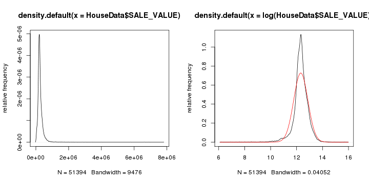

Aaron's First Cleaning of the Data
========================================================

This document describes and shows the first data cleaning done via R after the data file was uploaded to the R Server. We'll do most of the spatial display via ArcMap, but much of the data manipulation, analysis and non-spatial display via R.


```r
require(foreign)
```

```
## Loading required package: foreign
```

```r
getwd()
```

```
## [1] "/home/aswoboda/OSI Hedonic Project/OSI-Hedonic/writeup/02-AllData"
```

```r
HouseData = read.dbf("~/OSI Hedonic Project/Data/GIS2R/allData.dbf")
```


```r
options(width = 160)
```


What's in this file? What is the underlying structure of the data? What are the variables? How many of them? What are their values?

```r
str(HouseData)
```

```
## 'data.frame':	51394 obs. of  67 variables:
##  $ COUNTY_ID : Factor w/ 5 levels "003","037","123",..: 2 2 2 2 2 2 2 2 2 2 ...
##  $ PIN       : Factor w/ 51367 levels "003-013024110022",..: 14879 14882 10056 17023 17024 12061 12063 12067 12068 12071 ...
##  $ CITY      : Factor w/ 74 levels "ANDOVER","ANOKA",..: 40 40 3 48 48 6 6 6 6 7 ...
##  $ LOT       : Factor w/ 809 levels "001","002","003",..: NA NA NA NA NA NA NA NA NA NA ...
##  $ ACRES_POLY: num  0.3 0.28 0.37 0.84 0.61 0.92 0.53 0.54 0.33 1.25 ...
##  $ ACRES_DEED: num  0 0 0 0 0 0 0 0 0 0 ...
##  $ USE1_DESC : Factor w/ 7 levels "100 Res 1 unit",..: 4 4 4 4 4 4 4 4 4 4 ...
##  $ HOMESTEAD : Factor w/ 3 levels "N","P","Y": 3 3 3 3 3 3 3 3 3 3 ...
##  $ EMV_LAND  : int  50600 53000 64200 118700 149400 84700 116400 101600 59300 40500 ...
##  $ EMV_BLDG  : int  135700 213100 121700 284900 599400 216600 441800 318700 178300 183300 ...
##  $ EMV_TOTAL : int  186300 266100 185900 403600 748800 301300 558200 420300 237600 223800 ...
##  $ TAX_CAPAC : int  1906 2713 1915 4277 8614 3075 5853 4283 2423 2367 ...
##  $ TOTAL_TAX : int  2088 3130 2300 4124 8211 3872 7381 5436 2921 2528 ...
##  $ XUSE1_DESC: Factor w/ 7 levels "BENEVOLENT INST. (CHEM. DEPT TRTMNT CTR)",..: NA NA NA NA NA NA NA NA NA NA ...
##  $ DWELL_TYPE: Factor w/ 13 levels "Condominium",..: 6 6 6 6 6 6 6 6 6 6 ...
##  $ HOME_STYLE: Factor w/ 71 levels "1 1/2 Story Finished",..: 62 62 62 70 70 62 70 70 70 47 ...
##  $ FIN_SQ_FT : int  1756 2806 1509 3587 6225 2944 5104 3773 2746 2960 ...
##  $ GARAGE    : Factor w/ 2 levels "N","Y": NA NA NA NA NA NA NA NA NA NA ...
##  $ GARAGESQFT: Factor w/ 1745 levels "0","10","1000",..: 974 1317 825 341 73 1262 1452 1215 740 1379 ...
##  $ BASEMENT  : Factor w/ 2 levels "N","Y": NA NA NA NA NA NA NA NA NA NA ...
##  $ HEATING   : Factor w/ 13 levels "Electric","ELECTRIC",..: NA NA NA NA NA NA NA NA NA NA ...
##  $ COOLING   : Factor w/ 5 levels "CENTRAL","CENTRAL W/AIR COND",..: NA NA NA NA NA NA NA NA NA NA ...
##  $ YEAR_BUILT: int  1979 1991 1972 1988 1995 1979 1992 1988 1986 1966 ...
##  $ NUM_UNITS : Factor w/ 4 levels "0","1","2","3": 2 2 2 2 2 2 2 2 2 2 ...
##  $ SALE_DATE : Date, format: "2009-08-28" "2011-01-14" "2009-10-30" "2010-07-20" ...
##  $ SALE_VALUE: int  213400 261000 177000 465000 730000 250000 597000 369000 231000 179350 ...
##  $ SCHOOL_DST: Factor w/ 29 levels "006","11","12",..: 13 13 11 12 12 10 8 8 8 9 ...
##  $ WSHD_DIST : Factor w/ 22 levels "BLACK DOG","Capital Region W/S",..: 6 6 17 6 6 4 4 1 1 17 ...
##  $ MYPIN     : int  0 1 2 3 4 5 6 7 8 9 ...
##  $ X_COORD   : num  496830 495747 484574 491579 491388 ...
##  $ Y_COORD   : num  496830 495747 484574 491579 491388 ...
##  $ GEOID10   : Factor w/ 7434 levels "270030501101002",..: 536 573 1590 670 671 1049 1049 1028 787 1752 ...
##  $ Census_POP: num  41 41 188 183 218 ...
##  $ WhiteDense: num  0.878 1 0.878 0.945 0.936 ...
##  $ VACANT    : num  0 1 0 1 1 1 1 50 1 0 ...
##  $ SDNUM     : int  199 199 196 197 197 194 191 191 191 192 ...
##  $ SDNAME    : Factor w/ 27 levels "Anoka-Hennepin",..: 9 9 16 26 26 11 2 2 2 6 ...
##  $ ELEMENTARY: Factor w/ 196 levels "ADAMS","AFTON-LAKELAND",..: 136 78 62 110 110 126 182 57 189 46 ...
##  $ MIDDLE    : Factor w/ 56 levels "ANOKA MIDDLE SCHOOL FOR THE ARTS",..: 21 21 13 16 16 26 25 25 23 39 ...
##  $ HIGH      : Factor w/ 43 levels "ANDOVER","ANOKA",..: 34 34 13 19 19 35 5 5 5 15 ...
##  $ TRACTCE10 : Factor w/ 322 levels "030100","030201",..: 199 202 255 208 208 230 230 229 213 262 ...
##  $ NAME10    : Factor w/ 381 levels "Block 1000","Block 1001",..: 308 136 121 1 5 125 125 1 114 108 ...
##  $ Block_Area: num  40000 25000 120000 150000 260000 50000 50000 580000 56000 84000 ...
##  $ POP_Dense : num  0.001025 0.00164 0.001567 0.00122 0.000838 ...
##  $ fam_income: int  63953 99750 123628 121685 121685 76509 76509 89786 96111 78431 ...
##  $ income_err: Factor w/ 320 levels "10022","10059",..: 294 316 116 63 63 7 7 109 306 229 ...
##  $ StPaulDist: num  13907 12915 23100 8332 8394 ...
##  $ MinneaDist: num  23129 21868 24282 16132 16017 ...
##  $ parkArea05: num  36468 2960 64540 3951 43448 ...
##  $ parkArea02: num  322917 0 12390200 0 0 ...
##  $ parkArea01: num  0 0 4673 0 0 ...
##  $ parkArea10: num  0 206107 385935 401638 557911 ...
##  $ Over65Dens: num  0.0732 0 0.0425 0.0656 0.0321 ...
##  $ Less18Dens: num  1.83 1.63 1.71 1.73 1.78 ...
##  $ VacantDens: num  0 1 0 1 0.333 ...
##  $ OSV05KM   : int  3569670 2687240 2190160 4111410 3692540 3958300 3832840 3952690 2579150 2784770 ...
##  $ GarageBin : int  1 1 1 1 1 1 1 1 1 1 ...
##  $ OSV025KM  : num  838847 584558 535368 747625 443717 ...
##  $ OSV1KM    : num  17029800 18514700 13397700 29468300 26886400 ...
##  $ OSV01KM   : num  27000 108000 81000 65184 27000 ...
##  $ parkArea20: num  806048 902408 1654074 1394854 1389136 ...
##  $ BlockHCoun: int  21 14 62 61 74 15 15 165 17 15 ...
##  $ OSV2KM    : num  6.11e+07 8.66e+07 7.12e+07 1.13e+08 1.16e+08 ...
##  $ CostDiff  : int  27100 -5100 -8900 61400 -18800 -51300 38800 -51300 -6600 -44450 ...
##  $ Outliers  : int  0 0 0 0 0 0 0 0 0 0 ...
##  $ Attach    : int  2 2 2 2 2 2 2 2 2 2 ...
##  $ HomeStyle : Factor w/ 52 levels "1-2 STRY","1 Story",..: 45 45 45 8 8 45 8 8 8 2 ...
##  - attr(*, "data_types")= chr  "C" "C" "C" "C" ...
```

```r
summary(HouseData)
```

```
##  COUNTY_ID              PIN                           CITY            LOT          ACRES_POLY      ACRES_DEED   
##  003: 9479   139-254160010:    8   SAINT PAUL           : 8083   1      : 2249   Min.   : 0.00   Min.   : 0.00  
##  037: 9677   139-254160030:    8   CITY OF WOODBURY     : 4938   2      : 2151   1st Qu.: 0.14   1st Qu.: 0.00  
##  123:14057   139-250950090:    2   CITY OF SHAKOPEE     : 3113   3      : 2126   Median : 0.25   Median : 0.00  
##  139: 6919   139-252310040:    2   BLAINE               : 2416   4      : 1959   Mean   : 0.37   Mean   : 0.11  
##  163:11262   139-252310100:    2   CITY OF COTTAGE GROVE: 2121   5      : 1757   3rd Qu.: 0.34   3rd Qu.: 0.11  
##              139-254160170:    2   CITY OF SAVAGE       : 1895   (Other):25624   Max.   :39.98   Max.   :40.00  
##              (Other)      :51370   (Other)              :28828   NA's   :15528                                  
##                                                  USE1_DESC     HOMESTEAD    EMV_LAND          EMV_BLDG         EMV_TOTAL         TAX_CAPAC       TOTAL_TAX    
##  100 Res 1 unit                                       :18181   N: 7748   Min.   :   1800   Min.   :      0   Min.   :      0   Min.   :    0   Min.   :    0  
##  COMMERCIAL-PREFFERED                                 :    3   P:  120   1st Qu.:  42200   1st Qu.: 104600   1st Qu.: 154000   1st Qu.:    0   1st Qu.:    0  
##  EXEMPT                                               :    2   Y:43526   Median :  61700   Median : 131300   Median : 195200   Median :    0   Median : 1969  
##  RESIDENTIAL                                          : 9672             Mean   :  68962   Mean   : 156701   Mean   : 225662   Mean   :  816   Mean   : 1866  
##  RESIDENTIAL SINGLE FAMILY                            : 9478             3rd Qu.:  81000   3rd Qu.: 184700   3rd Qu.: 263200   3rd Qu.: 1684   3rd Qu.: 2762  
##  RESIDENTIAL SINGLE FAMILY, RESIDENTIAL SINGLE FAMILY,:    1             Max.   :1955300   Max.   :1994500   Max.   :3437200   Max.   :25949   Max.   :49323  
##  Single Family Dwelling, Platted Lot                  :14057                                                                                                  
##                                     XUSE1_DESC                             DWELL_TYPE            HOME_STYLE      FIN_SQ_FT      GARAGE         GARAGESQFT   
##  Muni Srvc Other                         :    4   SINGLE FAMILY DWELLING        :14057   One Story    : 7412   Min.   :  300   N   :  960   440     : 3251  
##  RESIDENTIAL SINGLE FAMILY               :    2   S.FAM.RES                     : 9677   Two Story    : 4850   1st Qu.: 1092   Y   :33838   484     : 1835  
##  BENEVOLENT INST. (CHEM. DEPT TRTMNT CTR):    1   RESIDENTIAL SINGLE FAMILY     : 9478   SPLIT LEVL   : 4140   Median : 1454   NA's:16596   528     : 1793  
##  CDA,ECON DEV/HABITAT FOR HUMANITY/MHFA  :    1   Single-Family / Owner Occupied: 7699   TWO STORY    : 3834   Mean   : 1648                440.0000: 1352  
##  Church-Other Res                        :    1   Townhouse                     : 2994   Bungalow     : 3610   3rd Qu.: 1978                576     : 1231  
##  (Other)                                 :    2   (Other)                       :  570   2 Story Frame: 3509   Max.   :18116                (Other) :32055  
##  NA's                                    :51383   NA's                          : 6919   (Other)      :24039                                NA's    : 9877  
##  BASEMENT          HEATING                    COOLING        YEAR_BUILT   NUM_UNITS      SALE_DATE            SALE_VALUE        SCHOOL_DST   
##  N   : 1566   FA Gas   : 8637   CENTRAL           : 4276   Min.   :1840   0   : 9502   Min.   :2005-01-01   Min.   :    500   625    : 8083  
##  Y   :33231   HOT AIR  : 6449   CENTRAL W/AIR COND: 9682   1st Qu.:1959   1   :34962   1st Qu.:2005-09-09   1st Qu.: 177500   11     : 5925  
##  NA's:16597   Yes      : 2529   NON CENTRAL       :   93   Median :1986   2   :   10   Median :2006-07-10   Median : 227500   196    : 3766  
##               HOT WATER: 1699   NONE              :    3   Mean   :1977   3   :    1   Mean   :2007-06-19   Mean   : 257784   720    : 3272  
##               Oil F.A. :   63   Y                 :10841   3rd Qu.:2000   NA's: 6919   3rd Qu.:2009-08-31   3rd Qu.: 301000   719    : 2892  
##               (Other)  :   59   NA's              :26499   Max.   :2011                Max.   :2011-12-08   Max.   :7785000   (Other):19918  
##               NA's     :31958                                                                                                 NA's   : 7538  
##                          WSHD_DIST         MYPIN          X_COORD          Y_COORD                   GEOID10        Census_POP     WhiteDense   
##  WS SOUTH WASHINGTON          : 6692   Min.   :    0   Min.   :453873   Min.   : 453873   271390803011036:  125   Min.   :   0   Min.   :0.000  
##  Capital Region W/S           : 5859   1st Qu.:12854   1st Qu.:479129   1st Qu.: 499150   271630710181000:   86   1st Qu.:  59   1st Qu.:0.826  
##  COON CREEK WATERSHED DISTRICT: 4264   Median :25756   Median :488113   Median :4958106   271630702031040:   59   Median : 105   Median :0.920  
##  Metro Watershed              : 4126   Mean   :25736   Mean   :487574   Mean   :3342662   271390809042006:   58   Mean   : 193   Mean   :0.860  
##  VERMILLION RIVER             : 4081   3rd Qu.:38605   3rd Qu.:498846   3rd Qu.:4983593   271390807001019:   55   3rd Qu.: 228   3rd Qu.:0.967  
##  (Other)                      :17660   Max.   :51453   Max.   :515941   Max.   :5019682   (Other)        :18351   Max.   :2381   Max.   :1.000  
##  NA's                         : 8712                                                      NA's           :32660                                 
##      VACANT           SDNUM                              SDNAME           ELEMENTARY                   MIDDLE                 HIGH         TRACTCE10    
##  Min.   :  0.00   Min.   :  0   St. Paul                    : 4255   RED OAK   :  992   SHAKOPEE          : 1367   SHAKOPEE     : 1367   071018 :  724  
##  1st Qu.:  0.00   1st Qu.:  0   South Washington County     : 2969   PEARSON   :  956   BATTLE CREEK      : 1343   PRIOR LAKE   : 1139   080302 :  447  
##  Median :  1.00   Median :  0   North St. Paul-Maplewood    : 1619   BAILEY    :  933   TWIN & HIDDEN OAKS: 1139   NORTH & SOUTH: 1125   080301 :  377  
##  Mean   :  3.63   Mean   :213   Shakopee                    : 1367   LAKE ELMO :  879   LAKE              :  927   WOODBURY     : 1033   071017 :  299  
##  3rd Qu.:  2.00   3rd Qu.:622   Rosemount-Apple Valley-Eagan: 1271   FIVE HAWKS:  794   WOODBURY          :  755   EAST RIDGE   : 1005   071206 :  299  
##  Max.   :164.00   Max.   :834   (Other)                     : 7253   WOODCREST :  783   (Other)           :12970   (Other)      :13065   (Other):16588  
##                                 NA's                        :32660   (Other)   :46057   NA's              :32893   NA's         :32660   NA's   :32660  
##         NAME10        Block_Area        POP_Dense         fam_income       income_err      StPaulDist      MinneaDist      parkArea05       parkArea02      
##  Block 2000:  407   Min.   :      0   Min.   :0.00000   Min.   : 15625   7118   :  724   Min.   :  629   Min.   : 4765   Min.   :     0   Min.   :0.00e+00  
##  Block 1000:  376   1st Qu.:      0   1st Qu.:0.00000   1st Qu.: 61692   5610   :  447   1st Qu.:11056   1st Qu.:18462   1st Qu.: 13126   1st Qu.:0.00e+00  
##  Block 2006:  344   Median :      0   Median :0.00000   Median : 74375   6132   :  377   Median :18355   Median :24653   Median : 43577   Median :7.68e+03  
##  Block 1008:  299   Mean   : 102858   Mean   :0.00070   Mean   : 76585   19338  :  299   Mean   :20077   Mean   :23153   Mean   : 66625   Mean   :4.89e+07  
##  Block 2001:  279   3rd Qu.:  27000   3rd Qu.:0.00114   3rd Qu.: 89417   5732   :  299   3rd Qu.:29493   3rd Qu.:28523   3rd Qu.: 94706   3rd Qu.:5.72e+04  
##  (Other)   :17029   Max.   :6200000   Max.   :0.01930   Max.   :160025   (Other):16588   Max.   :49892   Max.   :41925   Max.   :584901   Max.   :1.06e+10  
##  NA's      :32660                                                        NA's   :32660                                                                      
##    parkArea01      parkArea10        Over65Dens       Less18Dens      VacantDens       OSV05KM           GarageBin        OSV025KM           OSV1KM        
##  Min.   :    0   Min.   :      0   Min.   :0.0000   Min.   :0.000   Min.   : 0.00   Min.   :       0   Min.   :0.000   Min.   :      0   Min.   :0.00e+00  
##  1st Qu.:    0   1st Qu.: 129340   1st Qu.:0.0186   1st Qu.:0.270   1st Qu.: 0.00   1st Qu.: 2293662   1st Qu.:1.000   1st Qu.: 443184   1st Qu.:1.19e+07  
##  Median :    0   Median : 244768   Median :0.0539   Median :0.365   Median : 0.00   Median : 3192500   Median :1.000   Median : 621662   Median :1.65e+07  
##  Mean   : 1279   Mean   : 310954   Mean   :0.0798   Mean   :0.795   Mean   : 0.28   Mean   : 3744967   Mean   :0.981   Mean   : 732905   Mean   :1.95e+07  
##  3rd Qu.:  217   3rd Qu.: 432053   3rd Qu.:0.1139   3rd Qu.:1.632   3rd Qu.: 0.12   3rd Qu.: 4614896   3rd Qu.:1.000   3rd Qu.: 881833   3rd Qu.:2.43e+07  
##  Max.   :24099   Max.   :1934393   Max.   :1.0000   Max.   :2.000   Max.   :49.00   Max.   :30763200   Max.   :1.000   Max.   :9392010   Max.   :1.41e+08  
##                                                                                                                                                            
##     OSV01KM          parkArea20        BlockHCoun       OSV2KM            CostDiff           Outliers         Attach             HomeStyle    
##  Min.   :      0   Min.   :      0   Min.   :   1   Min.   :0.00e+00   Min.   :-1505000   Min.   :0e+00   Min.   :0.00   1 Story      : 9711  
##  1st Qu.:  54000   1st Qu.: 787950   1st Qu.:  23   1st Qu.:6.14e+07   1st Qu.:    3000   1st Qu.:0e+00   1st Qu.:2.00   2 Story      : 8694  
##  Median :  81000   Median :1193899   Median :  42   Median :8.77e+07   Median :   39600   Median :0e+00   Median :2.00   Split Level  : 6163  
##  Mean   :  97626   Mean   :1332636   Mean   : 198   Mean   :9.96e+07   Mean   :   32122   Mean   :2e-04   Mean   :1.66   Bungalow     : 3610  
##  3rd Qu.: 119184   3rd Qu.:1701123   3rd Qu.: 141   3rd Qu.:1.28e+08   3rd Qu.:   63500   3rd Qu.:0e+00   3rd Qu.:2.00   2 Story Frame: 3509  
##  Max.   :1762090   Max.   :6584706   Max.   :2402   Max.   :6.83e+08   Max.   : 7640000   Max.   :1e+00   Max.   :2.00   TOWNHOME     : 2504  
##                                                                                                                          (Other)      :17203  
```

```r
names(HouseData)
```

```
##  [1] "COUNTY_ID"  "PIN"        "CITY"       "LOT"        "ACRES_POLY" "ACRES_DEED" "USE1_DESC"  "HOMESTEAD"  "EMV_LAND"   "EMV_BLDG"   "EMV_TOTAL"  "TAX_CAPAC" 
## [13] "TOTAL_TAX"  "XUSE1_DESC" "DWELL_TYPE" "HOME_STYLE" "FIN_SQ_FT"  "GARAGE"     "GARAGESQFT" "BASEMENT"   "HEATING"    "COOLING"    "YEAR_BUILT" "NUM_UNITS" 
## [25] "SALE_DATE"  "SALE_VALUE" "SCHOOL_DST" "WSHD_DIST"  "MYPIN"      "X_COORD"    "Y_COORD"    "GEOID10"    "Census_POP" "WhiteDense" "VACANT"     "SDNUM"     
## [37] "SDNAME"     "ELEMENTARY" "MIDDLE"     "HIGH"       "TRACTCE10"  "NAME10"     "Block_Area" "POP_Dense"  "fam_income" "income_err" "StPaulDist" "MinneaDist"
## [49] "parkArea05" "parkArea02" "parkArea01" "parkArea10" "Over65Dens" "Less18Dens" "VacantDens" "OSV05KM"    "GarageBin"  "OSV025KM"   "OSV1KM"     "OSV01KM"   
## [61] "parkArea20" "BlockHCoun" "OSV2KM"     "CostDiff"   "Outliers"   "Attach"     "HomeStyle" 
```


Our primary interest is testing for a relationship between the house sale price and the OSI variables. 
------------
* What are the units of the OSI variable?

```r
vars = c("SALE_VALUE", "OSV01KM", "OSV025KM", "OSV05KM", "OSV1KM", "OSV2KM", "parkArea01", "parkArea02", "parkArea05", "parkArea10", "parkArea20")
whichVars = which(names(HouseData) %in% vars)
corMatrix = cor(HouseData[, vars])
round(corMatrix, 2)
```

```
##            SALE_VALUE OSV01KM OSV025KM OSV05KM OSV1KM OSV2KM parkArea01 parkArea02 parkArea05 parkArea10 parkArea20
## SALE_VALUE       1.00    0.12     0.18    0.20   0.19   0.15       0.09       0.01       0.09       0.08       0.06
## OSV01KM          0.12    1.00     0.76    0.51   0.34   0.26       0.09       0.02       0.05       0.04       0.01
## OSV025KM         0.18    0.76     1.00    0.79   0.55   0.41       0.11       0.04       0.10       0.07       0.02
## OSV05KM          0.20    0.51     0.79    1.00   0.79   0.56       0.08       0.05       0.14       0.12       0.03
## OSV1KM           0.19    0.34     0.55    0.79   1.00   0.79       0.07       0.05       0.13       0.16       0.08
## OSV2KM           0.15    0.26     0.41    0.56   0.79   1.00       0.07       0.04       0.08       0.13       0.11
## parkArea01       0.09    0.09     0.11    0.08   0.07   0.07       1.00       0.21       0.41       0.25       0.15
## parkArea02       0.01    0.02     0.04    0.05   0.05   0.04       0.21       1.00       0.30       0.31       0.25
## parkArea05       0.09    0.05     0.10    0.14   0.13   0.08       0.41       0.30       1.00       0.72       0.45
## parkArea10       0.08    0.04     0.07    0.12   0.16   0.13       0.25       0.31       0.72       1.00       0.73
## parkArea20       0.06    0.01     0.02    0.03   0.08   0.11       0.15       0.25       0.45       0.73       1.00
```


Our primary dependent variable has a skewed right distribution typical of house price distributions. A log-transformation results in an approximately normal-shaped distribution.

```r
par(mfrow = c(1, 2))
plot(density(HouseData$SALE_VALUE), ylab = "relative frequency")
plot(density(log(HouseData$SALE_VALUE)), ylab = "relative frequency")
curve(dnorm(x, mean = mean(log(HouseData$SALE_VALUE)), sd = sd(log(HouseData$SALE_VALUE))), add = TRUE, col = "red")
```

 


The following graphs show the distributions of our five Open Space Index variables. Notice that the OSI values are less skewed for the larger OSI radii. That is, the distribution of the OSI values for the 2km radius is more symmetrical than the OSI values for the .1km radius.

```r
par(mfrow = c(2, 3))
for (myVar in vars[-1]) {
    plot(density(HouseData[, myVar]), ylab = "relative frequency", xlab = "", main = myVar)
}
```

  


Basic Hedonic Regression
------

Let's start constructing our basic hedonic regression by formally creating the logged sale price variable, converting a couple variables from string to numeric, and creating some time related variables (year of sale, month of sale, etc.).

```r
HouseData$logPRICE = log(HouseData$SALE_VALUE)
HouseData$GARAGEsqft = as.numeric(as.character(HouseData$GARAGESQFT))
HouseData$SALE_YEAR = 1900 + as.POSIXlt(HouseData$SALE_DATE)$year
HouseData$SALE_MONTH = 1 + as.POSIXlt(HouseData$SALE_DATE)$mon
HouseData$YEARMON = 12 * (HouseData$SALE_YEAR - 2009) + HouseData$SALE_MONTH  # number of months since january 1, 2009
```


Now let's run an Ordinary Least Squares regression of the logged price on a few of our basic structural characteristics. The table below suggests that the four structural characteristics of finished square footage, lot size, garage size, and year built can explain almost half of the total variation in logged sales price. 

```r
StructuralModel1 = lm(logPRICE ~ FIN_SQ_FT + ACRES_POLY + YEAR_BUILT, data = HouseData)
summary(StructuralModel1)
```

```
## 
## Call:
## lm(formula = logPRICE ~ FIN_SQ_FT + ACRES_POLY + YEAR_BUILT, 
##     data = HouseData)
## 
## Residuals:
##    Min     1Q Median     3Q    Max 
## -6.312 -0.159  0.051  0.228  3.353 
## 
## Coefficients:
##             Estimate Std. Error t value Pr(>|t|)    
## (Intercept) 3.64e+00   1.35e-01    27.0   <2e-16 ***
## FIN_SQ_FT   3.54e-04   2.70e-06   131.1   <2e-16 ***
## ACRES_POLY  4.96e-02   2.30e-03    21.6   <2e-16 ***
## YEAR_BUILT  4.09e-03   6.86e-05    59.6   <2e-16 ***
## ---
## Signif. codes:  0 '***' 0.001 '**' 0.01 '*' 0.05 '.' 0.1 ' ' 1 
## 
## Residual standard error: 0.437 on 51390 degrees of freedom
## Multiple R-squared: 0.363,	Adjusted R-squared: 0.363 
## F-statistic: 9.75e+03 on 3 and 51390 DF,  p-value: <2e-16 
## 
```


We now add fixed effects for the home's construction style to our regression equation in order to further explain another five percent of the variation in our logged sale price variable.

```r
StructuralModel2 = lm(logPRICE ~ FIN_SQ_FT + ACRES_POLY + YEAR_BUILT + HomeStyle, data = HouseData)
summary(StructuralModel2)
```

```
## 
## Call:
## lm(formula = logPRICE ~ FIN_SQ_FT + ACRES_POLY + YEAR_BUILT + 
##     HomeStyle, data = HouseData)
## 
## Residuals:
##    Min     1Q Median     3Q    Max 
## -6.333 -0.138  0.048  0.203  3.356 
## 
## Coefficients:
##                                          Estimate Std. Error t value Pr(>|t|)    
## (Intercept)                              3.50e+00   1.91e-01   18.36  < 2e-16 ***
## FIN_SQ_FT                                3.28e-04   3.17e-06  103.38  < 2e-16 ***
## ACRES_POLY                               4.60e-02   2.25e-03   20.40  < 2e-16 ***
## YEAR_BUILT                               4.38e-03   9.53e-05   45.94  < 2e-16 ***
## HomeStyle1 Story                        -3.93e-01   2.25e-02  -17.47  < 2e-16 ***
## HomeStyle1 Story Brick                  -1.31e-01   2.44e-01   -0.54   0.5908    
## HomeStyle1 Story Condo                  -9.39e-01   4.16e-02  -22.56  < 2e-16 ***
## HomeStyle1 Story Frame                  -3.27e-01   2.39e-02  -13.71  < 2e-16 ***
## HomeStyle1 Story Townhouse              -3.82e-01   2.67e-02  -14.29  < 2e-16 ***
## HomeStyle2 1/2 Story Finished           -7.89e-01   4.21e-01   -1.87   0.0610 .  
## HomeStyle2 Story                        -3.20e-01   2.25e-02  -14.21  < 2e-16 ***
## HomeStyle2 Story Brick                  -1.56e-01   4.21e-01   -0.37   0.7116    
## HomeStyle2 Story Condo                  -8.42e-01   3.01e-02  -28.00  < 2e-16 ***
## HomeStyle2 Story Frame                  -3.52e-01   2.32e-02  -15.16  < 2e-16 ***
## HomeStyle2 Story Townhouse              -7.67e-01   2.40e-02  -32.04  < 2e-16 ***
## HomeStyle3/2 Story                      -3.44e-01   3.09e-02  -11.15  < 2e-16 ***
## HomeStyle3-LVL SPLT                     -2.37e-01   3.76e-02   -6.30  3.0e-10 ***
## HomeStyle4 LVL SPLT                     -1.71e-01   3.35e-02   -5.12  3.1e-07 ***
## HomeStyle5/4 Story                      -3.17e-01   2.72e-02  -11.68  < 2e-16 ***
## HomeStyle7/4 Story                      -4.69e-01   2.56e-02  -18.30  < 2e-16 ***
## HomeStyleBi-level                       -2.73e-01   2.43e-02  -11.23  < 2e-16 ***
## HomeStyleBungalow                       -3.93e-01   2.37e-02  -16.57  < 2e-16 ***
## HomeStyleCabin                          -5.30e-01   4.21e-01   -1.26   0.2075    
## HomeStyleCondo                          -8.96e-01   4.01e-02  -22.32  < 2e-16 ***
## HomeStyleDetached Townhome - 1 story    -7.98e-02   3.68e-02   -2.17   0.0300 *  
## HomeStyleDetached Townhome - 2 story    -3.97e-01   5.94e-02   -6.69  2.2e-11 ***
## HomeStyleDetached Townhome - Split Foy*  2.53e-02   2.44e-01    0.10   0.9174    
## HomeStyleDetached Townhome - Split lev* -2.09e-01   1.11e-01   -1.89   0.0592 .  
## HomeStyleDouble bungalow - split foyer  -1.65e-01   4.21e-01   -0.39   0.6955    
## HomeStyleDUP/TRI                        -3.11e-01   1.89e-01   -1.65   0.0997 .  
## HomeStyleEarth                          -3.86e-01   2.98e-01   -1.30   0.1949    
## HomeStyleLOG                             1.27e-01   2.44e-01    0.52   0.6031    
## HomeStyleMfd Home (Double)              -1.11e+00   4.21e-01   -2.64   0.0083 ** 
## HomeStyleMini-Warehouse - Condo         -2.82e+00   1.60e-01  -17.61  < 2e-16 ***
## HomeStyleModified two story             -2.61e-01   2.86e-02   -9.14  < 2e-16 ***
## HomeStyleModular                        -1.98e+00   2.98e-01   -6.65  3.0e-11 ***
## HomeStyleN/A                             6.45e-02   1.73e-01    0.37   0.7093    
## HomeStyleOther                          -1.32e+00   2.11e-01   -6.27  3.6e-10 ***
## HomeStyleQuad - one story               -5.42e-01   1.89e-01   -2.86   0.0042 ** 
## HomeStyleQuad - split level/foyer       -5.02e-01   4.02e-02  -12.49  < 2e-16 ***
## HomeStyleQuad - Two story               -5.39e-01   2.98e-01   -1.81   0.0703 .  
## HomeStyleRAMBLER                        -1.84e-01   2.63e-02   -6.98  2.9e-12 ***
## HomeStyleRow                            -4.07e-01   4.21e-01   -0.97   0.3337    
## HomeStyleSalvage                        -5.02e-01   2.11e-01   -2.38   0.0174 *  
## HomeStyleSplit Entry                    -4.37e-01   2.40e-02  -18.22  < 2e-16 ***
## HomeStyleSPLIT-FOY                      -2.57e-01   3.65e-02   -7.04  1.9e-12 ***
## HomeStyleSplit Foyer Frame              -3.56e-01   2.43e-02  -14.65  < 2e-16 ***
## HomeStyleSplit Level                    -3.77e-01   2.26e-02  -16.71  < 2e-16 ***
## HomeStyleSplit Level Frame              -2.76e-01   2.57e-02  -10.74  < 2e-16 ***
## HomeStyleThree Story                    -6.99e-01   7.98e-02   -8.76  < 2e-16 ***
## HomeStyleTOWNHOME                       -5.01e-01   2.35e-02  -21.36  < 2e-16 ***
## HomeStyleTWIN HOME                      -3.56e-01   3.81e-02   -9.33  < 2e-16 ***
## HomeStyleTwin home - one story          -7.42e-01   9.22e-02   -8.05  8.7e-16 ***
## HomeStyleTwin home - spit level/ split* -7.25e-01   5.45e-02  -13.32  < 2e-16 ***
## HomeStyleTwin home - two story          -1.05e+00   1.42e-01   -7.41  1.3e-13 ***
## ---
## Signif. codes:  0 '***' 0.001 '**' 0.01 '*' 0.05 '.' 0.1 ' ' 1 
## 
## Residual standard error: 0.42 on 51339 degrees of freedom
## Multiple R-squared: 0.412,	Adjusted R-squared: 0.412 
## F-statistic:  667 on 54 and 51339 DF,  p-value: <2e-16 
## 
```


Additional structural variables, such as the presence and type of cooling system are not reported for some counties in our study area and prevent us from including them in our regressions. We will rerun our regressions in the subset of area with cooling data to test the robustness of our results in a later section.

```r
table(is.na(HouseData$COOLING), HouseData$COUNTY_ID)
```

```
##        
##           003   037   123   139   163
##   FALSE     0     0 14054     0 10841
##   TRUE   9479  9677     3  6919   421
```


Adding Neighborhood Variables to the Regression
--------------

We now include a few of the most commonly used neighborhood characteristics in housing hedonic functions, namely


```r
neighborhoodModel1 = lm(logPRICE ~ FIN_SQ_FT + ACRES_POLY + YEAR_BUILT + HomeStyle + CITY + SCHOOL_DST + WhiteDense + fam_income, data = HouseData)
summary(neighborhoodModel1)
```

```
## 
## Call:
## lm(formula = logPRICE ~ FIN_SQ_FT + ACRES_POLY + YEAR_BUILT + 
##     HomeStyle + CITY + SCHOOL_DST + WhiteDense + fam_income, 
##     data = HouseData)
## 
## Residuals:
##    Min     1Q Median     3Q    Max 
## -6.548 -0.121  0.036  0.178  3.246 
## 
## Coefficients: (4 not defined because of singularities)
##                                          Estimate Std. Error t value Pr(>|t|)    
## (Intercept)                              4.61e+00   2.38e-01   19.34  < 2e-16 ***
## FIN_SQ_FT                                3.46e-04   3.88e-06   89.15  < 2e-16 ***
## ACRES_POLY                               3.62e-02   2.59e-03   13.99  < 2e-16 ***
## YEAR_BUILT                               3.22e-03   1.16e-04   27.67  < 2e-16 ***
## HomeStyle1 Story                        -9.68e-03   2.31e-02   -0.42  0.67492    
## HomeStyle1 Story Brick                   8.72e-01   4.13e-01    2.11  0.03460 *  
## HomeStyle1 Story Condo                  -3.45e-02   1.30e-01   -0.27  0.79060    
## HomeStyle1 Story Frame                   5.50e-01   1.23e-01    4.46  8.3e-06 ***
## HomeStyle1 Story Townhouse               4.92e-01   1.25e-01    3.93  8.6e-05 ***
## HomeStyle2 1/2 Story Finished           -3.76e-01   4.00e-01   -0.94  0.34732    
## HomeStyle2 Story                         4.53e-03   2.23e-02    0.20  0.83905    
## HomeStyle2 Story Condo                  -3.43e-02   1.28e-01   -0.27  0.78892    
## HomeStyle2 Story Frame                   4.89e-01   1.23e-01    3.97  7.3e-05 ***
## HomeStyle2 Story Townhouse               1.62e-01   1.23e-01    1.32  0.18829    
## HomeStyle3/2 Story                      -2.98e-02   3.11e-02   -0.96  0.33804    
## HomeStyle3-LVL SPLT                     -2.34e-01   3.50e-02   -6.68  2.4e-11 ***
## HomeStyle4 LVL SPLT                     -1.55e-01   3.13e-02   -4.94  7.8e-07 ***
## HomeStyle5/4 Story                      -1.50e-04   2.78e-02   -0.01  0.99570    
## HomeStyle7/4 Story                      -4.58e-02   2.54e-02   -1.80  0.07145 .  
## HomeStyleBi-level                        1.18e-01   2.52e-02    4.67  3.0e-06 ***
## HomeStyleBungalow                       -1.36e-02   2.40e-02   -0.57  0.57137    
## HomeStyleCabin                          -2.32e-01   3.91e-01   -0.59  0.55283    
## HomeStyleCondo                          -9.16e-01   3.80e-02  -24.12  < 2e-16 ***
## HomeStyleDetached Townhome - 1 story     2.62e-01   3.60e-02    7.27  3.5e-13 ***
## HomeStyleDetached Townhome - 2 story    -4.73e-02   5.92e-02   -0.80  0.42486    
## HomeStyleDetached Townhome - Split Foy*  3.68e-01   2.27e-01    1.62  0.10424    
## HomeStyleDetached Townhome - Split lev*  1.78e-01   1.04e-01    1.71  0.08724 .  
## HomeStyleDouble bungalow - split foyer   1.77e-01   3.92e-01    0.45  0.65252    
## HomeStyleDUP/TRI                        -3.65e-01   1.76e-01   -2.08  0.03748 *  
## HomeStyleEarth                          -4.51e-01   2.76e-01   -1.63  0.10255    
## HomeStyleLOG                             3.49e-01   2.30e-01    1.52  0.12900    
## HomeStyleMini-Warehouse - Condo         -2.42e+00   1.50e-01  -16.15  < 2e-16 ***
## HomeStyleModified two story              1.08e-01   2.87e-02    3.76  0.00017 ***
## HomeStyleModular                        -1.67e+00   2.77e-01   -6.02  1.8e-09 ***
## HomeStyleN/A                             3.18e-03   1.61e-01    0.02  0.98420    
## HomeStyleOther                          -1.01e+00   1.96e-01   -5.13  2.8e-07 ***
## HomeStyleQuad - one story               -2.00e-01   1.76e-01   -1.14  0.25515    
## HomeStyleQuad - split level/foyer       -1.73e-01   3.94e-02   -4.39  1.1e-05 ***
## HomeStyleQuad - Two story               -1.57e-01   2.77e-01   -0.57  0.57020    
## HomeStyleRAMBLER                        -2.14e-01   2.46e-02   -8.72  < 2e-16 ***
## HomeStyleRow                            -1.14e-01   3.91e-01   -0.29  0.77027    
## HomeStyleSalvage                        -6.87e-01   4.09e-01   -1.68  0.09283 .  
## HomeStyleSplit Entry                    -1.75e-01   2.32e-02   -7.54  4.9e-14 ***
## HomeStyleSPLIT-FOY                      -2.37e-01   3.42e-02   -6.92  4.5e-12 ***
## HomeStyleSplit Foyer Frame               5.90e-01   1.24e-01    4.77  1.9e-06 ***
## HomeStyleSplit Level                     4.09e-02   2.34e-02    1.75  0.08027 .  
## HomeStyleSplit Level Frame               6.40e-01   1.24e-01    5.16  2.5e-07 ***
## HomeStyleThree Story                    -1.63e-01   7.56e-02   -2.16  0.03069 *  
## HomeStyleTOWNHOME                       -4.58e-01   2.19e-02  -20.90  < 2e-16 ***
## HomeStyleTWIN HOME                      -3.24e-01   3.55e-02   -9.11  < 2e-16 ***
## HomeStyleTwin home - one story          -3.67e-01   8.65e-02   -4.24  2.3e-05 ***
## HomeStyleTwin home - spit level/ split* -3.63e-01   5.20e-02   -6.99  2.8e-12 ***
## HomeStyleTwin home - two story          -6.72e-01   1.32e-01   -5.08  3.7e-07 ***
## CITYANOKA                               -4.64e-02   2.28e-02   -2.04  0.04167 *  
## CITYAPPLE VALLEY                         6.14e-02   6.46e-02    0.95  0.34159    
## CITYARDEN HILLS                         -4.38e-01   8.21e-02   -5.34  9.3e-08 ***
## CITYBLAINE                              -4.40e-02   1.69e-02   -2.61  0.00898 ** 
## CITYBURNSVILLE                           6.53e-02   6.20e-02    1.05  0.29227    
## CITYCASTLE ROCK TWP                      2.33e-01   2.07e-01    1.12  0.26167    
## CITYCENTERVILLE                         -1.54e-01   4.77e-02   -3.24  0.00121 ** 
## CITYCIRCLE PINES                        -6.03e-02   4.63e-02   -1.30  0.19269    
## CITYCITY OF BIRCHWOOD                   -1.35e-01   2.38e-01   -0.57  0.57171    
## CITYCITY OF COTTAGE GROVE               -5.04e-01   1.52e-01   -3.31  0.00094 ***
## CITYCITY OF DELLWOOD                    -2.21e-01   2.09e-01   -1.05  0.29145    
## CITYCITY OF GRANT                       -5.00e-01   2.12e-01   -2.36  0.01850 *  
## CITYCITY OF HUGO                        -4.71e-01   2.31e-01   -2.04  0.04133 *  
## CITYCITY OF LAKE ELMO                   -4.42e-01   1.71e-01   -2.59  0.00953 ** 
## CITYCITY OF MAHTOMEDI                   -3.98e-01   2.01e-01   -1.98  0.04775 *  
## CITYCITY OF OAKDALE                     -5.52e-01   1.63e-01   -3.38  0.00072 ***
## CITYCITY OF PINE SPRINGS                -3.92e-01   2.56e-01   -1.53  0.12634    
## CITYCITY OF PRIOR LAKE                   4.13e-01   6.04e-02    6.83  8.4e-12 ***
## CITYCITY OF SAVAGE                       4.72e-01   5.95e-02    7.93  2.2e-15 ***
## CITYCITY OF SHAKOPEE                     2.84e-01   5.22e-02    5.44  5.2e-08 ***
## CITYCITY OF WHITE BEAR LAKE             -5.58e-01   2.30e-01   -2.43  0.01529 *  
## CITYCITY OF WILLERNIE                   -6.93e-01   2.26e-01   -3.06  0.00222 ** 
## CITYCITY OF WOODBURY                    -4.15e-01   1.62e-01   -2.57  0.01015 *  
## CITYCOLUMBIA HEIGHTS                     6.71e-02   5.75e-02    1.17  0.24324    
## CITYCOLUMBUS                            -2.58e-01   1.41e-01   -1.83  0.06702 .  
## CITYCOON RAPIDS                         -2.50e-02   1.58e-02   -1.58  0.11305    
## CITYEAGAN                                1.18e-01   6.37e-02    1.85  0.06362 .  
## CITYEAST BETHEL                          2.89e-02   7.43e-02    0.39  0.69766    
## CITYEMPIRE TWP                          -5.80e-03   8.43e-02   -0.07  0.94513    
## CITYFALCON HEIGHTS                      -2.82e-01   8.90e-02   -3.16  0.00156 ** 
## CITYFARMINGTON                          -1.27e-03   7.19e-02   -0.02  0.98591    
## CITYFRIDLEY                              2.22e-02   4.02e-02    0.55  0.58095    
## CITYGEM LAKE                            -6.27e-01   1.15e-01   -5.45  5.2e-08 ***
## CITYHAM LAKE                            -4.14e-02   2.25e-02   -1.84  0.06582 .  
## CITYHILLTOP                             -4.41e-01   2.81e-01   -1.57  0.11614    
## CITYINVER GROVE HEIGHTS                  1.62e-01   7.34e-02    2.21  0.02744 *  
## CITYLAKEVILLE                            3.28e-02   6.55e-02    0.50  0.61652    
## CITYLAUDERDALE                          -4.01e-01   9.82e-02   -4.08  4.4e-05 ***
## CITYLEXINGTON                           -8.82e-02   6.79e-02   -1.30  0.19354    
## CITYLINO LAKES                          -7.19e-02   3.71e-02   -1.94  0.05286 .  
## CITYLITTLE CANADA                       -4.20e-01   8.45e-02   -4.97  6.8e-07 ***
## CITYMAPLEWOOD                           -4.82e-01   8.55e-02   -5.63  1.8e-08 ***
## CITYMENDOTA                              2.28e-01   2.07e-01    1.10  0.27163    
## CITYMENDOTA HEIGHTS                      1.52e-01   7.45e-02    2.04  0.04159 *  
## CITYMOUNDS VIEW                         -5.65e-01   8.06e-02   -7.01  2.4e-12 ***
## CITYNEW BRIGHTON                        -4.64e-01   7.93e-02   -5.85  4.9e-09 ***
## CITYNORTH OAKS                          -3.73e-01   8.09e-02   -4.62  3.9e-06 ***
## CITYNORTH SAINT PAUL                    -5.63e-01   8.89e-02   -6.34  2.3e-10 ***
## CITYNOWTHEN                             -1.18e-01   8.79e-02   -1.34  0.17919    
## CITYOAK GROVE                            5.67e-02   1.15e-01    0.49  0.62061    
## CITYRAMSEY                              -2.15e-01   1.76e-02  -12.17  < 2e-16 ***
## CITYROSEMOUNT                            5.95e-02   6.55e-02    0.91  0.36398    
## CITYROSEVILLE                           -4.15e-01   8.12e-02   -5.12  3.1e-07 ***
## CITYSAINT ANTHONY                       -3.25e-01   1.59e-01   -2.05  0.04021 *  
## CITYSAINT PAUL                           6.43e-03   5.17e-02    0.12  0.90099    
## CITYSHOREVIEW                           -4.12e-01   7.85e-02   -5.25  1.5e-07 ***
## CITYSOUTH ST PAUL                       -1.02e-01   5.34e-02   -1.91  0.05678 .  
## CITYSPRING LAKE PARK                    -1.74e-01   3.87e-02   -4.48  7.3e-06 ***
## CITYSUNFISH LAKE                         3.94e-01   1.26e-01    3.12  0.00179 ** 
## CITYTOWN OF CREDIT RIVER                 3.60e-01   1.34e-01    2.68  0.00733 ** 
## CITYTOWN OF JACKSON                      5.31e-01   3.93e-01    1.35  0.17708    
## CITYTOWN OF LOUISVILLE                   2.06e-01   2.31e-01    0.89  0.37337    
## CITYTOWN OF SPRING LAKE                  4.56e-01   7.77e-02    5.87  4.4e-09 ***
## CITYVADNAIS HEIGHTS                     -3.50e-01   6.94e-02   -5.05  4.5e-07 ***
## CITYWEST ST PAUL                         1.62e-01   7.27e-02    2.23  0.02551 *  
## CITYWHITE BEAR LAKE                     -3.38e-01   6.72e-02   -5.02  5.1e-07 ***
## CITYWHITE BEAR TOWNSHIP                 -3.54e-01   6.89e-02   -5.14  2.8e-07 ***
## SCHOOL_DST11                            -5.72e-02   4.91e-02   -1.16  0.24416    
## SCHOOL_DST12                             9.98e-03   4.10e-02    0.24  0.80748    
## SCHOOL_DST13                            -3.29e-02   7.14e-02   -0.46  0.64511    
## SCHOOL_DST14                             1.68e-02   6.46e-02    0.26  0.79543    
## SCHOOL_DST15                            -2.07e-01   7.43e-02   -2.79  0.00533 ** 
## SCHOOL_DST16                             6.66e-02   4.97e-02    1.34  0.18045    
## SCHOOL_DST191                           -2.06e-01   3.31e-02   -6.25  4.3e-10 ***
## SCHOOL_DST192                           -2.06e-01   4.91e-02   -4.20  2.6e-05 ***
## SCHOOL_DST194                           -2.25e-01   4.17e-02   -5.40  6.7e-08 ***
## SCHOOL_DST196                           -2.22e-01   3.80e-02   -5.84  5.3e-09 ***
## SCHOOL_DST197                           -1.94e-01   4.89e-02   -3.96  7.4e-05 ***
## SCHOOL_DST199                           -2.67e-01   5.59e-02   -4.77  1.9e-06 ***
## SCHOOL_DST282                            4.41e-01   1.32e-01    3.33  0.00086 ***
## SCHOOL_DST621                            4.22e-01   7.96e-02    5.30  1.2e-07 ***
## SCHOOL_DST622                            4.09e-01   8.84e-02    4.63  3.8e-06 ***
## SCHOOL_DST623                            4.64e-01   8.32e-02    5.58  2.4e-08 ***
## SCHOOL_DST624                            2.84e-01   6.72e-02    4.23  2.3e-05 ***
## SCHOOL_DST625                                  NA         NA      NA       NA    
## SCHOOL_DST717                           -2.11e-01   1.58e-01   -1.33  0.18347    
## SCHOOL_DST719                           -5.64e-02   3.10e-02   -1.82  0.06909 .  
## SCHOOL_DST720                                  NA         NA      NA       NA    
## SCHOOL_DST728                           -3.84e-02   8.82e-02   -0.44  0.66330    
## SCHOOL_DST831                                  NA         NA      NA       NA    
## SCHOOL_DSTISD622                        -5.75e-02   1.07e-01   -0.54  0.59194    
## SCHOOL_DSTISD624                        -1.74e-01   1.91e-01   -0.91  0.36449    
## SCHOOL_DSTISD831                        -5.08e-01   2.10e-01   -2.42  0.01544 *  
## SCHOOL_DSTISD832                        -3.33e-02   1.53e-01   -0.22  0.82761    
## SCHOOL_DSTISD833                               NA         NA      NA       NA    
## WhiteDense                               8.48e-01   1.22e-02   69.75  < 2e-16 ***
## fam_income                               1.13e-06   1.25e-07    9.03  < 2e-16 ***
## ---
## Signif. codes:  0 '***' 0.001 '**' 0.01 '*' 0.05 '.' 0.1 ' ' 1 
## 
## Residual standard error: 0.39 on 43710 degrees of freedom
##   (7538 observations deleted due to missingness)
## Multiple R-squared: 0.501,	Adjusted R-squared: 0.499 
## F-statistic:  302 on 145 and 43710 DF,  p-value: <2e-16 
## 
```


Surprisingly, few of the city or school district fixed effects seem to statistically differ from zero. Let's try a smaller scale measure of location - the elementary school catchment basin. This model now describes about two-thirds of the variation in logged sale price.

```r
neighborhoodModel2 = lm(logPRICE ~ FIN_SQ_FT + ACRES_POLY + YEAR_BUILT + HomeStyle + ELEMENTARY + WhiteDense + fam_income, data = HouseData)
summary(neighborhoodModel2)
```

```
## 
## Call:
## lm(formula = logPRICE ~ FIN_SQ_FT + ACRES_POLY + YEAR_BUILT + 
##     HomeStyle + ELEMENTARY + WhiteDense + fam_income, data = HouseData)
## 
## Residuals:
##    Min     1Q Median     3Q    Max 
## -6.834 -0.108  0.034  0.169  3.191 
## 
## Coefficients:
##                                              Estimate Std. Error t value Pr(>|t|)    
## (Intercept)                                  3.48e+00   2.20e-01   15.84  < 2e-16 ***
## FIN_SQ_FT                                    3.29e-04   3.45e-06   95.11  < 2e-16 ***
## ACRES_POLY                                   4.02e-02   2.13e-03   18.88  < 2e-16 ***
## YEAR_BUILT                                   4.00e-03   1.10e-04   36.47  < 2e-16 ***
## HomeStyle1 Story                            -1.59e-02   2.17e-02   -0.73  0.46429    
## HomeStyle1 Story Brick                       3.60e-01   2.14e-01    1.68  0.09254 .  
## HomeStyle1 Story Condo                      -4.65e-01   4.36e-02  -10.65  < 2e-16 ***
## HomeStyle1 Story Frame                       1.54e-01   3.10e-02    4.96  7.1e-07 ***
## HomeStyle1 Story Townhouse                   8.49e-02   3.32e-02    2.56  0.01048 *  
## HomeStyle2 1/2 Story Finished               -3.65e-01   3.68e-01   -0.99  0.32058    
## HomeStyle2 Story                            -1.88e-02   2.10e-02   -0.90  0.37029    
## HomeStyle2 Story Brick                       1.68e-01   3.68e-01    0.46  0.64722    
## HomeStyle2 Story Condo                      -3.49e-01   3.59e-02   -9.71  < 2e-16 ***
## HomeStyle2 Story Frame                       8.16e-02   3.08e-02    2.65  0.00812 ** 
## HomeStyle2 Story Townhouse                  -2.61e-01   3.12e-02   -8.36  < 2e-16 ***
## HomeStyle3/2 Story                          -4.02e-02   2.85e-02   -1.41  0.15896    
## HomeStyle3-LVL SPLT                         -2.30e-01   3.30e-02   -6.96  3.5e-12 ***
## HomeStyle4 LVL SPLT                         -1.39e-01   2.95e-02   -4.73  2.2e-06 ***
## HomeStyle5/4 Story                          -7.82e-03   2.61e-02   -0.30  0.76408    
## HomeStyle7/4 Story                           4.02e-03   2.39e-02    0.17  0.86657    
## HomeStyleBi-level                            8.48e-02   2.37e-02    3.57  0.00035 ***
## HomeStyleBungalow                            2.77e-03   2.27e-02    0.12  0.90262    
## HomeStyleCabin                              -2.47e-01   3.67e-01   -0.67  0.50212    
## HomeStyleCondo                              -8.99e-01   3.67e-02  -24.47  < 2e-16 ***
## HomeStyleDetached Townhome - 1 story         2.45e-01   3.45e-02    7.09  1.3e-12 ***
## HomeStyleDetached Townhome - 2 story        -2.95e-02   5.46e-02   -0.54  0.58935    
## HomeStyleDetached Townhome - Split Foy*      3.36e-01   2.13e-01    1.57  0.11558    
## HomeStyleDetached Townhome - Split lev*      1.78e-01   9.88e-02    1.80  0.07231 .  
## HomeStyleDouble bungalow - split foyer       1.93e-01   3.68e-01    0.52  0.60075    
## HomeStyleDUP/TRI                            -2.48e-01   1.65e-01   -1.50  0.13380    
## HomeStyleEarth                              -4.62e-01   2.60e-01   -1.78  0.07543 .  
## HomeStyleLOG                                 2.23e-01   2.13e-01    1.05  0.29370    
## HomeStyleMfd Home (Double)                  -4.37e-01   3.68e-01   -1.19  0.23500    
## HomeStyleMini-Warehouse - Condo             -2.50e+00   1.42e-01  -17.58  < 2e-16 ***
## HomeStyleModified two story                  8.79e-02   2.71e-02    3.25  0.00117 ** 
## HomeStyleModular                            -1.64e+00   2.60e-01   -6.28  3.4e-10 ***
## HomeStyleN/A                                 2.69e-03   1.51e-01    0.02  0.98578    
## HomeStyleOther                              -1.06e+00   1.85e-01   -5.75  8.7e-09 ***
## HomeStyleQuad - one story                   -1.94e-01   1.66e-01   -1.17  0.24367    
## HomeStyleQuad - split level/foyer           -1.68e-01   3.76e-02   -4.48  7.4e-06 ***
## HomeStyleQuad - Two story                   -1.88e-01   2.60e-01   -0.72  0.46979    
## HomeStyleRAMBLER                            -1.87e-01   2.34e-02   -7.99  1.4e-15 ***
## HomeStyleRow                                -1.73e-01   3.67e-01   -0.47  0.63835    
## HomeStyleSalvage                             5.73e-02   1.86e-01    0.31  0.75771    
## HomeStyleSplit Entry                        -1.59e-01   2.20e-02   -7.23  4.7e-13 ***
## HomeStyleSPLIT-FOY                          -2.14e-01   3.24e-02   -6.60  4.3e-11 ***
## HomeStyleSplit Foyer Frame                   1.52e-01   3.17e-02    4.79  1.7e-06 ***
## HomeStyleSplit Level                         9.90e-03   2.20e-02    0.45  0.65221    
## HomeStyleSplit Level Frame                   2.12e-01   3.23e-02    6.58  4.9e-11 ***
## HomeStyleThree Story                        -2.27e-01   7.13e-02   -3.19  0.00143 ** 
## HomeStyleTOWNHOME                           -5.03e-01   2.08e-02  -24.20  < 2e-16 ***
## HomeStyleTWIN HOME                          -3.52e-01   3.38e-02  -10.41  < 2e-16 ***
## HomeStyleTwin home - one story              -3.87e-01   8.20e-02   -4.72  2.3e-06 ***
## HomeStyleTwin home - spit level/ split*     -3.76e-01   4.93e-02   -7.63  2.4e-14 ***
## HomeStyleTwin home - two story              -6.98e-01   1.25e-01   -5.59  2.2e-08 ***
## ELEMENTARYAFTON-LAKELAND                    -8.92e-02   4.34e-02   -2.05  0.04014 *  
## ELEMENTARYAKIN ROAD                         -7.75e-02   3.20e-02   -2.42  0.01533 *  
## ELEMENTARYAMES                               1.05e-01   4.52e-02    2.31  0.02070 *  
## ELEMENTARYANDERSEN                           1.64e-01   6.54e-02    2.51  0.01224 *  
## ELEMENTARYANDERSON & WILDWOOD                1.45e-01   3.66e-02    3.95  8.0e-05 ***
## ELEMENTARYANDOVER                            1.01e-01   2.93e-02    3.43  0.00060 ***
## ELEMENTARYARMSTRONG                         -1.37e-01   3.80e-02   -3.61  0.00030 ***
## ELEMENTARYBAILEY                             4.12e-02   3.45e-02    1.19  0.23244    
## ELEMENTARYBATTLE CREEK                       2.12e-02   4.41e-02    0.48  0.63031    
## ELEMENTARYBEL AIR                            1.00e-01   3.14e-02    3.18  0.00146 ** 
## ELEMENTARYBIRCH LAKE                         4.64e-04   3.70e-02    0.01  0.99000    
## ELEMENTARYBLUE HERON                        -7.65e-03   3.35e-02   -0.23  0.81919    
## ELEMENTARYBRIMHALL                           2.37e-01   3.25e-02    7.29  3.1e-13 ***
## ELEMENTARYBRUCE F. VENTO                    -3.88e-01   3.64e-02  -10.65  < 2e-16 ***
## ELEMENTARYCARVER                            -1.51e-02   3.30e-02   -0.46  0.64826    
## ELEMENTARYCASTLE                            -8.85e-02   3.66e-02   -2.42  0.01561 *  
## ELEMENTARYCEDAR CREEK                       -3.35e-01   7.12e-02   -4.71  2.5e-06 ***
## ELEMENTARYCEDAR PARK                        -1.93e-02   3.95e-02   -0.49  0.62480    
## ELEMENTARYCENTENNIAL                         5.64e-02   3.67e-02    1.54  0.12429    
## ELEMENTARYCENTERVILLE                        4.03e-02   3.45e-02    1.17  0.24321    
## ELEMENTARYCENTRAL PARK                       1.23e-01   3.36e-02    3.67  0.00025 ***
## ELEMENTARYCHELSEA HEIGHTS                    1.50e-01   2.93e-02    5.13  3.0e-07 ***
## ELEMENTARYCHERRY VIEW                       -3.95e-02   3.78e-02   -1.04  0.29668    
## ELEMENTARYCHRISTINA HUDDLESTON              -2.62e-02   3.84e-02   -0.68  0.49623    
## ELEMENTARYCOMO PARK                          5.50e-02   3.22e-02    1.71  0.08786 .  
## ELEMENTARYCOTTAGE GROVE                     -6.98e-02   3.61e-02   -1.93  0.05323 .  
## ELEMENTARYCOWERN                            -1.15e-01   3.34e-02   -3.43  0.00060 ***
## ELEMENTARYCRESTVIEW                         -1.46e-01   4.00e-02   -3.66  0.00026 ***
## ELEMENTARYCROOKED LAKE                       5.21e-02   3.46e-02    1.51  0.13164    
## ELEMENTARYCRYSTAL LAKE                       9.52e-03   3.74e-02    0.25  0.79880    
## ELEMENTARYDAYTONS BLUFF                     -3.86e-01   3.27e-02  -11.80  < 2e-16 ***
## ELEMENTARYDEERWOOD                           7.08e-02   4.05e-02    1.75  0.08063 .  
## ELEMENTARYDIAMOND PATH                       1.01e-02   3.26e-02    0.31  0.75808    
## ELEMENTARYEAGLE CREEK                        3.67e-01   3.16e-02   11.62  < 2e-16 ***
## ELEMENTARYEAGLE POINT                       -6.65e-02   4.02e-02   -1.65  0.09825 .  
## ELEMENTARYEAST BETHEL & CEDAR CREEK          3.22e-02   4.43e-02    0.73  0.46801    
## ELEMENTARYEASTERN HEIGHTS                   -2.36e-01   3.06e-02   -7.70  1.4e-14 ***
## ELEMENTARYEASTVIEW                           3.60e-02   3.84e-02    0.94  0.34843    
## ELEMENTARYECHO PARK                         -2.56e-02   3.35e-02   -0.76  0.44487    
## ELEMENTARYEDGERTON                           2.64e-02   3.54e-02    0.75  0.45596    
## ELEMENTARYEDWARD NEILL                      -4.03e-02   3.57e-02   -1.13  0.25972    
## ELEMENTARYEISENHOWER                         4.72e-02   4.14e-02    1.14  0.25385    
## ELEMENTARYEMMET D. WILLIAMS                  1.73e-01   3.30e-02    5.22  1.8e-07 ***
## ELEMENTARYFALCON HEIGHTS                     1.76e-01   3.22e-02    5.46  4.9e-08 ***
## ELEMENTARYFARMINGTON                        -6.76e-02   3.11e-02   -2.17  0.03002 *  
## ELEMENTARYFARNSWORTH                         1.78e-01   3.85e-02    4.63  3.6e-06 ***
## ELEMENTARYFARNSWORTH LOWER                  -3.46e-01   3.81e-02   -9.09  < 2e-16 ***
## ELEMENTARYFIVE HAWKS                         5.76e-01   2.84e-02   20.26  < 2e-16 ***
## ELEMENTARYFOREST VIEW                       -3.98e-01   1.27e-01   -3.14  0.00166 ** 
## ELEMENTARYFOREST VIEW & FOREST LAKE         -6.04e-01   1.42e-01   -4.25  2.2e-05 ***
## ELEMENTARYFRANKLIN                          -1.09e-01   3.19e-02   -3.41  0.00066 ***
## ELEMENTARYFRANKLIN MUSIC                    -2.91e-01   1.52e-01   -1.92  0.05526 .  
## ELEMENTARYFROST LAKE                        -5.61e-02   3.74e-02   -1.50  0.13337    
## ELEMENTARYGALTIER & MAXFIELD                -6.29e-02   2.97e-02   -2.12  0.03407 *  
## ELEMENTARYGARLOUGH                           3.83e-02   3.77e-02    1.02  0.30980    
## ELEMENTARYGIDEON POND                       -2.05e-02   4.07e-02   -0.50  0.61500    
## ELEMENTARYGLACIER HILLS                      1.07e-01   3.92e-02    2.74  0.00621 ** 
## ELEMENTARYGLENDALE                           5.20e-01   3.20e-02   16.27  < 2e-16 ***
## ELEMENTARYGOLDEN LAKE                        1.48e-01   4.23e-02    3.51  0.00044 ***
## ELEMENTARYGRAINWOOD                          1.15e-01   3.85e-02    2.97  0.00296 ** 
## ELEMENTARYGREENLEAF                          1.10e-02   3.22e-02    0.34  0.73334    
## ELEMENTARYGREY CLOUD                        -1.21e-01   3.81e-02   -3.18  0.00146 ** 
## ELEMENTARYGROVELAND PARK                     5.71e-01   3.17e-02   17.98  < 2e-16 ***
## ELEMENTARYGROVELAND PARK & ST. ANTHONY PARK  2.53e-01   3.63e-02    6.97  3.1e-12 ***
## ELEMENTARYHAMILTON                           7.82e-03   3.52e-02    0.22  0.82438    
## ELEMENTARYHANCOCK                           -1.02e-01   5.05e-02   -2.02  0.04330 *  
## ELEMENTARYHANCOCK EL.                        2.86e-01   4.33e-02    6.60  4.0e-11 ***
## ELEMENTARYHARRIET BISHOP                     4.05e-01   3.45e-02   11.76  < 2e-16 ***
## ELEMENTARYHAYDEN HEIGHTS                     5.92e-02   3.84e-02    1.54  0.12372    
## ELEMENTARYHAYDEN HTS. & PROSPERITY HTS.     -3.63e-01   3.22e-02  -11.30  < 2e-16 ***
## ELEMENTARYHAYES                              1.28e-01   3.52e-02    3.65  0.00027 ***
## ELEMENTARYHIDDEN VALLEY                      2.81e-01   3.56e-02    7.91  2.6e-15 ***
## ELEMENTARYHIGHLAND                           7.60e-02   2.97e-02    2.56  0.01051 *  
## ELEMENTARYHIGHLAND PARK                      4.29e-01   3.10e-02   13.83  < 2e-16 ***
## ELEMENTARYHIGHWOOD HILLS                    -7.37e-02   3.72e-02   -1.98  0.04783 *  
## ELEMENTARYHILLSIDE                          -1.68e-01   3.92e-02   -4.29  1.8e-05 ***
## ELEMENTARYHILLTOP                           -1.94e-02   3.68e-02   -0.53  0.59924    
## ELEMENTARYHOMECROFT                          3.00e-01   4.65e-02    6.45  1.2e-10 ***
## ELEMENTARYHOOVER                             8.10e-02   4.01e-02    2.02  0.04307 *  
## ELEMENTARYHUGO                              -4.77e-02   3.52e-02   -1.35  0.17543    
## ELEMENTARYHUGO & ONEKA                      -2.70e-01   3.63e-02   -7.43  1.1e-13 ***
## ELEMENTARYISLAND LAKE                        1.67e-01   3.13e-02    5.32  1.0e-07 ***
## ELEMENTARYJACKSON                           -5.93e-01   4.27e-02  -13.88  < 2e-16 ***
## ELEMENTARYJEFFERSON                          4.08e-02   3.32e-02    1.23  0.21918    
## ELEMENTARYJEFFERS POND                       4.27e-01   3.66e-02   11.68  < 2e-16 ***
## ELEMENTARYJOHN F. KENNEDY                   -9.69e-04   5.29e-02   -0.02  0.98540    
## ELEMENTARYJOHNSON A+                        -3.15e-01   4.12e-02   -7.66  1.9e-14 ***
## ELEMENTARYJOHNSVILLE                         7.08e-02   2.99e-02    2.37  0.01788 *  
## ELEMENTARYJORDAN                             3.93e-01   1.32e-01    2.98  0.00291 ** 
## ELEMENTARYKAPOSIA                            2.76e-04   3.07e-02    0.01  0.99281    
## ELEMENTARYKENNETH HALL                       7.00e-03   3.41e-02    0.21  0.83721    
## ELEMENTARYLAKEAIRES                          1.40e-01   3.16e-02    4.43  9.5e-06 ***
## ELEMENTARYLAKE ELMO                          6.15e-02   3.46e-02    1.78  0.07587 .  
## ELEMENTARYLAKE MARION                       -1.62e-02   4.23e-02   -0.38  0.70073    
## ELEMENTARYLAKEVIEW                          -2.57e-02   3.50e-02   -0.74  0.46199    
## ELEMENTARYLiberty Ridge                      1.28e-01   3.74e-02    3.43  0.00061 ***
## ELEMENTARYLIBERTY RIDGE                      4.34e-02   3.68e-02    1.18  0.23830    
## ELEMENTARYLINCOLN                            1.38e-02   2.76e-02    0.50  0.61750    
## ELEMENTARYLINO LAKES                         9.46e-03   4.12e-02    0.23  0.81815    
## ELEMENTARYLITTLE CANADA                      1.32e-01   3.66e-02    3.61  0.00031 ***
## ELEMENTARYL.O. JACOB                         8.18e-02   4.37e-02    1.87  0.06111 .  
## ELEMENTARYLONGFELLOW                         5.41e-01   3.43e-02   15.79  < 2e-16 ***
## ELEMENTARYMADISON                            8.79e-02   3.56e-02    2.47  0.01364 *  
## ELEMENTARYMANN                               4.18e-01   3.07e-02   13.62  < 2e-16 ***
## ELEMENTARYMARION W. SAVAGE                   3.29e-01   3.14e-02   10.50  < 2e-16 ***
## ELEMENTARYMATOSKA INTERNATIONAL             -1.88e-02   4.11e-02   -0.46  0.64661    
## ELEMENTARYMCKINLEY                           5.44e-02   3.12e-02    1.74  0.08109 .  
## ELEMENTARYMEADOWVIEW                        -8.76e-02   3.36e-02   -2.61  0.00904 ** 
## ELEMENTARYMENDOTA                            1.44e-01   3.66e-02    3.94  8.1e-05 ***
## ELEMENTARYMIDDLETON                          1.14e-01   3.67e-02    3.11  0.00187 ** 
## ELEMENTARYMISSISSIPPI                       -9.48e-03   3.26e-02   -0.29  0.77128    
## ELEMENTARYMONROE                            -1.26e-01   3.28e-02   -3.85  0.00012 ***
## ELEMENTARYMORELAND                           6.05e-02   3.24e-02    1.87  0.06203 .  
## ELEMENTARYMORRIS BYE                        -1.52e-02   3.31e-02   -0.46  0.64650    
## ELEMENTARYNEWPORT                           -1.86e-01   3.72e-02   -4.99  5.9e-07 ***
## ELEMENTARYNORTH END                         -3.86e-01   3.22e-02  -11.99  < 2e-16 ***
## ELEMENTARYNORTH PARK                         3.79e-02   3.43e-02    1.10  0.26950    
## ELEMENTARYNORTH TRAIL                       -5.86e-02   3.29e-02   -1.78  0.07434 .  
## ELEMENTARYNORTHVIEW                          5.43e-02   3.64e-02    1.49  0.13555    
## ELEMENTARYOAKDALE                           -1.84e-01   3.51e-02   -5.24  1.6e-07 ***
## ELEMENTARYOAK HILLS                         -3.16e-02   4.05e-02   -0.78  0.43605    
## ELEMENTARYOAKRIDGE                           6.57e-01   3.12e-02   21.01  < 2e-16 ***
## ELEMENTARYOAK RIDGE                          6.71e-02   3.64e-02    1.85  0.06504 .  
## ELEMENTARYOBAMA                              4.31e-01   7.52e-02    5.73  1.0e-08 ***
## ELEMENTARYORCHARD LAKE                       5.76e-02   3.89e-02    1.48  0.13812    
## ELEMENTARYOTTER LAKE                         1.38e-01   3.24e-02    4.26  2.0e-05 ***
## ELEMENTARYPARKER                            -9.97e-03   8.16e-02   -0.12  0.90272    
## ELEMENTARYPARK TERRACE                       1.10e-01   3.47e-02    3.17  0.00152 ** 
## ELEMENTARYPARK TERRACE & WESTWOOD           -3.33e-01   2.60e-01   -1.28  0.20054    
## ELEMENTARYPARKVIEW                           4.94e-02   3.13e-02    1.58  0.11403    
## ELEMENTARYPARKWAY                            8.65e-02   3.92e-02    2.21  0.02724 *  
## ELEMENTARYPEARSON                            4.02e-01   2.79e-02   14.40  < 2e-16 ***
## ELEMENTARYPHALEN LAKE                       -3.11e-01   3.49e-02   -8.92  < 2e-16 ***
## ELEMENTARYPILOT KNOB                         8.25e-02   3.95e-02    2.09  0.03678 *  
## ELEMENTARYPINE BEND                          6.19e-02   3.66e-02    1.69  0.09075 .  
## ELEMENTARYPINE HILL                         -2.09e-01   3.68e-02   -5.70  1.2e-08 ***
## ELEMENTARYPINEWOOD                          -1.24e-02   2.91e-02   -0.43  0.66986    
## ELEMENTARYPROSPERITY HEIGHTS                 1.61e-01   5.41e-02    2.97  0.00301 ** 
## ELEMENTARYPULLMAN                           -2.89e-01   3.64e-02   -7.93  2.2e-15 ***
## ELEMENTARYRAHN                               2.36e-02   3.58e-02    0.66  0.51017    
## ELEMENTARYRAMSEY                            -1.07e-01   2.71e-02   -3.96  7.5e-05 ***
## ELEMENTARYRANDOLPH HEIGHTS                   4.95e-01   3.02e-02   16.41  < 2e-16 ***
## ELEMENTARYRED OAK                            5.33e-01   2.76e-02   19.30  < 2e-16 ***
## ELEMENTARYRED PINE                           7.83e-02   3.38e-02    2.32  0.02043 *  
## ELEMENTARYRED ROCK                           1.15e-01   3.80e-02    3.02  0.00252 ** 
## ELEMENTARYREDTAIL RIDGE                      3.57e-01   3.35e-02   10.65  < 2e-16 ***
## ELEMENTARYRICE LAKE                          1.34e-01   3.33e-02    4.02  5.9e-05 ***
## ELEMENTARYRICHARDSON                        -5.33e-03   3.20e-02   -0.17  0.86776    
## ELEMENTARYRIVERVIEW                         -1.85e-01   4.74e-02   -3.90  9.6e-05 ***
## ELEMENTARYRIVERVIEW & CHEROKEE              -3.05e-01   3.60e-02   -8.48  < 2e-16 ***
## ELEMENTARYROOSEVELT & RIVERVIEW & CHEROKEE   1.94e-01   3.82e-02    5.09  3.5e-07 ***
## ELEMENTARYROSEMOUNT                         -3.98e-02   3.43e-02   -1.16  0.24609    
## ELEMENTARYROYAL OAKS                        -2.22e-02   3.71e-02   -0.60  0.54878    
## ELEMENTARYRUM RIVER                         -1.03e-02   3.14e-02   -0.33  0.74375    
## ELEMENTARYRUTHERFORD                         1.74e-01   5.21e-02    3.34  0.00084 ***
## ELEMENTARYSALEM HILLS                        3.67e-02   5.22e-02    0.70  0.48197    
## ELEMENTARYSAND CREEK                         3.84e-02   3.03e-02    1.27  0.20473    
## ELEMENTARYSHANNON PARK                      -2.70e-02   3.33e-02   -0.81  0.41782    
## ELEMENTARYSHERIDAN                           1.29e-01   4.51e-02    2.85  0.00437 ** 
## ELEMENTARYSHERIDAN & AMES                   -4.15e-01   3.17e-02  -13.09  < 2e-16 ***
## ELEMENTARYSIOUX TRAIL                        1.60e-02   3.85e-02    0.42  0.67688    
## ELEMENTARYSKY OAKS                          -5.55e-02   3.68e-02   -1.51  0.13213    
## ELEMENTARYSKYVIEW                           -2.08e-01   3.83e-02   -5.42  5.8e-08 ***
## ELEMENTARYSKYVIEW COMMUNITY SCHOOL           1.00e-01   3.70e-02    2.70  0.00685 ** 
## ELEMENTARYSOMERSET HEIGHTS                   1.63e-01   3.34e-02    4.88  1.1e-06 ***
## ELEMENTARYSORTEBERG                         -8.28e-03   3.51e-02   -0.24  0.81355    
## ELEMENTARYSOUTH GROVE                        2.52e-02   5.03e-02    0.50  0.61596    
## ELEMENTARYSOUTHVIEW                         -1.84e-02   3.30e-02   -0.56  0.57689    
## ELEMENTARYST ANTHONY PARK                    5.28e-01   4.11e-02   12.85  < 2e-16 ***
## ELEMENTARYSTEVENSON                          9.83e-02   3.70e-02    2.66  0.00793 ** 
## ELEMENTARYSUNNYSIDE                          3.17e-02   3.39e-02    0.93  0.35030    
## ELEMENTARYSUN PATH                           8.11e-02   3.10e-02    2.61  0.00893 ** 
## ELEMENTARYSWEENEY                            2.51e-01   2.98e-02    8.41  < 2e-16 ***
## ELEMENTARYTHOMAS LAKE                        5.05e-02   3.84e-02    1.32  0.18846    
## ELEMENTARYTURTLE LAKE                        2.48e-01   2.96e-02    8.40  < 2e-16 ***
## ELEMENTARYTWIN LAKES                        -7.27e-01   1.67e-01   -4.35  1.4e-05 ***
## ELEMENTARYUNIVERSITY                        -1.09e-01   2.91e-02   -3.75  0.00018 ***
## ELEMENTARYVADNAIS HEIGHTS                    2.24e-02   3.59e-02    0.62  0.53355    
## ELEMENTARYVALENTINE HILLS                    1.17e-01   3.12e-02    3.76  0.00017 ***
## ELEMENTARYVALLEY VIEW                        1.17e-01   3.53e-02    3.30  0.00096 ***
## ELEMENTARYVISTA VIEW                        -1.97e-02   3.53e-02   -0.56  0.57573    
## ELEMENTARYWASHINGTON                         4.05e-02   3.82e-02    1.06  0.28916    
## ELEMENTARYWEAVER                             2.40e-02   3.05e-02    0.79  0.43228    
## ELEMENTARYWEBSTER                            7.62e-02   3.63e-02    2.10  0.03585 *  
## ELEMENTARYWESTVIEW                          -2.13e-04   3.36e-02   -0.01  0.99493    
## ELEMENTARYWESTWOOD                           2.79e-01   3.73e-02    7.49  6.7e-14 ***
## ELEMENTARYWESTWOOD & GRAINWOOD               5.13e-01   3.06e-02   16.76  < 2e-16 ***
## ELEMENTARYWILLIAM BYRNE                     -5.40e-02   3.81e-02   -1.42  0.15601    
## ELEMENTARYWILLOW LANE                       -2.00e-02   3.96e-02   -0.51  0.61315    
## ELEMENTARYWILSHIRE PARK                      1.15e-01   6.81e-02    1.69  0.09135 .  
## ELEMENTARYWILSON                            -5.86e-02   3.57e-02   -1.64  0.10098    
## ELEMENTARYWOODBURY                          -1.07e-02   3.66e-02   -0.29  0.76980    
## ELEMENTARYWOODCREST                          1.74e-01   2.71e-02    6.42  1.4e-10 ***
## ELEMENTARYWOODCREST & WESTWOOD              -7.51e-02   2.60e-01   -0.29  0.77269    
## ELEMENTARYWOODLAND                           7.68e-02   3.80e-02    2.02  0.04310 *  
## WhiteDense                                   4.97e-01   1.20e-02   41.29  < 2e-16 ***
## fam_income                                  -1.08e-06   1.24e-07   -8.70  < 2e-16 ***
## ---
## Signif. codes:  0 '***' 0.001 '**' 0.01 '*' 0.05 '.' 0.1 ' ' 1 
## 
## Residual standard error: 0.366 on 51142 degrees of freedom
## Multiple R-squared: 0.556,	Adjusted R-squared: 0.553 
## F-statistic:  255 on 251 and 51142 DF,  p-value: <2e-16 
## 
```


Time
----
The years of 2005 - 2011 were different for the real estate market relative to the early years of the 2000s. We now incorporate fixed effects for the sale year and month of sale to limit the confounding effects of the changing real estate conditions.
* Here we should create a graph of sales price indices for the region (such as Case Schiller) and the nation.


```r
TimeModel1 = lm(logPRICE ~ FIN_SQ_FT + ACRES_POLY + YEAR_BUILT + HomeStyle + ELEMENTARY + WhiteDense + fam_income + factor(SALE_YEAR) + factor(SALE_MONTH), data = HouseData)
summary(TimeModel1)
```

```
## 
## Call:
## lm(formula = logPRICE ~ FIN_SQ_FT + ACRES_POLY + YEAR_BUILT + 
##     HomeStyle + ELEMENTARY + WhiteDense + fam_income + factor(SALE_YEAR) + 
##     factor(SALE_MONTH), data = HouseData)
## 
## Residuals:
##    Min     1Q Median     3Q    Max 
## -7.011 -0.101  0.023  0.153  3.187 
## 
## Coefficients:
##                                              Estimate Std. Error t value Pr(>|t|)    
## (Intercept)                                  4.69e+00   2.08e-01   22.57  < 2e-16 ***
## FIN_SQ_FT                                    3.10e-04   3.26e-06   95.06  < 2e-16 ***
## ACRES_POLY                                   4.05e-02   2.01e-03   20.16  < 2e-16 ***
## YEAR_BUILT                                   3.35e-03   1.04e-04   32.30  < 2e-16 ***
## HomeStyle1 Story                             2.14e-03   2.05e-02    0.10  0.91661    
## HomeStyle1 Story Brick                       2.34e-01   2.01e-01    1.16  0.24434    
## HomeStyle1 Story Condo                      -5.04e-01   4.11e-02  -12.25  < 2e-16 ***
## HomeStyle1 Story Frame                       1.29e-01   2.92e-02    4.42  9.8e-06 ***
## HomeStyle1 Story Townhouse                   6.06e-02   3.13e-02    1.94  0.05267 .  
## HomeStyle2 1/2 Story Finished               -1.89e-01   3.46e-01   -0.55  0.58544    
## HomeStyle2 Story                            -1.66e-02   1.98e-02   -0.84  0.40158    
## HomeStyle2 Story Brick                       1.47e-01   3.46e-01    0.42  0.67198    
## HomeStyle2 Story Condo                      -4.48e-01   3.39e-02  -13.24  < 2e-16 ***
## HomeStyle2 Story Frame                       6.13e-02   2.90e-02    2.11  0.03467 *  
## HomeStyle2 Story Townhouse                  -3.19e-01   2.94e-02  -10.86  < 2e-16 ***
## HomeStyle3/2 Story                          -2.27e-02   2.69e-02   -0.85  0.39769    
## HomeStyle3-LVL SPLT                         -1.91e-01   3.11e-02   -6.14  8.4e-10 ***
## HomeStyle4 LVL SPLT                         -1.18e-01   2.78e-02   -4.27  2.0e-05 ***
## HomeStyle5/4 Story                           1.33e-02   2.46e-02    0.54  0.58669    
## HomeStyle7/4 Story                           1.09e-02   2.26e-02    0.48  0.63043    
## HomeStyleBi-level                            8.73e-02   2.23e-02    3.91  9.4e-05 ***
## HomeStyleBungalow                            1.48e-02   2.13e-02    0.69  0.48935    
## HomeStyleCabin                              -3.37e-01   3.46e-01   -0.97  0.33011    
## HomeStyleCondo                              -8.41e-01   3.46e-02  -24.29  < 2e-16 ***
## HomeStyleDetached Townhome - 1 story         2.20e-01   3.25e-02    6.78  1.2e-11 ***
## HomeStyleDetached Townhome - 2 story        -2.14e-02   5.14e-02   -0.42  0.67761    
## HomeStyleDetached Townhome - Split Foy*      3.92e-01   2.01e-01    1.95  0.05148 .  
## HomeStyleDetached Townhome - Split lev*      1.94e-01   9.31e-02    2.09  0.03671 *  
## HomeStyleDouble bungalow - split foyer       1.41e-01   3.47e-01    0.41  0.68338    
## HomeStyleDUP/TRI                            -1.38e-01   1.56e-01   -0.89  0.37426    
## HomeStyleEarth                              -4.20e-01   2.45e-01   -1.72  0.08603 .  
## HomeStyleLOG                                 1.56e-01   2.01e-01    0.78  0.43769    
## HomeStyleMfd Home (Double)                  -2.63e-01   3.46e-01   -0.76  0.44825    
## HomeStyleMini-Warehouse - Condo             -2.48e+00   1.34e-01  -18.49  < 2e-16 ***
## HomeStyleModified two story                  7.46e-02   2.55e-02    2.93  0.00344 ** 
## HomeStyleModular                            -1.65e+00   2.45e-01   -6.73  1.7e-11 ***
## HomeStyleN/A                                 1.05e-02   1.42e-01    0.07  0.94111    
## HomeStyleOther                              -1.10e+00   1.74e-01   -6.34  2.4e-10 ***
## HomeStyleQuad - one story                   -1.65e-01   1.57e-01   -1.05  0.29321    
## HomeStyleQuad - split level/foyer           -1.72e-01   3.54e-02   -4.86  1.2e-06 ***
## HomeStyleQuad - Two story                   -1.97e-01   2.45e-01   -0.80  0.42144    
## HomeStyleRAMBLER                            -1.56e-01   2.20e-02   -7.09  1.3e-12 ***
## HomeStyleRow                                -1.90e-01   3.46e-01   -0.55  0.58234    
## HomeStyleSalvage                             2.31e-02   1.75e-01    0.13  0.89509    
## HomeStyleSplit Entry                        -1.21e-01   2.07e-02   -5.84  5.2e-09 ***
## HomeStyleSPLIT-FOY                          -1.89e-01   3.05e-02   -6.18  6.6e-10 ***
## HomeStyleSplit Foyer Frame                   1.29e-01   2.98e-02    4.31  1.6e-05 ***
## HomeStyleSplit Level                         1.15e-02   2.07e-02    0.56  0.57717    
## HomeStyleSplit Level Frame                   1.79e-01   3.04e-02    5.89  3.9e-09 ***
## HomeStyleThree Story                        -2.33e-01   6.72e-02   -3.47  0.00052 ***
## HomeStyleTOWNHOME                           -4.92e-01   1.96e-02  -25.10  < 2e-16 ***
## HomeStyleTWIN HOME                          -2.96e-01   3.18e-02   -9.31  < 2e-16 ***
## HomeStyleTwin home - one story              -3.74e-01   7.72e-02   -4.84  1.3e-06 ***
## HomeStyleTwin home - spit level/ split*     -3.50e-01   4.64e-02   -7.53  5.0e-14 ***
## HomeStyleTwin home - two story              -6.05e-01   1.18e-01   -5.14  2.7e-07 ***
## ELEMENTARYAFTON-LAKELAND                    -7.32e-02   4.09e-02   -1.79  0.07380 .  
## ELEMENTARYAKIN ROAD                         -2.37e-03   3.01e-02   -0.08  0.93728    
## ELEMENTARYAMES                               1.38e-01   4.26e-02    3.24  0.00120 ** 
## ELEMENTARYANDERSEN                           1.36e-01   6.16e-02    2.20  0.02754 *  
## ELEMENTARYANDERSON & WILDWOOD                1.53e-01   3.45e-02    4.45  8.8e-06 ***
## ELEMENTARYANDOVER                            4.01e-02   2.76e-02    1.45  0.14637    
## ELEMENTARYARMSTRONG                         -6.37e-02   3.58e-02   -1.78  0.07519 .  
## ELEMENTARYBAILEY                            -3.21e-03   3.25e-02   -0.10  0.92120    
## ELEMENTARYBATTLE CREEK                       1.65e-01   4.16e-02    3.97  7.3e-05 ***
## ELEMENTARYBEL AIR                            1.65e-01   2.96e-02    5.58  2.5e-08 ***
## ELEMENTARYBIRCH LAKE                         9.42e-02   3.49e-02    2.70  0.00690 ** 
## ELEMENTARYBLUE HERON                        -2.93e-02   3.15e-02   -0.93  0.35331    
## ELEMENTARYBRIMHALL                           3.15e-01   3.06e-02   10.29  < 2e-16 ***
## ELEMENTARYBRUCE F. VENTO                    -2.15e-01   3.44e-02   -6.26  3.9e-10 ***
## ELEMENTARYCARVER                             5.20e-02   3.11e-02    1.67  0.09502 .  
## ELEMENTARYCASTLE                             5.37e-02   3.45e-02    1.56  0.11983    
## ELEMENTARYCEDAR CREEK                       -7.34e-02   6.72e-02   -1.09  0.27504    
## ELEMENTARYCEDAR PARK                         5.44e-02   3.73e-02    1.46  0.14395    
## ELEMENTARYCENTENNIAL                         1.58e-02   3.46e-02    0.46  0.64881    
## ELEMENTARYCENTERVILLE                       -4.92e-04   3.25e-02   -0.02  0.98794    
## ELEMENTARYCENTRAL PARK                       2.01e-01   3.16e-02    6.35  2.1e-10 ***
## ELEMENTARYCHELSEA HEIGHTS                    2.36e-01   2.76e-02    8.54  < 2e-16 ***
## ELEMENTARYCHERRY VIEW                       -5.16e-02   3.56e-02   -1.45  0.14791    
## ELEMENTARYCHRISTINA HUDDLESTON              -1.01e-02   3.62e-02   -0.28  0.77940    
## ELEMENTARYCOMO PARK                          1.58e-01   3.04e-02    5.20  2.0e-07 ***
## ELEMENTARYCOTTAGE GROVE                      1.85e-02   3.40e-02    0.54  0.58728    
## ELEMENTARYCOWERN                             4.58e-02   3.16e-02    1.45  0.14628    
## ELEMENTARYCRESTVIEW                         -5.88e-02   3.77e-02   -1.56  0.11907    
## ELEMENTARYCROOKED LAKE                       4.29e-02   3.26e-02    1.32  0.18816    
## ELEMENTARYCRYSTAL LAKE                      -2.38e-02   3.52e-02   -0.68  0.49923    
## ELEMENTARYDAYTONS BLUFF                     -1.90e-01   3.09e-02   -6.14  8.4e-10 ***
## ELEMENTARYDEERWOOD                           2.94e-02   3.82e-02    0.77  0.44080    
## ELEMENTARYDIAMOND PATH                       5.11e-02   3.08e-02    1.66  0.09673 .  
## ELEMENTARYEAGLE CREEK                        4.39e-01   2.98e-02   14.76  < 2e-16 ***
## ELEMENTARYEAGLE POINT                        1.11e-02   3.79e-02    0.29  0.77045    
## ELEMENTARYEAST BETHEL & CEDAR CREEK          1.09e-03   4.17e-02    0.03  0.97912    
## ELEMENTARYEASTERN HEIGHTS                   -4.69e-02   2.90e-02   -1.62  0.10569    
## ELEMENTARYEASTVIEW                          -2.18e-02   3.61e-02   -0.60  0.54548    
## ELEMENTARYECHO PARK                         -2.74e-02   3.15e-02   -0.87  0.38463    
## ELEMENTARYEDGERTON                           1.55e-01   3.34e-02    4.64  3.4e-06 ***
## ELEMENTARYEDWARD NEILL                       3.90e-04   3.37e-02    0.01  0.99077    
## ELEMENTARYEISENHOWER                         6.61e-02   3.90e-02    1.70  0.08985 .  
## ELEMENTARYEMMET D. WILLIAMS                  2.33e-01   3.11e-02    7.47  8.3e-14 ***
## ELEMENTARYFALCON HEIGHTS                     2.49e-01   3.03e-02    8.19  2.6e-16 ***
## ELEMENTARYFARMINGTON                        -1.22e-02   2.93e-02   -0.42  0.67704    
## ELEMENTARYFARNSWORTH                         1.91e-01   3.62e-02    5.29  1.3e-07 ***
## ELEMENTARYFARNSWORTH LOWER                  -1.16e-01   3.60e-02   -3.24  0.00120 ** 
## ELEMENTARYFIVE HAWKS                         5.29e-01   2.68e-02   19.77  < 2e-16 ***
## ELEMENTARYFOREST VIEW                       -3.28e-01   1.19e-01   -2.75  0.00597 ** 
## ELEMENTARYFOREST VIEW & FOREST LAKE         -3.74e-01   1.34e-01   -2.79  0.00526 ** 
## ELEMENTARYFRANKLIN                          -9.47e-02   3.01e-02   -3.15  0.00163 ** 
## ELEMENTARYFRANKLIN MUSIC                     1.00e-01   1.43e-01    0.70  0.48210    
## ELEMENTARYFROST LAKE                         6.21e-02   3.52e-02    1.76  0.07774 .  
## ELEMENTARYGALTIER & MAXFIELD                 2.65e-02   2.80e-02    0.95  0.34380    
## ELEMENTARYGARLOUGH                           1.62e-01   3.55e-02    4.57  5.0e-06 ***
## ELEMENTARYGIDEON POND                        7.04e-02   3.84e-02    1.83  0.06660 .  
## ELEMENTARYGLACIER HILLS                      6.59e-02   3.69e-02    1.78  0.07460 .  
## ELEMENTARYGLENDALE                           4.39e-01   3.01e-02   14.58  < 2e-16 ***
## ELEMENTARYGOLDEN LAKE                        1.47e-01   3.98e-02    3.69  0.00023 ***
## ELEMENTARYGRAINWOOD                          2.60e-01   3.64e-02    7.14  9.2e-13 ***
## ELEMENTARYGREENLEAF                         -2.28e-02   3.04e-02   -0.75  0.45217    
## ELEMENTARYGREY CLOUD                        -1.18e-02   3.59e-02   -0.33  0.74185    
## ELEMENTARYGROVELAND PARK                     5.10e-01   2.99e-02   17.05  < 2e-16 ***
## ELEMENTARYGROVELAND PARK & ST. ANTHONY PARK  4.14e-01   3.43e-02   12.08  < 2e-16 ***
## ELEMENTARYHAMILTON                           3.88e-02   3.32e-02    1.17  0.24246    
## ELEMENTARYHANCOCK                            1.89e-01   4.78e-02    3.96  7.4e-05 ***
## ELEMENTARYHANCOCK EL.                        2.91e-01   4.08e-02    7.13  9.9e-13 ***
## ELEMENTARYHARRIET BISHOP                     3.16e-01   3.25e-02    9.74  < 2e-16 ***
## ELEMENTARYHAYDEN HEIGHTS                     4.73e-02   3.62e-02    1.31  0.19142    
## ELEMENTARYHAYDEN HTS. & PROSPERITY HTS.     -1.27e-01   3.04e-02   -4.17  3.0e-05 ***
## ELEMENTARYHAYES                              1.36e-01   3.32e-02    4.08  4.4e-05 ***
## ELEMENTARYHIDDEN VALLEY                      2.80e-01   3.35e-02    8.37  < 2e-16 ***
## ELEMENTARYHIGHLAND                           6.59e-02   2.80e-02    2.35  0.01859 *  
## ELEMENTARYHIGHLAND PARK                      4.25e-01   2.92e-02   14.55  < 2e-16 ***
## ELEMENTARYHIGHWOOD HILLS                     1.04e-01   3.51e-02    2.96  0.00310 ** 
## ELEMENTARYHILLSIDE                          -2.99e-02   3.70e-02   -0.81  0.41829    
## ELEMENTARYHILLTOP                            1.01e-01   3.47e-02    2.89  0.00380 ** 
## ELEMENTARYHOMECROFT                          2.82e-01   4.38e-02    6.45  1.1e-10 ***
## ELEMENTARYHOOVER                             9.40e-02   3.77e-02    2.49  0.01272 *  
## ELEMENTARYHUGO                               1.70e-02   3.32e-02    0.51  0.60812    
## ELEMENTARYHUGO & ONEKA                       2.09e-02   3.44e-02    0.61  0.54402    
## ELEMENTARYISLAND LAKE                        1.63e-01   2.95e-02    5.51  3.6e-08 ***
## ELEMENTARYJACKSON                           -4.61e-01   4.03e-02  -11.46  < 2e-16 ***
## ELEMENTARYJEFFERSON                          4.48e-02   3.13e-02    1.43  0.15246    
## ELEMENTARYJEFFERS POND                       4.74e-01   3.45e-02   13.76  < 2e-16 ***
## ELEMENTARYJOHN F. KENNEDY                    3.54e-02   4.99e-02    0.71  0.47772    
## ELEMENTARYJOHNSON A+                        -1.90e-01   3.88e-02   -4.90  9.5e-07 ***
## ELEMENTARYJOHNSVILLE                         5.03e-02   2.82e-02    1.79  0.07400 .  
## ELEMENTARYJORDAN                             3.13e-01   1.24e-01    2.52  0.01176 *  
## ELEMENTARYKAPOSIA                            1.08e-01   2.89e-02    3.74  0.00018 ***
## ELEMENTARYKENNETH HALL                       1.95e-02   3.21e-02    0.61  0.54384    
## ELEMENTARYLAKEAIRES                          2.26e-01   2.98e-02    7.58  3.6e-14 ***
## ELEMENTARYLAKE ELMO                          4.89e-02   3.26e-02    1.50  0.13431    
## ELEMENTARYLAKE MARION                       -1.05e-02   3.98e-02   -0.26  0.79231    
## ELEMENTARYLAKEVIEW                          -6.46e-02   3.29e-02   -1.96  0.04994 *  
## ELEMENTARYLiberty Ridge                     -6.36e-02   3.53e-02   -1.80  0.07168 .  
## ELEMENTARYLIBERTY RIDGE                      1.32e-01   3.47e-02    3.79  0.00015 ***
## ELEMENTARYLINCOLN                            8.46e-02   2.61e-02    3.25  0.00116 ** 
## ELEMENTARYLINO LAKES                         9.87e-03   3.88e-02    0.25  0.79911    
## ELEMENTARYLITTLE CANADA                      2.14e-01   3.45e-02    6.21  5.3e-10 ***
## ELEMENTARYL.O. JACOB                         8.01e-02   4.11e-02    1.95  0.05139 .  
## ELEMENTARYLONGFELLOW                         4.54e-01   3.23e-02   14.07  < 2e-16 ***
## ELEMENTARYMADISON                            8.78e-02   3.36e-02    2.61  0.00895 ** 
## ELEMENTARYMANN                               4.44e-01   2.89e-02   15.35  < 2e-16 ***
## ELEMENTARYMARION W. SAVAGE                   3.79e-01   2.96e-02   12.83  < 2e-16 ***
## ELEMENTARYMATOSKA INTERNATIONAL              2.22e-01   3.88e-02    5.72  1.1e-08 ***
## ELEMENTARYMCKINLEY                           4.36e-02   2.94e-02    1.49  0.13718    
## ELEMENTARYMEADOWVIEW                        -2.22e-02   3.16e-02   -0.70  0.48215    
## ELEMENTARYMENDOTA                            9.25e-02   3.45e-02    2.68  0.00729 ** 
## ELEMENTARYMIDDLETON                          6.06e-02   3.46e-02    1.75  0.07972 .  
## ELEMENTARYMISSISSIPPI                        6.32e-02   3.07e-02    2.06  0.03985 *  
## ELEMENTARYMONROE                             4.13e-02   3.10e-02    1.33  0.18279    
## ELEMENTARYMORELAND                           1.16e-01   3.05e-02    3.80  0.00014 ***
## ELEMENTARYMORRIS BYE                        -6.44e-02   3.12e-02   -2.07  0.03886 *  
## ELEMENTARYNEWPORT                            2.31e-03   3.51e-02    0.07  0.94758    
## ELEMENTARYNORTH END                         -1.89e-01   3.04e-02   -6.20  5.8e-10 ***
## ELEMENTARYNORTH PARK                         5.89e-02   3.23e-02    1.82  0.06840 .  
## ELEMENTARYNORTH TRAIL                       -7.88e-03   3.10e-02   -0.25  0.79916    
## ELEMENTARYNORTHVIEW                         -4.16e-02   3.43e-02   -1.21  0.22512    
## ELEMENTARYOAKDALE                           -5.80e-03   3.31e-02   -0.18  0.86093    
## ELEMENTARYOAK HILLS                         -7.21e-02   3.82e-02   -1.89  0.05899 .  
## ELEMENTARYOAKRIDGE                           5.18e-01   2.95e-02   17.55  < 2e-16 ***
## ELEMENTARYOAK RIDGE                          5.71e-02   3.43e-02    1.67  0.09580 .  
## ELEMENTARYOBAMA                              5.31e-01   7.09e-02    7.49  7.2e-14 ***
## ELEMENTARYORCHARD LAKE                       9.69e-02   3.66e-02    2.65  0.00810 ** 
## ELEMENTARYOTTER LAKE                         9.71e-02   3.05e-02    3.19  0.00145 ** 
## ELEMENTARYPARKER                            -4.66e-02   7.69e-02   -0.61  0.54474    
## ELEMENTARYPARK TERRACE                       1.06e-01   3.26e-02    3.26  0.00111 ** 
## ELEMENTARYPARK TERRACE & WESTWOOD           -1.16e-01   2.45e-01   -0.47  0.63496    
## ELEMENTARYPARKVIEW                           7.17e-02   2.94e-02    2.44  0.01482 *  
## ELEMENTARYPARKWAY                            6.57e-02   3.69e-02    1.78  0.07505 .  
## ELEMENTARYPEARSON                            3.82e-01   2.63e-02   14.52  < 2e-16 ***
## ELEMENTARYPHALEN LAKE                       -1.52e-01   3.29e-02   -4.63  3.6e-06 ***
## ELEMENTARYPILOT KNOB                         7.65e-02   3.72e-02    2.05  0.03995 *  
## ELEMENTARYPINE BEND                          7.85e-02   3.45e-02    2.28  0.02271 *  
## ELEMENTARYPINE HILL                         -1.83e-02   3.47e-02   -0.53  0.59781    
## ELEMENTARYPINEWOOD                           1.05e-02   2.74e-02    0.38  0.70294    
## ELEMENTARYPROSPERITY HEIGHTS                 1.53e-01   5.10e-02    2.99  0.00275 ** 
## ELEMENTARYPULLMAN                           -8.07e-02   3.44e-02   -2.34  0.01911 *  
## ELEMENTARYRAHN                               7.33e-02   3.38e-02    2.17  0.03012 *  
## ELEMENTARYRAMSEY                            -1.09e-01   2.55e-02   -4.26  2.0e-05 ***
## ELEMENTARYRANDOLPH HEIGHTS                   4.93e-01   2.84e-02   17.36  < 2e-16 ***
## ELEMENTARYRED OAK                            4.72e-01   2.60e-02   18.15  < 2e-16 ***
## ELEMENTARYRED PINE                           6.01e-02   3.18e-02    1.89  0.05888 .  
## ELEMENTARYRED ROCK                           3.18e-02   3.58e-02    0.89  0.37417    
## ELEMENTARYREDTAIL RIDGE                      4.65e-01   3.16e-02   14.72  < 2e-16 ***
## ELEMENTARYRICE LAKE                          2.26e-02   3.14e-02    0.72  0.47046    
## ELEMENTARYRICHARDSON                         1.23e-01   3.02e-02    4.09  4.4e-05 ***
## ELEMENTARYRIVERVIEW                          5.48e-02   4.48e-02    1.22  0.22132    
## ELEMENTARYRIVERVIEW & CHEROKEE              -2.24e-02   3.41e-02   -0.66  0.51063    
## ELEMENTARYROOSEVELT & RIVERVIEW & CHEROKEE   1.67e-01   3.59e-02    4.66  3.2e-06 ***
## ELEMENTARYROSEMOUNT                          2.89e-02   3.23e-02    0.89  0.37183    
## ELEMENTARYROYAL OAKS                         1.93e-02   3.49e-02    0.55  0.58119    
## ELEMENTARYRUM RIVER                         -4.00e-02   2.96e-02   -1.35  0.17607    
## ELEMENTARYRUTHERFORD                         1.15e-01   4.91e-02    2.34  0.01928 *  
## ELEMENTARYSALEM HILLS                        7.28e-02   4.92e-02    1.48  0.13869    
## ELEMENTARYSAND CREEK                        -6.66e-03   2.85e-02   -0.23  0.81548    
## ELEMENTARYSHANNON PARK                      -2.98e-02   3.14e-02   -0.95  0.34299    
## ELEMENTARYSHERIDAN                           1.49e-01   4.25e-02    3.50  0.00047 ***
## ELEMENTARYSHERIDAN & AMES                   -1.17e-01   3.01e-02   -3.88  0.00010 ***
## ELEMENTARYSIOUX TRAIL                        8.36e-02   3.63e-02    2.31  0.02109 *  
## ELEMENTARYSKY OAKS                           3.89e-02   3.47e-02    1.12  0.26210    
## ELEMENTARYSKYVIEW                           -1.11e-03   3.61e-02   -0.03  0.97552    
## ELEMENTARYSKYVIEW COMMUNITY SCHOOL           6.34e-02   3.49e-02    1.82  0.06913 .  
## ELEMENTARYSOMERSET HEIGHTS                   1.51e-01   3.15e-02    4.80  1.6e-06 ***
## ELEMENTARYSORTEBERG                         -7.20e-04   3.31e-02   -0.02  0.98262    
## ELEMENTARYSOUTH GROVE                        5.60e-02   4.74e-02    1.18  0.23674    
## ELEMENTARYSOUTHVIEW                          8.80e-03   3.11e-02    0.28  0.77743    
## ELEMENTARYST ANTHONY PARK                    5.44e-01   3.87e-02   14.04  < 2e-16 ***
## ELEMENTARYSTEVENSON                          1.47e-01   3.49e-02    4.20  2.6e-05 ***
## ELEMENTARYSUNNYSIDE                          1.17e-01   3.20e-02    3.68  0.00024 ***
## ELEMENTARYSUN PATH                           2.52e-01   2.93e-02    8.61  < 2e-16 ***
## ELEMENTARYSWEENEY                            3.06e-01   2.81e-02   10.88  < 2e-16 ***
## ELEMENTARYTHOMAS LAKE                        1.39e-02   3.61e-02    0.39  0.70017    
## ELEMENTARYTURTLE LAKE                        1.68e-01   2.79e-02    6.03  1.6e-09 ***
## ELEMENTARYTWIN LAKES                        -5.03e-01   1.58e-01   -3.19  0.00142 ** 
## ELEMENTARYUNIVERSITY                        -1.58e-01   2.75e-02   -5.76  8.3e-09 ***
## ELEMENTARYVADNAIS HEIGHTS                    9.89e-02   3.38e-02    2.92  0.00347 ** 
## ELEMENTARYVALENTINE HILLS                    1.99e-01   2.95e-02    6.74  1.6e-11 ***
## ELEMENTARYVALLEY VIEW                        1.55e-01   3.33e-02    4.66  3.2e-06 ***
## ELEMENTARYVISTA VIEW                         7.11e-02   3.33e-02    2.14  0.03256 *  
## ELEMENTARYWASHINGTON                         3.02e-02   3.60e-02    0.84  0.40156    
## ELEMENTARYWEAVER                             1.29e-01   2.88e-02    4.49  7.2e-06 ***
## ELEMENTARYWEBSTER                            2.07e-01   3.43e-02    6.05  1.5e-09 ***
## ELEMENTARYWESTVIEW                          -7.46e-03   3.16e-02   -0.24  0.81339    
## ELEMENTARYWESTWOOD                           3.51e-01   3.51e-02    9.99  < 2e-16 ***
## ELEMENTARYWESTWOOD & GRAINWOOD               4.06e-01   2.88e-02   14.09  < 2e-16 ***
## ELEMENTARYWILLIAM BYRNE                     -2.55e-02   3.59e-02   -0.71  0.47654    
## ELEMENTARYWILLOW LANE                        1.03e-01   3.74e-02    2.77  0.00568 ** 
## ELEMENTARYWILSHIRE PARK                      2.73e-01   6.42e-02    4.26  2.1e-05 ***
## ELEMENTARYWILSON                            -5.26e-02   3.36e-02   -1.56  0.11801    
## ELEMENTARYWOODBURY                           6.33e-02   3.45e-02    1.83  0.06676 .  
## ELEMENTARYWOODCREST                          1.42e-01   2.55e-02    5.54  3.0e-08 ***
## ELEMENTARYWOODCREST & WESTWOOD               2.57e-01   2.45e-01    1.05  0.29407    
## ELEMENTARYWOODLAND                           4.90e-04   3.58e-02    0.01  0.98908    
## WhiteDense                                   1.96e-01   1.20e-02   16.33  < 2e-16 ***
## fam_income                                   4.61e-06   1.38e-07   33.33  < 2e-16 ***
## factor(SALE_YEAR)2006                        6.27e-03   3.86e-03    1.62  0.10420    
## factor(SALE_YEAR)2009                       -3.40e-01   5.68e-03  -59.97  < 2e-16 ***
## factor(SALE_YEAR)2010                       -3.58e-01   5.85e-03  -61.27  < 2e-16 ***
## factor(SALE_YEAR)2011                       -5.14e-01   1.03e-02  -50.10  < 2e-16 ***
## factor(SALE_MONTH)2                         -1.35e-02   9.11e-03   -1.49  0.13720    
## factor(SALE_MONTH)3                          1.35e-02   8.47e-03    1.60  0.11012    
## factor(SALE_MONTH)4                          8.27e-03   8.30e-03    1.00  0.31944    
## factor(SALE_MONTH)5                          3.92e-02   8.19e-03    4.78  1.7e-06 ***
## factor(SALE_MONTH)6                          4.46e-02   8.02e-03    5.55  2.8e-08 ***
## factor(SALE_MONTH)7                          4.41e-02   8.31e-03    5.31  1.1e-07 ***
## factor(SALE_MONTH)8                          4.49e-02   8.24e-03    5.44  5.3e-08 ***
## factor(SALE_MONTH)9                          2.71e-02   8.49e-03    3.19  0.00141 ** 
## factor(SALE_MONTH)10                         3.98e-02   8.55e-03    4.66  3.2e-06 ***
## factor(SALE_MONTH)11                         5.87e-03   8.83e-03    0.66  0.50631    
## factor(SALE_MONTH)12                        -6.10e-03   9.13e-03   -0.67  0.50401    
## ---
## Signif. codes:  0 '***' 0.001 '**' 0.01 '*' 0.05 '.' 0.1 ' ' 1 
## 
## Residual standard error: 0.345 on 51127 degrees of freedom
## Multiple R-squared: 0.606,	Adjusted R-squared: 0.604 
## F-statistic:  295 on 266 and 51127 DF,  p-value: <2e-16 
## 
```


Open Space
---------
Now we'll bring in the open space measures, both Open Space Index and park area.


```r
osiModel05KM.1 = lm(logPRICE ~ FIN_SQ_FT + ACRES_POLY + YEAR_BUILT + HomeStyle + ELEMENTARY + WhiteDense + fam_income + factor(SALE_YEAR) + factor(SALE_MONTH) + 
    parkArea05, data = HouseData)
summary(osiModel05KM.1)
```

```
## 
## Call:
## lm(formula = logPRICE ~ FIN_SQ_FT + ACRES_POLY + YEAR_BUILT + 
##     HomeStyle + ELEMENTARY + WhiteDense + fam_income + factor(SALE_YEAR) + 
##     factor(SALE_MONTH) + parkArea05, data = HouseData)
## 
## Residuals:
##    Min     1Q Median     3Q    Max 
## -7.017 -0.101  0.023  0.153  3.189 
## 
## Coefficients:
##                                              Estimate Std. Error t value Pr(>|t|)    
## (Intercept)                                  4.71e+00   2.08e-01   22.66  < 2e-16 ***
## FIN_SQ_FT                                    3.10e-04   3.26e-06   94.96  < 2e-16 ***
## ACRES_POLY                                   4.07e-02   2.01e-03   20.27  < 2e-16 ***
## YEAR_BUILT                                   3.33e-03   1.04e-04   32.16  < 2e-16 ***
## HomeStyle1 Story                             2.97e-03   2.05e-02    0.14  0.88471    
## HomeStyle1 Story Brick                       2.40e-01   2.01e-01    1.19  0.23346    
## HomeStyle1 Story Condo                      -4.98e-01   4.11e-02  -12.11  < 2e-16 ***
## HomeStyle1 Story Frame                       1.33e-01   2.92e-02    4.55  5.3e-06 ***
## HomeStyle1 Story Townhouse                   6.46e-02   3.13e-02    2.07  0.03889 *  
## HomeStyle2 1/2 Story Finished               -1.89e-01   3.46e-01   -0.54  0.58589    
## HomeStyle2 Story                            -1.61e-02   1.98e-02   -0.81  0.41598    
## HomeStyle2 Story Brick                       1.58e-01   3.46e-01    0.46  0.64867    
## HomeStyle2 Story Condo                      -4.45e-01   3.39e-02  -13.12  < 2e-16 ***
## HomeStyle2 Story Frame                       6.50e-02   2.91e-02    2.24  0.02533 *  
## HomeStyle2 Story Townhouse                  -3.15e-01   2.95e-02  -10.68  < 2e-16 ***
## HomeStyle3/2 Story                          -2.10e-02   2.69e-02   -0.78  0.43413    
## HomeStyle3-LVL SPLT                         -1.90e-01   3.11e-02   -6.12  9.7e-10 ***
## HomeStyle4 LVL SPLT                         -1.18e-01   2.78e-02   -4.24  2.3e-05 ***
## HomeStyle5/4 Story                           1.47e-02   2.46e-02    0.60  0.54946    
## HomeStyle7/4 Story                           1.14e-02   2.26e-02    0.50  0.61358    
## HomeStyleBi-level                            8.79e-02   2.23e-02    3.93  8.4e-05 ***
## HomeStyleBungalow                            1.57e-02   2.13e-02    0.74  0.46181    
## HomeStyleCabin                              -3.37e-01   3.46e-01   -0.97  0.33007    
## HomeStyleCondo                              -8.40e-01   3.46e-02  -24.27  < 2e-16 ***
## HomeStyleDetached Townhome - 1 story         2.21e-01   3.25e-02    6.79  1.1e-11 ***
## HomeStyleDetached Townhome - 2 story        -2.01e-02   5.14e-02   -0.39  0.69595    
## HomeStyleDetached Townhome - Split Foy*      3.94e-01   2.01e-01    1.96  0.04981 *  
## HomeStyleDetached Townhome - Split lev*      1.99e-01   9.31e-02    2.14  0.03251 *  
## HomeStyleDouble bungalow - split foyer       1.42e-01   3.47e-01    0.41  0.68140    
## HomeStyleDUP/TRI                            -1.36e-01   1.56e-01   -0.88  0.38148    
## HomeStyleEarth                              -4.17e-01   2.45e-01   -1.70  0.08823 .  
## HomeStyleLOG                                 1.60e-01   2.00e-01    0.80  0.42553    
## HomeStyleMfd Home (Double)                  -2.57e-01   3.46e-01   -0.74  0.45760    
## HomeStyleMini-Warehouse - Condo             -2.47e+00   1.34e-01  -18.48  < 2e-16 ***
## HomeStyleModified two story                  7.45e-02   2.55e-02    2.92  0.00346 ** 
## HomeStyleModular                            -1.65e+00   2.45e-01   -6.71  1.9e-11 ***
## HomeStyleN/A                                 7.94e-03   1.42e-01    0.06  0.95545    
## HomeStyleOther                              -1.10e+00   1.74e-01   -6.35  2.1e-10 ***
## HomeStyleQuad - one story                   -1.62e-01   1.57e-01   -1.04  0.30055    
## HomeStyleQuad - split level/foyer           -1.74e-01   3.54e-02   -4.92  8.6e-07 ***
## HomeStyleQuad - Two story                   -1.98e-01   2.45e-01   -0.81  0.42039    
## HomeStyleRAMBLER                            -1.54e-01   2.20e-02   -7.02  2.3e-12 ***
## HomeStyleRow                                -1.85e-01   3.46e-01   -0.54  0.59196    
## HomeStyleSalvage                             2.80e-02   1.75e-01    0.16  0.87283    
## HomeStyleSplit Entry                        -1.20e-01   2.07e-02   -5.80  6.5e-09 ***
## HomeStyleSPLIT-FOY                          -1.87e-01   3.05e-02   -6.13  8.7e-10 ***
## HomeStyleSplit Foyer Frame                   1.33e-01   2.99e-02    4.45  8.4e-06 ***
## HomeStyleSplit Level                         1.20e-02   2.07e-02    0.58  0.56176    
## HomeStyleSplit Level Frame                   1.83e-01   3.05e-02    6.01  1.9e-09 ***
## HomeStyleThree Story                        -2.31e-01   6.72e-02   -3.43  0.00060 ***
## HomeStyleTOWNHOME                           -4.90e-01   1.96e-02  -25.01  < 2e-16 ***
## HomeStyleTWIN HOME                          -2.95e-01   3.18e-02   -9.26  < 2e-16 ***
## HomeStyleTwin home - one story              -3.73e-01   7.72e-02   -4.83  1.4e-06 ***
## HomeStyleTwin home - spit level/ split*     -3.49e-01   4.64e-02   -7.52  5.7e-14 ***
## HomeStyleTwin home - two story              -6.07e-01   1.18e-01   -5.16  2.5e-07 ***
## ELEMENTARYAFTON-LAKELAND                    -7.50e-02   4.09e-02   -1.83  0.06693 .  
## ELEMENTARYAKIN ROAD                         -4.84e-03   3.01e-02   -0.16  0.87245    
## ELEMENTARYAMES                               1.40e-01   4.26e-02    3.28  0.00103 ** 
## ELEMENTARYANDERSEN                           1.37e-01   6.16e-02    2.23  0.02570 *  
## ELEMENTARYANDERSON & WILDWOOD                1.54e-01   3.45e-02    4.45  8.5e-06 ***
## ELEMENTARYANDOVER                            4.27e-02   2.76e-02    1.55  0.12217    
## ELEMENTARYARMSTRONG                         -6.55e-02   3.58e-02   -1.83  0.06749 .  
## ELEMENTARYBAILEY                            -7.79e-03   3.25e-02   -0.24  0.81077    
## ELEMENTARYBATTLE CREEK                       1.51e-01   4.18e-02    3.61  0.00031 ***
## ELEMENTARYBEL AIR                            1.66e-01   2.96e-02    5.61  2.0e-08 ***
## ELEMENTARYBIRCH LAKE                         9.50e-02   3.49e-02    2.73  0.00642 ** 
## ELEMENTARYBLUE HERON                        -2.95e-02   3.15e-02   -0.94  0.34961    
## ELEMENTARYBRIMHALL                           3.17e-01   3.06e-02   10.37  < 2e-16 ***
## ELEMENTARYBRUCE F. VENTO                    -2.14e-01   3.44e-02   -6.21  5.2e-10 ***
## ELEMENTARYCARVER                             5.04e-02   3.11e-02    1.62  0.10507    
## ELEMENTARYCASTLE                             5.11e-02   3.45e-02    1.48  0.13928    
## ELEMENTARYCEDAR CREEK                       -7.05e-02   6.72e-02   -1.05  0.29422    
## ELEMENTARYCEDAR PARK                         5.42e-02   3.72e-02    1.46  0.14544    
## ELEMENTARYCENTENNIAL                         1.61e-02   3.46e-02    0.47  0.64133    
## ELEMENTARYCENTERVILLE                        6.99e-04   3.25e-02    0.02  0.98286    
## ELEMENTARYCENTRAL PARK                       1.99e-01   3.16e-02    6.27  3.6e-10 ***
## ELEMENTARYCHELSEA HEIGHTS                    2.37e-01   2.76e-02    8.57  < 2e-16 ***
## ELEMENTARYCHERRY VIEW                       -5.20e-02   3.56e-02   -1.46  0.14466    
## ELEMENTARYCHRISTINA HUDDLESTON              -7.77e-03   3.62e-02   -0.21  0.83012    
## ELEMENTARYCOMO PARK                          1.57e-01   3.04e-02    5.18  2.2e-07 ***
## ELEMENTARYCOTTAGE GROVE                      1.25e-02   3.41e-02    0.37  0.71477    
## ELEMENTARYCOWERN                             4.56e-02   3.15e-02    1.44  0.14880    
## ELEMENTARYCRESTVIEW                         -6.59e-02   3.78e-02   -1.74  0.08131 .  
## ELEMENTARYCROOKED LAKE                       4.62e-02   3.26e-02    1.42  0.15673    
## ELEMENTARYCRYSTAL LAKE                      -2.11e-02   3.52e-02   -0.60  0.54917    
## ELEMENTARYDAYTONS BLUFF                     -1.90e-01   3.09e-02   -6.15  7.6e-10 ***
## ELEMENTARYDEERWOOD                           3.02e-02   3.82e-02    0.79  0.42884    
## ELEMENTARYDIAMOND PATH                       5.18e-02   3.08e-02    1.68  0.09206 .  
## ELEMENTARYEAGLE CREEK                        4.39e-01   2.98e-02   14.76  < 2e-16 ***
## ELEMENTARYEAGLE POINT                        1.19e-02   3.79e-02    0.31  0.75320    
## ELEMENTARYEAST BETHEL & CEDAR CREEK          4.76e-03   4.18e-02    0.11  0.90928    
## ELEMENTARYEASTERN HEIGHTS                   -4.48e-02   2.90e-02   -1.55  0.12198    
## ELEMENTARYEASTVIEW                          -2.13e-02   3.61e-02   -0.59  0.55497    
## ELEMENTARYECHO PARK                         -2.73e-02   3.15e-02   -0.87  0.38670    
## ELEMENTARYEDGERTON                           1.56e-01   3.34e-02    4.68  2.8e-06 ***
## ELEMENTARYEDWARD NEILL                       1.47e-04   3.37e-02    0.00  0.99651    
## ELEMENTARYEISENHOWER                         6.85e-02   3.90e-02    1.76  0.07882 .  
## ELEMENTARYEMMET D. WILLIAMS                  2.31e-01   3.11e-02    7.43  1.1e-13 ***
## ELEMENTARYFALCON HEIGHTS                     2.51e-01   3.04e-02    8.26  < 2e-16 ***
## ELEMENTARYFARMINGTON                        -1.19e-02   2.93e-02   -0.41  0.68469    
## ELEMENTARYFARNSWORTH                         1.91e-01   3.62e-02    5.28  1.3e-07 ***
## ELEMENTARYFARNSWORTH LOWER                  -1.17e-01   3.60e-02   -3.26  0.00112 ** 
## ELEMENTARYFIVE HAWKS                         5.28e-01   2.68e-02   19.72  < 2e-16 ***
## ELEMENTARYFOREST VIEW                       -3.29e-01   1.19e-01   -2.76  0.00579 ** 
## ELEMENTARYFOREST VIEW & FOREST LAKE         -3.75e-01   1.34e-01   -2.80  0.00518 ** 
## ELEMENTARYFRANKLIN                          -9.66e-02   3.01e-02   -3.21  0.00132 ** 
## ELEMENTARYFRANKLIN MUSIC                     1.00e-01   1.43e-01    0.70  0.48330    
## ELEMENTARYFROST LAKE                         6.24e-02   3.52e-02    1.77  0.07645 .  
## ELEMENTARYGALTIER & MAXFIELD                 2.92e-02   2.80e-02    1.04  0.29707    
## ELEMENTARYGARLOUGH                           1.63e-01   3.55e-02    4.59  4.4e-06 ***
## ELEMENTARYGIDEON POND                        6.91e-02   3.84e-02    1.80  0.07193 .  
## ELEMENTARYGLACIER HILLS                      6.86e-02   3.70e-02    1.86  0.06339 .  
## ELEMENTARYGLENDALE                           4.40e-01   3.01e-02   14.62  < 2e-16 ***
## ELEMENTARYGOLDEN LAKE                        1.45e-01   3.98e-02    3.63  0.00029 ***
## ELEMENTARYGRAINWOOD                          2.54e-01   3.64e-02    6.97  3.2e-12 ***
## ELEMENTARYGREENLEAF                         -2.26e-02   3.04e-02   -0.74  0.45743    
## ELEMENTARYGREY CLOUD                        -1.62e-02   3.59e-02   -0.45  0.65276    
## ELEMENTARYGROVELAND PARK                     5.13e-01   2.99e-02   17.14  < 2e-16 ***
## ELEMENTARYGROVELAND PARK & ST. ANTHONY PARK  4.16e-01   3.43e-02   12.13  < 2e-16 ***
## ELEMENTARYHAMILTON                           3.75e-02   3.32e-02    1.13  0.25873    
## ELEMENTARYHANCOCK                            1.91e-01   4.78e-02    4.00  6.4e-05 ***
## ELEMENTARYHANCOCK EL.                        2.93e-01   4.08e-02    7.18  7.2e-13 ***
## ELEMENTARYHARRIET BISHOP                     3.16e-01   3.25e-02    9.74  < 2e-16 ***
## ELEMENTARYHAYDEN HEIGHTS                     4.90e-02   3.62e-02    1.35  0.17633    
## ELEMENTARYHAYDEN HTS. & PROSPERITY HTS.     -1.27e-01   3.04e-02   -4.16  3.2e-05 ***
## ELEMENTARYHAYES                              1.35e-01   3.32e-02    4.08  4.6e-05 ***
## ELEMENTARYHIDDEN VALLEY                      2.78e-01   3.35e-02    8.30  < 2e-16 ***
## ELEMENTARYHIGHLAND                           6.56e-02   2.80e-02    2.34  0.01917 *  
## ELEMENTARYHIGHLAND PARK                      4.28e-01   2.92e-02   14.64  < 2e-16 ***
## ELEMENTARYHIGHWOOD HILLS                     9.81e-02   3.52e-02    2.79  0.00533 ** 
## ELEMENTARYHILLSIDE                          -3.33e-02   3.70e-02   -0.90  0.36820    
## ELEMENTARYHILLTOP                            1.02e-01   3.47e-02    2.93  0.00338 ** 
## ELEMENTARYHOMECROFT                          2.80e-01   4.38e-02    6.41  1.5e-10 ***
## ELEMENTARYHOOVER                             9.52e-02   3.77e-02    2.52  0.01166 *  
## ELEMENTARYHUGO                               1.63e-02   3.32e-02    0.49  0.62264    
## ELEMENTARYHUGO & ONEKA                       2.16e-02   3.44e-02    0.63  0.52926    
## ELEMENTARYISLAND LAKE                        1.59e-01   2.95e-02    5.37  8.0e-08 ***
## ELEMENTARYJACKSON                           -4.59e-01   4.03e-02  -11.40  < 2e-16 ***
## ELEMENTARYJEFFERSON                          4.67e-02   3.13e-02    1.49  0.13550    
## ELEMENTARYJEFFERS POND                       4.73e-01   3.45e-02   13.73  < 2e-16 ***
## ELEMENTARYJOHN F. KENNEDY                    3.50e-02   4.99e-02    0.70  0.48257    
## ELEMENTARYJOHNSON A+                        -1.90e-01   3.88e-02   -4.89  1.0e-06 ***
## ELEMENTARYJOHNSVILLE                         5.40e-02   2.82e-02    1.91  0.05553 .  
## ELEMENTARYJORDAN                             3.17e-01   1.24e-01    2.55  0.01089 *  
## ELEMENTARYKAPOSIA                            1.11e-01   2.89e-02    3.82  0.00013 ***
## ELEMENTARYKENNETH HALL                       2.13e-02   3.21e-02    0.66  0.50653    
## ELEMENTARYLAKEAIRES                          2.29e-01   2.98e-02    7.68  1.6e-14 ***
## ELEMENTARYLAKE ELMO                          4.26e-02   3.27e-02    1.30  0.19262    
## ELEMENTARYLAKE MARION                       -1.16e-02   3.98e-02   -0.29  0.77129    
## ELEMENTARYLAKEVIEW                          -6.33e-02   3.29e-02   -1.92  0.05461 .  
## ELEMENTARYLiberty Ridge                     -7.16e-02   3.54e-02   -2.02  0.04322 *  
## ELEMENTARYLIBERTY RIDGE                      1.29e-01   3.47e-02    3.73  0.00019 ***
## ELEMENTARYLINCOLN                            8.62e-02   2.61e-02    3.31  0.00095 ***
## ELEMENTARYLINO LAKES                         1.22e-02   3.88e-02    0.32  0.75247    
## ELEMENTARYLITTLE CANADA                      2.16e-01   3.45e-02    6.26  3.9e-10 ***
## ELEMENTARYL.O. JACOB                         7.67e-02   4.11e-02    1.87  0.06216 .  
## ELEMENTARYLONGFELLOW                         4.56e-01   3.23e-02   14.13  < 2e-16 ***
## ELEMENTARYMADISON                            8.96e-02   3.36e-02    2.67  0.00763 ** 
## ELEMENTARYMANN                               4.46e-01   2.89e-02   15.42  < 2e-16 ***
## ELEMENTARYMARION W. SAVAGE                   3.78e-01   2.96e-02   12.80  < 2e-16 ***
## ELEMENTARYMATOSKA INTERNATIONAL              2.24e-01   3.88e-02    5.78  7.5e-09 ***
## ELEMENTARYMCKINLEY                           4.79e-02   2.94e-02    1.63  0.10347    
## ELEMENTARYMEADOWVIEW                        -2.19e-02   3.16e-02   -0.69  0.48816    
## ELEMENTARYMENDOTA                            9.13e-02   3.45e-02    2.65  0.00812 ** 
## ELEMENTARYMIDDLETON                          5.74e-02   3.46e-02    1.66  0.09759 .  
## ELEMENTARYMISSISSIPPI                        6.37e-02   3.07e-02    2.07  0.03827 *  
## ELEMENTARYMONROE                             4.34e-02   3.10e-02    1.40  0.16138    
## ELEMENTARYMORELAND                           1.19e-01   3.05e-02    3.89  0.00010 ***
## ELEMENTARYMORRIS BYE                        -6.28e-02   3.12e-02   -2.01  0.04409 *  
## ELEMENTARYNEWPORT                           -1.38e-03   3.51e-02   -0.04  0.96861    
## ELEMENTARYNORTH END                         -1.87e-01   3.04e-02   -6.15  7.7e-10 ***
## ELEMENTARYNORTH PARK                         5.98e-02   3.23e-02    1.85  0.06429 .  
## ELEMENTARYNORTH TRAIL                       -6.26e-03   3.10e-02   -0.20  0.83982    
## ELEMENTARYNORTHVIEW                         -4.48e-02   3.43e-02   -1.30  0.19234    
## ELEMENTARYOAKDALE                           -5.70e-03   3.31e-02   -0.17  0.86341    
## ELEMENTARYOAK HILLS                         -7.51e-02   3.82e-02   -1.97  0.04939 *  
## ELEMENTARYOAKRIDGE                           5.19e-01   2.95e-02   17.60  < 2e-16 ***
## ELEMENTARYOAK RIDGE                          5.77e-02   3.43e-02    1.68  0.09208 .  
## ELEMENTARYOBAMA                              5.33e-01   7.09e-02    7.52  5.5e-14 ***
## ELEMENTARYORCHARD LAKE                       9.82e-02   3.66e-02    2.68  0.00731 ** 
## ELEMENTARYOTTER LAKE                         9.41e-02   3.05e-02    3.09  0.00203 ** 
## ELEMENTARYPARKER                            -4.51e-02   7.69e-02   -0.59  0.55701    
## ELEMENTARYPARK TERRACE                       1.09e-01   3.27e-02    3.33  0.00087 ***
## ELEMENTARYPARK TERRACE & WESTWOOD           -1.15e-01   2.45e-01   -0.47  0.63994    
## ELEMENTARYPARKVIEW                           7.29e-02   2.94e-02    2.48  0.01331 *  
## ELEMENTARYPARKWAY                            6.64e-02   3.69e-02    1.80  0.07222 .  
## ELEMENTARYPEARSON                            3.82e-01   2.63e-02   14.55  < 2e-16 ***
## ELEMENTARYPHALEN LAKE                       -1.53e-01   3.29e-02   -4.65  3.4e-06 ***
## ELEMENTARYPILOT KNOB                         7.94e-02   3.72e-02    2.13  0.03311 *  
## ELEMENTARYPINE BEND                          8.03e-02   3.45e-02    2.33  0.01983 *  
## ELEMENTARYPINE HILL                         -1.85e-02   3.47e-02   -0.53  0.59491    
## ELEMENTARYPINEWOOD                           9.60e-03   2.74e-02    0.35  0.72644    
## ELEMENTARYPROSPERITY HEIGHTS                 1.52e-01   5.10e-02    2.98  0.00290 ** 
## ELEMENTARYPULLMAN                           -8.15e-02   3.44e-02   -2.37  0.01788 *  
## ELEMENTARYRAHN                               7.50e-02   3.38e-02    2.22  0.02650 *  
## ELEMENTARYRAMSEY                            -1.07e-01   2.56e-02   -4.18  3.0e-05 ***
## ELEMENTARYRANDOLPH HEIGHTS                   4.96e-01   2.84e-02   17.45  < 2e-16 ***
## ELEMENTARYRED OAK                            4.71e-01   2.60e-02   18.11  < 2e-16 ***
## ELEMENTARYRED PINE                           6.21e-02   3.18e-02    1.95  0.05120 .  
## ELEMENTARYRED ROCK                           2.77e-02   3.59e-02    0.77  0.44016    
## ELEMENTARYREDTAIL RIDGE                      4.65e-01   3.16e-02   14.73  < 2e-16 ***
## ELEMENTARYRICE LAKE                          2.35e-02   3.14e-02    0.75  0.45301    
## ELEMENTARYRICHARDSON                         1.22e-01   3.02e-02    4.04  5.3e-05 ***
## ELEMENTARYRIVERVIEW                          5.10e-02   4.48e-02    1.14  0.25493    
## ELEMENTARYRIVERVIEW & CHEROKEE              -2.22e-02   3.41e-02   -0.65  0.51588    
## ELEMENTARYROOSEVELT & RIVERVIEW & CHEROKEE   1.67e-01   3.59e-02    4.65  3.3e-06 ***
## ELEMENTARYROSEMOUNT                          3.10e-02   3.23e-02    0.96  0.33713    
## ELEMENTARYROYAL OAKS                         1.44e-02   3.50e-02    0.41  0.68020    
## ELEMENTARYRUM RIVER                         -3.67e-02   2.96e-02   -1.24  0.21520    
## ELEMENTARYRUTHERFORD                         1.15e-01   4.91e-02    2.35  0.01882 *  
## ELEMENTARYSALEM HILLS                        7.53e-02   4.92e-02    1.53  0.12576    
## ELEMENTARYSAND CREEK                        -1.27e-02   2.86e-02   -0.44  0.65825    
## ELEMENTARYSHANNON PARK                      -2.98e-02   3.14e-02   -0.95  0.34316    
## ELEMENTARYSHERIDAN                           1.52e-01   4.25e-02    3.57  0.00036 ***
## ELEMENTARYSHERIDAN & AMES                   -1.15e-01   3.01e-02   -3.82  0.00013 ***
## ELEMENTARYSIOUX TRAIL                        7.70e-02   3.63e-02    2.12  0.03401 *  
## ELEMENTARYSKY OAKS                           3.88e-02   3.47e-02    1.12  0.26422    
## ELEMENTARYSKYVIEW                           -1.63e-03   3.61e-02   -0.05  0.96407    
## ELEMENTARYSKYVIEW COMMUNITY SCHOOL           6.05e-02   3.49e-02    1.73  0.08278 .  
## ELEMENTARYSOMERSET HEIGHTS                   1.52e-01   3.15e-02    4.82  1.4e-06 ***
## ELEMENTARYSORTEBERG                         -3.37e-03   3.31e-02   -0.10  0.91882    
## ELEMENTARYSOUTH GROVE                        5.76e-02   4.74e-02    1.22  0.22359    
## ELEMENTARYSOUTHVIEW                          8.80e-03   3.11e-02    0.28  0.77739    
## ELEMENTARYST ANTHONY PARK                    5.45e-01   3.87e-02   14.08  < 2e-16 ***
## ELEMENTARYSTEVENSON                          1.47e-01   3.49e-02    4.22  2.4e-05 ***
## ELEMENTARYSUNNYSIDE                          1.18e-01   3.19e-02    3.70  0.00021 ***
## ELEMENTARYSUN PATH                           2.54e-01   2.93e-02    8.67  < 2e-16 ***
## ELEMENTARYSWEENEY                            3.06e-01   2.81e-02   10.88  < 2e-16 ***
## ELEMENTARYTHOMAS LAKE                        1.15e-02   3.62e-02    0.32  0.75106    
## ELEMENTARYTURTLE LAKE                        1.64e-01   2.79e-02    5.88  4.2e-09 ***
## ELEMENTARYTWIN LAKES                        -5.02e-01   1.58e-01   -3.18  0.00145 ** 
## ELEMENTARYUNIVERSITY                        -1.58e-01   2.74e-02   -5.74  9.6e-09 ***
## ELEMENTARYVADNAIS HEIGHTS                    9.64e-02   3.39e-02    2.85  0.00442 ** 
## ELEMENTARYVALENTINE HILLS                    1.98e-01   2.94e-02    6.72  1.8e-11 ***
## ELEMENTARYVALLEY VIEW                        1.57e-01   3.33e-02    4.72  2.3e-06 ***
## ELEMENTARYVISTA VIEW                         7.08e-02   3.33e-02    2.13  0.03327 *  
## ELEMENTARYWASHINGTON                         3.15e-02   3.60e-02    0.87  0.38223    
## ELEMENTARYWEAVER                             1.28e-01   2.88e-02    4.46  8.2e-06 ***
## ELEMENTARYWEBSTER                            2.07e-01   3.43e-02    6.05  1.5e-09 ***
## ELEMENTARYWESTVIEW                          -5.84e-03   3.16e-02   -0.18  0.85349    
## ELEMENTARYWESTWOOD                           3.52e-01   3.51e-02   10.01  < 2e-16 ***
## ELEMENTARYWESTWOOD & GRAINWOOD               4.03e-01   2.89e-02   13.97  < 2e-16 ***
## ELEMENTARYWILLIAM BYRNE                     -2.69e-02   3.59e-02   -0.75  0.45400    
## ELEMENTARYWILLOW LANE                        1.03e-01   3.74e-02    2.75  0.00603 ** 
## ELEMENTARYWILSHIRE PARK                      2.76e-01   6.42e-02    4.30  1.7e-05 ***
## ELEMENTARYWILSON                            -5.43e-02   3.36e-02   -1.62  0.10618    
## ELEMENTARYWOODBURY                           5.78e-02   3.46e-02    1.67  0.09442 .  
## ELEMENTARYWOODCREST                          1.45e-01   2.56e-02    5.66  1.5e-08 ***
## ELEMENTARYWOODCREST & WESTWOOD               2.59e-01   2.45e-01    1.06  0.28944    
## ELEMENTARYWOODLAND                           4.25e-04   3.58e-02    0.01  0.99053    
## WhiteDense                                   1.95e-01   1.20e-02   16.29  < 2e-16 ***
## fam_income                                   4.61e-06   1.39e-07   33.27  < 2e-16 ***
## factor(SALE_YEAR)2006                        6.35e-03   3.86e-03    1.65  0.09988 .  
## factor(SALE_YEAR)2009                       -3.40e-01   5.68e-03  -59.84  < 2e-16 ***
## factor(SALE_YEAR)2010                       -3.58e-01   5.85e-03  -61.16  < 2e-16 ***
## factor(SALE_YEAR)2011                       -5.13e-01   1.03e-02  -50.05  < 2e-16 ***
## factor(SALE_MONTH)2                         -1.37e-02   9.11e-03   -1.50  0.13373    
## factor(SALE_MONTH)3                          1.35e-02   8.47e-03    1.59  0.11140    
## factor(SALE_MONTH)4                          8.19e-03   8.30e-03    0.99  0.32426    
## factor(SALE_MONTH)5                          3.90e-02   8.19e-03    4.77  1.9e-06 ***
## factor(SALE_MONTH)6                          4.45e-02   8.02e-03    5.55  2.9e-08 ***
## factor(SALE_MONTH)7                          4.40e-02   8.31e-03    5.30  1.2e-07 ***
## factor(SALE_MONTH)8                          4.49e-02   8.24e-03    5.45  5.0e-08 ***
## factor(SALE_MONTH)9                          2.71e-02   8.49e-03    3.19  0.00141 ** 
## factor(SALE_MONTH)10                         3.98e-02   8.55e-03    4.66  3.2e-06 ***
## factor(SALE_MONTH)11                         5.86e-03   8.83e-03    0.66  0.50678    
## factor(SALE_MONTH)12                        -5.98e-03   9.13e-03   -0.65  0.51248    
## parkArea05                                   6.88e-08   2.39e-08    2.88  0.00395 ** 
## ---
## Signif. codes:  0 '***' 0.001 '**' 0.01 '*' 0.05 '.' 0.1 ' ' 1 
## 
## Residual standard error: 0.345 on 51126 degrees of freedom
## Multiple R-squared: 0.606,	Adjusted R-squared: 0.604 
## F-statistic:  294 on 267 and 51126 DF,  p-value: <2e-16 
## 
```

```r
# coef(summary(osiModel05KM.1))[-(5:250),]
```


```r
osiModel05KM.2 = lm(logPRICE ~ FIN_SQ_FT + ACRES_POLY + YEAR_BUILT + HomeStyle + ELEMENTARY + WhiteDense + factor(SALE_YEAR) + factor(SALE_MONTH) + parkArea05, data = HouseData)
# summary(osiModel05KM.2)
coef(summary(osiModel05KM.2))[-(5:250), ]
```

```
##                         Estimate Std. Error  t value   Pr(>|t|)
## (Intercept)            4.387e+00  2.099e-01  20.9064  1.189e-96
## FIN_SQ_FT              3.270e-04  3.259e-06 100.3449  0.000e+00
## ACRES_POLY             4.406e-02  2.028e-03  21.7240 3.608e-104
## YEAR_BUILT             3.603e-03  1.045e-04  34.4801 1.455e-257
## WhiteDense             2.604e-01  1.196e-02  21.7672 1.419e-104
## factor(SALE_YEAR)2006  5.227e-03  3.899e-03   1.3408  1.800e-01
## factor(SALE_YEAR)2009 -2.557e-01  5.140e-03 -49.7545  0.000e+00
## factor(SALE_YEAR)2010 -2.734e-01  5.329e-03 -51.3142  0.000e+00
## factor(SALE_YEAR)2011 -4.307e-01  1.006e-02 -42.8323  0.000e+00
## factor(SALE_MONTH)2   -1.472e-02  9.204e-03  -1.5987  1.099e-01
## factor(SALE_MONTH)3    1.299e-02  8.564e-03   1.5168  1.293e-01
## factor(SALE_MONTH)4    7.993e-03  8.393e-03   0.9523  3.410e-01
## factor(SALE_MONTH)5    3.950e-02  8.279e-03   4.7703  1.845e-06
## factor(SALE_MONTH)6    4.577e-02  8.106e-03   5.6468  1.643e-08
## factor(SALE_MONTH)7    4.332e-02  8.398e-03   5.1588  2.494e-07
## factor(SALE_MONTH)8    4.467e-02  8.332e-03   5.3612  8.303e-08
## factor(SALE_MONTH)9    2.743e-02  8.578e-03   3.1981  1.384e-03
## factor(SALE_MONTH)10   3.875e-02  8.645e-03   4.4820  7.409e-06
## factor(SALE_MONTH)11   6.077e-03  8.924e-03   0.6810  4.959e-01
## factor(SALE_MONTH)12  -5.652e-03  9.224e-03  -0.6127  5.401e-01
## parkArea05             8.347e-08  2.413e-08   3.4585  5.437e-04
```


```r
osiModel05KM.3 = lm(logPRICE ~ FIN_SQ_FT + ACRES_POLY + YEAR_BUILT + HomeStyle + ELEMENTARY + WhiteDense + fam_income + factor(SALE_YEAR) + factor(SALE_MONTH) + 
    OSV05KM, data = HouseData)
coef(summary(osiModel05KM.3))[-(5:250), ]
```

```
##                         Estimate Std. Error  t value   Pr(>|t|)
## (Intercept)            4.724e+00  2.080e-01  22.7125 1.234e-113
## FIN_SQ_FT              3.095e-04  3.271e-06  94.6231  0.000e+00
## ACRES_POLY             3.928e-02  2.037e-03  19.2835  1.453e-82
## YEAR_BUILT             3.325e-03  1.038e-04  32.0287 7.043e-223
## WhiteDense             1.958e-01  1.200e-02  16.3212  9.880e-60
## fam_income             4.602e-06  1.385e-07  33.2192 2.034e-239
## factor(SALE_YEAR)2006  6.221e-03  3.857e-03   1.6130  1.068e-01
## factor(SALE_YEAR)2009 -3.405e-01  5.677e-03 -59.9748  0.000e+00
## factor(SALE_YEAR)2010 -3.583e-01  5.848e-03 -61.2592  0.000e+00
## factor(SALE_YEAR)2011 -5.133e-01  1.025e-02 -50.0747  0.000e+00
## factor(SALE_MONTH)2   -1.331e-02  9.106e-03  -1.4621  1.437e-01
## factor(SALE_MONTH)3    1.374e-02  8.473e-03   1.6212  1.050e-01
## factor(SALE_MONTH)4    8.522e-03  8.304e-03   1.0262  3.048e-01
## factor(SALE_MONTH)5    3.938e-02  8.191e-03   4.8077  1.531e-06
## factor(SALE_MONTH)6    4.499e-02  8.020e-03   5.6090  2.046e-08
## factor(SALE_MONTH)7    4.445e-02  8.309e-03   5.3496  8.851e-08
## factor(SALE_MONTH)8    4.519e-02  8.243e-03   5.4821  4.223e-08
## factor(SALE_MONTH)9    2.726e-02  8.486e-03   3.2126  1.316e-03
## factor(SALE_MONTH)10   4.000e-02  8.553e-03   4.6765  2.925e-06
## factor(SALE_MONTH)11   6.149e-03  8.829e-03   0.6965  4.861e-01
## factor(SALE_MONTH)12  -5.684e-03  9.127e-03  -0.6228  5.334e-01
## OSV05KM                2.828e-09  8.368e-10   3.3790  7.281e-04
```


```r
osiModel05KM.4 = lm(logPRICE ~ FIN_SQ_FT + ACRES_POLY + YEAR_BUILT + HomeStyle + ELEMENTARY + WhiteDense + factor(SALE_YEAR) + factor(SALE_MONTH) + OSV05KM, data = HouseData)
coef(summary(osiModel05KM.4))[-(5:250), ]
```

```
##                         Estimate Std. Error  t value   Pr(>|t|)
## (Intercept)            4.409e+00  2.100e-01  20.9937  1.933e-97
## FIN_SQ_FT              3.263e-04  3.266e-06  99.9096  0.000e+00
## ACRES_POLY             4.221e-02  2.057e-03  20.5213  3.303e-93
## YEAR_BUILT             3.590e-03  1.046e-04  34.3105 4.382e-255
## WhiteDense             2.608e-01  1.196e-02  21.8012 6.800e-105
## factor(SALE_YEAR)2006  5.074e-03  3.898e-03   1.3015  1.931e-01
## factor(SALE_YEAR)2009 -2.566e-01  5.138e-03 -49.9297  0.000e+00
## factor(SALE_YEAR)2010 -2.741e-01  5.327e-03 -51.4482  0.000e+00
## factor(SALE_YEAR)2011 -4.311e-01  1.005e-02 -42.8742  0.000e+00
## factor(SALE_MONTH)2   -1.428e-02  9.204e-03  -1.5520  1.207e-01
## factor(SALE_MONTH)3    1.331e-02  8.564e-03   1.5536  1.203e-01
## factor(SALE_MONTH)4    8.418e-03  8.393e-03   1.0030  3.159e-01
## factor(SALE_MONTH)5    3.992e-02  8.279e-03   4.8219  1.426e-06
## factor(SALE_MONTH)6    4.639e-02  8.106e-03   5.7229  1.053e-08
## factor(SALE_MONTH)7    4.387e-02  8.398e-03   5.2241  1.757e-07
## factor(SALE_MONTH)8    4.500e-02  8.332e-03   5.4011  6.653e-08
## factor(SALE_MONTH)9    2.766e-02  8.577e-03   3.2244  1.263e-03
## factor(SALE_MONTH)10   3.895e-02  8.645e-03   4.5056  6.633e-06
## factor(SALE_MONTH)11   6.446e-03  8.924e-03   0.7223  4.701e-01
## factor(SALE_MONTH)12  -5.268e-03  9.225e-03  -0.5711  5.679e-01
## OSV05KM                3.625e-09  8.454e-10   4.2874  1.811e-05
```


```r
osiModel05 = lm(logPRICE ~ FIN_SQ_FT + ACRES_POLY + YEAR_BUILT + HomeStyle + ELEMENTARY + WhiteDense + fam_income + factor(SALE_YEAR) + factor(SALE_MONTH) + parkArea05 + 
    OSV05KM, data = HouseData)
coef(summary(osiModel05))[-(5:250), ]
```

```
##                         Estimate Std. Error  t value   Pr(>|t|)
## (Intercept)            4.738e+00  2.081e-01  22.7707 3.323e-114
## FIN_SQ_FT              3.093e-04  3.271e-06  94.5772  0.000e+00
## ACRES_POLY             3.963e-02  2.042e-03  19.4074  1.337e-83
## YEAR_BUILT             3.317e-03  1.039e-04  31.9315 1.490e-221
## WhiteDense             1.953e-01  1.200e-02  16.2846  1.793e-59
## fam_income             4.597e-06  1.385e-07  33.1818 6.873e-239
## factor(SALE_YEAR)2006  6.294e-03  3.857e-03   1.6318  1.027e-01
## factor(SALE_YEAR)2009 -3.400e-01  5.679e-03 -59.8645  0.000e+00
## factor(SALE_YEAR)2010 -3.579e-01  5.851e-03 -61.1656  0.000e+00
## factor(SALE_YEAR)2011 -5.129e-01  1.025e-02 -50.0319  0.000e+00
## factor(SALE_MONTH)2   -1.344e-02  9.106e-03  -1.4759  1.400e-01
## factor(SALE_MONTH)3    1.367e-02  8.473e-03   1.6139  1.066e-01
## factor(SALE_MONTH)4    8.426e-03  8.304e-03   1.0147  3.103e-01
## factor(SALE_MONTH)5    3.925e-02  8.191e-03   4.7922  1.655e-06
## factor(SALE_MONTH)6    4.490e-02  8.020e-03   5.5981  2.178e-08
## factor(SALE_MONTH)7    4.434e-02  8.309e-03   5.3370  9.489e-08
## factor(SALE_MONTH)8    4.522e-02  8.243e-03   5.4858  4.136e-08
## factor(SALE_MONTH)9    2.724e-02  8.486e-03   3.2097  1.329e-03
## factor(SALE_MONTH)10   3.999e-02  8.553e-03   4.6752  2.944e-06
## factor(SALE_MONTH)11   6.115e-03  8.829e-03   0.6926  4.885e-01
## factor(SALE_MONTH)12  -5.623e-03  9.126e-03  -0.6161  5.378e-01
## parkArea05             5.874e-08  2.411e-08   2.4359  1.486e-02
## OSV05KM                2.541e-09  8.450e-10   3.0075  2.636e-03
```


```r
osiModel05int = lm(logPRICE ~ FIN_SQ_FT + ACRES_POLY + YEAR_BUILT + HomeStyle + ELEMENTARY + WhiteDense + fam_income + factor(SALE_MONTH) + parkArea05 * factor(SALE_YEAR) + 
    OSV05KM * factor(SALE_YEAR), data = HouseData)
coef(summary(osiModel05int))[-(5:250), ]
```

```
##                                    Estimate Std. Error  t value   Pr(>|t|)
## (Intercept)                       4.746e+00  2.080e-01  22.8151 1.216e-114
## FIN_SQ_FT                         3.096e-04  3.272e-06  94.6327  0.000e+00
## ACRES_POLY                        4.001e-02  2.053e-03  19.4866  2.886e-84
## YEAR_BUILT                        3.318e-03  1.039e-04  31.9412 1.099e-221
## WhiteDense                        1.935e-01  1.200e-02  16.1278  2.270e-58
## fam_income                        4.586e-06  1.386e-07  33.0839 1.653e-237
## factor(SALE_MONTH)2              -1.297e-02  9.102e-03  -1.4254  1.540e-01
## factor(SALE_MONTH)3               1.419e-02  8.469e-03   1.6752  9.389e-02
## factor(SALE_MONTH)4               9.592e-03  8.301e-03   1.1555  2.479e-01
## factor(SALE_MONTH)5               4.054e-02  8.189e-03   4.9508  7.416e-07
## factor(SALE_MONTH)6               4.586e-02  8.017e-03   5.7208  1.066e-08
## factor(SALE_MONTH)7               4.535e-02  8.305e-03   5.4602  4.778e-08
## factor(SALE_MONTH)8               4.602e-02  8.239e-03   5.5854  2.344e-08
## factor(SALE_MONTH)9               2.825e-02  8.482e-03   3.3306  8.671e-04
## factor(SALE_MONTH)10              4.094e-02  8.549e-03   4.7891  1.680e-06
## factor(SALE_MONTH)11              7.414e-03  8.826e-03   0.8401  4.009e-01
## factor(SALE_MONTH)12             -4.480e-03  9.123e-03  -0.4911  6.234e-01
## parkArea05                        2.250e-08  3.859e-08   0.5830  5.599e-01
## factor(SALE_YEAR)2006            -2.477e-04  8.121e-03  -0.0305  9.757e-01
## factor(SALE_YEAR)2009            -3.573e-01  9.711e-03 -36.7890 1.870e-292
## factor(SALE_YEAR)2010            -3.803e-01  1.031e-02 -36.8971 3.844e-294
## factor(SALE_YEAR)2011            -5.967e-01  1.906e-02 -31.3090 3.685e-213
## OSV05KM                           3.455e-10  1.371e-09   0.2519  8.011e-01
## parkArea05:factor(SALE_YEAR)2006 -5.125e-08  5.436e-08  -0.9428  3.458e-01
## parkArea05:factor(SALE_YEAR)2009  2.370e-07  6.281e-08   3.7739  1.609e-04
## parkArea05:factor(SALE_YEAR)2010 -3.747e-08  6.548e-08  -0.5723  5.671e-01
## parkArea05:factor(SALE_YEAR)2011  5.812e-07  1.252e-07   4.6406  3.483e-06
## factor(SALE_YEAR)2006:OSV05KM     2.657e-09  1.818e-09   1.4619  1.438e-01
## factor(SALE_YEAR)2009:OSV05KM     5.255e-10  2.031e-09   0.2587  7.958e-01
## factor(SALE_YEAR)2010:OSV05KM     6.537e-09  2.140e-09   3.0543  2.257e-03
## factor(SALE_YEAR)2011:OSV05KM     1.410e-08  4.223e-09   3.3388  8.421e-04
```


